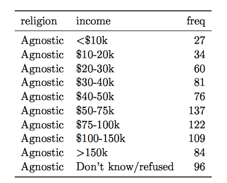
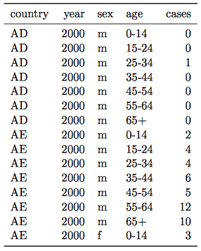
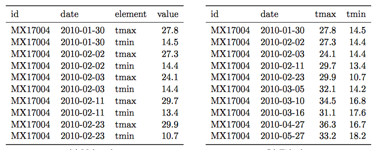

# (PART) Part III: Intermediate {-}

# Entering and cleaning data #2

[Download](https://github.com/geanders/RProgrammingForResearch/raw/master/slides/CourseNotes_Week6.pdf) a pdf of the lecture slides covering this topic.

```{r echo = FALSE, message = FALSE, warning = FALSE}
library(tidyverse)
library(knitr)
```


## Joining datasets

So far, you have only worked with a single data source at a time. When you work on your own projects, however, you typically will need to merge together two or more datasets to create the a data frame to answer your research question. For example, for air pollution epidemiology, you will often have to join several datasets: 

- Health outcome data (e.g., number of deaths per day)
- Air pollution concentrations
- Weather measurements (since weather can be a confounder)
- Demographic data

The `dplyr` package has a family of different functions to join two dataframes together, the `*_join` family of functions. All combine two dataframes, which I'll call `x` and `y` here. \medskip

The functions include:

- `inner_join(x, y)`: Keep only rows where there are observations in both `x` and `y`.
- `left_join(x, y)`: Keep all rows from `x`, whether they have a match in `y` or not. 
- `right_join(x, y)`: Keep all rows from `y`, whether they have a match in `x` or not. 
- `full_join(x, y)`: Keep all rows from both `x` and `y`, whether they have a match in the other dataset or not.

In the examples, I'll use two datasets, `x` and `y`. Both datasets include the column `course`. The other column in `x` is `grade`, while the other column in `y` is `day`. Observations exist for courses `x` and `y` in both datasets, but for `w` and `z` in only one dataset.

```{r}
x <- data.frame(course = c("x", "y", "z"),
                grade = c(90, 82, 78))
y <- data.frame(course = c("w", "x", "y"),
                day = c("Tues", "Mon / Fri", "Tue"))
```

Here is what these two example datasets look like:

```{r}
x
y
```

With `inner_join`, you'll only get the observations that show up in both datasets. That means you'll lose data on `z` (only in the first dataset) and `w` (only in the second dataset). 

```{r warning = FALSE}
inner_join(x, y)
```

With `left_join`, you'll keep everything in `x` (the "left" dataset), but not keep things in `y` that don't match something in `x`. That means that, here, you'll lose `w`:

```{r, warning = FALSE}
left_join(x, y)
```

`right_join` is the opposite:

```{r, warning = FALSE}
right_join(x, y)
```

`full_join` keeps everything from both datasets:

```{r warning = FALSE}
full_join(x, y)
```

## Tidy data

All of the material in this section comes directly from Hadley Wickham's [paper on tidy data](http://vita.had.co.nz/papers/tidy-data.pdf). You will need to read this paper to prepare for the quiz on this section.

Getting your data into a "tidy" format makes it easier to model and plot. By taking the time to tidy your data at the start of an analysis, you will save yourself time, and make it easier to plan out later steps. 

Characteristics of tidy data are:

1. Each variable forms a column.
2. Each observation forms a row.
3. Each type of observational unit forms a table.

Here are five common problems that Hadley Wickham has identified that keep data from being tidy:

1. Column headers are values, not variable names.
2. Multiple variables are stored in one column.
3. Variables are stored in both rows and columns.
4. Multiple types of observational units are stored in the same table.
5. A single observational unit is stored in multiple tables.

Here are examples (again, from Hadley Wickham's [paper on tidy data](http://vita.had.co.nz/papers/tidy-data.pdf), which is required reading for this week of the course) of each of these problems.

> 1. Column headers are values, not variable names.

```{r echo = FALSE, out.width = "\\textwidth"}
include_graphics("figures/TidyDataProblem1.png")
```

Solution: 

```{r echo = FALSE, out.width = "\\textwidth", fig.align = "center"}

```

> 2. Multiple variables are stored in one column.

```{r echo = FALSE, out.width = "\\textwidth", fig.align = "center"}
include_graphics("figures/TidyDataProblem2.png")
```

Solution: 

```{r echo = FALSE, out.width = "\\textwidth", fig.align = "center"}

```

> 3. Variables are stored in both rows and columns.

```{r echo = FALSE, out.width = "\\textwidth"}
include_graphics("figures/TidyDataProblem3.png")
```

Solution: 

```{r echo = FALSE, out.width = "\\textwidth"}

```

> 4. Multiple types of observational units are stored in the same table.

```{r echo = FALSE, out.width = "\\textwidth"}
include_graphics("figures/TidyDataProblem4.png")
```

Solution: 

```{r echo = FALSE, out.width = "\\textwidth"}
include_graphics("figures/TidyDataSolution4.png")
```

> 5. A single observational unit is stored in multiple tables.

Example: exposure and outcome data stored in different files: 

- File 1: Daily mortality counts
- File 2: Daily air pollution measurements

## Gathering

There are two functions from the `tidyr` package (another member of the tidyverse) that you can use to change between wide and long data: `gather` and `spread`. Here is a description of these two functions:

- `gather`: Take several columns and gather them into two columns, one with the former column names, and one with the former cell values.
- `spread`: Take two columns and spread them into multiple columns. Column names for the new columns will come from one of the two original columns, while cell values will come from the other of the original columns.

The following examples are from `tidyr` help files and show the effects of gathering and spreading a dataset. 

Here is some simulated wide data:

```{r, include = FALSE}
wide_stocks <- data.frame(
  time = as.Date('2009-01-01') + 0:9,
  X = rnorm(10, 0, 1),
  Y = rnorm(10, 0, 2),
  Z = rnorm(10, 0, 4)
)
```

```{r}
wide_stocks[1:3, ]
```

In the `wide_stocks` dataset, there are separate columns for three different stocks (`X`, `Y`, and `Z`). Each cell gives the value for a certain stock on a certain day. This data isn't "tidy", because the identify of the stock (`X`, `Y`, or `Z`) is a variable, and you'll probably want to include it as a variable in modeling. 

```{r}
wide_stocks[1:3, ]
```

If you want to convert the dataframe to have all stock values in a single column, you can use `gather` to convert wide data to long data: 

```{r}
long_stocks <- gather(wide_stocks, key = stock,
                      value = price, -time)
long_stocks[1:5, ]
```

In this "long" dataframe, there is now one column that gives the identify of the stock (`stock`) and another column that gives the price of that stock that day (`price`):

```{r}
long_stocks[1:5, ]
```

The format for a `gather` call is: 

```{r eval = FALSE}
## Generic code
new_df <- gather(old_df,
                 key = [name of column with old column names],
                 value = [name of column with cell values],
                 - [name of column(s) you want to 
                    exclude from gather])
```

Three important notes: 

- Everything is gathered into one of two columns -- one column with the old column names, and one column with the old cell values
- With the `key` and `value` arguments, you are just providing column names for the two columns that everything's gathered into.
- If there is a column you don't want to gather (`date` in the example), use `-` to exclude it in the `gather` call.

Notice how easy it is, now that the data is gathered, to use `stock` for aesthetics of faceting in a `ggplot2` call:

```{r fig.width = 7, fig.height = 2.5}
ggplot(long_stocks, aes(x = time, y = price)) + 
  geom_line() + 
  facet_grid(. ~ stock)
```

If you have data in a "long" format and would like to spread it out, you can use `spread` to do that:

```{r}
stocks <- spread(long_stocks, key = stock, value = price)
stocks[1:5, ]
```

Notice that this reverses the action of `gather`. 

"Spread" data is typically not tidy, so you often won't want to use `spread` when you are preparing data for analysis. However, `spread` can be very helpful in creating clean tables for final reports and presentations. 

For example, if you wanted to create a table with means and standard deviations for each of the three stocks, you could use `spread` to rearrange the final summary to create an attractive table. 

```{r}
stock_summary <- long_stocks %>% 
  group_by(stock) %>%
  summarize(N = n(), mean = mean(price), sd = sd(price))
stock_summary
```

```{r}
stock_summary %>%
  mutate("Mean (Std.dev.)" = paste0(round(mean, 2), " (",
                                    round(sd, 2), ")")) %>%
  select(- mean, - sd) %>%
  gather(key = "Statistic", value = "Value", -stock) %>%
  spread(key = stock, value = Value) %>%
  knitr::kable()
```

## Working with factors

Hadley Wickham has developed a package called `forcats` that helps you work with categorical variables (factors). I'll show some examples of its functions using the `worldcup` dataset:

```{r b}
library(forcats)
library(faraway)
data(worldcup)
```

The `fct_recode` function can be used to change the labels of a function (along the lines of using `factor` with `levels` and `labels` to reset factor labels).  

One big advantage is that `fct_recode` lets you change labels for some, but not all, levels. For example, here are the team names:

```{r c}
library(stringr)
worldcup %>%
  filter(str_detect(Team, "^US")) %>%
  slice(1:3) %>% select(Team, Position, Time)
```

If you just want to change "USA" to "United States," you can run: 

```{r d}
worldcup <- worldcup %>%
  mutate(Team = fct_recode(Team, `United States` = "USA"))
worldcup %>%
  filter(str_detect(Team, "^Un")) %>%
  slice(1:3) %>% select(Team, Position, Time)
```

You can use the `fct_lump` function to lump uncommon factors into an "Other" category. For example, to lump the two least common positions together, you can run (`n` specifies how many categories to keep outside of "Other"): 

```{r e}
worldcup %>%
  dplyr::mutate(Position = forcats::fct_lump(Position, n = 2)) %>%
  dplyr::count(Position)
```

You can use the `fct_infreq` function to reorder the levels of a factor from most common to least common:

```{r f}
levels(worldcup$Position)
worldcup <- worldcup %>%
  mutate(Position = fct_infreq(Position))
levels(worldcup$Position)
```

If you want to reorder one factor by another variable (ascending order), you can use `fct_reorder` (e.g., homework 3). For example, to relevel `Position` by the average shots on goals for each position, you can run:

```{r g}
levels(worldcup$Position)
worldcup <- worldcup %>%
  group_by(Position) %>%
  mutate(ave_shots = mean(Shots)) %>%
  ungroup() %>%
  mutate(Position = fct_reorder(Position, ave_shots))
levels(worldcup$Position)
```


## String operations and regular expressions

For these examples, we'll use some data on passengers of the Titanic. You can load this data using:

```{r}
# install.packages("titanic")
library(titanic)
data("titanic_train")
```

We will be using the `stringr` package:

```{r}
library(stringr)
```

This data includes a column called "Name" with passenger names. This column is somewhat messy and includes several elements that we might want to separate (last name, first name, title). Here are the first few values of "Name": 

```{r}
titanic_train %>% select(Name) %>% slice(1:3)
```

We've already done some things to manipulate strings. For example, if we wanted to separate "Name" into last name and first name (including title), we could actually do that with the `separate` function: 

```{r}
titanic_train %>% 
  select(Name) %>% 
  slice(1:3) %>% 
  separate(Name, c("last_name", "first_name"), sep = ", ")
```


Notice that `separate` is looking for a regular pattern (", ") and then doing something based on the location of that pattern in each string (splitting the string). \bigskip

There are a variety of functions in R that can perform manipulations based on finding regular patterns in character strings. 


The `str_detect` function will look through each element of a character vector for a designated pattern. If the pattern is there, it will return `TRUE`, and otherwise `FALSE`. The convention is: 

```
## Generic code
str_detect(string = [vector you want to check], 
           pattern = [pattern you want to check for])
```

For example, to create a logical vector specifying which of the Titanic passenger names include "Mrs.", you can call:

```{r}
mrs <- str_detect(titanic_train$Name, "Mrs.")
head(mrs)
```


The result is a logical vector, so `str_detect` can be used in `filter` to subset data to only rows where the passenger's name includes "Mrs.":

```{r}
titanic_train %>%
  filter(str_detect(Name, "Mrs.")) %>%
  select(Name) %>%
  slice(1:3)
```


There is an older, base R function called `grepl` that does something very similar (although note that the order of the arguments is reversed).

```{r}
titanic_train %>%
  filter(grepl("Mrs.", Name)) %>%
  select(Name) %>%
  slice(1:3)
```

The `str_extract` function can be used to extract a string (if it exists) from each value in a character vector. It follows similar conventions to `str_detect`:

```
## Generic code
str_extract(string = [vector you want to check], 
           pattern = [pattern you want to check for])
```


For example, you might want to extract "Mrs." if it exists in a passenger's name:

```{r}
titanic_train %>%
  mutate(mrs = str_extract(Name, "Mrs.")) %>%
  select(Name, mrs) %>%
  slice(1:3)
```

Notice that now we're creating a new column (`mrs`) that either has "Mrs." (if there's a match) or is missing (`NA`) if there's not a match. 


For this first example, we were looking for an exact string ("Mrs"). However, you can use patterns that match a particular pattern, but not an exact string. For example, we could expand the regular expression to find "Mr." or "Mrs.": 

```{r}
titanic_train %>%
  mutate(title = str_extract(Name, "Mr\\.|Mrs\\.")) %>%
  select(Name, title) %>%
  slice(1:3)
```

Note that this pattern uses a special operator (`|`) to find one pattern **or** another. Double backslashes (`\\`) **escape** the special character ".". 


As a note, in regular expressions, all of the following characters are special characters that need to be escaped with backslashes if you want to use them literally: 

```
. * + ^ ? $ \ | ( ) [ ] { }
```


Notice that "Mr." and "Mrs." both start with "Mr", end with ".", and may or may not have an "s" in between. 

```{r}
titanic_train %>%
  mutate(title = str_extract(Name, "Mr(s)*\\.")) %>%
  select(Name, title) %>%
  slice(1:3)
```

This pattern uses `(s)*` to match zero or more "s"s at this spot in the pattern. 


In the previous code, we found "Mr." and "Mrs.", but missed "Miss.". We could tweak the pattern again to try to capture that, as well. For all three, we have the pattern that it starts with "M", has some lowercase letters, and then ends with ".".  

```{r}
titanic_train %>%
  mutate(title = str_extract(Name, "M[a-z]+\\.")) %>%
  select(Name, title) %>%
  slice(1:3)
```


The last pattern used `[a-z]+` to match one or more lowercase letters. The `[a-z]`is a **character class**. \bigskip 

You can also match digits (`[0-9]`), uppercase letters (`[A-Z]`), just some letters (`[aeiou]`), etc. \bigskip

You can negate a character class by starting it with `^`. For example, `[^0-9]` will match anything that **isn't** a digit. 


Sometimes, you want to match a pattern, but then only subset a part of it. For example, each passenger seems to have a title ("Mr.", "Mrs.", etc.) that comes after ", " and before ". ". We can use this pattern to find the title, but then we get some extra stuff with the match: 

```{r}
titanic_train %>%
  mutate(title = str_extract(Name, ",\\s[A-Za-z]*\\.\\s")) %>%
  select(title) %>%
  slice(1:3)
```

As a note, in this pattern, `\\s` is used to match a space. 


We are getting things like ", Mr. ", when we really want "Mr". We can use the `str_match` function to do this. We group what we want to extract from the pattern in parentheses, and then the function returns a matrix. The first column is the full pattern match, and each following column gives just what matches within the groups. 

```{r}
head(str_match(titanic_train$Name,
          pattern = ",\\s([A-Za-z]*)\\.\\s"))
```


To get just the title, then, we can run:

```{r}
titanic_train %>%
  mutate(title = 
           str_match(Name, ",\\s([A-Za-z]*)\\.\\s")[ , 2]) %>%
  select(Name, title) %>%
  slice(1:3)
```

The `[ , 2]` pulls out just the second column from the matrix returned by `str_match`. 


Here are some of the most common titles: 

```{r}
titanic_train %>%
  mutate(title = 
           str_match(Name, ",\\s([A-Za-z]*)\\.\\s")[ , 2]) %>%
  group_by(title) %>% summarize(n = n()) %>%
  arrange(desc(n)) %>% slice(1:5)
```


Here are a few other examples of regular expressions in action with this dataset. 

Get just names that start with ("^") the letter "A":

```{r}
titanic_train %>%
  filter(str_detect(Name, "^A")) %>%
  select(Name) %>%
  slice(1:3)
```


Get names with "II" or "III" (`{2,}` says to match at least two times):

```{r}
titanic_train %>%
  filter(str_detect(Name, "I{2,}")) %>%
  select(Name) %>%
  slice(1:3)
```


Get names with "Andersen" or "Anderson" (alternatives in square brackets):

```{r}
titanic_train %>%
  filter(str_detect(Name, "Anders[eo]n")) %>%
  select(Name)
```


Get names that start with ("^" outside of brackets) the letters "A" and "B":

```{r}
titanic_train %>%
  filter(str_detect(Name, "^[AB]")) %>%
  select(Name) %>%
  slice(1:3)
```


Get names that end with ("$") the letter "b" (either lowercase or uppercase):

```{r}
titanic_train %>%
  filter(str_detect(Name, "[bB]$")) %>%
  select(Name) 
```


Some useful regular expression operators include: 

```{r echo = FALSE}
reg_exp <- data_frame("Operator" = c(".",
                                     "*",
                                     "*?",
                                     "+",
                                     "+?",
                                     "^",
                                     "$", 
                                     "[...]"),
                      "Meaning" = c("Any character", 
                                    "Match 0 or more times (greedy)",
                                    "Match 0 or more times (non-greedy)",
                                    "Match 1 or more times (greedy)",
                                    "Match 1 or more times (non-greedy)",
                                    "Starts with (in brackets, negates)",
                                    "Ends with",
                                    "Character classes"))
knitr::kable(reg_exp)
```


For more on these patterns, see: 

- Help file for the `stringi-search-regex` function in the `stringi` package (which should install when you install `stringr`)
- Chapter 14 of R For Data Science
- http://gskinner.com/RegExr: Interactive tool for helping you build regular expression pattern strings


## In-course exercise 

For today's exercise, we'll be using the following three datasets (click on the file name to access the correct file for today's class for each dataset): 

File name                | Description
--------------------     | -----------------------------------------------
[`country_timeseries.csv`](https://github.com/geanders/RProgrammingForResearch/raw/master/data/country_timeseries.csv) | Ebola cases by country for the 2014 outbreak
[`mexico_exposure.csv`](https://github.com/geanders/RProgrammingForResearch/raw/master/data/mexico_exposure.csv) and [`mexico_deaths.csv`](https://github.com/geanders/RProgrammingForResearch/raw/master/data/mexico_deaths.csv)     | Daily death counts and environmental measurements for Mexico City, Mexico, for 2008
[`measles_data/`](https://github.com/geanders/RProgrammingForResearch/tree/master/data/measles_data)          | Number of cases of measles in CA since end of Dec. 2014

Note that you likely have already downloaded all the files in the `measles_data` folder, since we used them in an earlier in-course exercise. If so, there is no need to re-download those files. 

Here are the sources for this data:

- `country_timeseries.csv` : [Caitlin Rivers' Ebola repository](https://github.com/cmrivers/ebola) (Caitlin originally collected this data from the WHO and WHO Situation reports)
- `mexico_exposure.csv` and `mexico_deaths.csv` : [one of Hadley Wickham's GitHub repos](https://github.com/hadley/mexico-mortality/tree/master/disease) (Hadley got the data originally from the Secretaria de Salud of Mexico's website, although it appears the link is now broken. I separated the data into two dataframes so students could practice merging.)
- `measles_data/`: [one of scarpino's GitHub repos](https://github.com/scarpino/measles-CA-2015) (Data originally from pdfs from the [California Department of Public Health](https://www.cdph.ca.gov/HealthInfo/discond/Pages/MeaslesSurveillanceUpdates.aspx))

```{block type = "rmdwarning"}
If you want to use these data further, you should go back and pull them from their original sources. They are here only for use in R code examples for this course.
```

Here are some of the packages you will need for this exercise:

```{r, message=FALSE}
library(dplyr)
library(gridExtra)
library(ggthemes)
```

### Designing tidy data

1. Check out the [`country_timeseries.csv` file](https://github.com/geanders/RProgrammingForResearch/raw/master/data/country_timeseries.csv) on Ebola for this week's example data. Talk with your partner and decide what changes you would need to make to this dataset to turn it into a "tidy" dataset, in particular which of the five common "untidy" problems the data currently has and why. 
2. Do the same for the data on daily mortality and daily weather in Mexico.
3. Do the same for the set of files with measles data.

### Easier data wrangling

- Use `read_csv` to read the Mexico data (exposure and mortality) directly from GitHub into your R session. Call the dataframes `mex_deaths` and `mex_exp`.
- Are there any values of the `day` column in `mex_deaths` that is not present in the `day` column of `mex_exp`? How about vice-versa? (Hint: There are a few ways you could check this. One is to try filtering down to just rows in one dataframe where the `day` values are not present in the `day` values from the other dataframe. The `%in%` logical vector may be useful.)
- Merge the two datasets together to create the dataframe `mexico`. Exclude all columns except the outcome (deaths), day, and mean temperature. 
- Convert the day to a Date class.
- If you did not already, try combining all the steps in the previous task into one "chained" pipeline of code using the pipe operator, `%>%`.
- Use this new dataframe to plot deaths by date in Mexico using `ggplot2`. The final plot should look like this: 

```{r echo = FALSE, fig.width = 4, fig.height = 2.5, message = FALSE, warning = FALSE}
deaths_url <- paste0("https://github.com/geanders/RProgrammingForResearch/",
                     "raw/master/data/mexico_deaths.csv")
mex_deaths <- read_csv(deaths_url)

exposure_url <- paste0("https://github.com/geanders/RProgrammingForResearch/",
                       "raw/master/data/mexico_exposure.csv")
mex_exp <- read_csv(exposure_url)

library(lubridate)
mexico <- full_join(mex_deaths, mex_exp, by = "day") %>%
        select(day, deaths, temp_mean) %>%
        mutate(day = mdy(day))

ggplot(data = mexico) + 
        geom_point(mapping = aes(x = day, y = deaths),
                   size = 1.5, alpha = 0.5) + 
        xlab("Date in 2008") + ylab("# of deaths") + 
        ggtitle("Deaths by date") + 
        theme_few() 
```


#### Example R code

Use `read_csv` to read the mexico data (exposure and mortality) directly from GitHub into your R session. Call the dataframes `mex_deaths` and `mex_exp`:

```{r message = FALSE}
deaths_url <- paste0("https://github.com/geanders/RProgrammingForResearch/",
                     "raw/master/data/mexico_deaths.csv")
mex_deaths <- read_csv(deaths_url)
head(mex_deaths)

exposure_url <- paste0("https://github.com/geanders/RProgrammingForResearch/",
                       "raw/master/data/mexico_exposure.csv")
mex_exp <- read_csv(exposure_url)
head(mex_exp)
```

Check if there are any values of the `day` column in `mex_deaths` that are not present in the `day` column of `mex_exp` and vice-versa.

```{r}
mex_deaths %>% 
  filter(!(day %in% mex_exp$day))
mex_exp %>% 
  filter(!(day %in% mex_deaths$day))
```

One important note is that, when you're doing this check, you do *not* want to overwrite your original dataframe, so be sure that you do not reassign this output to `mex_deaths` or `mex_exp`. 

An even quicker way to do check this is to create a logical vector that checks this and use `sum` to add up the values in the logical vector. If the sum is zero, that tells you that the logical check is never true, so there are no cases where there is a `day` value in one dataframe that is not also in the other dataframe. 

```{r}
sum(!(mex_deaths$day %in% mex_exp$day))
sum(!(mex_exp$day %in% mex_deaths$day))
```

Merge the two datasets together to create the dataframe `mexico`. Exclude all columns except the outcome (deaths), date, and mean temperature. 

```{r message = FALSE}
mexico <- full_join(mex_deaths, mex_exp, by = "day") 
mexico <- select(mexico, day, deaths, temp_mean)
```

Convert the date to a date class. 

```{r}
library(lubridate) ## For parsing dates
mexico <- mutate(mexico, day = mdy(day))
```

Try combining all the steps in the previous task into one "chained" command:

```{r}
mexico <- full_join(mex_deaths, mex_exp, by = "day") %>%
        select(day, deaths, temp_mean) %>%
        mutate(day = mdy(day))
head(mexico)
```

Note that, in this case, all the values of `day` in `mex_deaths` have one and only one matching value in `mex_exp`, and vice-versa. Because of this, we would have gotten the same `mexico` dataframe if we'd used `inner_join`, `left_join` or `right_join` instead of `full_join`. The differences between these `*_join` functions come into play when you have some values of your matching column that aren't in both of the dataframes you're joining.  

Use this new dataframe to plot deaths by date using `ggplot`:

```{r fig.width = 4, fig.height = 2.5}
ggplot(data = mexico) + 
        geom_point(mapping = aes(x = day, y = deaths),
                   size = 1.5, alpha = 0.5) + 
        labs(x = "Date in 2008", y = "# of deaths") + 
        ggtitle("Deaths by date") + 
        theme_few() 
```

### More extensive data wrangling

- Read the Ebola data directly from GitHub into your R session. Call the dataframe `ebola`.
- Use `dplyr` functions to create a tidy dataset. First, change it from "wide" data to "long" data. Name the new column with the key `variable` and the new column with the values `count`. The first few lines of the "long" version of the dataset should look like this: 

```{r echo = FALSE, message = FALSE, warning = FALSE}
ebola_url <- paste0("https://github.com/geanders/RProgrammingForResearch/",
              "raw/master/data/country_timeseries.csv")
ebola <- read_csv(ebola_url) %>% 
  gather(key = variable, value = count, -Date, -Day)
ebola %>% slice(1:6)
```

- Convert the `Date` column to a Date class.
- Use the `separate` function to separate the `variable` column into two columns, `type` ("Cases" or "Deaths") and `country` ("Guinea", "Liberia", etc.). At this point, the data should look like this: 

```{r echo = FALSE}
ebola <- ebola %>% 
  mutate(Date = lubridate::mdy(Date)) %>% 
  separate(variable, c("type", "country"), sep = "_")
ebola %>% slice(1:6)
```

- Use the `spread` function to convert the data so you have separate columns for the two variables of numbers of `Cases` and `Deaths`. At this point, the dataframe should look like this: 

```{r echo = FALSE}
ebola <- spread(ebola, key = type, value = count)
ebola %>% slice(1:6)
```

- Remove any observations where counts of both cases and deaths are missing for that country on that date.
- Now that your data is tidy, create one plot showing Ebola cases by date, faceted by country, and one showing Ebola deaths by date, also faceted by country. Try using the option `scales = "free_y"` in the `facet_wrap` function and see how that changes these graphs. Discuss with your group the advantages and disadvantages of using this option when creating these small multiple plots. The plots should look something like this (if you're using the `scales = "free_y"` option): 

```{r echo = FALSE, fig.width = 8, fig.height = 4, message = FALSE, warning = FALSE}
ebola <- filter(ebola, !is.na(Cases) & !is.na(Deaths))

ggplot(ebola, aes(x = Date, y = Cases)) + 
        geom_line() + 
        facet_wrap(~ country, ncol = 4, scales = "free_y") + 
        theme_classic()
ggplot(ebola, aes(x = Date, y = Deaths)) + 
        geom_line() + 
        facet_wrap(~ country, ncol = 4, scales = "free_y") + 
        theme_classic()
```

- Based on these plots, what would your next questions be about this data before you used it for an analysis?
- Can you put all of the steps of this cleaning process into just a few "chained" code pipelines using `%>%`? 
- If you have extra time (super-challenge!): There is a function called `fct_reorder` in the `forcats` package that can be used to reorder the levels of a factor in a dataframe based on another column in the same dataframe. This function can be very useful for using a meaningful order when plotting. We'll cover the `forcats` package in a later class, but today check out the help file for `fct_reorder` and see if you can figure out how to use it to reorder the small multiple plots in order of the maximum number of cases or deaths (for the two plots respectively) in each country. You'll be able to do this by changing the code in `facet_wrap` from `~ country` to `~ fct_reorder(country, ...)`, but with the `...` replaced with certain arguments. If you're getting stuck, try running the examples in the `fct_reorder` helpfile to get a feel for how this function can be used when plotting. The plots will look something like this:

```{r,echo = FALSE, message = FALSE, fig.width = 8, fig.height = 4}
ebola_url <- paste0("https://github.com/geanders/RProgrammingForResearch/",
              "raw/master/data/country_timeseries.csv")
ebola <- read_csv(ebola_url) %>%
        gather(key = variable, value = count, -Date, -Day) %>%
        mutate(Date = mdy(Date)) %>%
        separate(variable, c("type", "country"), sep = "_") %>% 
        spread(type, count) %>%
        filter(!is.na(Cases) & !is.na(Deaths))

library(forcats)
ggplot(ebola, aes(x = Date, y = Cases)) + 
        geom_line() + 
        facet_wrap(~ fct_reorder(country, Cases, .fun = max, .desc = TRUE),
                   ncol = 4) + 
        theme_classic() + 
  ggtitle("Deaths from Ebola") 
ggplot(ebola, aes(x = Date, y = Deaths)) + 
        geom_line() + 
        facet_wrap(~ fct_reorder(country, Deaths, .fun = max, .desc = TRUE),
                   ncol = 4) + 
        theme_classic() + 
  ggtitle("Cases of Ebola")
```


#### Example R code

Read the data in using `read_csv`. 

```{r message = FALSE}
ebola_url <- paste0("https://github.com/geanders/RProgrammingForResearch/",
              "raw/master/data/country_timeseries.csv")
ebola <- read_csv(ebola_url)

head(ebola)
```

Change the data to long data using the `gather()` function from `dplyr`:

```{r}
ebola <- ebola %>% 
  gather(key = variable, value = count, -Date, -Day)
head(ebola)
```

Convert `Date` to a date class:

```{r}
ebola <- ebola %>%
         mutate(Date = mdy(Date))
head(ebola)
```

Split `variable` into `type` and `country`:

```{r}
ebola <- ebola %>% 
  separate(variable, c("type", "country"), sep = "_")

head(ebola)
```

Convert the data so you have separate columns for the two variables of numbers of `Cases` and `Deaths`:

```{r}
ebola <- spread(ebola, key = type, value = count)
head(ebola)
```

Remove any observations where counts of cases or deaths are missing for that country:

```{r}
ebola <- filter(ebola, !is.na(Cases) & !is.na(Deaths))
head(ebola)
```

Now that your data is tidy, create one plot showing ebola cases by date, faceted by country, and one showing ebola deaths by date, also faceted by country:

```{r fig.width = 8, fig.height = 4}
ggplot(ebola, aes(x = Date, y = Cases)) + 
        geom_line() + 
        facet_wrap(~ country, ncol = 4) + 
        theme_classic()
ggplot(ebola, aes(x = Date, y = Deaths)) + 
        geom_line() + 
        facet_wrap(~ country, ncol = 4) + 
        theme_classic()
```

Try using the option `scales = "free_y"` in the `facet_wrap()` function (in the `gridExtra` package) and see how that changes these graphs:

```{r fig.width = 8, fig.height = 4}
ggplot(ebola, aes(x = Date, y = Cases)) + 
        geom_line() + 
        facet_wrap(~ country, ncol = 4, scales = "free_y") + 
        theme_classic()
ggplot(ebola, aes(x = Date, y = Deaths)) + 
        geom_line() + 
        facet_wrap(~ country, ncol = 4, scales = "free_y") + 
        theme_classic()
```

Put all of the steps of this cleaning process into just a few "chaining" calls. 

```{r, message = FALSE, fig.width = 8, fig.height = 4}
ebola <- read_csv(ebola_url) %>%
        gather(variable, count, -Date, -Day) %>%
        mutate(Date = mdy(Date)) %>%
        separate(variable, c("type", "country"), sep = "_") %>% 
        spread(type, count) %>%
        filter(!is.na(Cases) & !is.na(Deaths))

ggplot(ebola, aes(x = Date, y = Cases)) + 
        geom_line() + 
        facet_wrap(~ country, ncol = 4) + 
        theme_classic()
ggplot(ebola, aes(x = Date, y = Deaths)) + 
        geom_line() + 
        facet_wrap(~ country, ncol = 4) + 
        theme_classic()
```

Use the `fct_reorder` function inside the `facet_wrap` function call to reorder the small-multiple graphs.

```{r, message = FALSE, fig.width = 8, fig.height = 4}
library(forcats)
ggplot(ebola, aes(x = Date, y = Cases)) + 
        geom_line() + 
        facet_wrap(~ fct_reorder(country, Cases, .fun = max, .desc = TRUE),
                   ncol = 4) + 
        theme_classic()
ggplot(ebola, aes(x = Date, y = Deaths)) + 
        geom_line() + 
        facet_wrap(~ fct_reorder(country, Deaths, .fun = max, .desc = TRUE),
                   ncol = 4) + 
        theme_classic()
```

### Tidying `VADeaths` data

R comes with a dataset called `VADeaths` that gives death rates per 1,000 people in Virginia in 1940 by age, sex, and rural / urban. 

- Use `data("VADeaths")` to load this data. Make sure you understand what each column and row is showing -- use the helpfile (`?VADeaths`) if you need.
- Go through the three characteristics of tidy data and the five common problems in untidy data that we talked about in class. Sketch out (you're welcome to use the whiteboards) what a tidy version of this data would look like. 
- Open a new R script file. Write R code to transform this dataset into a tidy dataset. Try using a pipe chain, with `%>%` and tidyverse functions, to clean the data. 
- Use the tidy data to create the following graph:

```{r tidying_vadeaths, echo = FALSE, fig.width = 8, fig.height = 3}
library(datasets)
data(VADeaths)
VADeaths <- VADeaths %>%
  as.data.frame() %>% 
  mutate(age = rownames(VADeaths)) %>%
  gather(key = gender_loc, value = mort_rate, - age) %>%
  separate(col = gender_loc, into = c("loc", "gender"),
           sep = " ")
ggplot(VADeaths, aes(x = age, y = mort_rate,
                     color = gender)) + 
  geom_point() + 
  facet_wrap( ~ loc, ncol = 2) + 
  xlab("Age category") + ylab("Death rate (per 1,000)") + 
  theme_minimal()
```

There is no example R code for this -- try to figure out the code yourselves. We will go over a solution in class. You may find the RStudio Data Wrangling cheatsheet helpful for remembering which tidyverse functions do what. 

### Exploring Fatality Analysis Reporting System (FARS) data

- Explore the interactive visualization at http://metrocosm.com/10-years-of-traffic-accidents-mapped.html. This was created by Max Galka using this dataset. 
- Go to [FARS web page](http://www.nhtsa.gov/FARS). We want to get the raw data on fatal accidents. Navigate this page to figure out how you can get this raw data for the whole county for 2016 (hint: you'll need to access the raw data using FTP, and you may have more success with some web browsers, like Chrome, than others). Save 2016 "National" data (csv format) to your computer. What is the structure of how this data is saved (e.g., directory structure, file structure)?
- On the [FARS web page](http://www.nhtsa.gov/FARS), find the documentation describing this raw data. Look through both this documentation (*2016 Crash Report Sampling System (CRSS):Analytical User's Manual*) and the raw files you downloaded to figure out what information is included in the data. 
- Read the `accident.csv` file for 2016 into R (this is one of the files you'll get if you download the raw data for 2016). Use the documentation to figure out what each column represents. 
- Discuss what steps you would need to take to create the following plot. To start, don't write any code, just develop a plan. Talk about what the dataset should look like right before you create the plot and what functions you could use to get the data from its current format to that format. (Hint: Functions from the `lubridate` package will be very helpful, including `yday` and `wday`).
- Discuss which of the variables in this dataset could be used to merge the dataset with other appropriate data, either other datasets in the FARS raw data, or outside datasets. 
- Try to write the code to create this plot. This will include some code for cleaning the data and some code for plotting. I will add one example answer after class, but I'd like you to try to figure it out yourselves first.

```{r echo = FALSE, warning = FALSE, message = FALSE, fig.width = 6, fig.height = 3}
library(tidyverse)
library(lubridate)
library(ggthemes)

accident <- read_csv("data/accident.csv") %>%
  select(DAY:MINUTE) %>%
  select(-DAY_WEEK) %>%
  unite(date, DAY:MINUTE, sep = "-", remove = FALSE) %>%
  mutate(date = dmy_hm(date), 
         yday = yday(date),
         weekday = wday(date, label = TRUE, abbr = FALSE),
         weekend = weekday %in% c("Saturday", "Sunday")) 

accident %>% 
  filter(!is.na(yday)) %>%
  group_by(yday) %>%
  summarize(accidents = n(),
            weekend = first(weekend)) %>%
  ggplot(aes(x = yday, y = accidents, color = weekend)) + 
  geom_point(alpha = 0.5) + 
  xlab("Day of the year in 2016") + 
  ylab("# of fatal accidents") + 
  theme_few() + 
  geom_smooth(se = FALSE)
```

### Baby names

In the Fall 2018 session, we seem to have an unusually high percent of the class 
with names that start with an "A" or "K". In this part of the exercise, we'll see
if we can figure out whether the proportion of "A" and "K" names is unusual.

There is a package on CRAN called `babynames` with data on baby names by year in
the United States, based on data from the U.S.'s Social Security Administration.
We will use this data to compare the proportion of "A" and "K" names in our class
with the proportion in these baby names. We'll also do a few other things to 
explore this data.

- First, check out patterns in your own name. Is your name included in this 
dataset? Has your name been used for males and females? How have the patterns
in the proportion of babies with your name, for both males and females, changed 
over time (use a plot to look at this)?
- In the year you were born, what were the 5 most popular baby names for males
and females? Try to come up with some attractive ways (figures and tables) to 
show this. 

#### Example R code

Install and load the `babynames` package and its "babynames" dataframe:

```{r message = FALSE}
# install.packages("babynames")
library(babynames)
data("babynames")
```

Remember that you can use `?babynames` to find out more about this dataframe. 

Check out patterns in your own name. Is your name included in this 
dataset? You can use `filter` to create a subset of this data where you've 
filtered down to just the rows with your name. To see if your name ever 
shows up, you can use `count` on this dataframe---if your name never shows 
up, then you will have 0 rows in the new dataframe. As long as there's at least
one row, your name shows up somewhere. (If your name is not in here, try 
your middle or last name, or the name of a fictional character you like, for
the rest of these exercises.)

```{r}
my_name <- babynames %>% 
  filter(name == "Brooke")
my_name %>% 
  count()
```

Has your name been used for males and females? To figure this out, you can group
the dataset with rows with your name by the `sex` column and then use `count` to 
count the number of rows in the dataset for males and females. If your name has
only been used for one gender, then only one row will result from running this
code (for an example, try my first name, "Georgiana").

```{r}
my_name %>% 
  group_by(sex) %>% 
  count()
```

How have the patterns in the proportion of babies with your name, for both males
and females, changed over time (use a plot to look at this)? To check this out, 
I recommend you create a plot of the proportion of babies with your name (`prop`)
versus year (`year`). You can use color to show these patterns for males and 
females separately. I've done some extra things here to (1) relabel the `sex` 
factor, so the label shows up with clearer names and (2) change the labels for the
x-, y-, and color scales. 

```{r fig.width = 6, fig.height = 3}
library(forcats)
my_name %>% 
  mutate(sex = fct_recode(sex, Male = "M", Female = "F")) %>% 
  ggplot(aes(x = year, y = prop, color = sex)) + 
  geom_line() + 
  labs(x = "Year", y = "Proportion of babies\nof each sex named 'Brooke'",
       color = "")
```

In the year you were born, what were the 5 most popular baby names for males
and females?

```{r}
top_my_year <- babynames %>% 
  filter(year == 1981) %>% 
  group_by(sex) %>% 
  arrange(desc(prop)) %>% 
  slice(1:5)

top_my_year
```

If you'd like to show this in a prettier way, you could show this as a table:

```{r}
library(knitr)
top_my_year %>% 
  mutate(rank = 1:n()) %>% # Since the data is grouped by sex, this will rank
                           # separately for females and males
  ungroup() %>% # You have to ungroup before you can run `mutate` on `sex`
  mutate(sex = fct_recode(sex, Male = "M", Female = "F"),
         percent = round(100 * prop, 1),
         percent = paste(percent, "%", sep = "")) %>% 
  select(sex, rank, name, percent) %>% 
  kable()
```

You could also show it as a figure: 

```{r message = FALSE, fig.width = 6, fig.height = 3}
library(scales)
top_my_year %>% 
  ungroup() %>% 
  mutate(name = fct_reorder(name, prop, .desc = TRUE),
         sex = fct_recode(sex, Male = "M", Female = "F")) %>% 
  ggplot(aes(x = name)) + 
  geom_bar(aes(weight = prop)) + 
  coord_flip() + 
  labs(x = "", y = "Percent of babies with name in 1981") + 
  theme(legend.position = "top") + 
  scale_y_continuous(labels = percent) + 
  facet_wrap(~ sex, scales = "free_y") + 
  theme_classic()
```

### More with baby names

Now let's look at baby names based on the letter they start with. 

- For the full dataframe, what proportion of baby names start with each letter?
See if you can create a figure to help show this. Create the same plot 
using the names of people from our class. 
- What proportion of names start with "A" or "K" across the full dataset? How
about for the years from 1980 to 1995? Finally, how does the proportion change
over the years in the dataframe?

#### Example R code

For the full dataframe, what proportion of baby names start with "A" or "K"?

To start, create a column with the first letter of each name. You can use 
functions in the `stringr` package to do this. The easiest might be to 
use the position of the first letter to pull that information.

```{r}
library(stringr)
top_letters <- babynames %>% 
  mutate(first_letter = str_sub(name, 1, 1))

top_letters %>% 
  select(name, first_letter) %>% 
  slice(1:5)
```

Now we can group by letter and figure out these proportions. First, while the data is
grouped, count the number of names with each letter. Then, ungroup and use mutate
to divide this by the total number of names:

```{r}
top_letters <- top_letters %>% 
  group_by(first_letter) %>% 
  summarize(n = sum(n)) %>% 
  ungroup() %>% 
  mutate(prop = n / sum(n)) %>% 
  arrange(desc(prop))

top_letters
```

Here's one way to visualize this: 

```{r fig.height = 5, fig.width = 4}
top_letters %>% 
  mutate(first_letter = fct_reorder(first_letter, prop)) %>% 
  ggplot(aes(x = first_letter)) + 
  geom_bar(aes(weight = prop)) + 
  coord_flip() + 
  scale_y_continuous(labels = percent) + 
  labs(x = "", y = "Percent of names that start with ...")
```

Create the same plot using the names of people in our class. First, create a 
vector with the names of people in our class: 

```{r fig.width = 3, fig.height = 4}
student_list <- data_frame(name = c("Aeriel", "Rebecca", "Grant",
                                    "Amy", "Jessy", "Alyssa",
                                    "Camron", "Anastasia", "Kyle",
                                    "Ana", "Amanda", "Kathleen", 
                                    "Kyle", "Ana", "Amanda", "Kathleen",
                                    "Kayla", "Nichole", "Randy", "Katy",
                                    "Devin"))
student_list <- student_list %>% 
  mutate(first_letter = str_sub(name, 1, 1))
student_list

student_list %>% 
  group_by(first_letter) %>% 
  count() %>% 
  ungroup() %>% 
  mutate(prop = n / sum(n)) %>% 
  mutate(first_letter = fct_reorder(first_letter, prop)) %>% 
  ggplot(aes(x = first_letter)) + 
  geom_bar(aes(weight = prop)) + 
  coord_flip() + 
  scale_y_continuous(labels = percent) + 
  labs(x = "", y = "Percent of students with\na name that starts with ...")
```

What proportion of names start with "A" or "K" across the full dataset? You can 
create a dataframe that (1) pulls out the first letter of each name (just like 
we did for the last part of the question) and (2) tests whether that first letter
is an "A" or a "K" (using a logical statement):

```{r}
a_or_k <- babynames %>% 
  mutate(first_letter = str_sub(name, 1, 1),
         a_or_k = first_letter %in% c("A", "K"))

a_or_k %>% 
  select(name, first_letter, a_or_k) %>% 
  slice(1:5)
```

Next, group by this logical column (`a_or_k`) and figure out the number of 
baby names for each group. Then, to get the proportion of the total, ungroup
and mutate to divide by the total number across the data: 

```{r}
a_or_k %>% 
  group_by(a_or_k) %>% 
  count() %>% 
  ungroup() %>% 
  mutate(prop = n / sum(n))
```


How about for the years from 1980 to 1995? These proportions probably change over 
time, so let's try to get the proportion for a time period relevant for this class. 
You can get this information very similarly as the last question, just filter to 
this range of years first:

```{r}
a_or_k_80s90s <- babynames %>% 
  filter(1980 <= year & year <= 1995) %>% 
  mutate(first_letter = str_sub(name, 1, 1),
         a_or_k = first_letter %in% c("A", "K"))
```

You can doublecheck that this dataframe has the right range of years: 

```{r}
a_or_k_80s90s %>% 
  summarize(min_year = min(year),
            max_year = max(year))
```

Now do the same calculation as we did with the full dataset: 

```{r}
a_or_k_80s90s %>% 
  group_by(a_or_k) %>% 
  count() %>% 
  ungroup() %>% 
  mutate(prop = n / sum(n))
```

Finally, how does the proportion change over the years in the dataframe? You can start
from the `a_or_k` dataframe we created earlier. Group by year and the logical 
column `a_or_k` and then calculate the total number of baby names for each 
combination of year and `a_or_k` value. Then ungroup the data, group just by `year`,
and get the proportion each year. Finally, filter to just the rows where `a_or_k`
is true and plot how this changes over the years:

```{r fig.width = 6, fig.height = 4}
a_or_k_year <- a_or_k %>% 
  group_by(year, a_or_k) %>% 
  count()
a_or_k_year

a_or_k_year <- a_or_k_year %>% 
  ungroup() %>% 
  group_by(year) %>% 
  mutate(prop = n / sum(n))
a_or_k_year

a_or_k_year %>% 
  filter(a_or_k == TRUE) %>% 
  ggplot(aes(x = year, y = prop)) + 
  geom_line() + 
  scale_y_continuous(name = "Percent of baby's with names\nthat start with 'A' or 'K'",
                     labels = percent) + 
  expand_limits(y = 0)
```

