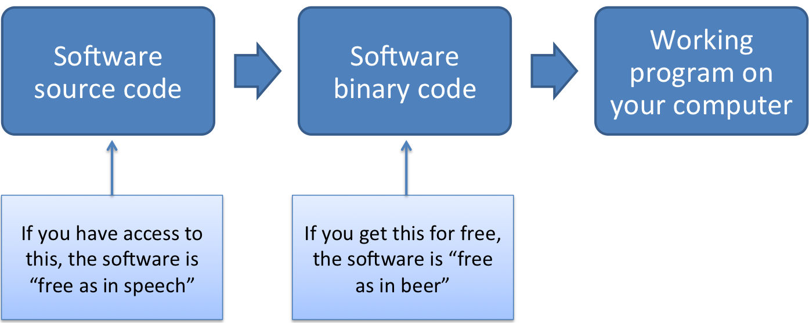
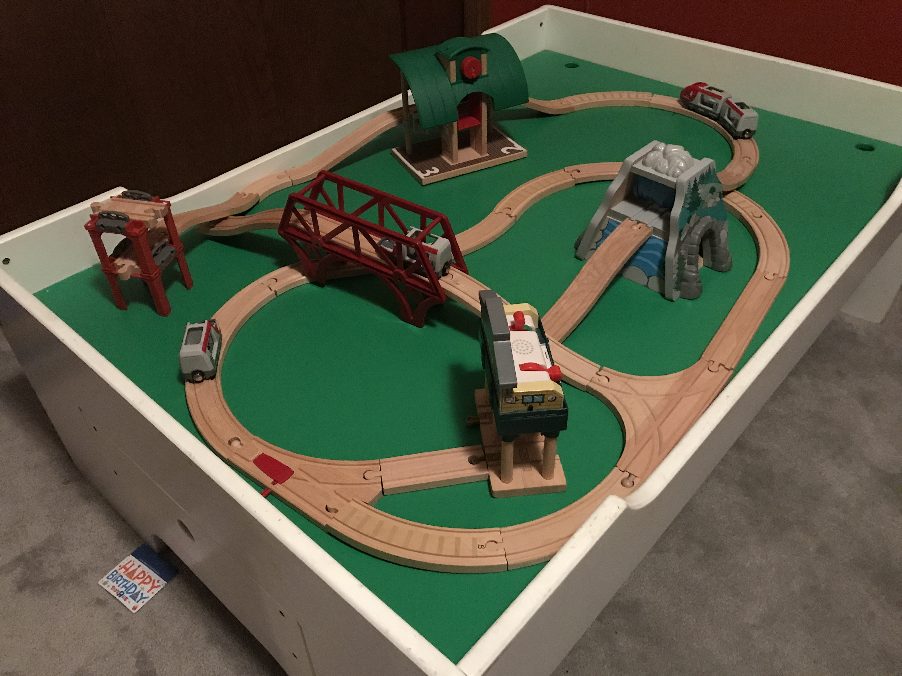
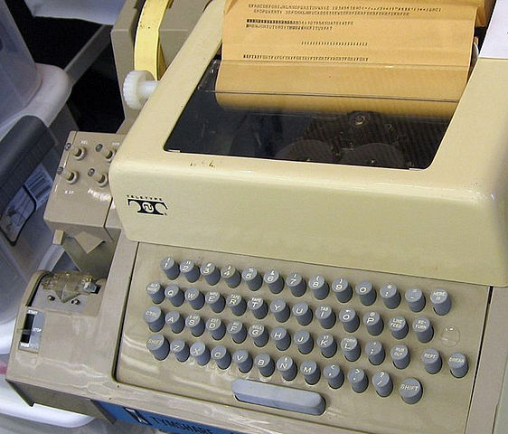
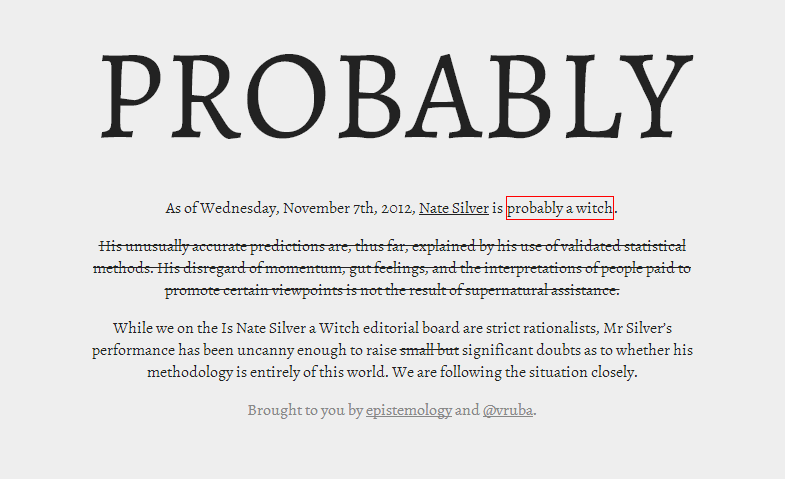
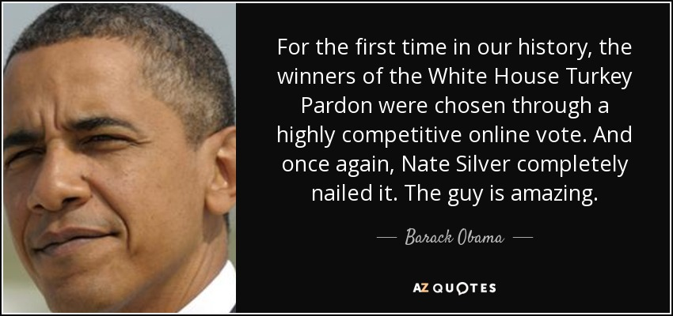

# R and RStudio

## What is R?

- A statistical programming language
- Free and open-source software
- A core package with many available user-created add-ons (packages)

\bigskip

R is currently popular in a number of fields, including:

- Statistics
- Machine learning
- Data journalism / Data analysis
- Bioinformatics

## What is R?

R is a programming language popular for statistical computing. 

> "The best thing about R is that it was developed by statisticians. The worst thing about R is that... it was developed by statisticians."

> -Bo Cowgill, Google, at the Bay Area R Users Group

Other programming languages popular for statistical computing include: 

- SAS
- SPSS
- Matlab
- Julia
- Python

## Open-source software

- Gratis: Free as in beer
- Libre: Free as in speech

\medskip

A basic sketch of how software can be "free":
```{r echo = FALSE, out.width = "300pt", fig.align='center'}

```

## Open-source software

With open-source software (free as in speech), you can:

- Check out the code to figure out how the software works
- Share the code (and software) with other people
- Make any changes you want to the code

```{r echo = FALSE, out.width = "300pt", fig.align='center'}

```

<!-- ## Open-source software -->

<!-- > "Open-source software is simply software for which the original source code is made freely available and may be redistributed and modified. ... Open-source systems are tried and tested. A majority of supercomputers use them. The Defense Department, NASA and the United States Air Force all use open-source systems, because they know this provides far more security. Every step in our voting process should use software that follows these examples." -->

<!-- [Woolsey and Fox. *To Protect Voting, Use Open-Source Software.* New York Times. August 3, 2017.](https://www.nytimes.com/2017/08/03/opinion/open-source-software-hacker-voting.html?mcubz=3) -->

## Open-source software

> "Despite its name, open-source software is less vulnerable to hacking than the secret, black box systems like those being used in polling places now. That’s because anyone can see how open-source systems operate. Bugs can be spotted and remedied, deterring those who would attempt attacks. This makes them much more secure than closed-source models like Microsoft’s, which only Microsoft employees can get into to fix."

[Woolsey and Fox. *To Protect Voting, Use Open-Source Software.* New York Times. August 3, 2017.](https://www.nytimes.com/2017/08/03/opinion/open-source-software-hacker-voting.html?mcubz=3)

<!-- ## Open-source software -->

<!-- > "One reason for the software companies’ resistance is the belief that it’s impossible to make a profit from open-source software. This is a myth. Businesses that use open-source software still need all of the other things that software companies provide. Many major companies use open-source software in their products." -->

<!-- [Woolsey and Fox. *To Protect Voting, Use Open-Source Software.* New York Times. August 3, 2017.](https://www.nytimes.com/2017/08/03/opinion/open-source-software-hacker-voting.html?mcubz=3) -->

## Open-source software

Funding agencies are starting to ask for grant proposals to develop open-source tools. For example, a recent call from the NIH asks for:

> "**Open-source,** generalizable, and scalable bioinformatics tools"

NIH RFA-RM-17-012: "Metabolomics Data Analysis and Interpretation Tools (U01)"

## What is RStudio?

RStudio (the software) is an integrated development environment (IDE) for R. You download it separately from R, but it's a "nicer" way to work in R. 

\bigskip

This IDE includes: 

- An interface with "panes" for key tasks you'll be doing (e.g., one pane with the R console, one for scripts, one to view graphs)
- Code highlighting
- Version control (git) and interface with GitHub
- Tools for Shiny web app development
- Tools for R package development

## What is RStudio?

RStudio (the company) is a leader in the R community. Currently, the company:

- Develops and freely provides the RStudio IDE
- Provides excellent resources for learning and using R (cheatsheets, )
- Is producing some of the most-used R packages
- Employs some of the top people in R development
- Is a key member of The R Consortium (others include Microsoft, IBM, and Google)

## Setting up

If do not already have them, you will need to download and install both R and RStudio. 

- Go to [CRAN](https://cran.r-project.org) and download the latest version of R for your system. Install.
- Go to the [RStudio download page](https://www.rstudio.com/products/rstudio/download/) and download the latest version of RStudio for your system. Install. 
- Defaults should be fine for everything.

# The "package" system

## R packages

Your original download of R is only a starting point:

```{r echo = FALSE, out.width = "200pt", fig.align='center'}
knitr::include_graphics("../figures/TrainBasic.JPG")
```

## R packages

To take full advantage of R, you'll want to add on packages:

```{r echo = FALSE, out.width = "200pt", fig.align='center'}

```

## R packages

You can get packages to add-on to your version of R from:

- CRAN (thousands of available packages)
- Bioconductor (specifically for bioinformatics-related packages)
- GitHub
- Your friends and collaborators
- Make them yourself

\medskip

The most popular place from which to get packages is currently CRAN. You can install packages from CRAN using R code. 

## Installing from CRAN

For example, to get the package `phonenumber`, you could use:

```{r, eval = FALSE}
install.packages("phonenumber")
```

```{r fig.align = "center", out.width = "75pt", echo = FALSE}
knitr::include_graphics("../figures/telephone_keypad.png")
```

## Loading an installed package

Once you have a package, you can load it to an R session using the `library()` function. 

```{r}
library("phonenumber")
```

Once it's loaded, you can use all its functions.

```{r}
fedex_number <- "GoFedEx"
letterToNumber(fedex_number)
```

## Alternative package::function notation

## Alternative package::function notation

[Using tab notation]

## Package vignettes

Many packages will come with a "vignette", or a tutorial on how to use the package. These are very helpful tools for figuring out how to use a package. 

To get a list of all the vignettes a package has, use the `vignette` function, specifying a package name with `package`: 

```{r eval = FALSE}
vignette(package = "phonenumber")
```

## Package vignettes

To open a vignette once you know its name, you can also use the `vignette` function. For example, to open the vignette called "phonenumber" for the `phonenumber` package, run: 

```{r eval = FALSE}
vignette("phonenumber", package = "phonenumber")
```

Many packages only have one vignette, with the same name as the package. In that case, you can open the vignette using a shorter call: 

```{r eval = FALSE}
vignette("phonenumber")
```


# Some basics of R code

## R's MVP: The *gets arrow*

The *gets arrow*, `<-`, is R's assignment operator. It takes whatever you've created on the right hand side of the `<-` and saves it as an object with the name you put on the left hand side of the `<-` : 

```{r eval = FALSE}
## Note: Generic code-- this will not work
[name of object] <- [thing I want to save]
```

## R's MVP: The *gets arrow*

For example, if I just type `"GoFedEx"`, R will print it back to me, but won't save it anywhere for me to use later:

```{r}
"GoFedEx"
```

## R's MVP: The *gets arrow*

However, if I assign it to an object, I can print it out or use it later by referencing that object name:

```{r}
fedex_number <- "GoFedEx"
fedex_number
letterToNumber(fedex_number)
```

## <- vs. =

You can make assignments using either `<-` or `=`, and you'll see both when you're reading other people's code. 

\medskip

However, R gurus advise using `<-` in your own code, and as you move to doing more complex things, problems might crop up if you use `=`. 

## <- vs. =

For now, though, it will be helpful for you to know that these two calls do the same thing:

```{r}
one_to_ten <- 1:10
one_to_ten

one_to_ten = 1:10
one_to_ten
```

## History of <-

```{r fig.align = "center", out.width = "200pt", echo = FALSE}

```

\small Photo by Marcin Wichary, User:AlanM1 - Derived (cropped) from, CC BY 2.0, https://commons.wikimedia.org/w/index.php?curid=20744606

## Naming objects

> “There are only two hard things in Computer Science: cache invalidation and naming things.”

> — Phil Karlton

## Naming objects

- Use only letters, numbers, and underscores
- Don't start with anything but a letter

*From [Hadley Wickham's R style guide](http://adv-r.had.co.nz/Style.html)*

- Use lower case for variable names (`fedex_number`, not `FedExNumber`)
- Use an underscore as a separator (`fedex_number`, not `fedex.number` or `fedexNumber`)
- Avoid using names that are already defined in R (e.g., don't name an object `mean`, because a `mean` function exists)

## Listing objects

At any point, you can use the `ls` function to list all the objects in your current R working session: 

```{r}
ls()
```

You can also check out the "Environment" pane in RStudio to see some of the R objects defined in your current R session.

## R's most basic object types

The two most basic types of objects for data in R are **vectors** (1D) and **dataframes** (2D). 

## Vectors

- A vector is a string of values. 
- All values must be of the same class (i.e., all numbers, all characters, all dates)
- You can use `c` to join values together to create a vector
- The *length* of the vector is how many values it has in it

For example:
```{r}
fibonacci <- c(1, 1, 2, 3, 5)
fibonacci
length(fibonacci)
```

## Vectors

An example using characters instead of numbers:

```{r}
one_to_five <- c("one", "two", "three", "four", "five")
one_to_five
```

If you mix classes, it will default to most generic:

```{r}
mixed_classes <- c(1, 3, "five")
mixed_classes
```

## Vectors

You can pull out certain values by using indexing (`[...]`) to identify the locations you want to get:

```{r}
fibonacci[2] # Get the second value
fibonacci[c(1, 5)] # Get first and fifth values
fibonacci[1:3] # Get the first three values
```

## Vectors

Vectors can have several different classes, including numeric, character, factor, and date. 

Typically, when you use `c`, you'll be creating a numeric or character vector. More complex classes (like factors and dates) require a bit more work to create "from scratch". 

- For character vectors, use quotation marks on each element. 

```{r eval = FALSE}
one_to_five <- c("one", "two", "three", "four", "five")
```

- For numeric, don't use quotation marks, but make sure you're using numbers. 

```{r eval = FALSE}
fibonacci <- c(1, 1, 2, 3, 5)
```


## Vectors

You can use the `class` function to figure out the class of a vector. 

```{r}
class(fibonacci)
class(one_to_five)
class(c("1", "2", 5))
```

## Dataframes

A dataframe is one or more vectors of the same length stuck together side-by-side. It is the closest R has to what you'd get with an Excel spreadsheet. 

\medskip

You can create dataframes using the `data.frame` function. However, most often you will create a dataframe by reading in data from a file using something like `read.csv`. 

## Dataframes

For example, to create a dataframe from vectors you already have saved as R objects:

```{r}
fibonacci_seq <- data.frame(num_in_seq = one_to_five,
                            fibonacci_num = fibonacci)
fibonacci_seq
```

## Dataframes

The format for using `data.frame` is:

```{r eval = FALSE}
## Generic code
[name of object] <- data.frame([1st column name] = 
                                     [1st column content],
                               [2nd column name] = 
                                     [2nd column content])
```

## Dataframes

You can use indexing (`[..., ...]`) for dataframes, too, but now they'll have two dimensions (rows, then columns). Put the rows you want before the comma, the columns after. If you want all of something, leave the designated spot blank. For example:

```{r}
fibonacci_seq[1:2, 2] # First two rows, second column
fibonacci_seq[5, ] # Last row, all columns
```

## Dataframes

Usually, instead of creating a dataframe from vectors, you'll read one in from data on an outside file. For example, to read in a dataset from a csv file called "daily_show_guests.csv":

```{r echo = FALSE}
daily_show <- read.csv("../data/daily_show_guests.csv",
                       header = TRUE,
                       skip = 4)
```
```{r eval = FALSE}
daily_show <- read.csv("daily_show_guests.csv",
                       header = TRUE,
                       skip = 4)
```

```{r}
daily_show[1:2, 1:4]
```

## Dataframes

You can use the functions `dim`, `nrow`, and `ncol` to figure out the dimensions (number of rows and columns) of a dataframe:

```{r}
dim(daily_show)
nrow(daily_show)
ncol(daily_show)
```

## Dataframes

Base R also has some useful functions for quickly exploring dataframes: 

- `str`: Show the structure of an R object, including a dataframe
- `summary`: Give summaries of each column of a dataframe.

For example, to get summaries of the first two columns of the Daily Show data, you can run: 

```{r}
summary(daily_show[ , c(1, 2)])
```


## In-Course Exercises

Here are a few tips for doing these in-course exercises: 

- Sometimes, I will ask you to try out things that we haven't covered yet in class. In this case, I'll give you detailed instructions. You can also use Google, R help files, and any other resources you want to help you figure out how to do something for an in-course exercises. If you're really stumped, I'm happy to help. 
- For each section of the exercise, I've included some example R code to show one possible solution. Try to not look at this until you've tried the exerise yourself without it. If you move quickly to this example R code, you will not learn R very quickly. 
- Some groups tend to move more quickly then others. I often include "If you have extra time" sections for groups who are moving more quickly.

## In-Course Exercises

The #1 rule for this class: 

**Don't use spaces in file pathnames!**

This includes the names of files and the names of directories. Keep this in mind during today's exercise. (We'll talk more about why not next week.)

## In-Course Exercises

We'll take a break now to get started on this week's in-course exercise. You can find all the instructions on the online coursebook (https://geanders.github.io/RProgrammingForResearch/r-preliminaries.html). 

Get together with your group members and do Sections 1.6.1 through [x] of the In-Course Exercise for Week #1 ("R Preliminaries").

## Nate Silver / FiveThirtyEight

```{r echo = FALSE, out.width = "300pt", fig.align='center'}

```

## Nate Silver / FiveThirtyEight

```{r echo = FALSE, out.width = "300pt", fig.align='center'}

```

For the story, see http://www.politico.com/blogs/media/2012/11/obama-cracks-nate-silver-joke-at-turkey-pardoning-150132.

## Functions

In general, functions in R take the following structure:

```{r, eval = FALSE}
## Generic code
function.name(required information, options)  
```

The result of the function will be output to your R session, unless you choose to save the output in an object:

```{r, eval = FALSE}
## Generic code
new.object <- function.name(required information, options)  
```

## Functions

Examples of this structure:

```{r, eval = FALSE}
head(daily_show)
head(daily_show, n = 3)
daily_show <- read.csv("daily_show_guests.csv",
                    skip = 4,
                    header = TRUE)
```

Find out more about a function by using `?` (e.g., ,`?head`, `?read.csv`). This will take you to the help page for the function, where you can find out all the possible arguments for the function, required and optional.

## When to use quotations

## R working session

## Script files versus the R console

## In-Course Exercises

We'll take a break now to get do some more of this week's in-course exercise. You can find all the instructions on the online coursebook (https://geanders.github.io/RProgrammingForResearch/r-preliminaries.html). 

Get together with your group members and do Sections [x] through [x] of the In-Course Exercise for Week #1 ("R Preliminaries").
