# What is R?

## What is R?

- A programming language good for data analysis / statistics
- A base package of some software with many available user-created add-ons (packages)
- Free and open-source software
- An interpreted language

\bigskip

R is currently popular in a number of fields, including:

- Statistics / Biostatistics
- Machine learning
- Data journalism 
- Ecology 
- Financial engineering
- Bioinformatics

## What is R?

R is a programming language popular for statistical computing. \medskip

> "The best thing about R is that it was developed by statisticians. The worst thing about R is that... it was developed by statisticians."

> -Bo Cowgill, Google, at the Bay Area R Users Group

Other programming languages popular for statistical computing include: 

- SAS
- SPSS
- Matlab
- Julia
- Python

<!-- ## Free and open-source software -->

<!-- ```{r echo = FALSE, out.width = "150pt", fig.align='center'} -->
<!-- knitr::include_graphics("../figures/stallman") -->
<!-- ``` -->

<!-- \footnotesize Source: Ruben Rodriguez.  -->
<!-- licensed under the [Creative Commons Attribution 4.0 International license](https://creativecommons.org/licenses/by/4.0/deed.en). -->

<!-- [Stallman story] -->

## Free and open-source software

How a lot of software is created:

```{r echo = FALSE, out.width = "300pt", fig.align='center'}
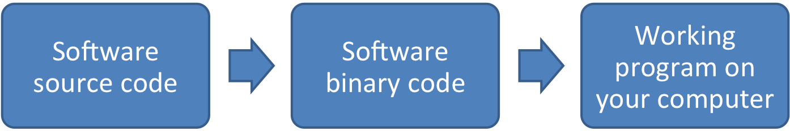
```

## Free and open-source software

A basic sketch of how software can be "free":

```{r echo = FALSE, out.width = "300pt", fig.align='center'}
knitr::include_graphics("../figures/OpenSourceOverview.png")
```

- **Gratis**: Free as in beer
- **Libre**: Free as in speech

## Free and open-source software

With open-source software (free as in speech), you can:

- Check out the code to figure out how the software works
- Share the code (and software) with other people
- Make any changes you want to the code

```{r echo = FALSE, out.width = "300pt", fig.align='center'}
knitr::include_graphics("../figures/OpenSourceOverview.png")
```

<!-- ## Open-source software -->

<!-- > "Open-source software is simply software for which the original source code is made freely available and may be redistributed and modified. ... Open-source systems are tried and tested. A majority of supercomputers use them. The Defense Department, NASA and the United States Air Force all use open-source systems, because they know this provides far more security. Every step in our voting process should use software that follows these examples." -->

<!-- [Woolsey and Fox. *To Protect Voting, Use Open-Source Software.* New York Times. August 3, 2017.](https://www.nytimes.com/2017/08/03/opinion/open-source-software-hacker-voting.html?mcubz=3) -->

## Free and open-source software

> "Despite its name, open-source software is less vulnerable to hacking than the secret, black box systems like those being used in polling places now. That’s because anyone can see how open-source systems operate. Bugs can be spotted and remedied, deterring those who would attempt attacks. This makes them much more secure than closed-source models like Microsoft’s, which only Microsoft employees can get into to fix."

[Woolsey and Fox. *To Protect Voting, Use Open-Source Software.* New York Times. August 3, 2017.](https://www.nytimes.com/2017/08/03/opinion/open-source-software-hacker-voting.html?mcubz=3)

<!-- ## Open-source software -->

<!-- > "One reason for the software companies’ resistance is the belief that it’s impossible to make a profit from open-source software. This is a myth. Businesses that use open-source software still need all of the other things that software companies provide. Many major companies use open-source software in their products." -->

<!-- [Woolsey and Fox. *To Protect Voting, Use Open-Source Software.* New York Times. August 3, 2017.](https://www.nytimes.com/2017/08/03/opinion/open-source-software-hacker-voting.html?mcubz=3) -->

## Free and open-source software

Funding agencies are starting to ask for grant proposals to develop open-source tools. For example, a recent call from the NIH asks for: \medskip

> "**Open-source,** generalizable, and scalable bioinformatics tools"

NIH RFA-RM-17-012: "Metabolomics Data Analysis and Interpretation Tools (U01)"

## Interpreted languages

```{r fig.align = "center", out.width = "325pt", echo = FALSE}
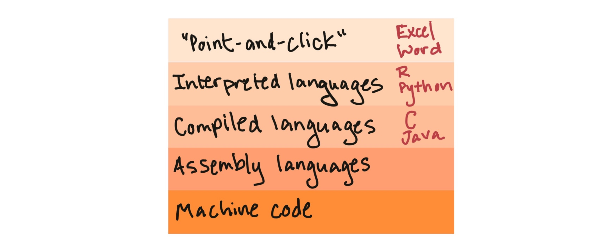
```

## Interpreted languages

```{r fig.align = "center", out.width = "325pt", echo = FALSE}
knitr::include_graphics("../figures/program_types2.jpg")
```

## Interpreted languages

```{r fig.align = "center", out.width = "325pt", echo = FALSE}
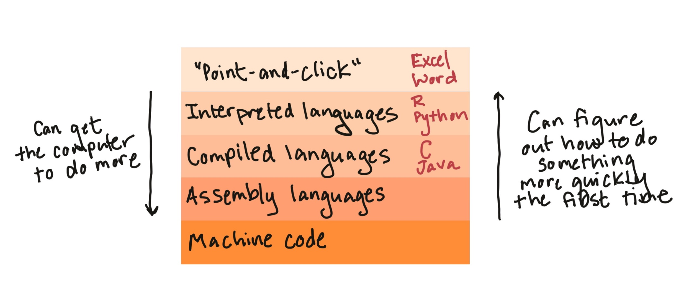
```

## RStudio vs. R

In this class, I'm having you download both R and RStudio. It's helpful for you 
to know the difference between the two. 

**R** provides the engine, while **RStudio** provides a nice place to work 
while using that engine (the leather interior, say). 

## RStudio vs. R

```{r fig.align = "center", out.width = "300pt", echo = FALSE}
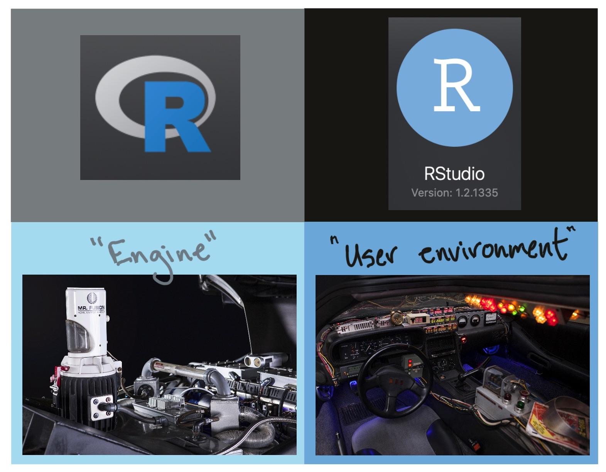
```

## RStudio vs. R

```{r fig.align = "center", out.width = "200pt", echo = FALSE}
knitr::include_graphics("../figures/plain_delorean.jpg")
```

**Note:** When you open **R**, it does have a user interface, it's just not 
as nice as RStudio's.

## RStudio vs. R

RStudio (the software) is an integrated development environment (IDE) for R. You
download it separately from R, but it's a "nicer" way to work in R.

\bigskip

This IDE includes: 

- An interface with "panes" for key tasks you'll be doing (e.g., one pane with
the R console, one for scripts, one to view graphs)
- Code highlighting
- Version control (git) and interface with GitHub
- Tools for Shiny web app development
- Tools for R package development

## RStudio vs. R

RStudio (the company) is a leader in the R community. Currently, the company:

- Develops and freely provides the RStudio IDE
- Provides excellent resources for learning and using R (e.g., cheatsheets, free
online books)
- Is producing some of the most-used R packages 
- Employs some of the top people in R development
- Is a key member of The R Consortium (others include Microsoft, IBM, and Google)

## Setting up

If do not already have them, you will need to download and install both R and RStudio. 

- Go to https://cran.r-project.org and download the latest version of R for your system. Install.
- Go to the [RStudio download page](https://www.rstudio.com/products/rstudio/download/) and download the latest version of RStudio Desktop for your system. Install. 
- Defaults should be fine for everything.

# How to "talk" to R

## How to "talk" to R

1. Open an **R session**
2. At the **prompt** in the **console**, enter an **R expression**
3. Read R's "response" (the **output**)
4. Repeat 2 and 3
5. Close the R session

## Opening an R session

An **R session** is an instance of you using R. 

To open an R session, double-click on the icon for "RStudio" on you computer.
When RStudio opens, you will be in a "fresh" R session, unless you restore a saved
session (which I strongly recommend against).

This means that, once you open RStudio, you will need to "set up" your session, 
including loading any packages you need (which we'll talk about later) and 
reading in any data (which we'll also talk about).

## The prompt in the console

In RStudio, there screen is divided into several "panes". We'll start with the pane 
called "Console".

The **console** lets you "talk" to R. This is where you can "talk" to R by
typing an **expression** at the **prompt** (the caret symbol, ">"). You press
the "Return" key to send this message to R.

## The prompt in the console

```{r fig.align = "center", out.width = "300pt", echo = FALSE}
knitr::include_graphics("../figures/r_console.jpg")
```

## How R might respond

Once you press "Return", R will respond in one of three ways:

1. R does whatever you asked it to do with the expression and prints the output
(if any) of doing that, as well as a new prompt so you can ask it something new
2. R doesn't think you've finished asking you something, and instead of giving you
a new prompt (">") it gives you a "+". This means that R is still listening, waiting 
for you to finish asking it something. 
3. R tries to do what you asked it to, but it can't. It gives you an **error message**, 
as well as a new prompt so you can try again or ask it something new. 

## R expressions, function calls, and objects

To "talk" with R, you need to know how to give it a complete **expression**. 

Most expressions you'll want to give R will be some combination of two elements: 

1. **Function calls**
2. **Object assignments**

We'll go through both these pieces and also look at how you can combine them 
together for some expressions.

## R expressions, function calls, and objects

According to John Chambers, one of the creators of R's precursor S:

1. Everything that exists in R is an **object**
2. Everything that happens in R is a **call to a function**

## Function calls

In general, function calls in R take the following structure: 

```{r eval = FALSE}
## Generic code (this won't run)
function_name(formal_argument_1 = named_argument_1, 
              formal_argument_2 = named_argument_2,
              [etc.])
```

A function call forms a complete R expression, and the output will 
be the result of running `print` or `show` on the object that is output
by the function call.

## Function calls

Here is an example of this structure: 

```{r}
print(x = "Hello world")
```

## Function calls

```{r fig.align = "center", out.width = "325pt", echo = FALSE}
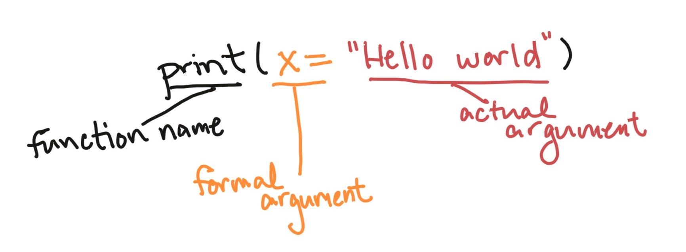
```

In this example, we're **calling** a function with the **name** `print`. It has one
**argument**, with a **formal argument** of `x`, which in this call we've provided
the **named argument** "Hello world". 

## Function calls

The **arguments** are how you customize the call to an R function. 

For example, you can use change the named argument value to print different messages 
with the `print` function: 

```{r}
print(x = "Hello world")
print(x = "Hi Fort Collins")
```

## Function calls

Some functions do not require any arguments. For example, the `getRversion` function will 
print out the version of R you are using.

```{r}
getRversion()
```

## Function calls

Some functions will accept multiple arguments. For example, the `print` function allows you 
to specify whether the output should include quotation marks, using the `quote`
formal argument: 

```{r}
print(x = "Hello world", quote = TRUE)
print(x = "Hello world", quote = FALSE)
```

## Function calls

Arguments can be **required** or **optional**. 

For a required argument, if you don't provide a value for the argument when you
call the function, R will respond with an error. For example, `x` is a **required argument**
for the `print` function, so if you try to call the function without it, you'll get an 
error: 

```{r eval = FALSE}
print()
```

```
Error in print.default() : argument "x" is 
  missing, with no default
```

## Function calls

For an **optional argument** on the other hand, R knows a **default value** for that 
argument, so if you don't give it a value for that argument, it will just use the 
default value for that argument. 

For example, for the `print` function, the `quote` argument has the default value 
`TRUE`. So if you don't specify a value for that argument, R will assume it should 
use `quote = TRUE`. That's why the following two calls give the same result: 

```{r}
print(x = "Hello world", quote = TRUE)
print(x = "Hello world")
```

## Function helpfiles

Often, you'll want to find out more about a function, including:

- Examples of how to use the function
- Which arguments you can include for the function
- Which  arguments are required versus optional
- What the default values are for optional arguments. 

You can find out all this information in the function's **helpfile**, which 
you can access using the function `?`. 

## Function helpfiles

For example, the `mean` function will let you calculate the mean (average) of a 
group of numbers. To find out more about this function, at the console type:

```{r eval = FALSE}
?mean
```

This will open a helpfile in the "Help" pane in RStudio.

## Function helpfiles

```{r fig.align = "center", out.width = "300pt", echo = FALSE}
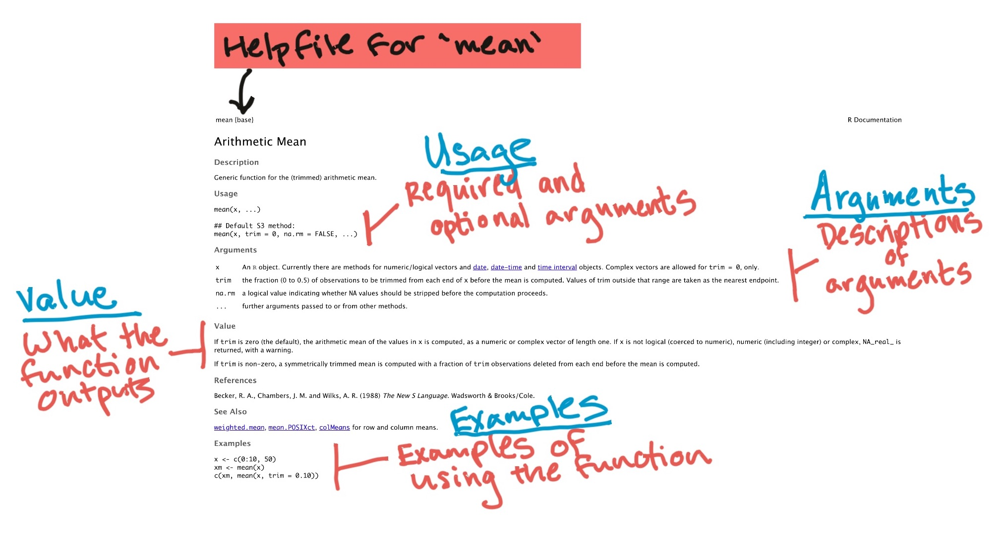
```

The helpfile includes sections giving the function's **usage**, **arguments**,
**value**, and **examples**.

## Function helpfiles

```{r fig.align = "center", out.width = "250pt", echo = FALSE}
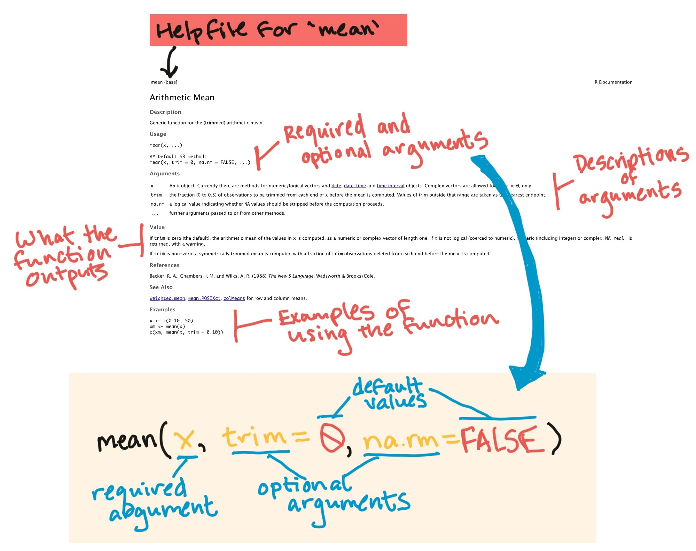
```

You can figure out which arguments are **required** and which are
**optional** in the Usage section of the helpfile.

## Operators

There's one class of functions that looks a bit different from others. These are the 
infix **operator** functions. 

Instead using parentheses after the function name, they usually go *between* two 
arguments. 

One common example is the `+` operator: 

```{r}
2 + 3
```

## Operators

There are operators for several mathematical functions: `+`, `-`, `*`, `/`.

There are also other operators, including **logical operators** and 
**assignment operators**, which we'll cover later.

## Objects, object names, and assignment expressions

Function calls will usually produce something called an **object**. 

If you just call a function, as we've been doing, then R will respond by printing out that
object. 

However, we'll often want to use that object some more. For example, we might want to 
use it as an argument later in our "conversation" with R, when we call another function 
later. 

If you want to re-use the results of a function call later, you can **assign** that
**object** to an **object name**.

This kind of expression is called an **assignment expression**.

## Assignment expressions

The **gets arrow**, `<-`, is R's assignment operator. It takes whatever you've
created on the right hand side of the `<-` and saves it as an object with the
name you put on the left hand side of the `<-` :

```{r eval = FALSE}
## Note: Generic code-- this will not work
[object name] <- [object]
```

## Assignment expressions

For example, if I just type `"Hello world"`, R will print it back to me, but
won't save it anywhere for me to use later:

```{r}
"Hello world"
```

## Assignment expressions

However, if I assign it to an object, I can "refer" to that object in a later expression. 

For example, the code below assigns the **object** `"Hello world"` the **object name** `message`. 
Later, I can just refer to this object using the name `message`, for example in a function
call to the `print` function:

```{r}
message <- "Hello world"
print(x = message)
```

## History of <-

```{r fig.align = "center", out.width = "200pt", echo = FALSE}
knitr::include_graphics("../figures/teletype.jpg")
```

<!-- \small Photo by Marcin Wichary, User:AlanM1 - Derived (cropped) from, CC BY 2.0, https://commons.wikimedia.org/w/index.php?curid=20744606 -->


## Assignment expressions

When you enter an **assignment expression** like this at the R console, if everything
goes right, then R will "respond" by giving you a new prompt, without any kind of 
message. 

However, there are three ways you can check to make sure that the object was 
assigned to the object name: 

1. Enter the object's name at the prompt and press return. The default if you do this
is for R to "respond" by calling the `print` function with that object as the `x`
argument. 
2. Call the `ls` function (which doesn't require any arguments). This will list all the
object names that have been assigned in the current R session. 
3. Look in the "Environment" pane in RStudio. This also lists all the object names that
have been assigned in the current R session.

## Assignment expressions

Here's an example of the first two strategies:

1. Enter the object's name at the prompt and press return:

```{r}
message
```

2. Call the `ls` function:

```{r}
ls()
```

## "Environment" pane

Here's an example of the third method:

```{r fig.align = "center", out.width = "250pt", echo = FALSE}
knitr::include_graphics("../figures/environment_pane.jpg")
```

## Object names

There are some absolute **rules** for the names you can use for an object name:

- Use only letters, numbers, and underscores 
- Don't start with anything but a letter

## Assigning objects to object names

If you try to assign an object to a name that doesn't follow the "hard" rules, you'll 
get an error. 

For example, all of these expressions will give you an error: 

```{r eval = FALSE}
1message <- "Hello world"
_message <- "Hello world"
message! <- "Hello world"
```

## Object names

There are also some **guidelines** for picking *good* object names:

*From [Hadley Wickham's R style guide](http://adv-r.had.co.nz/Style.html)* 

- Use lower case for variable names (`message`, not `Message`)
- Use an underscore as a separator (`message_one`, not `messageOne`)
- Avoid using names that are already defined in R (e.g., don't name an object `mean`, because a `mean` function exists)

## "Composing" to combine function calls

What if you want to "compose" a call from more than one function call?

One way to do it is to assign the output from the first function call to a name and
then use that name for the next call. 

For example: 

```{r}
message <- paste("Hello", "world")
print(x = message)
```

## "Composing" to combine function calls

You can also "nest" one function call inside another function call. For example:

```{r}
print(x = paste("Hello", "world"))
```

Just like with math, the order that the functions are evaluated moves from the
inner set of parentheses to the outer one.

There's one more way we'll look at later...

## "Composing" to combine function calls

```{r echo = FALSE, fig.align="center", out.width= "300pt"}
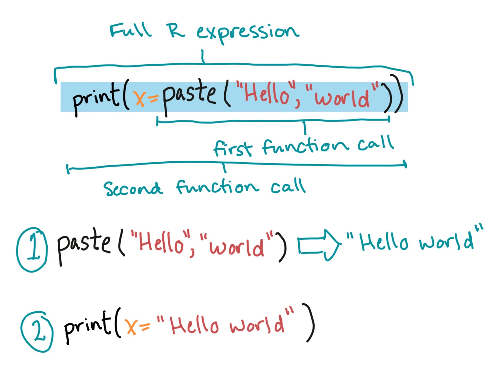
```

## Using R scripts

The console can be great for quick functions to explore the data. 

However, for most data analysis work you'll want to use a script, so you can
save all the expressions you used for the analysis.

This improves the *reproducibility* of your analysis.

## R scripts

An **R script** is a plain text file where you can write down and save R code. 

When you write, run, and save your R code in a script rather than running it one
line at a time in the console, you can easily go back and re-do exactly what you
did again later. 

You can also share the script for someone else to use, or run it on a different
computer.

## R scripts

RStudio has one pane that shows any R scripts you have open. If you'd like to
create new R scripts, you can do that in RStudio with the following steps:

- Open a new script file in RStudio: `File` -> `New File` -> `R Script`.
- I recommend that you make an "R" folder in all of the R project directories
that you create and save all your script files in that folder.
- Save scripts using the extension `.R`

## R scripts

Running code in R scripts line-by-line:

- To run code from an R script file in RStudio, you can use the `Run` button (or
`Command-R`).
- This will run whatever's on your cursor line or whatever's highlighted.

**Sourcing** an R script (i.e., running all the code saved in the script):

- To run the whole script, you can also use the `source` function with the
filename.
- You can also use the "Source" button on the script pane. 

## R scripts

```{r echo = FALSE, fig.align="center", out.width= "300pt"}
knitr::include_graphics("../figures/ExampleOfRScript.jpg")
```

## Comment characters

Sometimes, you'll want to include notes in your code. You can do this in all
programming languages by using a **comment character** to start the line with
your comment.

In R, the comment character is the hash symbol, `#`. R will skip any line that
starts with `#` in a script.

```{r}
# Don't print this.
"But print this"
```

## Closing an R session

Do **not** save the history of your R session when you close RStudio. Instead,
get in the habit of writing your R code in reproducible formats (R scripts,
RMarkdown documents)

## In-Course Exercises

We'll take a break now to start on this week's in-course exercise.

You can find
all the instructions on the [online coursebook](https://geanders.github.io/RProgrammingForResearch/r-preliminaries.html).

We'll form groups of 2--3 students. In your group, do Sections 1--3 
of the In-Course Exercise for Week # 1 ("R Preliminaries").

## In-Course Exercises

Here are a few tips for doing these in-course exercises: 

- Sometimes, I will ask you to try out things that we haven't covered yet in
class. In this case, I'll give you detailed instructions. You can also use
Google, R help files, and any other resources you want to help you figure out
how to do something for an in-course exercises. If you're really stumped, I'm
happy to help.
- For each section of the exercise, I've included some example R code to show
one possible solution. Try to not look at this until you've tried the exerise
yourself without it. If you move quickly to this example R code, you will not
learn R very quickly.
- Some groups tend to move more quickly then others. I often include "If you
have extra time" sections for groups who are moving more quickly.
- Use Google!

## Nate Silver / FiveThirtyEight

```{r echo = FALSE, out.width = "300pt", fig.align='center'}
knitr::include_graphics("../figures/is-nate-silver-a-witch.png")
```

## Nate Silver / FiveThirtyEight

```{r echo = FALSE, out.width = "300pt", fig.align='center'}
knitr::include_graphics("../figures/obama-nate-silver-turkey.jpg")
```

For the story, see
http://www.politico.com/blogs/media/2012/11/obama-cracks-nate-silver-joke-at-turkey-pardoning-150132.

# The "package" system

## R packages

Your original download of R is only a starting point:

```{r echo = FALSE, out.width = "200pt", fig.align='center'}
knitr::include_graphics("../figures/TrainBasic.JPG")
```

## R packages

To take full advantage of R, you'll want to add on packages:

```{r echo = FALSE, out.width = "200pt", fig.align='center'}
knitr::include_graphics("../figures/TrainComplex.JPG")
```

## What's in a package?

```{r echo = FALSE, out.width = "200pt", fig.align='center'}
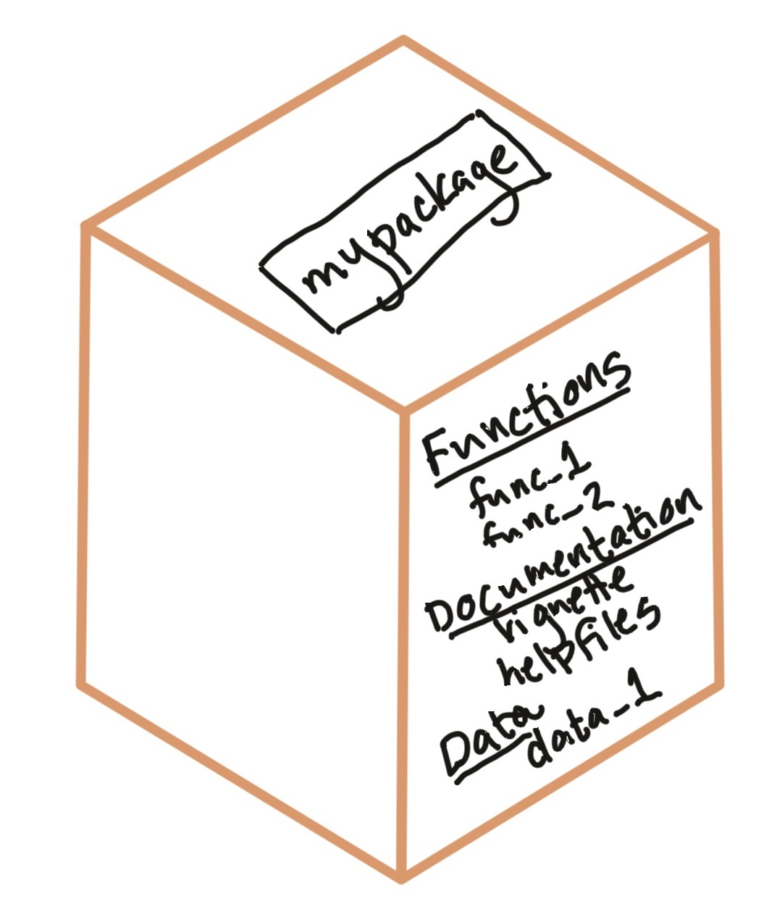
```

## R packages

You can get packages to add-on to your version of R from:

- CRAN 
- Bioconductor (specifically for bioinformatics-related packages)
- GitHub
- Your friends and collaborators
- Make them yourself

## CRAN 

The Comprehensive R Archive Network (CRAN) is the primary source of R packages,
with thousands of available packages. Each of the packages available on CRAN has
a unique name and has passed some broad checks.

```{r echo = FALSE, out.width = "300pt", fig.align='center'}
knitr::include_graphics("../figures/CRAN_package_10000.png")
```

## Installing from CRAN  

The main way you will install new packages will be with the `install.packages`
function. By default, this installs packages from CRAN.

For example, to get the package "phonenumber", you could use:

```{r, eval = FALSE}
install.packages(pkgs = "phonenumber")
```

```{r fig.align = "center", out.width = "75pt", echo = FALSE}
knitr::include_graphics("../figures/telephone_keypad.png")
```

## Installing from CRAN  

**Installing** a package downloads it (usually from CRAN) to your computer. 

\medskip

You will need to be online to install a package, because it downloads the package
from an online repository. 

\medskip

Once you install a package, you do not need to install it again. It's on your
computer. (At least, until the package maintainer creates a new version.)

## Installing versus loading

```{r echo = FALSE, out.width = "275pt", fig.align='center'}
knitr::include_graphics("../figures/install_vs_library.jpg")
```

**Install** a package (with `install.packages`) to get it onto your computer. **Load** it (with `library`) to get it into
your R session.


## How to use a package you've installed

1. Open an R session
2. Load the package
3. Use the package's vignette and helpfiles to figure out how to use the package
(optional)
4. Use functions in the package

## Loading an installed package

Once you have a package, you can load it to an R session using the `library()`
function.

```{r}
library(package = "phonenumber")
```

Once it's loaded, you can use all its functions.

```{r}
message <- "HelloWorld"
letterToNumber(value = message)
```


## Package vignettes

Many packages will come with a "vignette", or a tutorial on how to use the
package. These are very helpful tools for figuring out how to use a package.

To get a list of all the vignettes a package has, use the `vignette` function,
specifying a package name with `package`:

```{r eval = FALSE}
vignette(package = "phonenumber")
```

## Package vignettes

To open a vignette once you know its name, you can also use the `vignette`
function. For example, to open the vignette called "phonenumber" for the
`phonenumber` package, run:

```{r eval = FALSE}
vignette(topic = "phonenumber",
         package = "phonenumber")
```

Many packages only have one vignette, with the same name as the package. In that
case, the vignette topic usually has the same name as the whole package, so you can 
open the vignette using a shorter call:

```{r eval = FALSE}
vignette(topic = "phonenumber")
```

## Function helpfiles

Packages include helpfiles for all the functions they intend for people to use.

\medskip

You can access the helpfile for a function using `?` followed by the function
name. For example, to get the helpfile for `letterToNumber`, you can run:

```{r eval = FALSE}
?letterToNumber
```

# Object classes

## What are object classes?

Objects can be structured in different ways, in terms of how they "hold" data.

These difference structures are called **object classes**.

One class of objects can be a subtype of a more general object class.

## What are object classes?

Today, we'll look at two key object classes for working with data in R: 

1. Vectors
2. Dataframes (tibbles)

## What are object classes?

For these two object classes (vectors and dataframes), we'll look at: 

1. How that class is structured
2. How to make a new object with that class
3. How to extract values from objects with that class

In later classes, we'll spend a lot of time learning how to do other things
with objects from these two classes, plus learn some other classes.

## Structure of vector class

```{r fig.align = "center", out.width = "300pt", echo = FALSE}
knitr::include_graphics("../figures/example_vector.jpg")
```

A **vector** is an object class where the object is made of a string of values.

## Structure of vector class

```{r fig.align = "center", out.width = "275pt", echo = FALSE}
knitr::include_graphics("../figures/vector_class_examples.jpg")
```

All the values in a vector must be of the same **type** (e.g., all numbers, all
characters). There are different **classes** of vectors depending on the type
of data they store.

## Creating vectors

To create a vector object, you can use the **concatenate** function, `c`.

For example, to create a vector with the names of the three main characters 
in *Harry Potter*, use the R expression:

```{r}
c("Harry", "Ron", "Hermione")
```

## Creating vectors

If you want to use that object later, you can assign it an object name in the expression: 

```{r}
main_characters <- c("Harry", "Ron", "Hermione")
print(x = main_characters)
```

## Creating vectors

```{r fig.align = "center", out.width = "300pt", echo = FALSE}
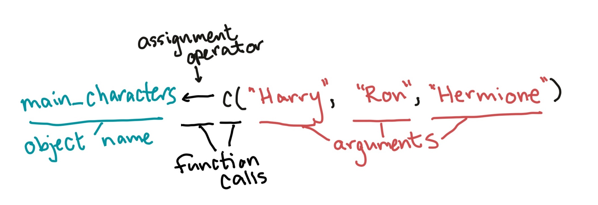
```

This **assignment expression** follows the structure we covered earlier for
function calls and assignment expressions.

## Creating vectors

Typically, when you use the `c` function, you'll be creating a numeric,
character, or logical vector. More complex classes (like factors and dates)
require a bit more work to create "from scratch".

- For character vectors, use quotation marks around each element. 

```{r}
main_characters <- c("Harry", "Ron", "Hermione")
```

- For numeric, don't use quotation marks. 

```{r}
n_kids <- c(1, 7, 1)
```

## Vectors

You can use the `class` function to figure out the class of a vector. 

```{r}
class(x = main_characters)
class(x = n_kids)
```

## Vectors

If you create a vector with a mix of classes, R will default the whole vector to
the most generic class:

```{r}
mixed_classes <- c(1, 3, "five")
mixed_classes
```

## Vectors

The *length* of the vector is how many values it has. The 
`main_characters` vector includes three values ("Harry", "Ron", and "Hermione"),
so it has a length of 3.

You can use the `length` function to figure out how long a vector is:

```{r}
length(x = main_characters)
```

## Extracting values from vectors

You can pull out certain values by using indexing (`[...]`) to identify the
locations you want to get. For example, to get the second value from the `main_characters` 
vector, you can call:

```{r}
main_characters[2] # Get the second value
```

## Extracting values from vectors

You can also extract more than one value from a vector, by giving a vector
of positions as the input in the square brackets. 

For example, to get the first and third values from the `main_characters` 
vector, you can call:

```{r}
main_characters[c(1, 3)] # Get first and third values
```

## Extracting values from vectors

There is an R operator that's very helpful with this. The `:` operator
will create a sequence of values: 

```{r}
1:3
```

Therefore, to get the first three values from the `main_characters` 
vector, you can call:

```{r}
main_characters[1:3] 
```

## In-Course Exercise

We'll take a break now to do Sections 4 and 5 of the In-Course Exercise

## Structure of dataframe objects

```{r fig.align = "center", out.width = "300pt", echo = FALSE}
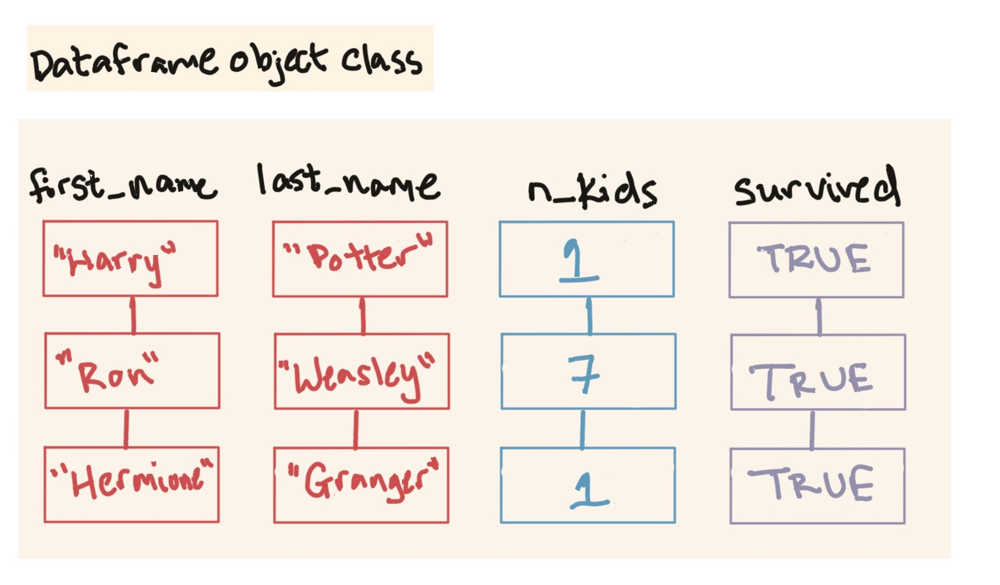
```

A **dataframe** combines one or more vectors of the same length stuck together
side-by-side. 

## Structure of dataframe objects

```{r fig.align = "center", out.width = "325pt", echo = FALSE}
knitr::include_graphics("../figures/example_dataframe_labeled.jpg")
```

A dataframe contains **rows** and **columns**, and each column has a 
**column name**.

## Creating dataframes

We'll be working with a specific class of dataframe called a **tibble**.

You can create tibble dataframe using the `tibble` function from the `tibble`
package. 

However, most often you will create a dataframe by reading in data from
a file---most datasets
will not be short enough that you want to enter them by hand in R.

We'll look at both methods of creating dataframes.

## Creating dataframes

The format for creating a tibble dataframe using the `tibble` function is:

```{r eval = FALSE}
## Generic code
library(package = "tibble")
[name of object] <- tibble([1st column name] = 
                                     [1st column content],
                           [2nd column name] = 
                                     [2nd column content],
                           etc.)
```

## Creating dataframes

```{r}
library(package = "tibble")
hp_data <- tibble(first_name = c("Harry", "Ron", "Hermione"),
                  last_name = c("Potter", "Weasley", "Granger"),
                  n_kids = c(1, 7, 1),
                  survived = c(TRUE, TRUE, TRUE))
hp_data
```

## Creating dataframes

You can also create dataframes by joining together vector objects you previously
created, as long as they have the same length and line up:

```{r}
hp_data <- tibble(first_name = main_characters,
                  last_name = c("Potter", "Weasley", "Granger"),
                  n_kids = n_kids,
                  survived = c(TRUE, TRUE, TRUE))
hp_data
```

## Creating dataframes

Usually, instead of creating a dataframe from vectors, you'll read one in from
data on an outside file, for example using `read_csv` from the `readr` package.

\medskip

For example, to read in a dataset from a csv file called "daily_show_guests.csv":

```{r echo = FALSE, message = FALSE}
library(package = "readr")
daily_show <- read_csv(file = "../data/daily_show_guests.csv",
                       skip = 4)
```
```{r eval = FALSE}
library(package = "readr")
daily_show <- read_csv(file = "daily_show_guests.csv",
                       skip = 4)
```

## Creating dataframes

This has read data in from the external file into a dataframe object in my R
session:

```{r}
ls()
```

## Dataframes

You can use the functions `dim`, `nrow`, and `ncol` to figure out the dimensions
(number of rows and columns) of a dataframe:

```{r}
dim(x = daily_show)
nrow(x = daily_show)
ncol(x = daily_show)
```

## Dataframes

Base R also has some useful functions for quickly exploring dataframes:

- `str`: Show the structure of an R object, including a dataframe
- `summary`: Give summaries of each column of a dataframe.


## Extracting values from dataframes

The `dplyr` package has two functions for extracting data from dataframes by position: 
`slice` to extract rows based on their row position and select to extract columns
based on their column position.

## Extracting values from dataframes

For example, if you wanted to get the first two rows of the `hp_data`
dataframe, you could run:

```{r message = FALSE, warning = FALSE}
library(package = "dplyr")
slice(.data = hp_data, c(1:2))
```

## Extracting values from dataframes

If you wanted to get the first and fourth columns, you could run: 

```{r}
select(.data = hp_data, c(1, 4))
```

## Extracting values from dataframes

You can compose calls from both functions. For example, you could extract the
values in the first and fourth columns of the first two rows with: 

```{r}
select(slice(.data = hp_data, c(1:2)), c(1, 4))
```


<!-- ## Dataframes -->

<!-- You can use indexing (`[..., ...]`) for dataframes, too, but now they'll have -->
<!-- two dimensions (rows, then columns). For example: -->

<!-- ```{r} -->
<!-- hp_data[1:2, 2] # First two rows, second column -->
<!-- ``` -->

<!-- ## Dataframes -->

<!-- If you want all of something, leave the designated spot blank. For example: -->

<!-- ```{r} -->
<!-- hp_data[3, ] # Last row, all columns -->
<!-- ``` -->

## In-Course Exercises

We'll take a break now to finish this week's in-course exercise. You can
find all the instructions on the [online coursebook](https://geanders.github.io/RProgrammingForResearch/r-preliminaries.html).

Get together with your group members and do Sections 4 through 8 of the
In-Course Exercise for Week #1 ("R Preliminaries"). 

If you have extra time, also try 9.

## In-Course Exercises

Hint: 

**Don't use spaces in file pathnames!**

This includes the names of files and the names of directories. Keep this in mind
during today's exercise. (We'll talk more about why not next week.)

# Some odds and ends

## Missing values

In R, `NA` is used to represent some types of missing values in a vector. This value can show up in numerical or character vectors (or in vectors of some other classes):

```{r}
c(1, 4, NA)
c("Jane Doe", NA)
```

## Missing values

```{r echo = FALSE, out.width = "225pt", fig.align='center'}
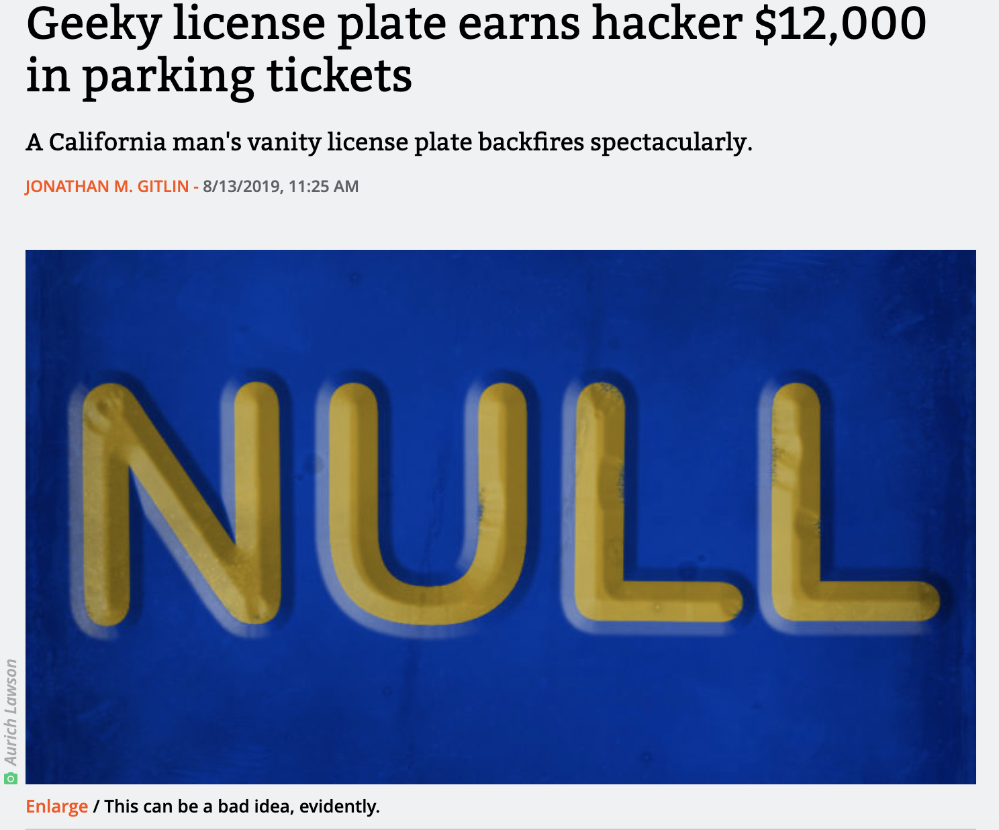
```

For the full story: 
https://arstechnica.com/cars/2019/08/wiseguy-changes-license-plate-to-null-gets-12k-in-parking-tickets/


## The `$` operator

The `select` function will extract a smaller dataframe object from a dataframe. The 
resulting object with have the dataframe class, even if it only has one column.

If you would like to extract a column from a dataframe as an object with the vector class, 
you can use the `$` operator.

For example, say you have the following dataset and want to pull the `color` column as a vector:

```{r}
example_df <- tibble(color = c("red", "blue"), 
                     value = c(1, 2))
example_df
```


## The `$` operator

You can pull the `color` column as a vector using the name of the dataframe, the dollar sign, and then the name of the column:

```{r}
example_df$color
```

```{r}
class(x = example_df$color)
```

(Note: You can use tab completion in RStudio after you put in `example_df$`.)

The `pluck` function in the `purrr` package also helps you extract a column of a
dataframe as a vector.


## `paste` and `paste0`

If you want to paste together several character strings to make a length-one character vector, you can use the `paste` function to do that:

```{r}
paste("abra", "ca", "dabra")
```

By default, spaces are used to separate each original character string in the final string.

## `paste` and `paste0`

If you want to remove these spaces, you can use the `sep` argument in the `paste` function: 

```{r}
paste("abra", "ca", "dabra", sep = "")
```

A short-cut function is `paste0`, which is identical to running `paste` with the argument `sep = ""`:

```{r}
paste0("abra", "ca", "dabra")
```

## <- vs. =

You can make assignments using either `<-` or `=`, and you'll see both when you're reading other people's code. 

\medskip

However, R gurus advise using `<-` in your own code. 

The arrow shows the *direction* of assignment. Also, as you move to doing more
complex things, problems might crop up if you use `=` for assignment in a few
specific cases.

## <- vs. =

For now, though, it will be helpful for you to know that these two calls do the same thing:

```{r}
one_to_ten <- 1:10
one_to_ten

one_to_ten = 1:10
one_to_ten
```

## When to use quotations

- Use quotation marks if you **literally** mean that specific character string
- Don't use quotation marks if you want to reference an R object by its name
- Never use quotation marks on the left-hand side of `<-` or `=`.

```{r echo = FALSE, out.width = "300pt", fig.align='center'}
knitr::include_graphics("../figures/literally.jpg")
```
\small Source: xkcd.com

## When to use quotations

- Use quotation marks if you **literally** mean that specific character string

```{r}
c("Harry", "Ron")
```

- Never use quotation marks on the left-hand side of `<-` or `=`.

```{r}
Harry <- c("Good at Quidditch")
Ron <- c("Good at Wizard Chess")
```

- Don't use quotation marks if you want to reference an R object by its name

```{r}
c(Harry, Ron)
```

## Being lazy

There are a few cases in R where you can be a bit lazy. 

One has to do with quotations. There are a few cases where, following the
rules we just covered, it will seem like you *should* use quotations, 
but you either don't have to or can't. 

One example is calling the `library` function. You can put the name of 
the library you want to load in quotation marks, or you can leave them off:

```{r}
library(package = "readr")
library(package = readr)
```

Another example, which we'll cover more next week, is referencing columns
by their column names in many tidyverse functions.

## Being lazy

Another way to be lazy is through leaving off formal argument names when 
you call a function. 

If you don't include formal argument names, then R will match actual arguments
in the function call to formal arguments by *position*. 

For example, since the first formal argument to the `class` function is `x = `,
the following two calls are the same: 

```{r}
class(x = main_characters)
class(main_characters)
```


## Alternative package::function notation

The `library` function is the most common way you'll access functions from R
packages, but it's not the only way to do this. There is another type of
notation that will allow you to use any external function from any package you
have installed on your computer: the `package::function` notation.

You can call functions by specifying the package name, a double colon, and then
the function name you want to use from that package. For example:

```{r}
phonenumber::letterToNumber(value = message)
```

## Alternative package::function notation

The `package::function` notation is not typically used because it substantially
increases how much you have to type in your code.

However, there can be cases where a function name is ambiguous. For example, you
might want to use functions from two different packages that have the same name.
In this case, using the `package::function` notation makes it crystal clear
which function you mean.

In practice, this problem is most likely to come up when you've loaded both
`plyr` and `dplyr`, which share several function names and are both popular
packages.

## Alternative package::function notation

There is another useful trick that you can do with the `package::function` notation.

RStudio has tab complemention, which means that once you start typing an object
name or function, if you press the Tab key, RStudio will give you suggestions
for how you can finish the name.

If you want to scroll through the names of all the external functions in a
package, you can do so by typing something like `?phonenumber::` in the console
(don't press Return) and then pressing the Tab key.

## "Composing" to combine function calls

There's one additional way to compose several function calls into one R expression.

There's a special "pipe" function (`%>%`) in a package called
"magrittr" that you can use to compose a large R expression from several smaller
function calls. This will "pipe" the object that is created from one function
call into the first argument for the next function call.

We'll explore this a **lot** more later in the course, but here's a taste of how
that looks:

```{r}
library(package = "magrittr")

paste(x = "Hello world") %>% 
  print()
```

## "Composing" to combine function calls

Here's another example. Earlier, we used the following code to extract certain
rows and columns from a dataframe: 

\small

```{r}
select(.data = slice(.data = hp_data, c(1:2)), c(1, 4))
```

You can use a pipe to express this much more cleanly: 

```{r}
slice(.data = hp_data, c(1:2)) %>% 
  select(c(1, 4))
```

