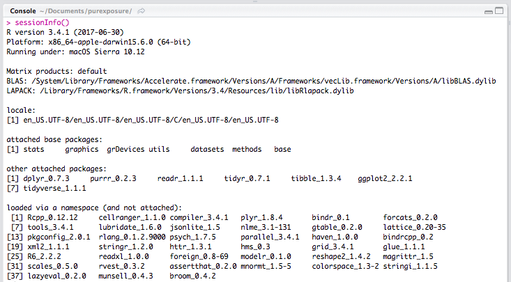
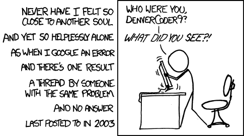
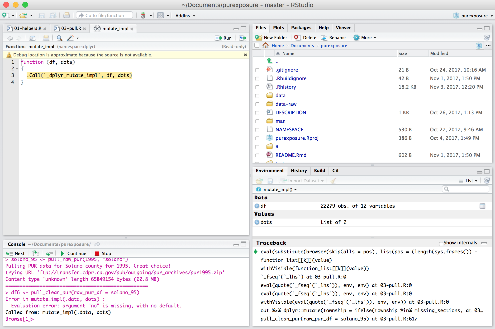
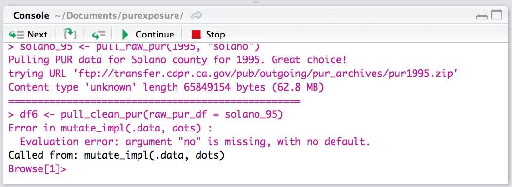
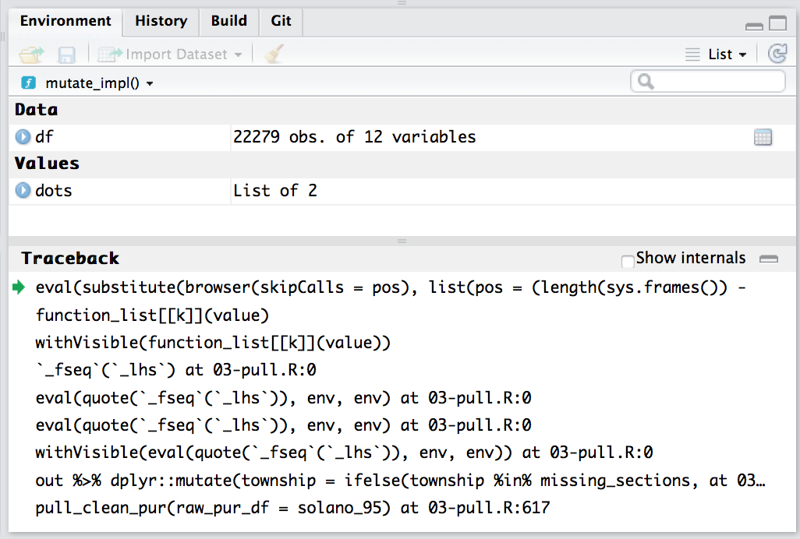
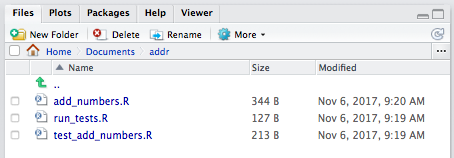
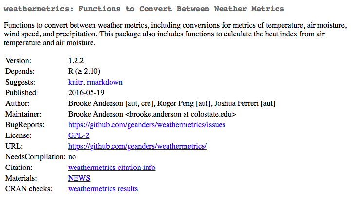

```{r echo = FALSE, message = FALSE, warning = FALSE}
library(dplyr)
```

# Odds and ends

## Final project guidelines

Each group will need to generate: 

1. The code for their project (we'll use GitHub to collaborate).
2. A brief report (5 to 6 pages including tables / figures) describing (1) the aim of their project, (2) the datasets they used, (3) what interesting things they found, (4) briefly, how their project fits into broader West Nile research, (5) how the group tackled their problem, (6) what pieces were particularly challenging and how they tackled those, (7) what they would do differently if they started fresh. Each group should submit a draft by Friday, Dec. 7 and must submit the final version, which responds to comments on the draft, by Thursday, Dec. 13. 
3. A presentation (15 minutes maximum) that covers the same material as the report. 

## Homework 6

Homework 6 is online and is due next Friday (Dec. 7) by midnight. 

## Office hours

Office hours will be the usual time this Friday, but will be in EH 121A instead
of EH 120. 

If we end up doing the final presentations earlier that week (or that Friday), 
I will schedule an alternative office hours sessions on the afternoon of 
Wednesday, Dec. 5.

## Class next Monday

We will be in Stadium 1214 next Monday. The lecture will be a combined lecture with 
some statistics students on using R on CSU's supercomputer. 

Please email Dr. Anderson today if you are still having problems getting access to the
Supercomputer, and she will get in touch with some of the CSU library staff 
involved with the supercomputer to see if they can help any MPH students get access
for the class.

## Class next Wednesday

I will have a few slides for class next Wednesday, but almost all of the time will be
available for you to work with your groups to finish up your group project. 

## Final project presentations

Proposed time for final presentations:

- Thursday, Dec. 6, 1:00--3:00
- Thursday, Dec. 6, 2:00--4:00
- Thursday, Dec. 6, 3:00--5:00
- Friday, Dec. 7, 2:30--4:30
- Friday, Dec. 7, 3:00--5:00
- Monday, Dec. 10, 1:00--3:00
- Monday, Dec. 10, 2:00--4:00
- Monday, Dec. 10, 3:00--5:00

# Overview of R packages

## What is an R package?

- From [Writing R Extensions](https://cran.r-project.org/doc/manuals/r-release/R-exts.html): "A directory of files which extend R".
- Files bundled together using `tar` and compressed using `gzip`. The file extension is `.tar.gz`. These are the *source files* for the package, which then must be installed from this source code locally prior to use. 
- Sometimes also called an *extension* of R.

## What is an R package?

Example R package:

```{r echo = FALSE, fig.align = "center", out.width = "\\textwidth"}
knitr::include_graphics("../figures/weathermetrics_package.png")
```

## What is an R package?

You can also have "binary packages" for a certain operating system. From [Writing R Extensions](https://cran.r-project.org/doc/manuals/r-release/R-exts.html):

> A binary package is "a zip file or tarball containing the files of an installed package which can be unpacked rather than installing from sources."

## Motivation

\begin{block}{Software development in biostatistics}
\includegraphics[width = \textwidth]{../figures/JeffLeekQuote.png}
\\ Source: Jeff Leek, Simply Statistics
\end{block}

## Motivation

\begin{block}{Consider developing software when}
\begin{itemize}
\item You have developed a new method you want to share
\item You have data you'd like to make publicly available 
\item You find yourself doing the same task repeatedly 
\end{itemize}
\end{block}

Why create an R package?

- Share some functions broadly
- Share some functions with a small group
- Create a version of code for yourself that's more organized and easier to use
    + Includes documentation (vignettes, help files)
    + Function names linked to package namespace
    + Once library is installed, can load easily
    
## NMMAPS package.

\includegraphics[width = \textwidth]{../figures/NMMAPS.png} \\
\small{Source: www.ihapss.jhsph.edu}

## Contents of NMMAPS package

\includegraphics[width = \textwidth]{../figures/NMMAPSPackageStructure.pdf}

## Impact of NMMAPS package

\begin{block}{Research impacts of NMMAPS package}
\textit{Source: Barnett,
  Huang, and Turner, ``Benefits of Publicly Available Data'', 
  Epidemiology 2012}
\begin{itemize}
\item As of November 2011, 67 publications had been published using this
data, with 1,781 citations to these papers 
\item Research using NMMAPS has been used by the US EPA in creating
  regulatory impact statements for air pollution (particulates and
  ozone) 
\item ``Thanks to NMMAPS, there is probably no other country in the
  world with a greater understanding of the health effects of air
  pollution and heat waves in its population.''
\end{itemize}
\end{block}

## Sharing an R package

If you want to share your R package, there are a number of ways you can do that:

- CRAN
- GitHub
- [Bioconductor](https://www.bioconductor.org): "Bioconductor provides tools for the analysis and comprehension of high-throughput genomic data." (from the Bioconductor website.)
- Other repositories
    + Private(-ish) repositories: e.g., ROpenSci's repository (for more, see https://ropensci.org/blog/blog/2015/08/04/a-drat-repository-for-ropensci)
    + `drat` repository: Make your own R package repository, including through GitHub pages. 
- Compressed file: You can save a source tarball or binary package file with others without posting to a repository.

## CRAN

Sharing on CRAN: 

- Traditional way to share an R package widely
- Easiest way for others to get your package (`install.packages`)
- Some barriers: 
    + Size constraint on packages (5 MB)
    + Must follow CRAN policies
    + All packages must pass a submission process. This is not a guarantee that a package does what it says, just a check that required files are where they should be and that the package more or less doesn't break things. 

## CRAN checks

```{r echo = FALSE, out.width = "0.7\\textwidth", fig.align = "center"}
knitr::include_graphics("../figures/trump_cran_checks.png")
```

## GitHub

GitHub is becoming more and more common as a place to share R packages, both development packages that eventually are posted to CRAN and packages that are never submitted to CRAN. 

- No restrictions / submission requirements
- GitHub repository size restrictions (1 GB, no files over 100 MB) much larger than CRAN package size restrictions (5 MB)
- GitHub packages can be installed using `install_github` from the `devtools` package
    + Requires `devtools` package, which has some set-up requirements (`XCode` for Mac, `Rtools` for Windows)
- Packages on CRAN cannot depend on packages available only on GitHub

## Package names

The format requirements for a package name are, based on [Writing R Extensions](https://cran.r-project.org/doc/manuals/r-release/R-exts.html):

> "This should contain only (ASCII) letters, numbers and dot, have at least two characters and start with a letter and not end in a dot."

Hadley Wickham's [additional guidelines](http://r-pkgs.had.co.nz/package.html): 

- Make it easy to Google.
- Make it all uppercase or all lower case
- Base it on a word that's easy to remember, but then tweak the spelling to make it unique (and easier to Google).
- Abbreviate.
- Add an "r".

## Package maintainer

A package can have many authors, but only one maintainer. The maintainer is in charge of fixing any problems that come up with CRAN checks over time to keep the package on CRAN. The maintainer is also the person who will be emailed about bugs, etc., by other users.

The package can have other authors, as well as people in other roles (e.g., contributor). See the helpfile for the `person` function for more on the codes used for different roles.

## Find out more

To find out more about writing R packages, useful sources are: 

- [Writing R Extensions](https://cran.r-project.org/doc/manuals/r-release/R-exts.html): Guidelines for R packages from the R Core Team.
- [R Packages](http://r-pkgs.had.co.nz) by Hadley Wickham
- [R package development cheatsheet](https://www.rstudio.com/wp-content/uploads/2015/06/devtools-cheatsheet.pdf)

# Debugging 

## Debugging 

```{r echo = FALSE, out.width = "200pt", fig.align='center'}
knitr::include_graphics("../figures/xkcd_fixing_problems.png")
```

## A general debugging strategy 

```
Error in as_mapper(.f, ...) : object 'quo_name' not found
In addition: There were 13 warnings (use warnings() to see them)
Called from: as_mapper(.f, ...)
Browse[1]> 
```

When you find an error: 

1. Breathe, relax 
2. Re-read the error message and focus on key wording 
3. Isolate the error 
4. Recreate the error 
5. Investigate 

## Be able to reproduce your error 

Reproduciblity is a key component of debugging, whether you are working alone or sharing the error with others. Being able to reproduce your error ensures that (1) you'll know when it's fixed, and (2) others will more easily be able to investigate your error. 

A reproducible example requires: 

- A minimal dataset, 
- The minimal, runnable code that results in the error, and 
- Your R version, versions of loaded packages, and the system you're working on (you can find these out by running `sessionInfo()`). 

## Be able to reproduce your error: `sessionInfo()`

```{r echo = FALSE, out.width = "330pt", out.height = "200pt", fig.align='center'}

```

## Investigate your error 

```{r echo = FALSE, out.width = "300pt", fig.align='center'}

```

## RStudio in debugging mode

```
Error in as_mapper(.f, ...) : object 'quo_name' not found
In addition: There were 13 warnings (use warnings() to see them)
Called from: as_mapper(.f, ...)
Browse[1]> 
```

## RStudio in debugging mode 

```{r echo = FALSE, out.width = "330pt", out.height = "215pt", fig.align='center'}

```

## RStudio in debugging mode: console

```{r echo = FALSE, out.width = "300pt", fig.align='center'}

```

## RStudio in debugging mode: source viewer 

```{r echo = FALSE, out.width = "300pt", fig.align='center'}
knitr::include_graphics("../figures/error_sourceviewer.png")
```

## RStudio in debugging mode: environment  

```{r echo = FALSE, out.width = "330pt", out.height = "215pt", fig.align='center'}

```

## Further reading about debugging strategies 

- Hadley Whickham's Debugging chapter from *Advanced R*: http://adv-r.had.co.nz/Exceptions-Debugging.html
- Debugging with RStudio: https://support.rstudio.com/hc/en-us/articles/205612627-Debugging-with-RStudio#using-the-debugger

## Preventing errors with conditions

In the context of writing functions, 

- `stop()` (raise an error), 
- `warning()` (display potential problems), and 
- `message()` (give informative output)

are useful for catching expected potential problems. 

## Preventing errors with conditions 

For example: 

\footnotesize
```{r}
add_numbers <- function(a, b, message = TRUE) {
  
  if (!is.numeric(a) | !is.numeric(b)) {
    stop("Both a and b should be numeric.")
  }
  
  if (message) {
    message(paste0("Adding ", a, " and ", b, " together."))
  }
  
  out <- a + b
  
  if (out > 10) {
    warning("This output is getting kind of high!")
  }
  
  return(out)
  
}
```

## Preventing errors with conditions 

\footnotesize
```{r}
add_numbers(2, 3)
add_numbers(2, 3, message = FALSE)
```

\footnotesize
```{r eval = FALSE}
add_numbers(2, "3")
# Error in add_numbers(2, "3") : Both a and b should be numeric.

add_numbers(10, 20)
# Adding 10 and 20 together.
# [1] 30
# Warning message:
# In add_numbers(10, 20) : This output is getting kind of high!
```

# Testing 

## Testing your code: Using the `testthat` package 

From the `testthat` Github repository: 

> "Testing your code can be painful and tedious, but it greatly increases the quality of your code. testthat tries to make testing as fun as possible, so that you get a visceral satisfaction from writing tests. Testing should be addictive, so you do it all the time."

File structure: 

```{r echo = FALSE, out.width = "300pt", fig.align='center'}

```

## Test your code using "expectations" that are grouped into "tests"

test_add_numbers.R: 

\footnotesize
```{r eval = FALSE}
test_that("add_numbers is working", {
  expect_message(add_numbers(4, 4), "Adding 4 and 4 together.")
  expect_error(add_numbers(1, "1"))
  expect_warning(add_numbers(5, 6))
  expect_equal(add_numbers(2, 3), 5)
})
```

## Example results if all tests are passing 

run_tests.R: 

\footnotesize
```{r eval = FALSE}
library(testthat)
source("~/Documents/addr/add_numbers.R")

test_results <- test_dir("~/Documents/addr", reporter = "summary")
# ....
# DONE ===================================================================
```

## Example results if a test fails 

\footnotesize
```{r eval = FALSE}
add_numbers <- function(a, b, message = TRUE) {
  
  if (!is.numeric(a) | !is.numeric(b)) {
    stop("Both a and b should be numeric.")
  }
  
  if (message) {
    message(paste0("Adding ", a, " and ", b, " together."))
  }
  
  out <- a + b
  
  if (out > 10) {
    warning("This output is getting kind of high!")
  }
  
  return(out + 2)
  
}
```

## Example results if a test fails 

\footnotesize
```{r eval = FALSE}
test_results <- test_dir("~/Documents/addr", reporter = "summary")

# ...1
# Failed ----------------------------------------------------------------
# 1. Failure: add_numbers is working (@test_add_numbers.R#5) ------------
# add_numbers(2, 3) not equal to 5.
# 1/1 mismatches
# [1] 7 - 5 == 2
# 
# 
# DONE ==================================================================
```

## Further reading about testing 

In the context of packages: 
- "Testing" from Hadley Wickham's *R Packages*: http://r-pkgs.had.co.nz/tests.html

Outside of the package structure:
- "Unit testing with R": https://www.r-bloggers.com/unit-testing-with-r/

# Basic example package

## `weathermetrics`

```{r echo = FALSE, fig.align = "center", out.width = "\\textwidth"}

```

## `weathermetrics`

Key functions: 

- `convert_temperature`: Convert between temperature metrics
- `convert_precip`: Convert between precipitation metrics
- `convert_wind_speed`: Convert between wind speed metrics
- `heat.index`: Calculates heat index from air temperature and a measure of air moisture (dew point temperature or relative humidity)

## Heat index

\begin{figure}
  \includegraphics[width = \textwidth]{../figures/TuscaloosaAL3}
\end{figure}

## Body-environment temperature exchange

\begin{center}
\small{Avenues of temperature exchange between the body and the environment.}
\end{center}
\vspace{-0.2cm}
\begin{figure}
\includegraphics[width = 0.8\textwidth]{../figures/HeatTransfer2.jpg}\\
\footnotesize{Source: Koppe et al., 2003, adapted from Havenith, 2003}
\end{figure}

## Heat index as a measure of heat exposure

\begin{figure}
  \includegraphics[width = \textwidth]{../figures/heatindex.png}
\end{figure}

## Heat index algorithms

\begin{figure}
 \includegraphics[width = 0.95\textwidth]{../figures/HeatAlgorithms}
\end{figure}

## NWS heat index algorithm

\vspace{-0.25cm}
\begin{figure}
  \includegraphics[width = 0.95\textwidth]{../figures/NWSWebApp}
\end{figure}

## Contents of weathermetrics package

\includegraphics[width =
4.5in]{../figures/WeathermetricsPackageStructure}

## Convert from Celsius to Fahrenheit

\begin{block}{Equation to convert from Celsius to Fahrenheit}
\begin{equation*}
T_F = \frac{9}{5} T_C + 32
\end{equation*}
\end{block} 

```{r echo = 2}
library(weathermetrics)
celsius.to.fahrenheit
```

## Convert temperatures

```{r echo = FALSE, out.width = "0.9\\textwidth", fig.align = "center"}
knitr::include_graphics("../figures/convert_temperature_helpfile.png")
```

## NWS heat index algorithm

\vspace{-0.25cm}
\begin{figure}
  \includegraphics[width = 0.5\textwidth]{../figures/NWSAlgorithm.pdf}
\end{figure}

## NWS heat index algorithm

```{r}
head(heat.index.algorithm, 10)
```

## NWS heat index algorithm

```{r}
data(suffolk)
suffolk %>%
  mutate(heat_index = heat.index(t = TemperatureF,
                                 rh = Relative.Humidity)) %>%
  slice(1:5)
```

# Elements of an R package

## Basic elements

Things you edit directly: 

- DESCRIPTION file: The package's "Title page". Metadata on the package, including names and contacts of authors, package name, and description. This file also lists all the package *dependencies* (other packages with functions this package uses).
- `R` folder: R code defining functions in the package. All code is included in one or more R scripts. If you use Roxygen for help with documentation, all of that is also included in these files. 

Things that are automatically written: 

- `man` folder: Help documentation for each function. This files are automatically rendered if you use Roxygen. 
- NAMESPACE file: Helps R find functions in your package you want others to use. 

## DESCRIPTION file

Required elements: 

- Package: Name of the package
- Version: Number of the current version of the package (e.g., 0.1.0)
- Title: Short title for the package, in title case and in 65 characters or less. 
- Author and Maintainer (these two sections can be replaced with Authors@R section that uses the `person` function)
- Description: Paragraph describing the package
- License: Name of the license the package is under. If necessary, you can also refer to a LICENSE file included as another file in the package. Only some licenses are easily accepted by CRAN.

## DESCRIPTION file

Other elements that are common but not required: 

- Date: Release date of this version of the package.
- Imports: A list of the packages on which this package depends: other packages with functions used by the code in this package. 
- URL: If there is a webpage associated with the package, the address for it. Often, this is the web address of the package's GitHub repository.
- BugReports: Where users can submit problems they've had. Often, the web address of the "Issues" page of the GitHub repository for the package. 

## DESCRIPTION file

```
Package: weathermetrics
Type: Package
Title: Functions to Convert Between Weather Metrics
Version: 1.2.2
Date: 2016-05-19
Authors@R: c(person("Brooke", "Anderson",
    email = "brooke.anderson@colostate.edu",
    role = c("aut", "cre")),
    person("Roger", "Peng",
    email = "rdpeng@gmail.com", role = c("aut")),
    person("Joshua", "Ferreri",
    email = "joshua.m.ferreri@gmail.com", role = c("aut")))
Description: Functions to convert between weather metrics, 
    including conversions for metrics of temperature, air 
    moisture, wind speed, and precipitation. This package also 
    includes functions to calculate the heat index from
    air temperature and air moisture.
```
\small{(cont. on next slide)}

## DESCRIPTION file

```
URL: https://github.com/geanders/weathermetrics/
BugReports: https://github.com/geanders/weathermetrics/issues
License: GPL-2
LazyData: true
RoxygenNote: 5.0.1
Depends:
    R (>= 2.10)
Suggests: knitr,
    rmarkdown
VignetteBuilder: knitr
```

## R folder

The `R` folder of the package includes: 

- R scripts with code defining all functions for the package
- Help documentation for each function (if using Roxygen)
- Help documentation for the package data in "data.R"

```{r echo = FALSE, out.width = "0.8\\textwidth", fig.align = "center"}
knitr::include_graphics("../figures/weathermetrics_package.png")
```

## R folder

You define functions in the R scripts just as you would anytime you want to define a function in R. For example, "temperature_conversions.R" includes the following code to define converting from Celsius to Fahrenheit:

```{r eval = FALSE}
celsius.to.fahrenheit <- function (T.celsius, round = 2) {
    T.fahrenheit <- (9/5) * T.celsius + 32
    T.fahrenheit <- round(T.fahrenheit, digits = round)
    return(T.fahrenheit)
}
```

Only exception: use `package::function` syntax to call functions from other packages (e.g., `dplyr::mutate()`).

## R folder

Using `roxygen2`, you put all information for the help files directly into a special type of code comments right before defining the function. 

- Start each line with `#'`. 
- To render into help files, use the `document` function from the `devtools` package.
- This will write out help files in the `man` folder of the package. 
- Use these comments to specify which functions should be *exported* from the package using the `@export` tag. This information will be used to render the NAMESPACE file for the package. 

## R folder

```
#' Convert from Celsius to Fahrenheit.
#'
#' \code{celsius.to.fahrenheit} creates a numeric vector of 
#'    temperatures in Fahrenheit from a numeric vector of 
#'    temperatures in Celsius.
#'
#' @param T.celsius Numeric vector of temperatures in Celsius.
#' @inheritParams convert_temperature
#'
#' @return A numeric vector of temperature values in Fahrenheit.
#'
#' @note Equations are from the source code for the US National 
#'     Weather Service's
#'     \href{http://www.wpc.ncep.noaa.gov/html/heatindex.shtml}
#'      {online heat index calculator}.
```
\small{(cont. on next slide)}

## R folder

```
#' @author
#' Brooke Anderson \email{brooke.anderson@@colostate.edu},
#' Roger Peng \email{rdpeng@@gmail.com}
#'
#' @seealso \code{\link{fahrenheit.to.celsius}}
#'
#' @examples # Convert from Celsius to Fahrenheit.
#' data(lyon)
#' lyon$TemperatureF <- celsius.to.fahrenheit(lyon$TemperatureC)
#' lyon
#'
#' @export
```

## R folder

Some of the most common tags you'll use for `roxygen2` are: 

- `@param`: Use to explain parameters for the function.
- `@inheritParam`: If you have already explained a parameter for the help file 
    for a different function, you can use this tag to use the same 
    definition for this function.
- `@return`: Explanation of the object returned by the function. 
- `@examples`: One or more examples of using the function. 
- `@export`: Export the function, so it's available when users load the package.

By default, the first line in the `roxygen2` comments is the function title and the next section is the function description. For more on `roxygen2`, see: https://cran.r-project.org/web/packages/roxygen2/vignettes/roxygen2.html


## R folder

Once you run `document`, this is all rendered as a help file. Now, when you run `?celsius.to.fahrenheit`, you'll get: 

```{r echo = FALSE, out.width = "0.7\\textwidth", fig.align = "center"}
knitr::include_graphics("../figures/c_to_f_helpfile.png")
```

## R folder

The start of the NAMESPACE file will be automatically written when you run `document` and will look like: 

```
# Generated by roxygen2: do not edit by hand

export(celsius.to.fahrenheit)
export(celsius.to.kelvin)
export(convert_precip)
export(convert_temperature)
export(convert_wind_speed)
export(dewpoint.to.humidity)
```

## R folder

If you are automating helpfile documentation, you must also include an R script with the doumentation for each data set that comes with the package. 

This file will include `roxygen2` documentation for each data set, followed by the name of the dataset in quotation marks.

As an example, the next slide has the documentation in the "data.R" file for the "lyon" data set.

## R folder

```
#' Weather in Lyon, France
#'
#' Daily values of mean temperature (Celsius) and mean dew 
#' point temperature (Celsius) for the week of June 18, 2000,
#' in Lyon, France.
#'
#' @source \href{http://www.wunderground.com/}
#'              {Weather Underground}
#'
#' @format A data frame with columns:
#'    \describe{
#'    \item{Date}{Date of weather observation}
#'    \item{TemperatureC}{Daily mean temperature in Celsius}
#'    \item{DewpointC}{Daily mean dewpoint temperature in 
#'                     Celsius}
#'    }
"lyon"
```

## Other common elements

Some other elements, while not required, are common in many R packages: 

- `data` folder: R objects with data that goes with the package. Often, these are small-ish data files for examples of how to use package functions. However, more "scientific" packages may include more substantive data in this folder. Some packages are created solely to deliver data. 
- `vignettes` folder: One or more tutorials on why the package was created and how to use it. These can be written in RMarkdown. 
- NEWS file: Information about changes in later versions of the package. 
- .Rbuildignore file: Lists files and directories that should not be included in the package build
- LICENSE file: With certain licenses (MIT is a common example), you need a separate LICENSE file, to supplement the license information in the DESCRIPTION file. 

## Less common elements

- `src` folder: Sources and headers for compiled code (e.g., C++).
- `demo` folder: R scripts that give demonstrations of using the package. 
- `tests` folder: Test code for the package. Currently, the best way to create tests for a package are with the `testthat` package. 
- `inst` folder: Various and sundries, including a CITATION file to tell others how to cite your package and executable scripts not in R (e.g., shell scripts, Perl or Python code).


# Creating an R package

## Creating an R package

Invaluable tools when creating an R package: 

- The `devtools` package: Various utility functions that help you develop an R package.
- *R Packages* by Hadley Wickham. Available from O'Reilly or free online at http://r-pkgs.had.co.nz
- GitHub: When in doubt of how to structure something, look for examples in code for other R packages. GitHub is currently the easiest way to browse through the code for many R packages. 

## Initializing an R package

The easiest way to start a new R package project is through R Studio. Go to "File" -> "New Project" -> "Empty Directory". One of the options is "R Package". 

```{r echo = FALSE, out.width = "0.8\\textwidth", fig.align = "center"}
knitr::include_graphics("../figures/initialize_r_package.png")
```

## Initializing an R package

You'll need to specify where you want to save the directory and the package name. You can also select if you'd like to use git (you'll still need to set-up and sync with GitHub if you want to post the package to GitHub).

```{r echo = FALSE, out.width = "0.6\\textwidth", fig.align = "center"}
knitr::include_graphics("../figures/package_setup.png")
```

## Initializing an R package

Once you choose this, R Studio will create a new "skeleton" directory for you, with some of the default files and directories you need (kind of like how it starts with a template for RMarkdown documents). You can add and edit files within this structure to create your package. 

```{r echo = FALSE, out.width = "0.9\\textwidth", fig.align = "center"}
knitr::include_graphics("../figures/example_package_skeleton.png")
```

## Working on an R package

Once you set-up the package, most of your work will be in writing the code for the package's functions and creating documentation. The `devtools` package has some functions that are very useful for this process: 

- `load_all`: Loads the last saved version of all functions in the package. You can use this to change and check functions without rebuilding the whole package and restarting R each time. 
- `document`: Parse all `roxygen2` comments to create the helpfiles in the `man` directory and the NAMESPACE file. As soon as you've loaded an documented the last saved version of your package, you can access the help file for each function using `?`, as with other R functions. 
- Control-. : This is a keyboard shortcut rather than a function, but it allows you to search the package for the code where a certain function is defined. As a package grows larger, this functionality is very useful for navigating the R code in the package. 

## Working on an R package

The `devtools` package also has some functions that set up useful infrastructure for the package. For example, if you want to include a vignette written in RMarkdown, you need to do a few things: 

1. Add a new folder called `vignettes`. 
2. Add `inst/doc` to the `.gitignore` file. (The built pdf is written into this folder, but typically you don't want to include rendered files in git, just the code with which they were generated.)
3. Make a few changes to the DESCRIPTION file. 

Rather than having to remember how to do all this yourself, you can use the `use_vignette` function, which adds this infrastructure to the package at once. 

## Working on an R package

Typically, you will only use these infrastructure calls once per package. Other useful infrastructure functions are: 

- `use_cran_comments`: Add a text file with comments for the people who check the package when it's submitted to CRAN. 
- `use_readme_rmd`: Create an RMarkdown "README" file that you can use to provide information on the package (similar to the vignette, but this will show up on the first page of the GitHub repo if you have one for the package).
- `use_news_md`: Create a text file to provide details of changes in later package versions. 
- `use_travis`: Add the infrastructure needed to check the package on Travis when you push to GitHub. 
- `use_rcpp`: Add an `src` directory and other infrastructure needed to use C++ code within the package. 
- `use_testthat`: Add infrastructure for using package tests based on `testthat`. 

## Working on an R package

There are a few infrastructure-type functions you might use more often: 

- `use_data`: Save data currently in an R object in your working session to use as data within the package. This function saves that data as an `.rda` file in the `data` folder. 
- `use_build_ignore`: Add a file or files to the ".Rbuildignore" file, so they won't cause an error with CRAN checks (one of the checks is that there aren't any unrecognized files or directories in the top level of the package). 
- `use_package`: Add a package that your package depends on to the DESCRIPTION file. 

## Finalizing an R package

Once you have included all the functions and documentation for a package, there are a few more steps before that version is ready to be shared: 

- Create a vignette and / or README file to explain how others can use the package. 
- Run the package through CRAN checks and resolve all ERRORS, WARNINGS, and NOTES. This is required if you are submitting to CRAN. It's usually a good idea and improves the package even if you're not. 
- Change the version number to a stable version (typically, development versions end in .9000, like 0.0.0.9000). When you have a stable version of the package, you'll change this to a three-part number (e.g., 0.1.0).

\small{(cont. on next slide)}

## Finalizing an R package

- Build the package locally. For this, you can use the "Build" tab in the upper right RStudio tab (it will show up once you have a package project open).
- Build the package on other systems. You can use Travis (Unix / Linux) and `build_win` (Windows) to do this for those systems. 
- Create a pdf of all help files to proofread. To do this, open a bash shell in the parent directory of the package and run `R CMD Rd2pdf <packagename>` (for example, if the package were `csupackage`, you'd run `R CMD Rd2pdf csupackage`). This will create a pdf in that directory with all helpfiles for all functions. 
- If you want the package to be on CRAN, submit to CRAN. There is a function called `submit_cran` that will build the package and submit it to CRAN.

