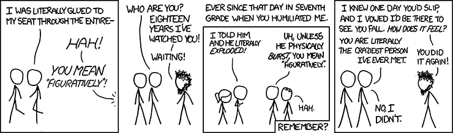

# Some odds and ends

## Missing values

In R, `NA` is used to represent some types of missing values in a vector. This value can show up in numerical or character vectors (or in vectors of some other classes):

```{r}
c(1, 4, NA)
c("Jane Doe", NA)
```

## Missing values

```{r echo = FALSE, out.width = "225pt", fig.align='center'}
knitr::include_graphics("../figures/null_license_plate.png")
```

For the full story: 
https://arstechnica.com/cars/2019/08/wiseguy-changes-license-plate-to-null-gets-12k-in-parking-tickets/


## The `$` operator

The `select` function will extract a smaller dataframe object from a dataframe. The 
resulting object with have the dataframe class, even if it only has one column.

If you would like to extract a column from a dataframe as an object with the vector class, 
you can use the `$` operator.

For example, say you have the following dataset and want to pull the `color` column as a vector:

```{r echo = 4}
library(package = "tibble")
example_df <- tibble(color = c("red", "blue"), 
                     value = c(1, 2))
example_df
```


## The `$` operator

You can pull the `color` column as a vector using the name of the dataframe, the dollar sign, and then the name of the column:

```{r}
example_df$color
```

```{r}
class(x = example_df$color)
```

(Note: You can use tab completion in RStudio after you put in `example_df$`.)

The `pluck` function in the `purrr` package also helps you extract a column of a
dataframe as a vector.


## `paste` and `paste0`

If you want to paste together several character strings to make a length-one character vector, you can use the `paste` function to do that:

```{r}
paste("abra", "ca", "dabra")
```

By default, spaces are used to separate each original character string in the final string.

## `paste` and `paste0`

If you want to remove these spaces, you can use the `sep` argument in the `paste` function: 

```{r}
paste("abra", "ca", "dabra", sep = "")
```

A short-cut function is `paste0`, which is identical to running `paste` with the argument `sep = ""`:

```{r}
paste0("abra", "ca", "dabra")
```

## <- vs. =

You can make assignments using either `<-` or `=`, and you'll see both when you're reading other people's code. 

\medskip

However, R gurus advise using `<-` in your own code. 

The arrow shows the *direction* of assignment. Also, as you move to doing more
complex things, problems might crop up if you use `=` for assignment in a few
specific cases.

## <- vs. =

For now, though, it will be helpful for you to know that these two calls do the same thing:

```{r}
one_to_ten <- 1:10
one_to_ten

one_to_ten = 1:10
one_to_ten
```

## When to use quotations

- Use quotation marks if you **literally** mean that specific character string
- Don't use quotation marks if you want to reference an R object by its name
- Never use quotation marks on the left-hand side of `<-` or `=`.

```{r echo = FALSE, out.width = "300pt", fig.align='center'}

```
\small Source: xkcd.com

## When to use quotations

- Use quotation marks if you **literally** mean that specific character string

```{r}
c("Harry", "Ron")
```

- Never use quotation marks on the left-hand side of `<-` or `=`.

```{r}
Harry <- c("Good at Quidditch")
Ron <- c("Good at Wizard Chess")
```

- Don't use quotation marks if you want to reference an R object by its name

```{r}
c(Harry, Ron)
```

## Being lazy

There are a few cases in R where you can be a bit lazy. 

One has to do with quotations. There are a few cases where, following the
rules we just covered, it will seem like you *should* use quotations, 
but you either don't have to or can't. 

One example is calling the `library` function. You can put the name of 
the library you want to load in quotation marks, or you can leave them off:

```{r}
library(package = "readr")
library(package = readr)
```

Another example, which we'll cover more next week, is referencing columns
by their column names in many tidyverse functions.

## Being lazy

Another way to be lazy is through leaving off formal argument names when 
you call a function. 

If you don't include formal argument names, then R will match actual arguments
in the function call to formal arguments by *position*. 

For example, since the first formal argument to the `class` function is `x = `,
the following two calls are the same: 

```{r echo = 2:3}
main_characters <- c("Harry", "Ron", "Hermione")
class(x = main_characters)
class(main_characters)
```


## Alternative package::function notation

The `library` function is the most common way you'll access functions from R
packages, but it's not the only way to do this. There is another type of
notation that will allow you to use any external function from any package you
have installed on your computer: the `package::function` notation.

You can call functions by specifying the package name, a double colon, and then
the function name you want to use from that package. For example:

```{r}
message <- "Hello world"
phonenumber::letterToNumber(value = message)
```

## Alternative package::function notation

The `package::function` notation is not typically used because it substantially
increases how much you have to type in your code.

However, there can be cases where a function name is ambiguous. For example, you
might want to use functions from two different packages that have the same name.
In this case, using the `package::function` notation makes it crystal clear
which function you mean.

In practice, this problem is most likely to come up when you've loaded both
`plyr` and `dplyr`, which share several function names and are both popular
packages.

## Alternative package::function notation

There is another useful trick that you can do with the `package::function` notation.

RStudio has tab complemention, which means that once you start typing an object
name or function, if you press the Tab key, RStudio will give you suggestions
for how you can finish the name.

If you want to scroll through the names of all the external functions in a
package, you can do so by typing something like `?phonenumber::` in the console
(don't press Return) and then pressing the Tab key.

## "Composing" to combine function calls

There's one additional way to compose several function calls into one R expression.

There's a special "pipe" function (`%>%`) in a package called
"magrittr" that you can use to compose a large R expression from several smaller
function calls. This will "pipe" the object that is created from one function
call into the first argument for the next function call.

We'll explore this a **lot** more later in the course, but here's a taste of how
that looks:

```{r}
library(package = "magrittr")

paste(x = "Hello world") %>% 
  print()
```

## "Composing" to combine function calls

Here's another example. Earlier, we used the following code to extract certain
rows and columns from a dataframe: 

\small

```{r echo = 3, message = FALSE, warning = FALSE}
library("dplyr")
hp_data <- tibble(first_name = c("Harry", "Ron", "Hermione"),
                  last_name = c("Potter", "Weasley", "Granger"),
                  n_kids = c(1, 7, 1),
                  survived = c(TRUE, TRUE, TRUE))
select(.data = slice(.data = hp_data, c(1:2)), c(1, 4))
```

You can use a pipe to express this much more cleanly: 

```{r}
slice(.data = hp_data, c(1:2)) %>% 
  select(c(1, 4))
```

