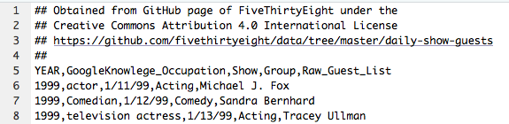
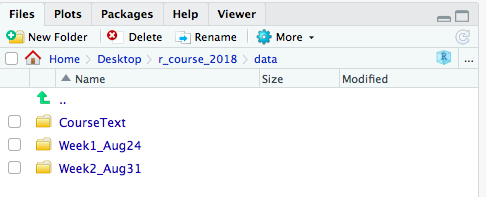

```{r echo = FALSE}
options(width = 50)
```

## Odds and ends

- Next week, we will not meet for either class session (Aug. 27 and 29). Instead, videos of the lectures will be available through the online coursebook. You will be responsible for watching these sometime during next week on your own time.
- Office hours will be in EH 120, 10:00--11:00 AM Fridays. For the office hours on Aug. 31, we will go through the group exercises for Week 1 ("Entering and Cleaning Data #1"). Attendance is voluntary, but you are responsible for trying the exercises whether you attend this in-person session or not. 

## Odds and ends

- The first quiz will be on Wednesday, Sept. 5 (next in-person class meeting). It will cover the content in Chapter 1 of the online book ("R Preliminaries"). The vocabulary list is up in the "Vocabulary" appendix of the online book.
- The first homework is due Sept. 12. The updated assignment for 2018 is available now in the online coursebook.

# Getting data into R

## Basics of getting data into R

Basic approach: 

- Download data to your computer
- Save the data in your R Project directory for the project you're using it for or in a subdirectory within that directory ("data" is a good name for this subdirectory)
- Read data into R (functions in `readr`: `read_csv`, `read_table`, `read_delim`, `read_fwf`, etc.) 
- Check to make sure the data came in correctly (`dim`, `ncol`, `nrow`, `head`, `tail`, `str`, `colnames`)

# Reading data into R

## What kind of data can you get into R?

The sky is the limit...

- **Flat files**
- Files from other statistical packages (SAS, Excel, Stata, SPSS)
- [Tables on webpages](http://yihui.name/en/2010/10/grabbing-tables-in-webpages-using-the-xml-package/) (e.g., the table near the end of [this page](http://en.wikipedia.org/wiki/Ebola_virus_epidemic_in_West_Africa))
- Data in a database (e.g., SQL)
- Data stored in XML and JSON
- Really crazy data formats used in other disciplines (e.g., [netCDF files from climate folks](https://www.image.ucar.edu/GSP/Software/Netcdf/), [MRI data stored in Analyze, NIfTI, and DICOM formats](http://www.tractor-mri.org.uk))
- Data through APIs (e.g., [GoogleMaps](http://www.r-bloggers.com/heatmap-of-toronto-traffic-signals-using-rgooglemaps/), [Twitter](http://davetang.org/muse/2013/04/06/using-the-r_twitter-package/), many government agencies)
- Incredibly messy data using `scan` and `readLines`

## Flat files

R can read in data from *a lot* of different formats. 
The only catch: you need to tell R how to do it.

To start, we'll look at **flat files**, which are plain text files (i.e., you can read them when you open them in a text editor, unlike a file in a binary format, like an Excel or Word file) with a two-dimenional structure (a row for each observation and a column for each variable). 

## Types of flat files

There are two main types of flat files:

1. **Fixed width files**: Each column is a certain number of characters wide. (If you printed it out, you could draw vertical lines that separate the columns.)

2. **Delimited files**: In each row, a certain symbol (**delimiter**) separates the data into columns values for that observation.
    + ".csv": Comma-separated values
    + ".tab", ".tsv": Tab-separated values
    + Other possible delimiters: colon, semicolon, pipe ("|")
    
\medskip

See if you can identify what types of files the following files are...

## What type of file?

```{r echo = FALSE, fig.align='center', out.width = "150pt"}
knitr::include_graphics("../figures/csvEx1.jpg")
```

## What type of file?

```{r echo = FALSE, fig.align='center', out.width = "250pt"}
knitr::include_graphics("../figures/fixedwidthfile.png")
```

## What type of file?

```{r echo = FALSE, fig.align='center', out.width = "250pt"}
knitr::include_graphics("../figures/pipeDelimited.png")
```

## What type of file?

```{r echo = FALSE, fig.align='center', out.width = "325pt"}
knitr::include_graphics("../figures/tabEx1.jpg")
```

## What type of file?

```{r echo = FALSE, fig.align='center', out.width = "350pt"}
knitr::include_graphics("../figures/csvEx2.jpg")
```

## What type of file?

```{r echo = FALSE, fig.align='center', out.width = "200pt"}
knitr::include_graphics("../figures/fwfEx2.png")
```

## Types of flat files

Flat files will often end in file extensions like ".txt", ".csv", ".fwf", and ".tsv".

To figure out the structure of a flat file, start by opening it in a text editor. 
RStudio can also be used as a text editor to open and explore flat files (right click on the file name and then choose "Open With" and "RStudio").

## Reading in flat files

R can read any of the types of files we just looked at by using one of the functions from the `readr` package: 

File type     | General function
------------- | ----------------
Delimited     | `read_delim`
Fixed width   | `read_fwf`

You will just need to be able to clearly tell R *how* to read the file in, including what type of flat file it is and what delimiter it uses.

## Reading in flat files

For example, the file "AWOIS_Wrecks_KnownYear.tab" is a flat delimited file with tabs as delimiters containing the subset of the [Office of the Coast Survey's Automated Wreck and Obstruction Information System (AWOIS)](https://www.nauticalcharts.noaa.gov/data/wrecks-and-obstructions.html) for which the year the vessel sank is known. 

You can download this file by going to [this link](https://github.com/geanders/RProgrammingForResearch/blob/master/data/AWOIS_Wrecks_KnownYear.tab) and using the "Raw" button in the top right hand corner (right click and select "Download Linked File").

## Reading in flat files

If save this file in your working directory, to read it in and assign it the name `shipwrecks`, you can run: 

```{r eval = FALSE}
library(readr)
shipwrecks <- read_delim("AWOIS_Wrecks_KnownYear.tab", 
                        delim = "\t")
```
```{r echo = FALSE, message = FALSE}
library(readr)
shipwrecks <- read_delim("../data/AWOIS_Wrecks_KnownYear.tab", 
                        delim = "\t")
```
```{r}
# Check out a subset of the data
shipwrecks[c(1:4), c(2, 4, 5, 9)]
```

## `readr` family of functions

Some of the interesting options with the `readr` family of functions are:

Option  | Description
------- | -----------
`skip`    | How many lines of the start of the file should you skip?
`col_names`  | What would you like to use as the column names?
`col_types`   | What would you like to use as the column types?
`n_max`   | How many rows do you want to read in?
`na` | How are missing values coded?


## Reading in flat files

The "daily_show_guests.csv" file you worked with in the previous In-Course Exercise is a delimited flat file with commas as the delimiters. **It also has four lines of information about the data, before the actual data begins.** 

```{r echo = FALSE, fig.align='center', out.width = "300pt"}

```

## Reading in flat files

You can handle this by using the `skip` option to tell R to skip the first four lines:

\footnotesize

```{r eval = FALSE, echo = TRUE}
read_delim("daily_show_guests.csv", delim = ",", skip = 4)
```

\footnotesize

```{r echo = FALSE, message = FALSE}
read_delim("../data/daily_show_guests.csv", delim = ",", skip = 4)
```

## `readr` family of functions

Many members of the `readr` package that read delimited files are doing the same basic thing. The only difference is what defaults they have for the separator (`delim`). \medskip

Some key members of the `readr` family for delimited data:

Function     | Separator  
------------ | ---------- 
`read_csv`    |  comma     
`read_csv2`   | semi-colon 
`read_table2` | whitespace
`read_tsv`    | tab

## `readr` family of functions

For any type of delimited flat files, you can also use the more general `read_delim` function to read in the file. However, you will have to specify yourself what the delimiter is (e.g., `delim = ","` for a comma-separated file).

For example, the following two calls do the same thing: 

```{r eval = FALSE}
read_delim("daily_show_guests.csv", delim = ",", skip = 4)
read_csv("daily_show_guests.csv", skip = 4)
```

## `readr` family of functions

The `readr` package also includes some functions for reading in fixed width files: 

- `read_fwf`
- `read_table`

These allow you to specify field widths for each fixed width field, but they will also try to determine the field-widths automatically.

## Reading data from other files types

You can also read data in from a variety of other file formats, including:

```{r echo = FALSE}
read_funcs <- data.frame(file_type = c("Excel",
                                       "SAS",
                                       "SPSS",
                                       "Stata"),
                         func = c("`read_excel`",
                                  "`read_sas`",
                                  "`read_spss`",
                                  "`read_stata`"),
                         pkg = c("`readxl`",
                                 "`haven`",
                                 "`haven`",
                                 "`haven`"))
knitr::kable(read_funcs, col.names = c("File type", "Function", "Package"))
```

## In-course exercise

We'll take break here to work on the start of the In-Course Exercise (Sections 2.7.1 and 2.7.2).

# Directory structure

## Computer directory structure

```{r echo = FALSE, fig.align='center', out.width = "275pt"}
knitr::include_graphics("../figures/FileDirectoryStructure.png")
```

## Working directory

The **working directory** is the directory within your directory structure from which your R session is currently working. 

When you use **R Projects** to organize your work and files in R, anytime you open one of your R Projects, your working directory will automatically be that project's directory. 

## Working directory

To confirm this, open one of your R Projects and print out your working directory using the function `getwd()`: 

\small

```{r eval = FALSE}
getwd()
```

```
[1] "/Users/brookeanderson/Desktop/RCourseFall2015"
```

```{r echo = FALSE, fig.align='center', out.width = "200pt"}
knitr::include_graphics("../figures/FileDirectoryStructure.png")
```

## Working directory

You can use the `list.files()` function to list all the files in your current working directory:

\small

```{r eval = FALSE}
list.files()
```

```
[1] "CourseText"    "Week1_Aug24"     "Week2_Aug31"
```

```{r echo = FALSE, fig.align='center', out.width = "200pt"}
knitr::include_graphics("../figures/FileDirectoryStructure.png")
```


## Working directory

The "Files" pane in RStudio (often on the lower right) will also show you the files available in your current working directory. 

This should line up with what you get if you run `list.files()`.

```{r echo = FALSE, fig.align='center', out.width = "250pt"}

```

## Working directory

When you run `list.files()`, if there is a name without a file extension, it's probably the name of a **subdirectory** of your current working directory. 
To list the files in one of these subdirectories, you can use `list.files` with that subdirectory's name. 

```{r, eval = FALSE}
list.files("CourseText")
```
```
[1]  "temperature.csv"      "heat_mort.csv"
```

```{r echo = FALSE, fig.align='center', out.width = "150pt"}
knitr::include_graphics("../figures/FileDirectoryStructure.png")
```


## Relative versus absolute pathnames

When you want to reference a directory or file that is not in your working directory, you need to give R the directions for how to find the file. You can use one of two types of pathnames:

- *Relative pathname*: How to get to the file or directory from your current working directory
- *Absolute pathname*: How to get to the file or directory from anywhere on the computer

## Relative versus absolute pathnames

Say your current working directory was `/Users/brookeanderson/RProgrammingForResearch` and you wanted to get into the subdirectory `data`. Here are examples of referencing that subdirectory using the two types of pathnames:

**Absolute**: 
```
"/Users/brookeanderson/RProgrammingForResearch/data"
```

**Relative**:
```
"data"
```

## Relative versus absolute pathnames

Both methods of writing filenames have their own advantages and disadvantages: 

- *Relative pathname*: Which file you are indicating depends on which working directory you are in, which means that your code will break if you try to re-run it from a different working directory. However, relative pathways in your code make it easier for you to share a working version of a project with someone else. For most of this course, we will focus on using relative pathnames, especially when you start collaborating.
- *Absolute pathname*: No matter what working directory you're in, it is completely clear to your computer which file you mean when you use an absolute pathname. However, your code will not work on someone else's computer without modifications (because the structure of their computer's full directory will be different).

## Relative versus absolute pathnames

I **strongly** recommend saving your data files somewhere in the directory structure of the R Project in which you're working and then using **relative pathnames** to reference that file when you need to read it in. 

This practice establishes good habits for making your research computationally reproducible.


## Getting around directories

There are a few abbreviations you can use to represent certain relative locations:

\small

```{r echo = FALSE}
dirpath_shortcuts <- data.frame(abbr = c("`.`", "`..`", "`../..`", "`../data`"),
                                meaning = c("Current working directory",
                                            "One directory up from current working directory (parent directory)",
                                            "Two directories up from current working directory",
                                            "The 'data' subdirectory of the parent directory"))
knitr::kable(dirpath_shortcuts, col.names = c("Shorthand", "Meaning"))
```

## Relative versus absolute pathnames

Here are some examples of relative pathnames that use these abbreviations: \medskip

If `data` is a subdirectory of your current parent directory (i.e., from your working directory, you need to go "up and over"):

```
"../data"
```

If `data` is a subdirectory of the subdirectory `Ex` of your current working directory:

```
"Ex/data"
```

## Reading in an online flat file

Once you understand this idea of giving R directions to a file to read it, 
you shouldn't be too surprised that R can also do this for flat files that
are hosted online. 

In this case, the file isn't even on your computer, so you need to give R
the directions to find it online. You do that by putting the file's online
address as the file name. For example, to read in the shipwreck data directly
from GitHub, you can run:

```{r message = FALSE} 
shipwreck_url <- paste0("https://raw.githubusercontent.com/",
                        "geanders/RProgrammingForResearch/",
                        "master/data/", 
                        "AWOIS_Wrecks_KnownYear.tab")
shipwrecks <- read_tsv(shipwreck_url)
```

## Taking advantage of `paste0`

You can create an object with your directory name using `paste0`, and then use that to set your directory. We'll take a lot of advantage of this for reading in files.

\medskip

The convention for `paste0` is:

```{r, eval = FALSE}
## Generic code
[object name] <- paste0("[first thing you want to paste]",
                        "[what you want to add to that]",
                        "[more you want to add]")
```

## Taking advantage of `paste0`

Here's an example:

```{r, message = FALSE}
shipwreck_url <- paste0("https://raw.githubusercontent.com/",
                        "geanders/RProgrammingForResearch/",
                        "master/data/", 
                        "AWOIS_Wrecks_KnownYear.tab")
shipwrecks <- read_tsv(shipwreck_url)
```

## In-course exercise 

We'll take a break now to do the next part of the in-course exercise (Section 2.7.3).


# Data cleaning

## Cleaning data

Common data-cleaning tasks include: 

```{r echo = FALSE}
dc_func <- data.frame(task = c("Renaming columns",
                               "Selecting certain columns",
                               "Adding or changing columns",
                               "Limiting to certain rows",
                               "Filtering to certain rows",
                               "Arranging rows"),
                      func = c("`rename`",
                               "`select`",
                               "`mutate`",
                               "`slice`",
                               "`filter`",
                               "`arrange`"))
knitr::kable(dc_func, col.names = c("Task", "`dplyr` function"))
```

## The "tidyverse"

Today, we'll talk about using functions from the `dplyr` and `lubridate` packages, which are both part of the "tidyverse", like the `readr` package.

\medskip

To use these functions, you'll need to load those packages: 

```{r message = FALSE, warning = FALSE}
library("dplyr")
library("lubridate")
```

## Cleaning data

As an example, let's look at the Daily Show data:

```{r message = FALSE, echo = FALSE}
daily_show <- read_csv("../data/daily_show_guests.csv",
                       skip = 4)
```
```{r eval = FALSE}
daily_show <- read_csv("data/daily_show_guests.csv",
                       skip = 4)
```

```{r}
head(daily_show, 3)
```

## Re-naming columns

A first step is often re-naming columns. It can be hard to work with a column name that is: 

- long
- includes spaces
- includes upper case

Several of the column names in `daily_show` have some of these issues: 

```{r}
colnames(daily_show)
```

## Renaming columns 

To rename these columns, use `rename`. The basic syntax is: 

```{r eval = FALSE}
## Generic code
rename(dataframe, 
       new_column_name_1 = old_column_name_1,
       new_column_name_2 = old_column_name_2)
```

If you want to change column names in the saved object, be sure you reassign the object to be the output of `rename`.

## Renaming columns 

To rename columns in the `daily_show` data, then, use:

```{r}
daily_show <- rename(daily_show,
                     year = YEAR,
                     job = GoogleKnowlege_Occupation, 
                     date = Show, 
                     category = Group,
                     guest_name = Raw_Guest_List)
head(daily_show, 3)
```

## Renaming columns 

As a quick check, what is the difference between these two calls?

```{r eval = FALSE}
# 1.
rename(daily_show,
       year = YEAR,
       job = GoogleKnowlege_Occupation, 
       date = Show, 
       category = Group,
       guest_name = Raw_Guest_List)
```

```{r eval = FALSE}
# 2.
daily_show <- rename(daily_show,
                     year = YEAR,
                     job = GoogleKnowlege_Occupation, 
                     date = Show, 
                     category = Group,
                     guest_name = Raw_Guest_List)
```


## Selecting columns

Next, you may want to select only some columns of the dataframe. You can use `select` for this. The basic structure of this command is: 

```{r eval = FALSE}
## Generic code
select(dataframe, column_name_1, column_name_2, ...)
```

Where `column_name_1`, `column_name_2`, etc., are the names of the columns you want to keep. 

## Selecting columns

For example, to select all columns except `year` (since that information is already included in `date`), run: 

```{r}
select(daily_show, job, date, category, guest_name)
```

## Selecting columns

As a reminder, we could have selected these columns using square bracket indexing, too:

```{r eval = FALSE}
daily_show[ , 2:5]
```

However, the `select` function will fit in nicely with other data-cleaning functions from "tidyverse" packages, plus the `select` function has some cool extra options, including:

- Selecting all columns that start with a certain pattern
- Selecting all columns that end with a certain pattern
- Selecting all columns that contain a certain pattern

## Selecting columns

The `select` function also provides some time-saving tools. For example, in the last example, we wanted all the columns except one. Instead of writing out all the columns we want, we can use `-` with the columns we don't want to save time: 

```{r}
daily_show <- select(daily_show, -year)
head(daily_show, 3)
```

## Selecting columns

Another cool trick with `select` is that, if you want to keep several columns in a row, you can use a colon (`:`) with column names (rather than column position numbers) to select those columns: 

```{r eval = FALSE}
daily_show <- select(daily_show, job:guest_name)
```

This call says that we want to select all columns from the one named "job" to the one named "guest_name".

## Add or change columns

You can change a column or add a new column using the `mutate` function. That function has the syntax: 

```{r eval = FALSE}
# Generic code
mutate(dataframe,
       changed_column = function(changed_column),
       new_column = function(other arguments))
```

- If you want to just **change** a column (in place), use its original name on the left of the equation. 
- If you want to **add** a new column, use a new name on the left of the equation (this will be the name of the new column).

## Add or change columns

For example, the `job` column in `daily_show` sometimes uses upper case and sometimes does not: 

```{r}
head(unique(daily_show$job), 10)
```

## Add or change columns

We could use the `tolower` function to make all listings lowercase: 

```{r}
library("stringr")
daily_show <- mutate(daily_show, job = str_to_lower(job))
head(daily_show, 3)
```

## In-course exercise

We'll take a break now and do section 2.6.4 of the In-Course Exercise.

# Dates in R

## `Date` class

A common task when changing or adding columns is to change the class of some of the columns. This is especially common for dates, which will often be read in as a character vector when reading data into R.

## Vector classes

Here are a few common vector classes in R:

Class        | Example
------------ | -------------
`character`  | "Chemistry", "Physics", "Mathematics"
`numeric`    | 10, 20, 30, 40
`factor`     | Male [underlying number: 1], Female [2]
`Date`       | "2010-01-01" [underlying number: 14,610]
`logical`    | TRUE, FALSE

## Vector classes

To find out the class of a vector, you can use `class()`:

```{r}
class(daily_show$date)
```

Note: You can use `str` to get information on the classes of all columns in a dataframe. It's also printed at the top of output from `dplyr` functions.

## `lubridate` package

In many cases you can use functions from the `lubridate` package to parse dates pretty easily. \medskip

For example, if you have a character string with the date in the order of *year-month-day*, you can use the `ymd` function from `lubridate` to convert the character string to the `Date` class. For example:

```{r message = FALSE}
library("lubridate")
my_date <- ymd("2008-10-13")
class(my_date)
```

## `lubridate` package

The `lubridate` package has a number of functions for converting character strings into dates (or date-times). To decide which one to use, you just need to know the order of the elements of the date in the character string. 

For example, here are some commonly-used `lubridate` functions:

`lubridate` function | Order of date elements
---------------------|-----------------------
`ymd`                | year-month-day
`dmy`                | day-month-year
`mdy_hm`             | month-day-year-hour-minute
`ymd_hms`            | year-month-day-hour-minute-second

(Remember, you can use `vignette("lubridate")` and `?lubridate` to get help with the `lubridate` package.)

## `lubridate` package

You will see dates represented in many different ways. For example, October might be included in data as "October", "Oct", or "10". Further, the way the elements are separated can vary. 

The functions in `lubridate` are pretty good at working with these different options intelligently: 

```{r}
mdy("10-31-2017")
dmy("31 October 2017")
```

## `lubridate` package

Some more examples: 

```{r}
ymd_hms("2017/10/31--17:33:10")
mdy_hm("Oct. 31, 2017 5:33PM", tz = "MST")
```


## Converting to `Date` class

We can use the `mdy` function from `lubridate` to convert the `date` column in the `daily_show` dataset to a Date class:

```{r}
daily_show <- mutate(daily_show, date = mdy(date))
head(daily_show, 3)
class(daily_show$date)
```

## Converting to `Date` class

Once you have an object in the `Date` class, you can do things like plot by date, calculate the range of dates, and calculate the total number of days the dataset covers:

```{r}
range(daily_show$date)
diff(range(daily_show$date))
```

## `lubridate` package

The `lubridate` package also includes functions to pull out certain elements of a date. For example, we could use `wday` to create a new column with the weekday of each show: 

```{r}
daily_show <- mutate(daily_show, 
                     show_day = wday(date, label = TRUE)) 
head(select(daily_show, date, show_day), 3)
```


## `lubridate` package

Other functions in `lubridate` for pulling elements from a date include: 

- `mday`: Day of the month
- `yday`: Day of the year
- `month`: Month
- `quarter`: Fiscal quarter
- `year`: Year

# Filtering and logical operators

## Slicing to certain rows

Last week, you learned how to use square bracket indexing to limit a dataframe to certain rows by row number:

```{r eval = FALSE}
daily_show[1:3, ]
```

The `dplyr` package has a function you can use to do this, called `slice`. That function has the syntax: 

```{r eval = FALSE}
# Generic code
slice(dataframe, starting_row:ending_row)
```

where `starting_row` is the row number of the first row you want to keep and `ending_row` is the row number of the last line you want to keep.

## Slicing to certain rows

For example, to print the first three rows of the `daily_show` data, you can run:

```{r}
slice(daily_show, 1:3)
```

## Arranging rows

There is also a function, `arrange`, you can use to re-order the rows in a dataframe. The syntax for this function is: 

```{r eval = FALSE}
# Generic code
arrange(dataframe, column_to_order_by)
```

If you run this function to use a character vector to order, it will order the rows alphabetically by the values in that column. If you specify a numeric vector, it will order the rows by the numeric value. 

## Arranging rows

For example, we could reorder the `daily_show` data alphabetically by the values in the `category` column with the following call:

```{r}
daily_show <- arrange(daily_show, category)
head(daily_show, 3)
```

## Arranging rows

If you want the ordering to be reversed (e.g., from "z" to "a" for character vectors, from higher to lower for numeric, latest to earliest for a Date), you can include the `desc` function. 

For example, to reorder the `daily_show` data by descending date (latest to earliest), you can run: 

```{r}
daily_show <- arrange(daily_show, desc(date))
head(daily_show, 3)
```

## Filtering to certain rows

Next, you might want to filter the dataset down so that it only includes certain rows. You can use `filter` to do that. The syntax is: 

```{r eval = FALSE}
## Generic code
filter(dataframe, logical statement)
```

The `logical statement` gives the condition that a row must meet to be included in the output data frame. For example, you might want to pull: 

- Rows from 2015
- Rows where the guest was an academic
- Rows where the job is not missing

## Filtering to certain rows

For example, if you want to create a data frame that only includes guests who were scientists, you can run:

```{r}
scientists <- filter(daily_show, category == "Science")
head(scientists)
```


## Common logical operators in R

To build a logical statement to use in `filter`, you'll need to know some of R's logical operators: 

Operator  | Meaning | Example
--------- | ------- | ---------------------------------
`==`      | equals  | `category == "Acting"`
`!=`      | does not equal | `category != "Comedy`
`%in%`    | is in | `category %in% c("Academic", "Science")`
`is.na()` | is NA | `is.na(job)`
`!is.na()`| is not NA | `!is.na(job)`
`&`       | and | `year == 2015 & category == "Academic"`
`|`       | or | `year == 2015 | category == "Academic"`

## `dplyr` versus base R

Just so you know, all of these actions also have alternatives in base R:

```{r echo = FALSE}
dplyr_vs_base <- data.frame(dplyr = c("`rename`",
                                      "`select`",
                                      "`slice`",
                                      "`filter`",
                                      "`mutate`"),
                            base = c("Reassign `colnames`",
                                     "Square bracket indexing",
                                     "Square bracket indexing",
                                     "`subset`",
                                     "Use `$` to change / create columns"))
knitr::kable(dplyr_vs_base, col.names = c("`dplyr`", 
                                          "Base R equivalent"))
```

You will see these alternatives used in older code examples.

## In-course exercise

We'll take a break now and do section 2.6.5 of the In-Course Exercise.

# Piping

## Piping

```{r echo = FALSE, out.width = "\\textwidth"}
knitr::include_graphics("../figures/Magritte.png")
```

## Piping

If you look at the format of these `dplyr` functions, you'll notice that they all take a dataframe as their first argument: 

```{r eval = FALSE}
# Generic code
rename(dataframe, 
       new_column_name_1 = old_column_name_1,
       new_column_name_2 = old_column_name_2)
select(dataframe, column_name_1, column_name_2)
slice(dataframe, starting_row:ending_row)
arrange(dataframe, column_to_order_by)
filter(dataframe, logical statement)
mutate(dataframe,
       changed_column = function(changed_column),
       new_column = function(other arguments))
```

## Piping

Classically, you would clean up a dataframe in R by reassigning the dataframe object at each step: 

```{r eval = FALSE}
daily_show <-read_csv("../data/daily_show_guests.csv",
                      skip = 4)
daily_show <- rename(daily_show, 
                     job = GoogleKnowlege_Occupation,
                     date = Show,
                     category = Group,
                     guest_name = Raw_Guest_List)
daily_show <- select(daily_show, -YEAR) 
daily_show <- mutate(daily_show, job = str_to_lower(job))
daily_show <- filter(daily_show, category == "Science")
```

## Piping

"Piping" lets you clean this code up a bit. It can be used with any function that inputs a dataframe as its first argument. It "pipes" the dataframe created right before the pipe (`%>%`) into the function right after the pipe. 

## Piping

With piping, the same data cleaning looks like: 

```{r message = FALSE}
daily_show <- read_csv("../data/daily_show_guests.csv",
                      skip = 4) %>%
  rename(job = GoogleKnowlege_Occupation,
         date = Show,
         category = Group,
         guest_name = Raw_Guest_List) %>%
  select(-YEAR) %>%
  mutate(job = str_to_lower(job)) %>%
  filter(category == "Science")
```

## Piping

Piping tip #1: As you are trying to figure out what "piped" code like this is doing, try highlighting from the start of the code through just part of the pipe and run that. For example, try highlighting and running just from `read_csv` through the before the ` %>%` in the line with `select`, and see what that output looks like. 

```{r eval = FALSE}
daily_show <- read_csv("../data/daily_show_guests.csv",
                      skip = 4) %>%
  rename(job = GoogleKnowlege_Occupation,
         date = Show,
         category = Group,
         guest_name = Raw_Guest_List) %>%
  select(-YEAR) %>%
  mutate(job = str_to_lower(job)) %>%
  filter(category == "Science")
```

## Piping

Piping tip #2: When you are writing an R script that uses piping, first write it and make sure you have it right **without** assigning it to an R object (i.e., no `<-`). Often you'll use piping to clean up an object in R, but if you have to work on the piping code, you end up with different versions of the object, which will cause frustrations.

```{r eval = FALSE}
read_csv("../data/daily_show_guests.csv", skip = 4) %>%
  rename(job = GoogleKnowlege_Occupation,
         date = Show,
         category = Group,
         guest_name = Raw_Guest_List) %>%
  select(-YEAR) %>%
  mutate(job = str_to_lower(job)) %>%
  filter(category == "Science")
```

## Piping

Piping tip #3: There is a keyboard shortcut for the pipe symbol: 

```
Command-Shift-m
```

## In-course exercise

We'll take a break now and do section 2.6.6 of the In-Course Exercise.