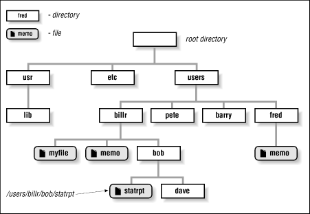
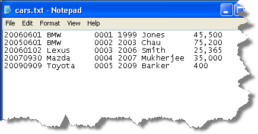
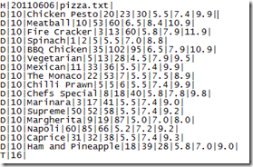
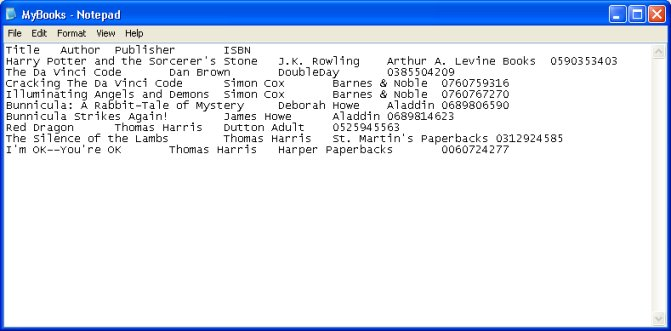
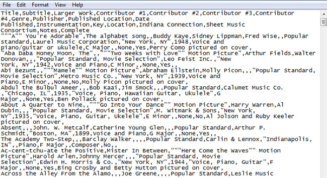
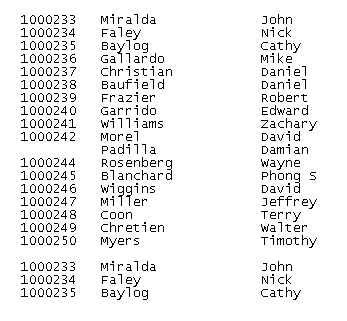

# R scripts

## R scripts

If you are writing code you think you will use later, write it in an *R script* file rather than using the console. 

- Open a new script file in RStudio: `File` -> `New File` -> `R Script`.
- To run code from an R script file in RStudio, you can use the `Run` button (or `Command-R`). It will run whatever's on your cursor line or whatever's highlighted.
- To run the whole script, use `source`. 
- Save scripts using the extension `.R`

## R scripts

```{r echo = FALSE, fig.align="center", out.width= "300pt"}
knitr::include_graphics("../figures/ExampleOfRScript.jpg")
```

# Getting data into R

## Basics of getting data into R

Basic approach: 

- Download data to your computer
- Make sure R is working in the directory with your data (`getwd`, `setwd`)
- Read data into R (`read.csv`, `read.table`)
- Check to make sure the data came in correctly (`dim`, `head`, `tail`, `str`)

#Directories

## Directories

Anytime you work in R, R will run from within a directory somewhere on your computer. 

Let's review directories: 

```{r echo = FALSE, fig.align='center', eval = FALSE}

```

## Directories

You can check your working directory anytime using `getwd()`:

```{r}
getwd()
```

## Directories

You can use `setwd()` to change your directory.

To get to your home directory (for example, mine is "/Users/brookeanderson"), you can use the abbreviation `~`. 

For example, if you want to change into your home directory and print its name, you could run:

```{r eval = FALSE}
setwd("~")
getwd()
```

```
## [1] "/Users/brookeanderson"
```

## Directories

The most straightforward way to read in data is often to put it in your working directory and then read it in using the file name. If you're working in the directory with the file you want, you should see the file if you list files in the working directory:

```{r}
list.files()
```

## Getting around directories

There are a few abbreviations you can use to represent certain relative or absolute locations when you're using `setwd()`:

Command           | Directory
---------         | ---------
`setwd("~")`      | Your home directory
`setwd("..")`     | One directory up from your current directory
`setwd("../..")`  | Two directories up from your current directory

## Taking advantage of `paste0`

You can create an object with your directory name using `paste0`, and then use that to set your directory. We'll take a lot of advantage of this for reading in files.

The convention for `paste0` is:

```{r, eval = FALSE}
[object name] <- paste0("[first thing you want to paste]",
                        "[what you want to add to that]",
                        "[more you want to add]")
```

## Taking advantage of `paste0`

Here's an example:

```{r}
my_dir <- paste0("~/Desktop/RCourseFall2015/",
                 "Week2_Aug31")
my_dir
```

```{r, eval = FALSE}
setwd(my_dir)
```

## Relative versus absolute pathnames

When you want to reference a directory or file, you can use one of two types of pathnames:

- *Relative*: How to get there from your current working directory
- *Absolute*: The full pathname

## Relative versus absolute pathnames

Say your current working directory was `/Users/brookeanderson/Desktop/RCourseFall2015` and you wanted to get into the subdirectory `Week2_Aug31`. Here are examples using the two types of pathnames:

Absolute: 
```{r eval = FALSE}
setwd("/Users/brookeanderson/Desktop/RCourseFall2015/Week2_Aug31")
```

Relative:
```{r eval = FALSE}
setwd("Week2_Aug31")
```

## Relative versus absolute pathnames

Here are some other examples of relative pathnames:

If `Week2_Aug31` is a subdirectory of your current parent directory:

```{r eval = FALSE}
setwd("../Week2_Aug31")
```

If `Week2_Aug31` is a subdirectory of your home (root) directory:

```{r eval = FALSE}
setwd("~/Week2_Aug31")
```

If `Week2_Aug31` is a subdirectory of the subdirectory `Ex` of your current working directory:

```{r eval = FALSE}
setwd("Ex/Week2_Aug31")
```

# Reading data into R

## What kind of data can you get into R?

The sky is the limit...

- Flat files
- Files from other statistical packages (SAS, Excel, Stata, SPSS)
- [Tables on webpages](http://yihui.name/en/2010/10/grabbing-tables-in-webpages-using-the-xml-package/) (e.g., the table near the end of [this page](http://en.wikipedia.org/wiki/Ebola_virus_epidemic_in_West_Africa))
- Data in a database (e.g., SQL)
- Really crazy data formats used in other disciplines (e.g., [netCDF files from climate folks](https://www.image.ucar.edu/GSP/Software/Netcdf/), [MRI data stored in Analyze, NIfTI, and DICOM formats](http://www.tractor-mri.org.uk))
- Data through APIs (e.g., [GoogleMaps](http://www.r-bloggers.com/heatmap-of-toronto-traffic-signals-using-rgooglemaps/), [Twitter](http://davetang.org/muse/2013/04/06/using-the-r_twitter-package/))
- Incrediably messy data using `scan` and `readLines`

## Types of flat files

R can read in data from *a lot* of different formats. 
The only catch: you need to tell R how to do it.

To start, we'll look at flat files:

1. Fixed width files

2. Delimited files 

- ".csv": Comma-separated values
- ".tab", ".tsv": Tab-separated values
- Other possible delimiters: colon, semicolon, pipe ("|")

See if you can identify what types of files the following files are...

## What type of file?

```{r echo = FALSE, fig.align='center'}
knitr::include_graphics("../figures/csvEx1.jpg")
```

## What type of file?

```{r echo = FALSE, fig.align='center'}

```

## What type of file?

```{r echo = FALSE, fig.align='center'}

```

## What type of file?

```{r echo = FALSE, fig.align='center'}

```

## What type of file?

```{r echo = FALSE, fig.align='center'}

```

## What type of file?

```{r echo = FALSE, fig.align='center'}

```

## Reading in flat files

R can read any of these types of files using one of the `read.table` and `read.fwf` functions. Find out more about those functions with:

```{r, eval = FALSE}
?read.table
?read.fwf
```

## `read.table` family of functions

Some of the interesting options with the `read.table` family of functions are:

Option  | Description
------- | -----------
`sep`   | What is the delimiter in the data?
`skip`  | How many lines of the start of the file should you skip?
`header`| Does the first line you read give column names?
`as.is` | Should you bring in strings as characters, not factors?
`nrows` | How many rows do you want to read in?
`na.strings` | How are missing values coded?

## `read.table` family of functions

All members of the `read.table` family are doing the same basic thing. The only difference is what defaults they have for the separator (`sep`) and the decimal point (`dec`).

Members of the `read.table` family:

Function     | Separator  | Decimal point
------------ | ---------- | -------------
`read.csv`   |  comma     |     period
`read.csv2`  | semi-colon |     comma 
`read.delim` |    tab     |     period
`read.delim2`|    tab     |     comma

## Reading in online flat files

If you're reading in data from a non-secure webpage (i.e., one that starts with `http`), if the data is in a "flat-file" format, you can just read it in using the [web address](http://www2.unil.ch/comparativegenometrics/docs/NC_006368.txt) as the file name:

```{r}
url <- paste0("http://www2.unil.ch/comparativegenometrics",
              "/docs/NC_006368.txt")
ld_genetics <- read.delim(url, header = TRUE)
ld_genetics[1:5, 1:4]
```

## Reading in online flat files

If you want to read in data from a secure webpage (e.g., one that starts with `https`), then you'll need to do something different.

First, you'll need to install then load the package `repmis`:

```{r}
# install.packages("repmis")
library(repmis)
```

## Reading in online flat files

Now you can use the `source.data` function to read in data from places like [GitHub](https://raw.githubusercontent.com/cmrivers/ebola/master/country_timeseries.csv) and Dropbox public folders:

```{r}
url <- paste0("https://raw.githubusercontent.com/cmrivers/",
              "ebola/master/country_timeseries.csv")
ebola <- source_data(url)
ebola[1, 1:3]
```

# Saving data as R objects

## Saving R objects

You can save an R object you've created as an `.RData` file using `save()`:

```{r}
save(ebola, file = "Ebola.RData")
list.files()
```

This saves to your current working directory (unless you specify a different location).

## Loading R objects

Then you can re-load the object later using `load()`:

```{r}
rm(ebola)
ls()
load("Ebola.RData")
ls()
```

```{r echo = FALSE, results = 'hide'}
# Clean up that file
file.remove("Ebola.RData")
```

## Saving R objects

One caveat for saving R objects: some people suggest you avoid this if possible, to make your research more reproducible. 

Imagine someone wants to look at your data and code in 30 years. R might not work the same, so you might not be able to read an `.RData` file. However, you can open flat files (e.g., `.csv`, `.txt`) and R scripts (`.R`) in text editors-- you should still be able to do this regardless of what happens to R.

Potential exceptions: 

- You have an object that you need to save that has a structure that won't work well in a flat file
- Your starting dataset is really, really large, and it would take a long time for you to read in your data fresh every time

# Cleaning up data in R

## Renaming columns 

Often, you'll want to change the column names of a dataframe as soon as you bring in the data, especially if the original ones have things like spaces. We'll look at this in the `icd10` data.

```{r}
library(readxl)
```
```{r echo = FALSE}
icd10 <- read_excel("../data/icd-10.xls")
```
```{r eval = FALSE}
icd10 <- read_excel("icd-10.xls")
```

## Renaming columns 

Take a look at the `icd10` data we loaded in the exercise:

```{r}
icd10[1:4, ]
```

## Renaming columns 

You can use the `colnames()` function to find out what the current column names are:

```{r}
colnames(icd10)
```

## Renaming columns 

You can also **rename** column names using `colnames()`. You just put this call on the left of the assignment, and what you want to assign them on the left. The new names will need to be in a vector the same length as the number of columns.

```{r}
colnames(icd10) <- c("code", "title")
icd10[1:2, ]
```

## Using `subset()`

You will often want to use only a portion of your data. You can use `subset()` to create a subset, using logical operators. For example, if you wanted to just pull out the rows of the `icd10` dataframe that start with the letter "A", you could run:

```{r}
icd10_a <- subset(icd10, substr(code, 1, 1) == "A")
```

## Using `subset()`

Here are the ends of the original and the subsetted dataframes:

```{r}
tail(icd10, 2)
tail(icd10_a, 2)
```

## Using `subset()`

The convention for `subset()` is:

```{r, eval = FALSE}
subset([name of dataframe],
       [logical statement describing which rows to keep],
       select = [vector with the names of columns to keep])
```

## Common logical operators in R

Operator  | Meaning | Example
--------- | ------- | --------------
`==`      | equals  | `subset(df, city == "Los Angeles")`
`!=`      | does not equal | `subset(df, city != "Los Angeles")`
`%in%`    | is in | `subset(df, city %in% c("Los Angeles", "San Diego"))`
`is.na()` | is NA | `subset(df, is.na(cases))`
`!is.na()`| is not NA | `subset(df, !is.na(cases))`
`&`       | and | `subset(df, city == "Los Angeles" & !is.na(cases))`
`|`       | or | `subset(df, city == "Los Angeles" | !is.na(cases))`

## Adding columns

In R, you can use the `$` operator after a dataframe to pull out one of it's columns. For example:

```{r echo = FALSE}
ca_measles <- read.delim("../data/measles_data/02-09-2015.txt",
                         header = FALSE,
                         col.names = c("city", "count"))
```
```{r eval = FALSE}
ca_measles <- read.delim("measles_data/02-09-2015.txt",
                         header = FALSE,
                         col.names = c("city", "count"))
```

```{r}
head(ca_measles$count)
```

## Adding columns

You can take advantage of this to add new columns to an existing dataframe. For example, this data is from Feb. 9, 2015. We can add a column with the date to `ca_measles`:

```{r}
ca_measles$date <- rep("02-09-2015", length = nrow(ca_measles))
head(ca_measles, 3)
```

## Adding columns

Two notes: 

- The previous example uses the `rep()` function, which will repeat a value `length` number of times
- If the value you assign to the new column is not the right length (remember, all columns in a dataframe must be vectors of equal length), R will try to "recycle" it to fill up the dataframe. So, the following call would have been a simpler alternative:  

```{r}
ca_measles$date <- "02-09-2015"
ca_measles[1:2, ]
```

## `Date` class

One final common task in cleaning data is to change the class of some of the columns. This is especially common for dates, which will usually be read in as characters or factors.

## Vector classes

Here are a few common vector classes in R:

Class        | Example
------------ | -------------
`character`  | "Chemistry", "Physics", "Mathematics"
`numeric`    | 10, 20, 30, 40
`factor`     | Male [underlying number: 1], Female [2]
`Date`       | "2010-01-01" [underlying number: 14,610]
`logical`    | TRUE, FALSE

## Vector classes

To find out the class of a vector, you can use `class()`:

```{r}
class(ca_measles$date)
```

## Vector classes

To find out the classes of all columns in a dataframe, you can use `str()`:

```{r}
str(ca_measles)
```

## Converting to `Date` class

To convert a vector to the `Date` class, you can use `as.Date()`:

```{r}
ca_measles$date <- as.Date(ca_measles$date,
                           format = "%m-%d-%Y")
head(ca_measles$date, 3)
class(ca_measles$date)
```

## Converting to `Date` class

Once you have an object in the `Date` class, you can do things like plot by date, calculate the range of dates, and calculate the total number of days the dataset covers:

```{r}
range(ca_measles$date)
diff(range(ca_measles$date))
```

## Converting to `Date` class

The only tricky thing is learning the abbreviations for the `format` option. Here are some common ones:

Abbreviation | Meaning
------------ | -------------
`%m`         | Month as a number (e.g., 1, 05)
`%B`         | Full month name (e.g., August)
`%b`         | Abbreviated month name (e.g., Aug)
`%y`         | Two-digit year (e.g., 99)
`%Y`         | Four-digit year (e.g., 1999)

## Converting to `Date` class

Here are some examples:

Your date    | `format = `
------------ | -------------
10/23/2008   | "%m/%d%Y"
08-10-23     | "%y-%m-%d"
Oct. 23 2008  | "%b. %d %Y"
October 23, 2008 | "%B %d, %Y"

