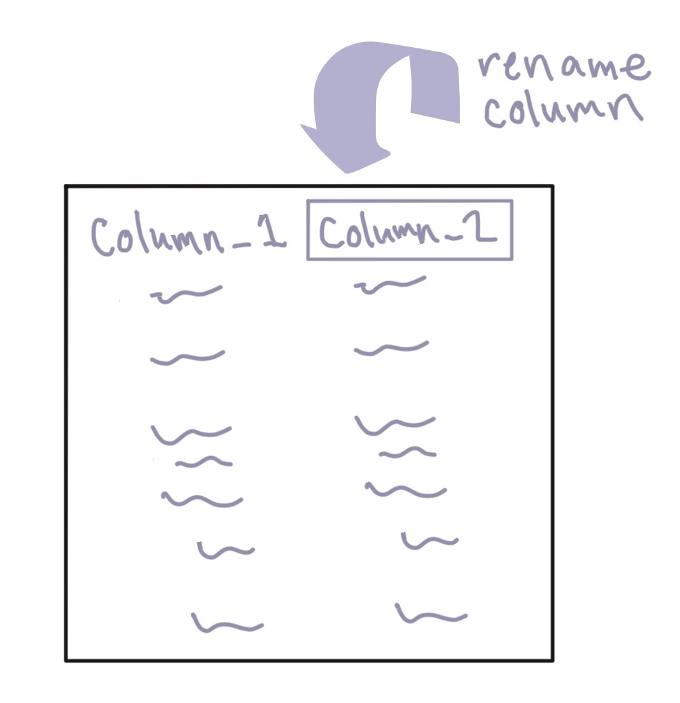
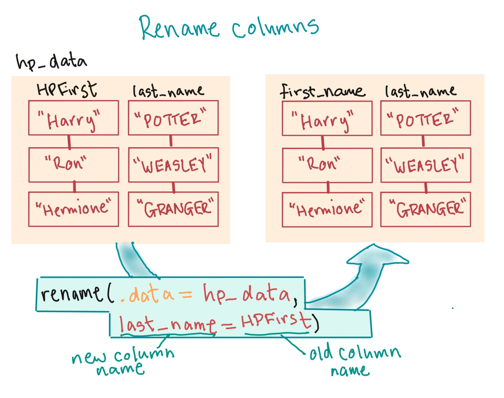

```{r echo = FALSE, message = FALSE, warning = FALSE}
options(width = 50)
library(tidyverse)
```

# Data cleaning

## Cleaning data

Common data-cleaning tasks include: 

```{r echo = FALSE}
dc_func <- data.frame(task = c("Renaming columns",
                               "Extracting certain columns",
                               "Extracting or arranging rows",
                               "Adding or changing columns"),
                      func = c("`rename`",
                               "`select`",
                               "`slice`, `sample_n`, `filter`, `arrange`",
                               "`mutate`"))
knitr::kable(dc_func, col.names = c("Task", "`dplyr` functions"))
```

## The "tidyverse"

Today, we'll talk about using functions from the `dplyr` pakcage, as well as a
package for working with a specific type of data (`stringr` for character
strings, which is part of the "tidyverse", like the `readr` package.

\medskip

To use these functions, you'll need to load those packages: 

```{r message = FALSE, warning = FALSE}
library("dplyr")
library("stringr")
```

## Cleaning data

As an example of cleaning data, we'll work with the Daily Show data:

```{r message = FALSE, echo = FALSE}
daily_show <- read_csv("../data/daily_show_guests.csv",
                       skip = 4)
```
```{r eval = FALSE}
daily_show <- read_csv("data/daily_show_guests.csv",
                       skip = 4)
```

```{r}
head(daily_show, 3)
```

## Re-naming columns

A first step is often re-naming columns. It can be hard to work with a column name that is: 

- long
- doesn't following the naming rules for R objects
- includes upper case

Several of the column names in `daily_show` have some of these issues: 

```{r}
colnames(daily_show)
```

## Renaming columns 

To rename these columns, use the `rename` function from `dplyr`. 

```{r echo = FALSE, fig.align='center', out.width = "200pt"}

```

## Renaming columns 

The basic syntax of `rename` is: 

```{r eval = FALSE}
## Generic code
rename(dataframe, 
       new_column_name_1 = old_column_name_1,
       new_column_name_2 = old_column_name_2)
```

If you want to change column names in the saved object, be sure you reassign the object to be the output of `rename`.

## Renaming columns 

Here's a basic example of using `rename`:

```{r echo = FALSE, fig.align='center', out.width = "250pt"}

```

## Renaming columns 

To rename columns in the `daily_show` data, then, use:

```{r}
daily_show <- rename(daily_show,
                     year = YEAR,
                     job = GoogleKnowlege_Occupation, 
                     date = Show, 
                     category = Group,
                     guest_name = Raw_Guest_List)
head(daily_show, 3)
```

## Renaming columns 

As a quick check, what is the difference between these two calls?

```{r eval = FALSE}
# 1.
rename(daily_show,
       year = YEAR,
       job = GoogleKnowlege_Occupation, 
       date = Show, 
       category = Group,
       guest_name = Raw_Guest_List)
```

```{r eval = FALSE}
# 2.
daily_show <- rename(daily_show,
                     year = YEAR,
                     job = GoogleKnowlege_Occupation, 
                     date = Show, 
                     category = Group,
                     guest_name = Raw_Guest_List)
```


