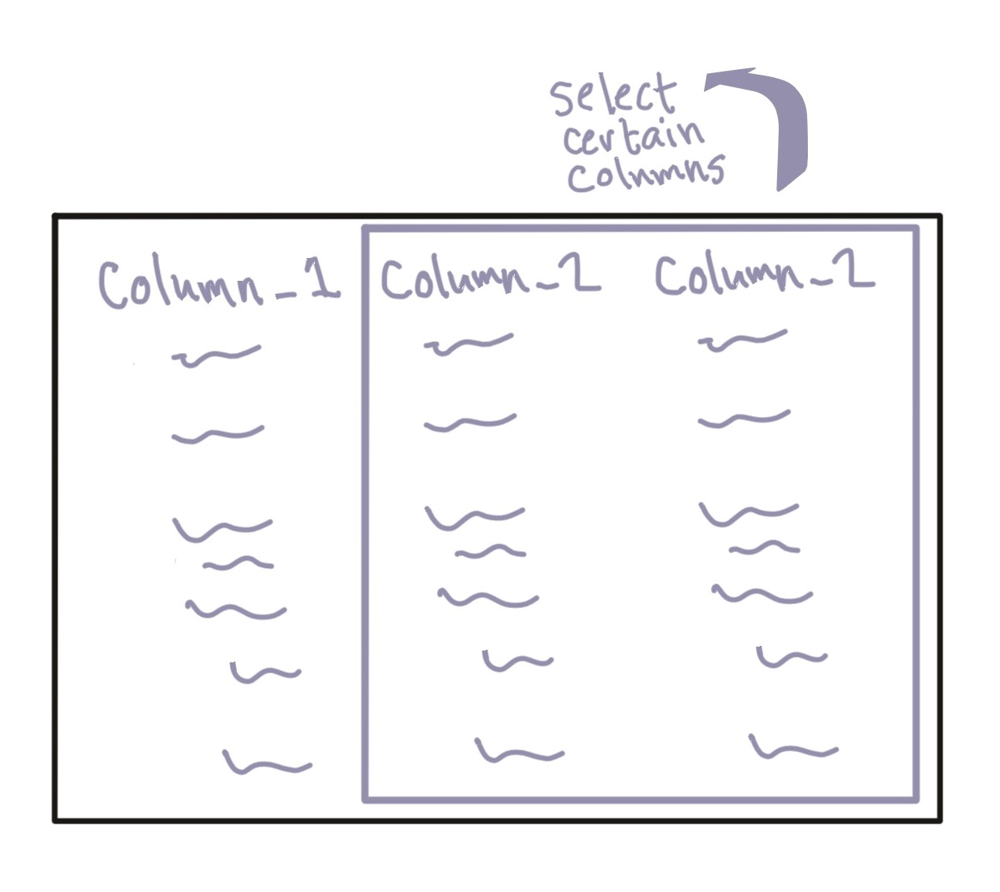

```{r echo = FALSE}
options(width = 50)
```
```{r echo = FALSE, message = FALSE, warning = FALSE}
library("readr")
library("dplyr")
library("stringr")
daily_show <- read_csv("../data/daily_show_guests.csv",
                       skip = 4)
daily_show <- rename(daily_show,
                     year = YEAR,
                     job = GoogleKnowlege_Occupation, 
                     date = Show, 
                     category = Group,
                     guest_name = Raw_Guest_List)
```

# Data cleaning: Extracting columns

## Extracting columns

Next, you may want to extract some columns of the dataframe. You can use the
`select` function for this.

```{r echo = FALSE, fig.align='center', out.width = "225pt"}

```

## Extracting columns

You have already used `select` to extract columns by position. You can also use
it to extract columns by name. 

In this case, the basic structure of this command is: 

```{r eval = FALSE}
## Generic code
select(.data = dataframe, 
       column_name_1, column_name_2, ...)
```

Where `column_name_1`, `column_name_2`, etc., are the names of the columns you
want to keep.

## Extracting columns

For example, to extract all columns except `year` (since that information is
already included in `date`), run:

```{r}
select(.data = daily_show, 
       job, date, category, guest_name)
```

## Extracting columns

As a reminder, we could have selected these columns using position, too:

```{r}
select(.data = daily_show, 2:5)
```


## Extracting columns

The `select` function also provides some time-saving tools. For example, in the
last example, we wanted all the columns except one. Instead of writing out all
the columns we want, we can use `-` with the columns we don't want to save time:

```{r}
daily_show <- select(daily_show, -year)
head(daily_show, 3)
```

## Extracting columns

Another cool trick with `select` is that, if you want to keep several columns in
a row, you can use a colon (`:`) with column names (rather than column position
numbers) to select those columns:

```{r eval = FALSE}
daily_show <- select(daily_show, job:guest_name)
```

This call says that we want to select all columns from the one named "job" to
the one named "guest_name".

## Extracting columns

The `select` function has some cool extra options that we'll explore later in 
the course, including:

- Selecting all columns that start with a certain pattern
- Selecting all columns that end with a certain pattern
- Selecting all columns that contain a certain pattern


