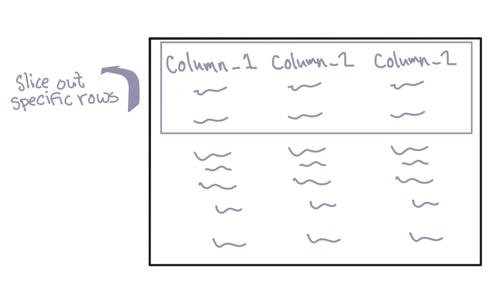
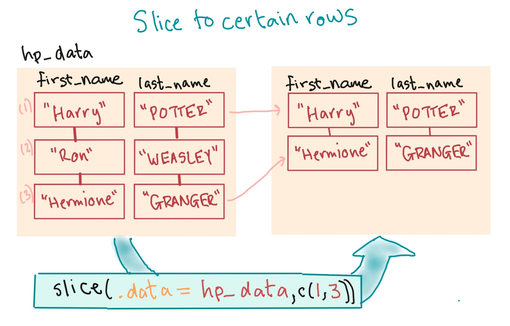

```{r echo = FALSE}
options(width = 50)
```
```{r echo = FALSE, message = FALSE, warning = FALSE}
library("readr")
library("dplyr")
library("stringr")
daily_show <- read_csv("../data/daily_show_guests.csv",
                       skip = 4)
daily_show <- rename(daily_show,
                     year = YEAR,
                     job = GoogleKnowlege_Occupation, 
                     date = Show, 
                     category = Group,
                     guest_name = Raw_Guest_List)
daily_show <- select(daily_show, -year)
```

# Data cleaning: Extracting and rearranging rows

## Extracting and rearranging rows

Next, we'll go deeper into how to extract certain rows, building on what we 
covered in the first week.

There are a few functions that are useful for extracting or rearranging rows in 
a dataframe: 

- `slice`
- `slice_sample`
- `arrange`
- `filter`

We'll go through what each of these does and how to use them.

## Slicing to certain rows

The `slice` function from the `dplyr` package can extract certain rows based on
their position in the dataframe.

```{r echo = FALSE, fig.align='center', out.width = "275pt"}

```

## Slicing to certain rows

Last week, you learned how to use the `slice` function 
to limit a dataframe to certain rows by row position.

For example, to print the first three rows of the `daily_show` data, you can
run:

```{r}
library("dplyr")
slice(.data = daily_show, 1:3)
```

<!-- ## Slicing to certain rows -->

<!-- ```{r echo = FALSE, fig.align='center', out.width = "300pt"} -->
<!--  -->
<!-- ``` -->

## Randomly sampling rows

There are some other functions you can use to extract rows from a tibble dataframe, 
all from the "dplyr" package. 

For example, if you'd like to extract a random subset of *n* rows, you can use the 
`slice_sample` function, with the `size` argument set to *n*. 

To extract two random rows from the `daily_show` dataframe, run: 

```{r}
slice_sample(.data = daily_show, n = 2)
```

## Arranging rows

There is also a function, `arrange`, you can use to re-order the rows in a
dataframe based on the values in one of its columns. The syntax for this
function is:

```{r eval = FALSE}
# Generic code
arrange(.data = dataframe, column_to_order_by)
```

If you run this function to use a character vector to order, it will order the
rows alphabetically by the values in that column. If you specify a numeric
vector, it will order the rows by the numeric value.

## Arranging rows

For example, we could reorder the `daily_show` data alphabetically by the values
in the `category` column with the following call:

```{r}
daily_show <- arrange(.data = daily_show, category)
slice(.data = daily_show, 1:3)
```

## Arranging rows

If you want the ordering to be reversed (e.g., from "z" to "a" for character
vectors, from higher to lower for numeric, latest to earliest for a Date), you
can include the `desc` function.

For example, to reorder the `daily_show` data by job category in descending 
alphabetical order, you can run:

```{r}
daily_show <- arrange(.data = daily_show, 
                      desc(x = category))
slice(.data = daily_show, 1:2)
```

## Filtering to certain rows

Next, you might want to filter the dataset down so that it only includes certain
rows. You can use the `filter` function from the `dplyr` package to do that. The
syntax is:

```{r eval = FALSE}
## Generic code
filter(.data = dataframe, logical expression)
```

## Filtering to certain rows

The **logical expression** gives the condition that a row must meet to be
included in the output data frame. For example, you might want to pull:

- Rows from 2015
- Rows where the guest was an academic
- Rows where the job is not missing

## Filtering to certain rows

For example, the `==` logical operator tests if two values are equal. So if you
want to create a data frame that only includes guests who were scientists, you
can run:

```{r}
scientists <- filter(.data = daily_show, category == "Science")
head(scientists)
```


## Common logical and relational operators in R

To build a logical statement to use in `filter`, you'll need to know some of R's
logical and relational operators:

\small

Operator  | Meaning | Example
--------- | ------- | ---------------------------------
`==`      | equals  | `category == "Acting"`
`!=`      | does not equal | `category != "Comedy"`
`%in%`    | is in | `category %in% c("Academic", "Science")`
`is.na()` | is NA | `is.na(job)`
`&`       | and | `(year == 2015) & (category == "Academic")`
`|`       | or | `(year == 2015) | (category == "Academic")`

## Common logical and relational operators in R

We will cover logical operators and expressions in depth next
week. 

As a preview, the `==` operator will check each element of a vector against each
corresponding element of another vector to see if it's equal.

The result will be a **logical vector**: 

```{r}
c(1, 2, 3) == c(1, 2, 4)
```

