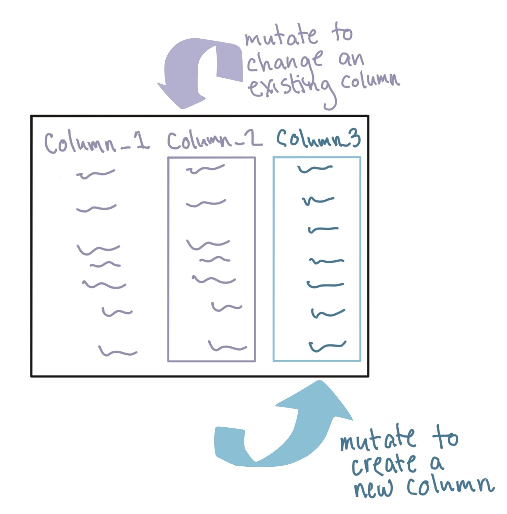
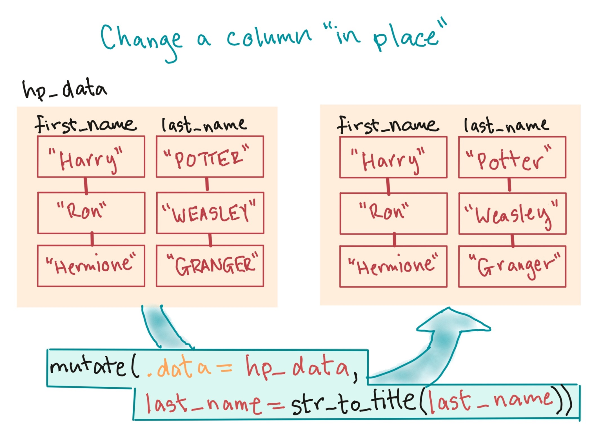
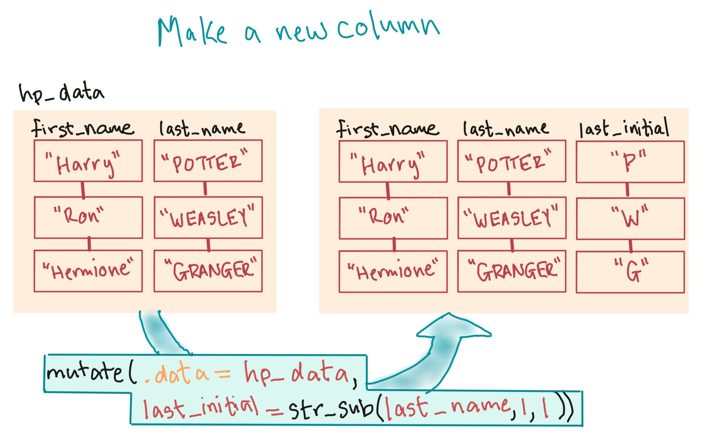

```{r echo = FALSE}
options(width = 50)
```
```{r echo = FALSE, message = FALSE, warning = FALSE}
library("readr")
library("dplyr")
library("stringr")
daily_show <- read_csv("../data/daily_show_guests.csv",
                       skip = 4)
daily_show <- rename(daily_show,
                     year = YEAR,
                     job = GoogleKnowlege_Occupation, 
                     date = Show, 
                     category = Group,
                     guest_name = Raw_Guest_List)
daily_show <- select(daily_show, -year)
daily_show <- arrange(.data = daily_show, 
                      desc(x = category))
```

# Data cleaning: Adding or changing columns

## Add or change columns

You can **change **a column or **add** a new column using the `mutate` function
from the `dplyr` package.

```{r echo = FALSE, fig.align='center', out.width = "200pt"}

```

## Add or change columns

The `mutate` function has the syntax:

```{r eval = FALSE}
# Generic code
mutate(.data =dataframe,
       changed_column = function(original column),
       new_column = function(original columns))
```

- If you want to just **change** a column (in place), use its original name on
the left of the equation.
- If you want to **add** a new column, use a new column name (you pick what that
name will be) on the left of the equation (this will be the name of the new
column).

## Add or change columns

You can use `mutate` to *change* an existing column.

```{r echo = FALSE, fig.align='center', out.width = "250pt"}

```


## Add or change columns

For example, the `job` column in `daily_show` sometimes uses upper case and sometimes does not: 

```{r}
daily_show$job[1:10]
```

## Add or change columns

There is a package called `stringr` for working with character strings.

We could use the `str_to_lower` function from the `stringr` package to make all
listings lowercase:

```{r}
library("stringr")
daily_show <- mutate(.data = daily_show, 
                     job = str_to_lower(string = job))
```

## Add or change columns

Now all job listings are in lowercase:

```{r}
daily_show$job[1:10]
```

## Add or change columns

Alternatively, you can also use `mutate` to *add* a new column to the dataframe.

```{r echo = FALSE, fig.align='center', out.width = "250pt"}

```


## Add or change columns

For example, you could add a column called `uc_job` with the job name in uppercase
letters:

```{r}
daily_show <- mutate(.data = daily_show, 
                     uc_job = str_to_upper(string = job))
slice(select(.data = daily_show, job, uc_job), 1:3)
```

