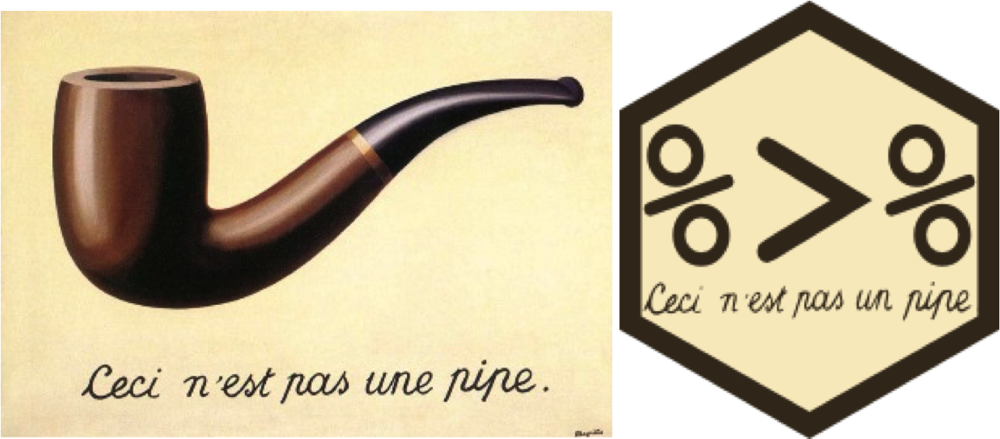
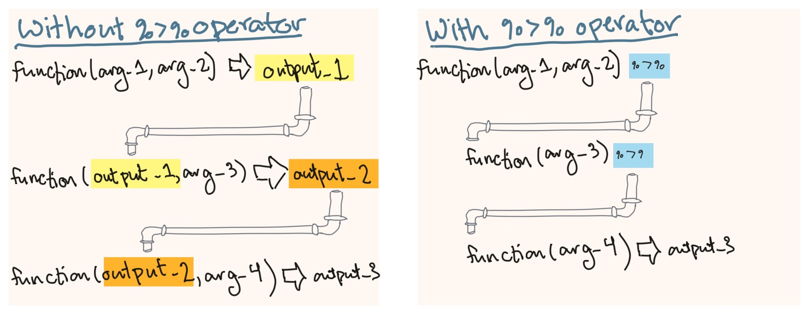

```{r echo = FALSE}
options(width = 50)
```
```{r echo = FALSE, message = FALSE, warning = FALSE}
library("readr")
library("dplyr")
library("stringr")
daily_show <- read_csv("../data/daily_show_guests.csv",
                       skip = 4)
daily_show <- rename(daily_show,
                     year = YEAR,
                     job = GoogleKnowlege_Occupation, 
                     date = Show, 
                     category = Group,
                     guest_name = Raw_Guest_List)
daily_show <- select(daily_show, -year)
daily_show <- arrange(.data = daily_show, 
                      desc(x = category))
daily_show <- mutate(.data = daily_show, 
                     job = str_to_lower(string = job))
daily_show <- mutate(.data = daily_show, 
                     uc_job = str_to_upper(string = job))
```

# Piping

## "Composing" to combine function calls

There's one additional way to compose several function calls into one R expression.

There's a special "pipe" function (`%>%`) in a package called
"magrittr" that you can use to compose a large R expression from several smaller
function calls. This will "pipe" the object that is created from one function
call into the first argument for the next function call.

For composing two simple function calls, here's how that looks:

```{r}
library(package = "magrittr")

paste(x = "Hello world") %>% 
  print()
```

## "Composing" to combine function calls

Here's another example. Earlier, we used something like the following code to
extract certain rows and columns from a dataframe:

\small

```{r eval = FALSE}
select(.data = slice(.data = daily_show, c(1:2)), c(1, 4))
```

You can use a pipe to express this much more cleanly: 

```{r eval = FALSE}
slice(.data = daily_show, c(1:2)) %>% 
  select(c(1, 4))
```

## "Composing" to combine function calls

You can even move the dataframe out of the first function call, and
move it to the start of the expression, where you "pipe" it into the 
first function call in the expression:

```{r eval = FALSE}
daily_show %>% 
  slice(c(1:2)) %>% 
  select(c(1, 4))
```

## Piping

```{r echo = FALSE, out.width = "\\textwidth"}

```

## Piping

If you look at the format of these `dplyr` functions, you'll notice that they all take a dataframe as their first argument: 

```{r eval = FALSE}
# Generic code
rename(.data = dataframe, 
       new_column_name_1 = old_column_name_1,
       new_column_name_2 = old_column_name_2)
select(.data = dataframe, column_name_1, column_name_2)
slice(.data = dataframe, starting_row:ending_row)
arrange(.data = dataframe, column_to_order_by)
filter(.data = dataframe, logical_expression)
mutate(.data = dataframe,
       changed_column = function(original_column),
       new_column = function(original_columns))
```

## Piping

Classically, you would clean up a dataframe in R by reassigning the dataframe object at each step: 

```{r eval = FALSE}
daily_show <-read_csv(file = "../data/daily_show_guests.csv",
                      skip = 4)
daily_show <- rename(.data = daily_show, 
                     job = GoogleKnowlege_Occupation,
                     date = Show,
                     category = Group,
                     guest_name = Raw_Guest_List)
daily_show <- select(.data = daily_show, -YEAR) 
daily_show <- mutate(.data = daily_show, 
                     job = str_to_lower(job))
daily_show <- filter(.data = daily_show, 
                     category == "Science")
```

## Piping

"Piping" lets you clean this code up a bit. It can be used with any function that inputs a dataframe as its first argument. It "pipes" the dataframe created right before the pipe (`%>%`) into the function right after the pipe. 

## Piping

```{r echo = FALSE, fig.align='center', out.width = "300pt"}

```

## Piping

With piping, the same data cleaning looks like: 

```{r message = FALSE}
daily_show <- read_csv("../data/daily_show_guests.csv",
                      skip = 4) %>%
  rename(job = GoogleKnowlege_Occupation,
         date = Show,
         category = Group,
         guest_name = Raw_Guest_List) %>%
  select(-YEAR) %>%
  mutate(job = str_to_lower(job)) %>%
  filter(category == "Science")
```

## Piping

Piping tip #1: As you are trying to figure out what "piped" code like this is doing, try highlighting from the start of the code through just part of the pipe and run that. For example, try highlighting and running just from `read_csv` through the before the ` %>%` in the line with `select`, and see what that output looks like. 

```{r eval = FALSE}
daily_show <- read_csv("../data/daily_show_guests.csv",
                      skip = 4) %>%
  rename(job = GoogleKnowlege_Occupation,
         date = Show,
         category = Group,
         guest_name = Raw_Guest_List) %>%
  select(-YEAR) %>%
  mutate(job = str_to_lower(job)) %>%
  filter(category == "Science")
```

## Piping

Piping tip #2: When you are writing an R script that uses piping, first write it and make sure you have it right **without** assigning it to an R object (i.e., no `<-`). Often you'll use piping to clean up an object in R, but if you have to work on the piping code, you end up with different versions of the object, which will cause frustrations.

```{r eval = FALSE}
read_csv("../data/daily_show_guests.csv", skip = 4) %>%
  rename(job = GoogleKnowlege_Occupation,
         date = Show,
         category = Group,
         guest_name = Raw_Guest_List) %>%
  select(-YEAR) %>%
  mutate(job = str_to_lower(job)) %>%
  filter(category == "Science")
```

## Piping

Piping tip #3: There is a keyboard shortcut for the pipe symbol: 

```
Command-Shift-m
```
