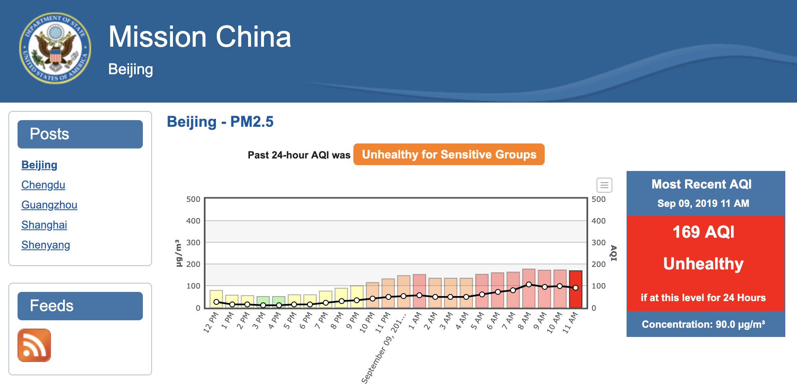
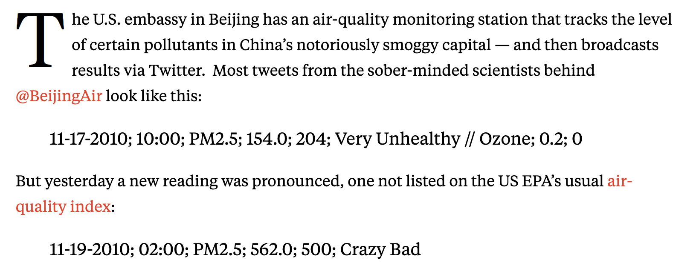

```{r echo = FALSE}
options(width = 50)
```

## Exploring data

- How to explore depends on data type / class
- Data exploration includes simple statistics (max, mean, min, standard deviation)
- Data exploration include plots

## Example data---Beijing air quality

```{r echo = FALSE, out.width = "4.5in"}

```

Source: http://www.stateair.net/web/post/1/1.HTML

## Example data---Beijing air quality

```{r echo = FALSE, out.width = "4.5in"}

```

Source: https://foreignpolicy.com/2010/11/19/beijing-air-crazy-bad/

## Example data---Beijing air quality

Find out more: 

https://www.wired.com/2015/03/opinion-us-embassy-beijing-tweeted-clear-air/
https://www.theguardian.com/environment/blog/2010/nov/19/crazy-bad-beijing-air-pollution
https://www.sciencemag.org/news/2018/04/rooftop-sensors-us-embassies-are-warning-world-about-crazy-bad-air-pollution

## Example data---Beijing air quality

Download the data [here](https://raw.githubusercontent.com/geanders/RProgrammingForResearch/master/data/Beijing_2017_HourlyPM25.csv). 

Then you can read this data into your R session: 

```{r}
library("readr")
```
```{r echo = FALSE, message = FALSE}
beijing_pm_raw <- read_csv("../data/Beijing_2017_HourlyPM25.csv", 
                       skip = 3)
```
```{r eval = FALSE}
beijing_pm_raw <- read_csv("data/Beijing_2017_HourlyPM25.csv", 
                       skip = 3)
```

## Example data---Beijing air quality

```{r}
head(beijing_pm_raw, n = 3)
```

## Example data---Beijing air quality

Let's clean this up a bit: 

```{r message = FALSE}
library("dplyr")
beijing_pm <- beijing_pm_raw %>% 
  rename(sample_time = `Date (LST)`, 
         value = Value,
         qc = `QC Name`) %>% 
  select(sample_time, value, qc)
head(beijing_pm, n = 3)
```

## Example data---Beijing air quality

This code will add the AQI categories:

```{r}
beijing_pm <- beijing_pm %>% 
  mutate(aqi = cut(value, 
                   breaks = c(0, 50, 100, 150, 200, 
                              300, 500, Inf),
                   labels = c("Good", "Moderate",
                              "Unhealthy for Sensitive Groups",
                              "Unhealthy", "Very Unhealthy", 
                              "Hazardous", "Beyond Index")))
head(beijing_pm, n = 2)
```

