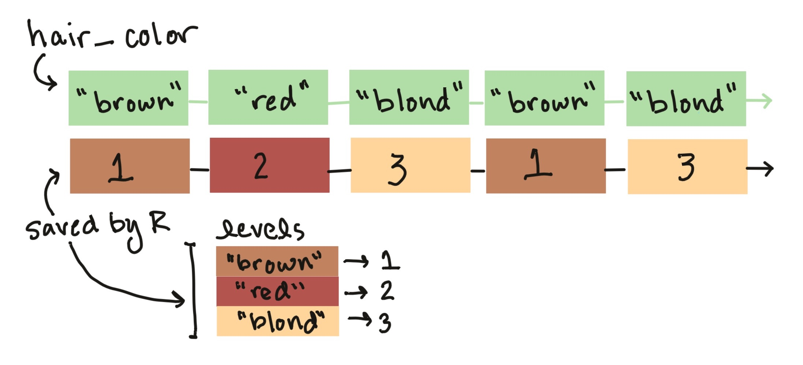
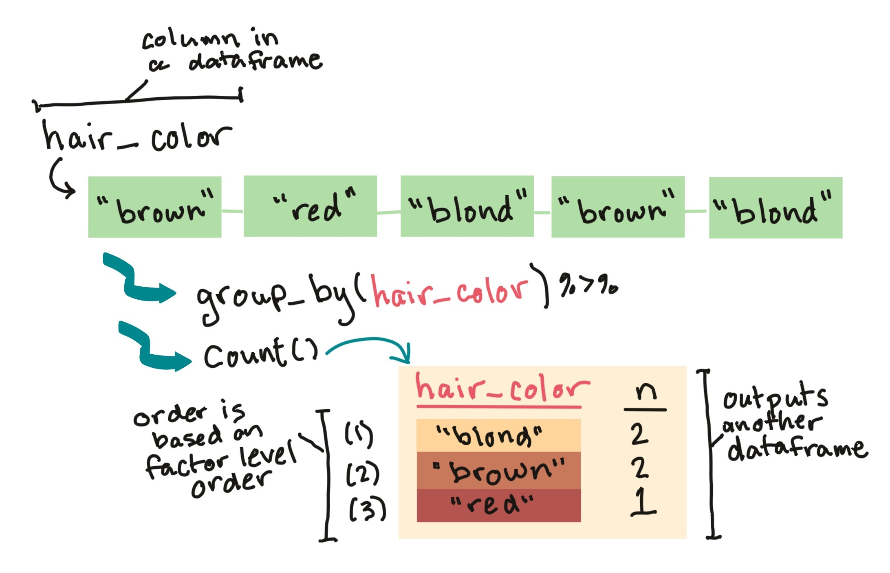
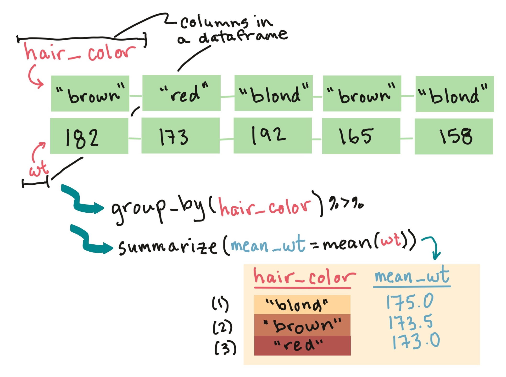

```{r echo = FALSE}
options(width = 50)
```

```{r echo = FALSE, message = FALSE, warning = FALSE}
library(readr)
library(dplyr)
```

```{r echo = FALSE}
beijing_pm <- read_rds("../data/beijing_pm.rds")
```

# Data types and vector classes

## Data types and vector classes

Here are a few common vector classes in R:

Class        | Example
------------ | -------------
`character`  | "Chemistry", "Physics", "Mathematics"
`numeric`    | 10, 20, 30, 40
`factor`     | Male [underlying number: 1], Female [2]
`Date`       | "2010-01-01" [underlying number: 14,610]
`logical`    | TRUE, FALSE [underlying numbers: 1, 0]

## Numeric vectors

To explore numeric vectors, there are a few base R functions that 
are very helpful. For example:

Function  | Description
--------- | -----------------
`min()` | Minimum of values in the vector
`max()` | Maximum of values in the vector
`mean()` | Mean of values in the vector
`median()` | Median of values in the vector

## Simple statistic examples

All of these take, as the main argument, the vector(s) for which you want the
statistic. 

```{r}
mean(x = beijing_pm$value)
min(x = beijing_pm$value)
```

If there are missing values in the vector, you'll need to add an
option to say what to do when them (e.g., `na.rm` or `use="complete.obs"`---see
help files).

## Simple statistic examples

These functions require a **numeric vector** as input. 

Remember that you can pull a column from a dataframe as a vector using
either `$` or the `pluck` function from `purrr`. Therefore, you can use 
either of these calls to get the mean weight of the children in the
dataset: 

```{r}
mean(beijing_pm$value)

library("purrr")
beijing_pm %>% 
  pluck("value") %>% 
  mean()
```

## The `summarize` function

Within a "tidy" workflow, you can use the `summarize` function from the `dplyr`
package to create summary statistics for a dataframe. This function inputs a
dataframe and outputs a dataframe with the specified summary measures.

## The `summarize` function

The basic format for using `summarize` is:

```{r eval = FALSE}
## Generic code
summarize(dataframe, 
          summary_column_1 = function(existing_columns),
          summary_column_2 = function(existing_columns))
```

## The `summarize` function

As an example, to summarize the `beijing_pm` dataset to get the minimum, mean,
and maximum PM\textsubscript{2.5} concentrations, you could run:

```{r}
summarize(beijing_pm,
          min_pm = min(value),
          mean_pm = mean(value),
          max_pm = max(value))
```

Notice that the output is one row (since the summary was on ungrouped data),
with three columns (since we defined three summaries in the `summarize`
function).

## The `summarize` function

Because the first input to the `summarize` function is a dataframe, you can
"pipe into" a `summarize` call. For example, we could have written the code on
the previous slide as:

```{r eval = FALSE}
beijing_pm %>% 
  summarize(min_pm = min(value),
            mean_pm = mean(value),
            max_pm = max(value))
```

As another note, because the output from `summarize` is also a dataframe, we
could also "pipe into" another tidyverse function after running `summarize`.

<!-- ## The `summarize` function -->

<!-- There are some special functions that are particularly useful to use with -->
<!-- `summarize` and other functions from the `dplyr` package: -->

<!-- Function | Description -->
<!-- ---------------|------------- -->
<!-- `n()`          | Number of elements in a vector -->
<!-- `n_distinct()` | Number of unique elements in a vector -->
<!-- `first()`      | First value in a vector -->
<!-- `last()`       | Last value in a vector -->

<!-- ## The `summarize` function -->

<!-- For example, the following call would give you the total number of observations in the dataset, the number of distinct values of age measured across all children, the ID of the first child included in the dataset, and the weight of the last child included in the dataset:   -->

<!-- ```{r} -->
<!-- distinct_nepali %>% -->
<!--   summarize(n_children = n(),  -->
<!--             n_distinct_ages = n_distinct(age), -->
<!--             first_id = first(id), -->
<!--             last_weight = last(wt)) -->
<!-- ``` -->

<!-- ## Grouping and summarizing -->

<!-- Often, you'll want to get summaries of the data stratified by groups within the data. For example, in the `nepali` dataset, you may want to get summaries by sex or by whether the child was short or tall.  -->

<!-- To get grouped summaries of a dataframe, you can first use the `group_by` function from the `dplyr` package to "group" the dataset, and then when you run "summarize", it will be applied **by group** to the data.  -->

<!-- Your final output from summarize will be a dataframe with:  -->

<!-- - As many rows as there were unique groups in the grouping factor(s) -->
<!-- - As many columns as you have defined summaries in the `summarize` function (the generic code above would result in two columns), plus columns for each of the grouping factors -->

<!-- ## Grouping and summarizing -->

<!-- Without piping, the use of `group_by` and `summarize` looks like this: -->

<!-- ```{r eval = FALSE} -->
<!-- # Generic code -->
<!-- summarize(group_by(dataframe, -->
<!--                    grouping_factor_1, grouping_factor_2),  -->
<!--           summary_column_1 = function(existing_columns), -->
<!--           summary_column_2 = function(existing_columns))  -->

<!-- ``` -->

<!-- You can see that `group_by` is nested within the `summarize` call, because `group_by` must be applied to the dataframe before `summarize` is run if you want to get summaries by group.  -->

<!-- ## Grouping and summarizing -->

<!-- This call tends to look much cleaner if you use piping. With piping, the generic call looks like:  -->

<!-- ```{r eval = FALSE} -->
<!-- # Generic code -->
<!-- dataframe %>%  -->
<!--   group_by(grouping_factor_1, grouping_factor_2) %>%  -->
<!--   summarize(summary_column_1 = function(existing_columns), -->
<!--             summary_column_2 = function(existing_columns)) -->
<!-- ``` -->

<!-- ## Grouping and summarizing -->

<!-- For example, in the Nepali dataset, say you want to get summaries by sex. You want to get the total number of children in each group, the mean weight, and the ID of the first child. -->

<!-- You can run: -->

<!-- ```{r} -->
<!-- distinct_nepali %>% -->
<!--   group_by(sex) %>% -->
<!--   summarize(n_children = n(),  -->
<!--             mean_wt = mean(wt, na.rm = TRUE), -->
<!--             first_id = first(id)) -->
<!-- ``` -->

<!-- ## Grouping and summarizing -->

<!-- ```{r} -->
<!-- distinct_nepali %>% -->
<!--   group_by(sex) %>% -->
<!--   summarize(n_children = n(),  -->
<!--             mean_wt = mean(wt, na.rm = TRUE), -->
<!--             first_id = first(id)) -->
<!-- ``` -->

<!-- Notice that the output is a dataframe with two rows (since there were two groups in the grouping factor) and four columns (one for the grouping factor, plus one for each of the summaries defined in the `summarize` function). -->

<!-- ## Grouping and summarizing -->

<!-- You can group by more than one variable. For example, to get summaries within groups divided by both sex and whether the child is tall (> 100 cm) or not, you could run: -->

<!-- \small -->

<!-- ```{r} -->
<!-- distinct_nepali %>% -->
<!--   mutate(tall = ht > 100) %>% -->
<!--   filter(!is.na(tall)) %>%  -->
<!--   group_by(sex, tall) %>% -->
<!--   summarize(n_children = n(), -->
<!--             mean_wt = mean(wt, na.rm = TRUE)) -->
<!-- ``` -->


## Factors in R

Factor vectors are used in R for **categorical variables**, where more than 
one observation can have the same category.

```{r echo = FALSE, out.width="4.5in"}

```

Factor variables have one or more **levels**. While you will always see a 
factor printed with its factor level labels, R "remembers" the variable
with each level assigned a number.

## Factors in R

In tibbles, factors will be noted with "fctr" under the column name. 
For example, look at the `aqi` column in the `beijing_pm` data:

```{r}
head(beijing_pm, n = 3)
```

## Factors in R

You can use the `levels` function to see the levels of a factor vector, as well
as the order those levels are recorded in R.

```{r}
levels(beijing_pm$aqi)
```

## Factors in R

To explore a factor vector, you'll often want to **count** the number of 
observations in each category. You can do that with two functions in the
`dplyr` package, `group_by` and `count`. 

Start with a dataframe that includes the factor variable as a column. 
First `group_by` the factor, then pipe the output of that into the `count`
function. 

This will create a new summary dataframe, with a row for each level of the
factor. A column called `n` will give the number of observations in the 
original data that had that level of the factor.

## Factors in R

You can **count** how many observations have each level of a factor.

```{r echo = FALSE, out.width="4.5in"}

```

## Factors in R

```{r message = FALSE, warning = FALSE}
beijing_pm %>% 
  group_by(aqi) %>% 
  count()
```

## Factors in R

You can jointly explore multiple columns in a dataframe. 

For example, if one column is a factor and one is numeric, it can be
useful to explore values of the numeric column within each level of 
the factor column. 

For the Beijing data, you may want to find out the mean comcentration of
PM\textsubscript{2.5} within each AQI level.

## Factors in R

You can **summarize** a numeric column within levels of a factor column:

```{r echo = FALSE, out.width="4in", fig.align='center'}

```

## Factors in R

To do this, pipe the dataframe into `group_by` (where you can group by the
factor column) and then into `summarize`, where you can calculate summaries. 

```{r message = FALSE, warning = FALSE}
beijing_pm %>% 
  group_by(aqi) %>% 
  summarize(mean_pm = mean(value))
```


## Factors in R

You can create several summaries at once: 

```{r message = FALSE, warning = FALSE}
beijing_pm %>% 
  group_by(aqi) %>% 
  summarize(min_pm = min(value), 
            max_pm = max(value))
```

## Factors in R

As a note, there's a function called `n()` that you can use inside
summarize to replace `count`. For example, these two expressions
give the same output: 

```{r eval = FALSE}
beijing_pm %>% 
  group_by(aqi) %>% 
  count()

beijing_pm %>% 
  group_by(aqi) %>% 
  summarize(n = n())
```

## Factors in R

If a column is in a character class, but you'd like it to be a 
factor, you can use `as.factor`: 

```{r}
beijing_pm %>% 
  mutate(qc = as.factor(qc))
```

