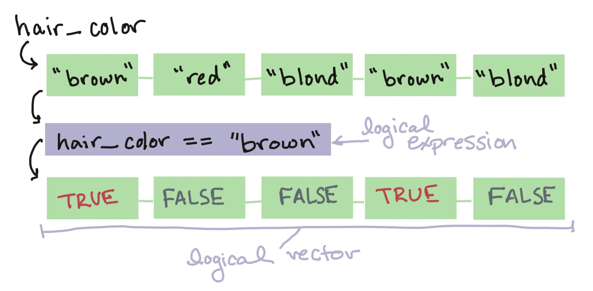
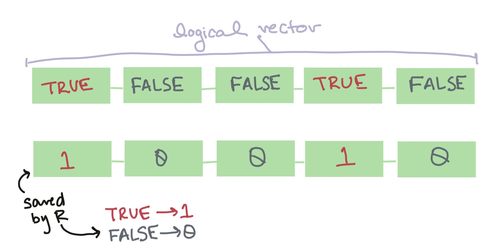
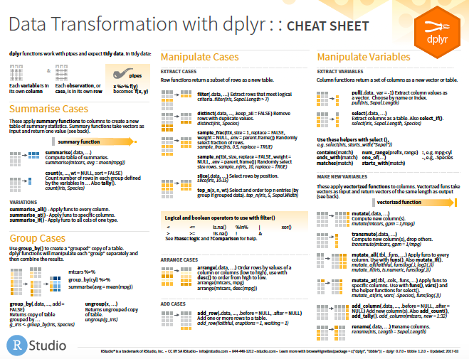
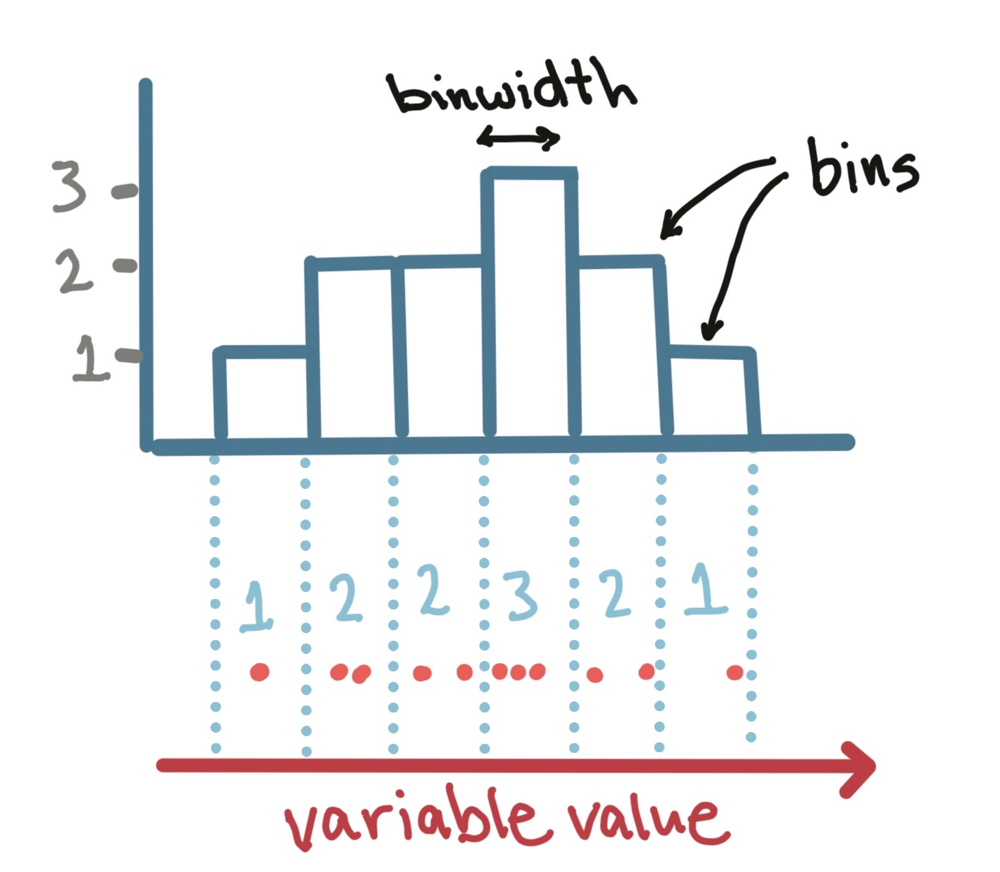

```{r echo = FALSE}
options(width = 50)
```

```{r echo = FALSE, message = FALSE, warning = FALSE}
library(readr)
library(dplyr)
library(lubridate)
```

```{r echo = FALSE}
beijing_pm <- read_rds("../data/beijing_pm.rds")
```

# Logical operators, vectors, and expressions

## Logical operators, vectors, and expressions

**Logical expressions** are operators that conduct a logical test based on 
one or more vectors, while logical expressions are the full R expressions 
that use these operators to conduct the test. The output is a **logical vector**. 

```{r echo = FALSE, out.width="4.5in"}

```

## Logical expressions

Last week, you learned some about logical expressions and how to use them with
the `filter` function. \medskip

You can use *logical vectors*, created with these expressions, for a lot data
exploration tasks. We'll review them and add some more details this week.

## Logical vectors

A logical expression outputs a *logical vector*. This logical vector will be the
same length as the original vector tested by the logical statement:

```{r}
length(beijing_pm$value)
length(beijing_pm$value > 500)
```

## Logical vectors

Each element of the logical vector can only have one of three values (`TRUE`,
`FALSE`, `NA`). The logical vector will have the value `TRUE` at any position
where the original vector met the logical condition you tested, and `FALSE`
anywhere else:

```{r}
head(beijing_pm$value)
head(beijing_pm$value > 500)
```

## Logical vectors

Because the logical vector is the same length as the vector it's testing, you
can add logical vectors to dataframes with `mutate`:

```{r}
beijing_pm <- beijing_pm %>% 
  mutate(beyond_index = value > 500)
```

## Logical vectors

```{r}
beijing_pm %>% 
  select(sample_time, value, beyond_index)
```

## Logical vectors

As another example, you could add a column that is a logical vector of whether
a day was in the "heating season", which usually ends on March 15 each year:

```{r}
beijing_pm <- beijing_pm %>% 
  mutate(heating = sample_time < ymd("2017-03-15")) 
```

## Common logical and relational operators in R

The **bang operator** (`!`) negates (flips) a logical expression:

```{r}
c(1, 2, 3) == c(1, 2, 5)
!(c(1, 2, 3) == c(1, 2, 5))
```

```{r}
is.na(c(1, 2,  NA))
!is.na(c(1, 2, NA))
```

## Common logical and relational operators in R

The `%in%` operator will check each element of a 
vector to see if it's a value that is included in a second 
vector. 

In this case, the two vectors don't have to have 
the same length: 

```{r}
c(1, 2, 3) %in% c(1, 5)
```

This logical expressions is asking *Is the first element of the first vector, 1,
in the set given by the second vector, 1 and 5? Is the second element of the
first vector, 2, in the set given by the second vector? Etc.*

## Logical vectors

You can do a few cool things now with this vector. For example, you can use it
with the `filter` function to pull out just the rows where `heating` is `TRUE`:

```{r}
beijing_pm %>% 
  filter(heating) %>% 
  slice(1:3)
```

## Logical vectors

Or, with `!`, just the rows where `heating` is `FALSE`:

```{r}
beijing_pm %>% 
  filter(!heating) %>% 
  slice(1:3)
```

## Logical vectors

All of the values in a logical vector are saved, at a deeper level, with a
number. Values of `TRUE` are saved as 1 and values of `FALSE` are saved as 0.

```{r echo = FALSE, out.width="4.5in"}

```

## Logical vectors

```{r}
head(beijing_pm$beyond_index)
```

```{r}
head(as.numeric(beijing_pm$beyond_index))
```


## Logical vectors

Therefore, you can use `sum()` to get the sum of all values in a vector. Because
logical vector values are linked with numerical values of 0 or 1, you can use
`sum()` to find out how many males and females are in the dataset:

```{r}
sum(beijing_pm$beyond_index)
sum(!beijing_pm$beyond_index)
```

# Tidyverse and cheatsheets

## The "tidyverse"

So far, we have used a number of packages that are part of the *tidyverse*. The
tidyverse is a collection of recent and developing packages for R, many written
by Hadley Wickham. \medskip

```{r echo = FALSE, out.width = "0.6\\textwidth", fig.align = "center"}

```


## The "tidyverse"

```{r echo = FALSE, out.width = "0.7\\textwidth", fig.align = 'center'}

```

\begin{center}
"A giant among data nerds"
\end{center}

\footnotesize{
\url{https://priceonomics.com/hadley-wickham-the-man-who-revolutionized-r/}}

## Cheatsheets

RStudio has several very helpful **cheatsheets**. These are one-page sheets
(front and back) that cover many of the main functions for a certain topic or
task in R. These cheatsheets cover a lot of the main "tidyverse" functions.

You can access these directly from RStudio. Go to "Help" -> "Cheatsheets" and
select the cheatsheet on the topic of interest.

You can find even more of these cheatsheets at
https://www.rstudio.com/resources/cheatsheets/.

## Cheatsheets

```{r echo = FALSE, out.width = "0.9\\textwidth", fig.align = 'center'}

```

## More reading / practice

If you would like more reading and practice on what we've covered so far on transforming data, see chapter 5 of the "R for Data Science" book suggested at the start of the course. 

As a reminder, that is available at: 

http://r4ds.had.co.nz

# Basic plotting

## Example data---Beijing air quality

Let's read the Beijing data in and clean up the "-999" values: 

```{r}
library("readr")
```
```{r echo = FALSE, message = FALSE}
beijing_pm_raw <- read_csv("../data/Beijing_2017_HourlyPM25.csv", 
                       skip = 3, na = "-999")
```
```{r eval = FALSE}
beijing_pm_raw <- read_csv("data/Beijing_2017_HourlyPM25.csv", 
                       skip = 3, na = "-999")
```

## Example data---Beijing air quality

Clean up as before:

\footnotesize

```{r}
beijing_pm <- beijing_pm_raw %>% 
  rename(sample_time = `Date (LST)`, 
         value = Value,
         qc = `QC Name`) %>% 
  select(sample_time, value, qc) %>% 
  mutate(aqi = cut(value, 
                   breaks = c(0, 50, 100, 150, 200, 
                              300, 500, Inf),
                   labels = c("Good", "Moderate",
                              "Unhealthy for Sensitive Groups",
                              "Unhealthy", "Very Unhealthy", 
                              "Hazardous", "Beyond Index"))) %>% 
  mutate(sample_time = mdy_hm(sample_time)) %>% 
  mutate(heating = sample_time < mdy("03/15/2017"))
```

# Plots 

## Plots to explore data

Plots can be invaluable in exploring your data. \medskip

Today, we will focus on **useful**, rather than **attractive** graphs, since we
are focusing on exploring rather than presenting data. \medskip

Next lecture, we will talk more about customization, to help you make more
attractive plots that would go into final reports. \medskip

## `ggplot` conventions

Here, we'll be using functions from the `ggplot2` library, so you'll need to install that package:

```{r}
library("ggplot2")
```

The basic steps behind creating a plot with `ggplot2` are:

1. Create an object of the `ggplot` class, typically specifying the **data** to
be shown in the plot;
2. Add on (using `+`) one or more **geoms**, specifying the **aesthetics** for
each; and
3. Add on (using `+`) other elements to create and customize the plot (e.g., add
layers to customize scales or themes or to add facets).

*Note*: To avoid errors, end lines with `+`, don't start lines with it. 

## Plot data

The `ggplot` function requires you to input a dataframe with the data you will
plot. All the columns in that dataframe can be mapped to specific aesthetics
within the plot.

```{r}
beijing_pm %>% 
  slice(1:3)
```

For example, if we input the `beijing_pm` dataframe, we would be able to create
a plot that shows each sample's sampling time on the x-axis,
PM\textsubscript{2.5} concentration on the y-axis, and AQI by the color of the
point.

## Plot aesthetics

**Aesthetics** are plotting elements that can show certain elements of the data.
\medskip

For example, you may want to create a scatterplot where color shows AQI,
x-position shows sampling time, and y-position shows PM\textsubscript{2.5}
concentration. \medskip

```{r echo = FALSE, warning = FALSE, fig.align = "center", out.width = "0.9\\textwidth", message = FALSE, fig.width = 8, fig.height = 3.5}
beijing_pm %>%
  ggplot(aes(x = sample_time, y = value, 
             color = aqi)) + 
  geom_point() + 
  xlab("Sampling time") + ylab("PM2.5 concentration")
```

## Plot aesthetics

In the previous graph, the mapped aesthetics are color, x, and y. In the
`ggplot` code, all of these aesthetic mappings will be specified within an `aes`
call, which will be nested in another call in the `ggplot` pipeline. \medskip

Aesthetic       | `ggplot` abbreviation  | `beijing_pm` column
----------------|------------------------|-----------------
x-axis position | `x = `                 | `sample_time`
y-axis position | `y = `                 | `value`
color           | `color = `             | `aqi`

This is how these mappings will be specified in an `aes` call:

```{r eval = FALSE}
# Note: This code should not be run by itself. 
# It will eventually be nested in a ggplot call.
aes(x = sample_time, y = value, color = aqi)
```


## Plot aesthetics

Here are some common plot aesthetics you might want to specify: 

```{r echo = FALSE}
aes_vals <- data.frame(aes = c("`x`", "`y`", "`shape`",
                               "`color`", "`fill`", "`size`",
                               "`alpha`", "`linetype`"),
                       desc = c("Position on x-axis", 
                                "Position on y-axis", 
                                "Shape",
                                "Color of border of elements", 
                                "Color of inside of elements",
                                "Size", 
                                "Transparency (1: opaque; 0: transparent)",
                                "Type of line (e.g., solid, dashed)"))
knitr::kable(aes_vals, col.names = c("Code", "Description"))
```

## Geoms

You will add **geoms** that create the actual geometric objects on the plot. For
example, a scatterplot has "points" geoms, since each observation is displayed
as a point.

There are `geom_*` functions that can be used to add a variety of geoms. The
function to add a "points" geom is `geom_point`.

We just covered three plotting elements: 

- Data
- Aesthetics
- Geoms

These are three elements that you will almost always specify when using
`ggplot`, and they are sufficient to create a number of basic plots.

## Creating a ggplot object

You can create a scatterplot using `ggplot` using the following code format:

```{r, eval = FALSE}
## Generic code
ggplot(data = dataframe) + 
  geom_point(mapping = aes(x = column_1, y = column_2, 
                           color = column_3))
```

\small 
Notice that: 

1. The `ggplot` call specifies the **dataframe** with the data you want to plot
2. A **geom** is added using the appropriate `geom_*` function for a scatterplot
(`geom_point`).
3. The mappings between columns in the dataframe and **aesthetics** of the geom
is specified within an `aes` call in the `mapping` argument of the `geom_*`
function call.
4. The `aes` call includes mappings to two aesthetics that are required from the
`geom_point` geom (`x` and `y`) and one that is optional (`color`).

## Creating a ggplot object

Let's put these ideas together to write the code to create a plot for our
example data:

```{r warning = FALSE, fig.align = "center", out.width = "0.9\\textwidth", message = FALSE, fig.width = 8, fig.height = 3.5}
  ggplot(data = beijing_pm) + 
  geom_point(mapping = aes(x = sample_time, y = value, 
                           color = aqi)) 
```

## Adding geoms

There are a number of different `geom_*` functions you can use to add geoms to a
plot. They are divided between geoms that directly map the data to an aesthetic
and those that show some summary or statistic of the data. \medskip

Some of the most common direct-mapping geoms are:

Geom(s)                     | Description
----------------------------|--------------
`geom_point`                | Points in 2-D (e.g. scatterplot)
`geom_line`, `geom_path`    | Connect observations with a line
`geom_abline`               | A line with a certain intercept and slope
`geom_hline`, `geom_vline`  | A horizontal or vertical line
`geom_rug`                  | A rug plot
`geom_label`, `geom_text`   | Text labels

## Creating a ggplot object

You can add several geoms to the same plot as layers:

```{r warning = FALSE, fig.align = "center", out.width = "0.6\\textwidth", message = FALSE, fig.width = 5, fig.height = 3}
  ggplot(data = beijing_pm) + 
  geom_point(mapping = aes(x = sample_time, y = value)) + 
  geom_line(mapping = aes(x = sample_time, y = value)) + 
  geom_rug(mapping = aes(x = sample_time, y = value)) 
```

## Creating a ggplot object

You may have noticed that all of these geoms use the same aesthetic mappings
(height to x-axis position, weight to y-axis position, and sex to color). To
save time, you can specify the aesthetic mappings in the first `ggplot` call.
These mappings will then be the default for any of the added geoms.

```{r eval = FALSE, warning = FALSE}
ggplot(data = beijing_pm,
       mapping = aes(x = sample_time, y = value)) + 
  geom_point() + 
  geom_line() + 
  geom_rug() 
```

## Creating a ggplot object

Because the first argument of the `ggplot` call is a dataframe, you can also
"pipe into" a `ggplot` call:

```{r eval = FALSE}
beijing_pm %>% 
  ggplot(aes(x = sample_time, y = value)) + 
  geom_point() + 
  geom_line() + 
  geom_rug() 
```

## Plot aesthetics

Which aesthetics you must specify in the `aes` call depend on which geom you are
adding to the plot. \medskip

You can find out the aesthetics you can use for a geom in the "Aesthetics"
section of the geom's help file (e.g., `?geom_point`). \medskip

Required aesthetics are in bold in this section of the help file and optional
ones are not.

## Constant aesthetics

Instead of mapping an aesthetic to an element of your data, you can use a
constant value for the aesthetic. For example, you may want to make all the
points blue, rather than having color map to AQI:

```{r echo = FALSE, warning = FALSE, fig.align = "center", out.width = "0.6\\textwidth", message = FALSE, fig.width = 5, fig.height = 3}
beijing_pm %>%
  ggplot(aes(x = sample_time, y = value)) + 
  geom_point(color = "blue")
```

In this case, you can define that aesthetic as a constant for the geom,
**outside** of an `aes` statement.

## Constant aesthetics

For example, you may want to change the shape of the points in a scatterplot from their default shape, but not map them to a particular element of the data. \medskip

In R, you can specify point shape with a number. Here are the shapes that correspond to the numbers 1 to 25:

```{r echo = FALSE, out.width = "0.6\\textwidth", fig.width = 5, fig.height = 3, fig.align = "center"}
x <- rep(1:5, 5)
y <- rep(1:5, each = 5)
shape <- 1:25
to_plot <- tibble(x = x, y = y, shape = shape)
ggplot(to_plot, aes(x = x, y = y)) + 
  geom_point(shape = shape, size = 4, color = "black", fill = "red") + 
  geom_text(label = shape, nudge_x = -0.25) +
  xlim(c(0.5, 5.5)) + 
  theme_void() + 
  scale_y_reverse()
```

## Constant aesthetics

Here is an example of mapping point shape to a constant value other than the
default:

```{r warning = FALSE, fig.align = "center", out.width = "0.9\\textwidth", message = FALSE, fig.width = 8, fig.height = 3.5}
ggplot(data = beijing_pm) + 
  geom_point(mapping = aes(x = sample_time, y = value,
                           color = aqi),
             shape = 9)
```

## Constant aesthetics

R has character names for different colors. For example: 

```{r echo = FALSE, out.width = "0.18\\textwidth", fig.width = 5, fig.height = 3, fig.align = "center"}
x <- rep(0, 6)
y <- 1:6
color <- c("blue", "blue4", "darkorchid", "deepskyblue2", 
           "steelblue1", "dodgerblue3")
to_plot <- data_frame(x = x, y = y, color = color)
ggplot(to_plot, aes(x = x, y = y)) + 
  geom_point(color = color, size = 2) + 
  geom_text(label = color, hjust = 0, nudge_x = 0.05) + 
  theme_void() + 
  xlim(c(-1, 1.5)) +
  scale_y_reverse()
```

Google "R colors" and search the images to find links to listings of different R colors.

## Constant aesthetics

Here is an example of mapping point shape and color to constant values other than the defaults:

```{r warning = FALSE, fig.align = "center", out.width = "0.9\\textwidth", message = FALSE, fig.width = 7, fig.height = 3}
ggplot(data = beijing_pm) + 
  geom_point(mapping = aes(x = sample_time, y = value),
             shape = 9, 
             color = "darkorchid")
```

## Useful plot additions

There are also a number of elements that you can add onto a `ggplot` object using `+`. A few very frequently used ones are: 

```{r echo = FALSE}
plot_adds <- data.frame(add = c("`ggtitle`",
                                "`xlab`, `ylab`, `labs`",
                                "`xlim`, `ylim`",
                                "`expand_limits`"),
                        descrip = c("Plot title",
                                    "x- and y-axis labels",
                                    "Limits of x- and y-axis",
                                    "Include a value in a range"))
knitr::kable(plot_adds, col.names = c("Element", "Description"))
```

## Useful plot additions

```{r warning = FALSE, fig.align = "center", out.width = "0.6\\textwidth", message = FALSE, fig.width = 5, fig.height = 3}
ggplot(data = beijing_pm) + 
  geom_point(mapping = aes(x = sample_time, y = value)) + 
  labs(x = "Sampling Date and Time", 
       y = "PM2.5 Concentration") + 
  ggtitle("Measurements of PM2.5 in Beijing, China, 2017",
          subtitle = "Based on U.S. Embassy Monitor") 
```


## Adding geoms

There are a number of different `geom_*` functions you can use to add geoms to a plot. They are divided between geoms that directly map the data to an aesthetic and those that show some summary or statistic of the data. \medskip 

Some of the most common "statistical" geoms are:

Geom(s)                        | Description
-------------------------------|--------------
`geom_histogram`               | Show distribution in 1-D
`geom_hex`, `geom_density`     | Show distribution in 2-D
`geom_col`, `geom_bar`         | Create bar charts
`geom_boxplot`, `geom_dotplot` | Create boxplots and related plots
`geom_smooth`                  | Add a fitted line to a scatterplot

## Adding geoms

These "statistical" geoms all input the original data and perform some
calculations on that data to determine how to plot the final geom. Often, this
calculation involves some kind of summarization.

## Adding geoms

For example, the geom for a histogram (`geom_hist`) divides the data into an
evenly-sized set of "bins" and then calculates the number of points in each bin
to provide a visualization of how the data is distributed.

```{r echo = FALSE, out.width = "0.6\\textwidth", fig.align = "center"}

```

## Adding geoms

To plot a histogram of PM_{2.5} concentrations in the Beijing data, run:

```{r warning = FALSE, fig.align = "center", out.width = "0.6\\textwidth", message = FALSE, fig.width = 5, fig.height = 3}
ggplot(data = beijing_pm) + 
  geom_histogram(aes(x = value))
```


## Histogram example

You can add some elements to the histogram, like `ggtitle`, and `labs`:

```{r, fig.width = 4, fig.height = 2.5, out.width="0.6\\textwidth", fig.align = "center", message = FALSE, warning = FALSE}
ggplot(beijing_pm, aes(x = value)) + 
  geom_histogram(fill = "lightblue", color = "black") + 
  ggtitle("PM2.5 Concentrations in Beijing") + 
  labs(x = "PM2.5 Concentration", y = "Number of samples") 
```

## Histogram example

`geom_histogram` also has its own special argument, `bins`. You can use this to change the number of bins that are used to make the histogram:

```{r, fig.width = 2.5, fig.height = 2, fig.align = "center", warning = FALSE, message = FALSE}
ggplot(beijing_pm, aes(x = value)) + 
  geom_histogram(bins = 100) 
```

## Bar chart

You can use the `geom_bar` geom to create a barchart:

```{r warning = FALSE, fig.align = "center", out.width = "0.9\\textwidth", message = FALSE, fig.width = 7, fig.height = 2.5}
ggplot(beijing_pm, aes(x = aqi)) + 
  geom_bar()
```

## Bar chart

You can use the `geom_bar` geom to show counts for two factors by using `x` for
one and `fill` for the other:

```{r warning = FALSE, fig.align = "center", out.width = "0.9\\textwidth", message = FALSE, fig.width = 7, fig.height = 2.5}
ggplot(beijing_pm, aes(x = aqi, fill = heating)) + 
  geom_bar()
```

## Bar chart

With the `geom_bar` geom, you can use the `position` argument to change how the
bars for different groups are shown (`"stack"`, `"dodge"`, `"fill"`):

```{r warning = FALSE, fig.align = "center", out.width = "0.9\\textwidth", message = FALSE, fig.width = 8, fig.height = 3}
ggplot(beijing_pm, aes(x = aqi, fill = heating)) + 
  geom_bar(position = "dodge")
```

## Boxplot example

To create a boxplot, you can use `geom_boxplot`: 

```{r, fig.height = 2, fig.width = 2, warning = FALSE, fig.align="center"}
ggplot(beijing_pm, aes(x = 1, y = value)) + 
  geom_boxplot() + 
  labs(x = "", y = "PM2.5 Concentration")
```

## Boxplot example

You can also do separate boxplots by a factor. In this case, you'll need to include two aesthetics (`x` and `y`) when you initialize the ggplot object. 

```{r, fig.height = 3.8, fig.width = 8, fig.align = "center", warning = FALSE, out.width = "\\textwidth"}
ggplot(beijing_pm, aes(x = aqi, y = value, group = aqi)) + 
  geom_boxplot() + 
  labs(x = "AQI Category", y = "PM2.5 Concentration")
```

