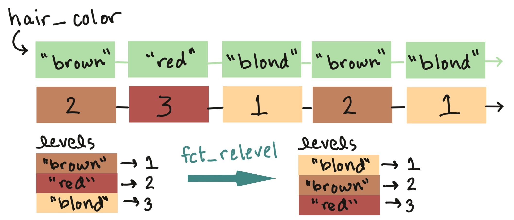
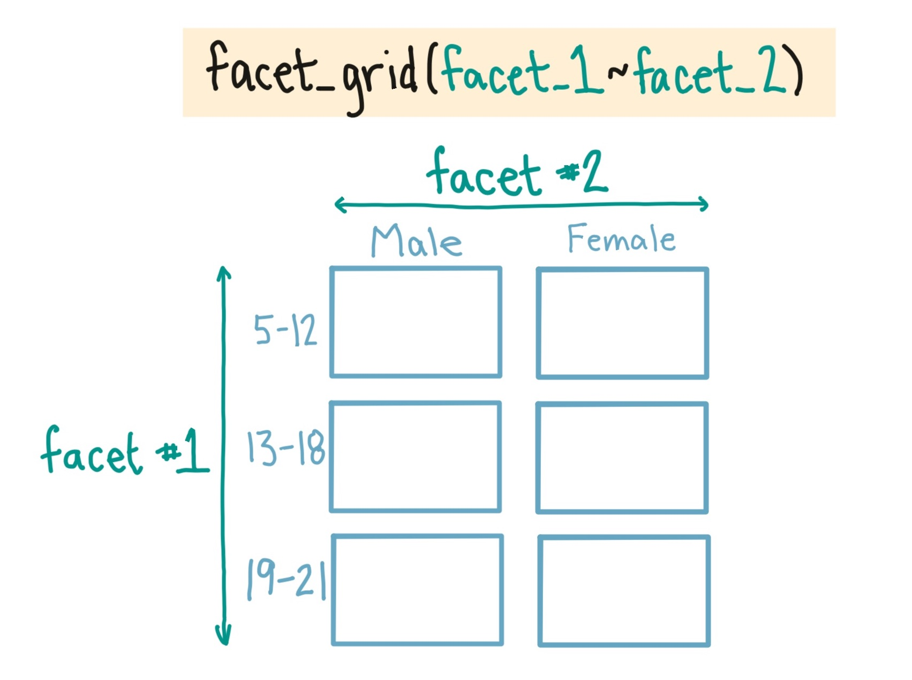
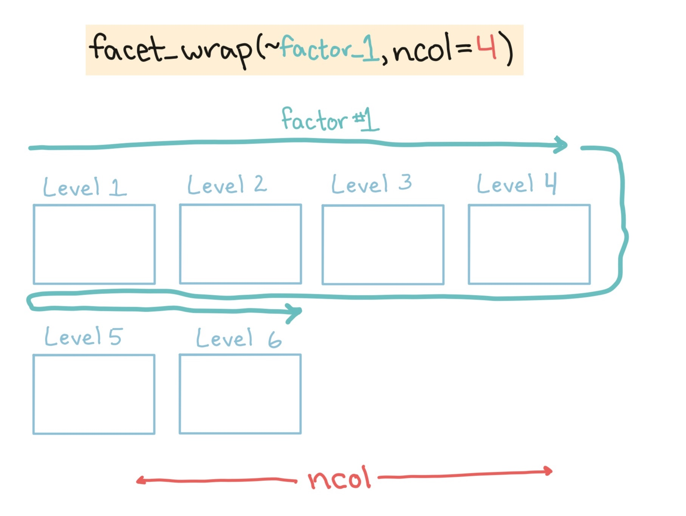

```{r echo = FALSE, message = FALSE, warning = FALSE}
library("knitr")
```

# Plot guidelines

## Guidelines for good plots

There are a number of very thoughtful books and articles about creating graphics that effectively communicate information. \medskip

Some of the authors I highly recommend (and from whose work I've pulled the guidelines for good graphics we'll talk about this week) are: 

- Edward Tufte
- Howard Wainer
- Stephen Few
- Nathan Yau

You should plan, in particular, to read *The Visual Display of Quantitative Information* by Edward Tufte before you graduate.

## Guidelines for good plots

This week, we'll focus on six guidelines for good graphics, based on the writings of these and other specialists in data display. \medskip

The guidelines are: 

1. Aim for high data density. 
2. Use clear, meaningful labels.
3. Provide useful references.
4. Highlight interesting aspects of the data. 
5. Make order meaningful. 
6. When possible, use small multiples.

## Packages for examples

For the examples, I'll use `dplyr` for data cleaning and, for plotting, the packages `ggplot2`, `gridExtra`, and `ggthemes`.

```{r message = FALSE}
library("dplyr")

library("ggplot2")
library("gridExtra")
library("ggthemes")
```

## Example data

You can load the data for today's examples with the following code: 

```{r message = FALSE}
library("faraway")
data("worldcup")
```

## Example data

```{r message = FALSE}
library("dlnm")
data("chicagoNMMAPS")
chic <- chicagoNMMAPS
chic_july <- chic %>%
  filter(month == 7 & year == 1995)
```
\footnotesize
```{r}
slice(chic_july, 1:3)
```

## High data density

Guideline 1: **Aim for high data density.** \bigskip

You should try to increase, as much as possible, the **data to ink ratio** in your graphs. This is the ratio of "ink" providing information to all ink used in the figure. \medskip

One way to think about this is that the only graphs you make that use up a lot of your printer's ink should be packed with information.

## High data density

Guideline 1: **Aim for high data density.** \bigskip

The two graphs below show the same information. Compare the amount of ink used in the left plot to the amount used in the right plot to see how graphs with the same information can have very different data densities. \bigskip

```{r echo = FALSE, fig.height = 3, fig.width = 8}
a <- ggplot(worldcup, aes(Position)) + 
        geom_bar() + coord_flip() + 
        ylab("Number of players") + 
        ggtitle("1. Lower data density")

ex <- group_by(worldcup, Position) %>%
        summarise(n = n())
b <- ggplot(ex, aes(x = n, y = Position)) + 
        geom_point() +  
        xlab("Number of players") +  ylab("") + 
        theme_few() + 
        xlim(0, 250) + 
        ggtitle("2. Higher data density")
grid.arrange(a, b, ncol = 2)
```

## High data density

Guideline 1: **Aim for high data density.** \bigskip

The two graphs below show another example of very different data densities in two plots showing the same information: \bigskip

```{r echo = FALSE, fig.height = 3, fig.width = 8}
a <- ggplot(chic_july, aes(x = date, y = death)) + 
        geom_area(fill = "black") + 
        xlab("Day in July 1995") + 
        ylab("All-cause deaths") + 
        ylim(0, 450) + 
        theme_excel() + 
        ggtitle("1. Lower data density")

b <- ggplot(chic_july, aes(x = as.POSIXlt(date)$mday,
                           y = death)) + 
        geom_line() + 
        xlab("Day in July 1995") + 
        ylab("All-cause deaths") + 
        ylim(0, 450) + 
        theme_tufte() + 
        ggtitle("2. Higher data density")

grid.arrange(a, b, ncol = 2)
```

## Data density

One quick way to increase data density in `ggplot2` is to change the *theme* for the plot. This essentially changes the "background" elements to a plot, including elements like the plot grid, background color, and the font used for labeling. \bigskip

Some themes come with `ggplot2`, including:

- `theme_classic`
- `theme_bw`
- `theme_minimal`
- `theme_void` 

The `ggthemes` packages has some excellent additional themes.

## Data density

The following slides show some examples of the effects of using different themes. The following code creates a plot of daily deaths in Chicago in July 1995:

```{r}
chic_plot <- ggplot(chic_july, aes(x = date, y = death))  +
        geom_point(color = "red")
```

Next, we can see how the graph looks with the default theme and with other themes.

## Themes

The left graph shows the graph with the default theme, while the right shows the effect of adding the black-and-white theme that comes with `ggplot2` as `theme_bw`:

```{r, fig.height = 3, fig.width = 8}
a <- chic_plot
b <- chic_plot + theme_bw()
grid.arrange(a, b, ncol = 2)
```

## Themes

Stephen Few theme: 

```{r, fig.height = 3, fig.width = 8}
a <- chic_plot
b <- chic_plot + theme_few()
grid.arrange(a, b, ncol = 2)
```

## Themes

Edward Tufte theme: 

```{r, fig.height = 3, fig.width = 8}
a <- chic_plot
b <- chic_plot + theme_tufte()
grid.arrange(a, b, ncol = 2)
```

## Themes

You can even use themes to add some questionable choices for different elements. For example, `ggthemes` includes an Excel theme: 

```{r, fig.height = 3, fig.width = 8}
a <- chic_plot
b <- chic_plot + theme_excel()
grid.arrange(a, b, ncol = 2)
```


## Meaningful labels

Guideline 2: **Use clear, meaningful labels.** \bigskip

Graph defaults often use abbreviations for axis labels and other labeling. Further, text labels can sometimes be aligned in a way that makes them hard to read. The plots below give an example of the same information shown without (left) and with (right) clear, meaningful labels. \bigskip

```{r echo = FALSE, fig.height = 3, fig.width = 8}
ex <- worldcup
ex$Position <- factor(ex$Position, 
                      levels = c("Defender",
                                 "Forward",
                                 "Goalkeeper",
                                 "Midfielder"),
                      labels = c("DF", "FW",
                                 "GK", "MF"))
a <- ggplot(ex, aes(Position)) + 
        geom_bar() + 
        ylab("Pls") + 
        xlab("Pos") +
        ggtitle("1. Murkier labels") + 
        theme(axis.text.x = 
                      element_text(angle = 90,
                                   vjust = 0.5,
                                   hjust=1))

b <- ggplot(worldcup, aes(Position)) + 
        geom_bar(fill = "lightgray") + coord_flip() + 
        ylab("Number of players") + xlab("") + 
        theme_tufte() + 
        ggtitle("2. Clearer labels")

grid.arrange(a, b, ncol = 2)
```

## Meaningful labels

There are a few strategies you can use to make labels clearer: 

- Add a `labs()` element to the plot, rather than relying on the column names in the original data. This can also be done with `scale` elements (e.g., `scale_x_continuous`), which give you more power to also make other changes to these scales.
- Include units of measurement in axis titles when relevant. If units are dollars or percent, check out the `scales` package, which allows you to add labels directly to axis elements by including arguments like `labels = percent` in `scale` elements.
- If the x-variable requires longer labels (player positions in the example above), consider flipping the coordinates, rather than abbreviating or rotating the labels. You can use `coord_flip` to do this.

## Meaningful labels

```{r fig.height = 3, fig.width = 4, out.width = "0.6\\textwidth", fig.align = "center"}
ggplot(worldcup, aes(Position)) + 
       geom_bar(fill = "lightgray") + coord_flip() + 
       labs(x = "", y = "Number of players") 
```


## References

Guideline 3: **Provide useful references.** \bigskip

Data is easier to interpret when you add references. For example, if you show what it typical, it helps viewers interpret how unusual outliers are. The graph below on the right has added shading showing the range of daily deaths in July in Chicago for 1990--1994 and 1996--2000, to clarify how unusual July 1995 was. \bigskip

```{r echo = FALSE, fig.height = 3, fig.width = 8}
chic_july <- subset(chic, month == 7 & year == 1995)
chic_july_ref <- filter(chic, month == 7 & 
                        year %in% c(1990:1994,
                                    1996:2000)) %>%
        summarise(mean = mean(death),
                  min = min(death),
                  max = max(death))
ref_points <- data.frame(date = c(-2, 33, 33, -2),
        death = c(rep(chic_july_ref$max, 2),
                  rep(chic_july_ref$min, 2)))
        
a <- ggplot(chic_july, aes(x = as.POSIXlt(date)$mday,
                           y = death)) + 
        geom_line() + 
        xlab("Day in July 1995") + 
        ylab("All-cause deaths") + 
        ylim(0, 450) + 
        theme_tufte() + 
        ggtitle("1. No reference")

b <- ggplot(chic_july, aes(x = as.POSIXlt(date)$mday,
                           y = death)) + 
        xlab("Day in July 1995") + 
        ylab("All-cause deaths") + 
        ylim(0, 450) + 
        theme_tufte() + 
        geom_polygon(aes(x = date, y = death), 
                     data = ref_points,
                     color = "lightgray", 
                     alpha = 0.1) + 
        geom_line() + 
        ggtitle("2. Reference")

grid.arrange(a, b, ncol = 2)
```

## References

Guideline 3: **Provide useful references.** \bigskip

Another useful way to add references is to add a linear or smooth fit to the data, to help clarify trends in the data. \bigskip

```{r echo = FALSE, message = FALSE, fig.width = 8, fig.height = 4}
ex <- subset(worldcup, Position == "Forward")
a <- ggplot(ex, aes(x = Passes, y = Shots)) + 
        geom_point(size = 1.5) + 
        theme_few()  + 
        ggtitle("1. No reference")

b <- ggplot(ex, aes(x = Passes, y = Shots)) + 
        geom_point(size = 1.5) + 
        theme_few()  + 
        geom_smooth() + 
        ggtitle("2. Reference")

grid.arrange(a, b, ncol = 2)
```

## References

You can use the function `geom_smooth` to add a smooth or linear reference line:

```{r fig.width = 3, fig.height = 3, out.width = "0.4\\textwidth", fig.align = "center"}
ggplot(worldcup, aes(x = Passes, y = Shots)) + 
  geom_point() + theme_few() + 
  geom_smooth(method = "lm")
```

## References

The most useful `geom_smooth` parameters to know are: 

- `method`: The default is to add a loess curve if the data includes less than 1000 points and a generalized additive model for 1000 points or more. However, you can change to show the fitted line from a linear model using `method = "lm"` or from a generalized linear model using `method = "glm"`.
- `span`: How wiggly or smooth the smooth line should be (smaller value: more wiggly; larger value: more smooth)
- `se`: TRUE or FALSE, indicating whether to include shading for 95% confidence intervals.
- `level`: Confidence level for confidence interval (e.g., `0.90` for 90% confidence intervals)

## References

Lines and polygons can also be useful for adding references. Useful geoms include: 

- `geom_hline`, `geom_vline`: Add a horizontal or vertical line
- `geom_abline`: Add a line with an intercept and slope
- `geom_polygon`: Add a filled polygon
- `geom_path`: Add an unfilled polygon

## References

```{r outwidth = "\\textwidth", fig.height = 3, fig.width = 6}
ggplot(data = chic, aes(x = date, y = death)) + 
  geom_point(color = "darkred", alpha = 0.3) + 
  geom_hline(yintercept = c(77, 139),
             linetype = 2)
```


## References

When adding these references: 

- If you want them to go behind the main points, add reference elements first, so they will be plotted under the data, instead of on top of it. 
- Use `alpha` to add transparency to these elements. 
- Use colors that are unobtrusive (e.g., grays)
- For lines, consider using non-solid line types (e.g., `linetype = 3`)

## In-course exercise 

We'll take a break now to do Sections 1 and 2 of the In-Course Exercise (Chapter 4).

## Highlighting

Guideline 3: **Highlight interesting aspects.** \bigskip

Consider adding elements to highlight noteworthy elements of the data. For example, in the graph on the right, the days of a major heat wave have been highlighted with a red line. \bigskip

```{r echo = FALSE, fig.height = 3, fig.width = 8}
chic_july <- subset(chic, month == 7 & year == 1995)
chic_july_ref <- filter(chic, month == 7 & 
                        year %in% c(1990:1994,
                                    1996:2000)) %>%
        summarise(mean = mean(death),
                  min = min(death),
                  max = max(death))
ref_points <- data.frame(date = c(-2, 33, 33, -2),
        death = c(rep(chic_july_ref$max, 2),
                  rep(chic_july_ref$min, 2)))
hw <- data.frame(date = c(12, 16, 16, 12),
                 death = c(425, 425, 0, 0))
        
a <- ggplot(chic_july, aes(x = as.POSIXlt(date)$mday,
                           y = death)) + 
        xlab("Day in July 1995") + 
        ylab("All-cause deaths") + 
        ylim(0, 450) + 
        theme_tufte() + 
        geom_polygon(aes(x = date, y = death), 
                     data = ref_points,
                     color = "lightgray", 
                     alpha = 0.1) + 
        geom_line() + 
        ggtitle("1. No highlighting")

b <- ggplot(chic_july, aes(x = as.POSIXlt(date)$mday,
                           y = death)) + 
        xlab("Day in July 1995") + 
        ylab("All-cause deaths") + 
        ylim(0, 450) + 
        theme_tufte() + 
        geom_polygon(aes(x = date, y = death), 
                     data = ref_points,
                     color = "lightgray", 
                     alpha = 0.1) + 
        geom_line(aes(x = date, y = death),
                  data = hw[1:2, ],
                     color = "red",
                  size = 2) +
        geom_line() + 
        ggtitle("2. With highlighting")

grid.arrange(a, b, ncol = 2)
```

## Highlighting

Guideline 3: **Highlight interesting aspects.** \bigskip

In the below graphs, the names of the players with the most shots and passes have been added to highlight these unusual points. \bigskip

```{r echo = FALSE, message = FALSE, fig.width = 8, fig.height = 4}
ex <- subset(worldcup, Position == "Forward")
a <- ggplot(ex, aes(x = Passes, y = Shots)) + 
        geom_point(size = 1.5, alpha = 0.5) + 
        theme_few()  + 
        ggtitle("1. No highlighting")

most_shots <- ex[which.max(ex$Shots), ]
most_passes <- ex[which.max(ex$Passes), ]
b <- ggplot(ex, aes(x = Passes, y = Shots)) + 
        geom_point(size = 1.5, alpha = 0.5) + 
        theme_few()  + 
        ggtitle("2. Highlighting") + 
        geom_text(data = most_shots,
           label = paste(rownames(most_shots), ",",
                                most_shots$Team, " "),
                  colour = "blue", size = 3,
                  hjust = 1, vjust = 0.4) + 
        geom_text(data = most_passes,
           label = paste(rownames(most_passes), ",",
                                most_passes$Team, " "),
                  colour = "blue", size = 3,
                  hjust = 1, vjust = 0.4) 

grid.arrange(a, b, ncol = 2)
```

## Highlighting

One helpful way to annotate is with text, using `geom_text()`. For this, you'll first need to create a dataframe with the hottest day in the data:

```{r}
hottest_day <- chic_july %>%
  filter(temp == max(temp))
hottest_day %>% select(date:dow)
```

## Highlighting

```{r fig.height = 3, fig.width = 4, out.width = "0.7\\textwidth", fig.align = "center"}
ggplot(data = chic_july, aes(x = date, y = death)) + 
  geom_point(color = "red") + 
  geom_text(data = hottest_day, 
            label = "Max", size = 3)
```

## Highlighting

With `geom_text`, you'll often want to use position adjustment (the `position` parameter) to move the text so it won't be right on top of the data points: 

\footnotesize

```{r fig.height = 3, fig.width = 4, out.width = "0.5\\textwidth", fig.align = "center", message = FALSE}
ggplot(data = chic_july, aes(x = date, y = death)) + 
  geom_point(color = "red") + 
  geom_text(data = hottest_day, 
            label = "Max", size = 3, 
            hjust = 0, vjust = -1)
```


## Highlighting

You can also use lines to highlight. For this, it is often useful to create a new dataframe with data for the reference. To add a line for the Chicago heat wave, I've added a dataframe called `hw` with the relevant date range. I'm setting the y-value to be high enough (425) to ensure the line will be placed above the mortality data. 

```{r message = FALSE, warning = FALSE}
library(lubridate)
hw <- data.frame(date = c(ymd("1995-07-12"), 
                          ymd("1995-07-16")),
                 death = c(425, 425))
        
b <- ggplot(data = chic_july, aes(x = date, y = death)) + 
        geom_point(color = "red") + 
        geom_line(data = hw,
                  aes(x = date, y = death),
                  size = 2)
```

-----

```{r fig.height = 3, fig.width = 4, out.width = "0.7\\textwidth", fig.align = "center"}
b
```

## Order

Guideline 4: **Make order meaningful.** \bigskip

You can make the ranking of data clearer from a graph by using order to show rank. Often, factor or categorical variables are ordered by something that is not interesting, like alphabetical order. 

## Order

Guideline 4: **Make order meaningful.** \bigskip

```{r echo = FALSE, fig.width = 8, fig.height = 5}
ex <- group_by(worldcup, Team) %>%
        summarise(mean_time = mean(Time))

a <- ggplot(ex, aes(x = mean_time, y = Team)) + 
        geom_point() + 
        theme_few() + 
        xlab("Mean time per player (minutes)") + ylab("") + 
        ggtitle("1. Alphabetical order")

ex2 <- arrange(ex, mean_time) %>%
        mutate(Team = factor(Team, levels = Team))
b <- ggplot(ex2, aes(x = mean_time, y = Team)) + 
        geom_point() + 
        theme_few() + 
        xlab("Mean time per player (minutes)") +  ylab("") + 
        ggtitle("2. Meaningful order")

grid.arrange(a, b, ncol = 2)
```

## Order

```{r echo = FALSE, out.width = "0.7\\textwidth", fig.align = "center"}

```


## Order

You can re-order factor variables in a graph by resetting the factor using several 
functions from the `forcats` package. 

The simplest is `fct_relevel`, which lets you change the levels "by hand". 

See the "factors" cheatsheet for more `forcats` functions.

## Changing factor levels

```{r echo = FALSE, out.width = "\\textwidth", fig.align = "center"}

```

## Order

> "And if you think that I'm going to miss even one
opportunity to
pick up half-a-mile boat speed, you're absolutely out of your mind. When it
costs us
nothing, when we give up nothing?! You're out of your mind." \newline
Bruno, \underline{The West Wing}, "The Indians in the Lobby"

## Small multiples

Guideline 5: **When possible, use small multiples.** \bigskip

*Small multiples* are graphs that use many small plots showing the same thing for different facets of the data. For example, instead of using color in a single plot to show data for males and females, you could use two small plots, one each for males and females. \bigskip

Typically, in small multiples, all plots with use the same x- and y-axes. This makes it easier to compare across plots, and it also allows you to save room by limiting axis annotation.

------

```{r echo = FALSE, message = FALSE, fig.height = 6, fig.width = 8}
ex <- subset(worldcup, Position %in% c("Forward",
                                       "Midfielder"))
ex2 <- group_by(ex, Team) %>%
        summarise(mean = mean(Shots)) %>%
        arrange(desc(mean))
ex$Team <- factor(ex$Team, 
                      levels = ex2$Team)
a <- ggplot(ex, aes(x = Time, y = Shots)) + 
        geom_point() + 
        theme_few() + 
        facet_wrap(~ Team, ncol = 8) 
a
```

## Small multiples

You can use the `facet` functions to create small multiples. This separates the graph into several small graphs, one for each level of a factor. \bigskip

The `facet` functions are: 

- `facet_grid()`
- `facet_wrap()`


## Small multiples

The `facet_grid` function can facet by one or two variables. One will be shown by rows, and one by columns:

```{r eval = FALSE}
## Generic code
facet_grid([factor for rows] ~ [factor for columns])
```

The `facet_wrap()` function can only facet by one variable, but it can "wrap" the small graphs for that variable, so the don't all have to be in one row or column:

```{r eval = FALSE}
## Generic code
facet_wrap(~ [factor for faceting], ncol = [# of columns])
```

## Small multiples

```{r echo = FALSE, out.width = "0.8\\textwidth", fig.align = "center"}

```

## Small multiples

```{r echo = FALSE, out.width = "0.9\\textwidth", fig.align = "center"}

```

## Small multiples

For example, to create small multiples of ozone concentration by day of week for the Chicago data, you can run:

```{r message = FALSE, warning = FALSE, fig.height = 3, fig.width = 6, out.width = "0.95\\textwidth"}
chic %>% 
  ggplot(aes(x = o3)) + 
  geom_histogram(fill = "skyblue1", color = "black") +
  facet_wrap(~ dow)
```

## Small multiples

To change the order of the facets, change the order of the factor levels for the factor you're using to facet. For example, to move weekend days together, you could run:

\footnotesize

```{r message = FALSE, warning = FALSE, fig.height = 3, fig.width = 6, out.width = "0.95\\textwidth"}
library(forcats)
chic %>% 
  mutate(dow = fct_relevel(dow, "Saturday")) %>% 
  ggplot(aes(x = o3)) + 
  geom_histogram(fill = "skyblue1", color = "black") +
  facet_wrap(~ dow)
```

## In-course exercise 

We'll now take a break to do Section 3 of the In-Course Exercise (Chapter 4).

# Advanced customization

## Scales

There are a number of different functions for adjusting scales. These follow the following convention: 

```{r eval = FALSE}
## Generic code
scale_[aesthetic]_[vector type]
```

For example, to adjust the x-axis scale for a continuous variable, you'd use `scale_x_continuous`. \medskip

You can use a `scale` function for an axis to change things like the axis label (which you could also change with `xlab` or `ylab`) as well as position and labeling of breaks.

## Scales

For example, here is the default for plotting time versus passes for the `worldcup` dataset, with the number of shots taken shown by size and position shown by color:

```{r fig.width = 7, fig.height = 4, out.width = "0.8\\textwidth", fig.align = "center"}
ggplot(worldcup, aes(x = Time, y = Passes,
                     color = Position, size = Shots)) + 
  geom_point(alpha = 0.5)
```

## Scales

```{r fig.width = 7, fig.height = 4, out.width = "0.8\\textwidth", fig.align = "center"}
ggplot(worldcup, aes(x = Time, y = Passes,
                     color = Position, size = Shots)) + 
  geom_point(alpha = 0.5) + 
  scale_x_continuous(name = "Time played (minutes)", 
                     breaks = 90 * c(2, 4, 6),
                     minor_breaks = 90 * c(1, 3, 5))
```

## Scales

Parameters you might find useful in `scale` functions include: 

```{r echo = FALSE}
scale_params <- data.frame(param = c("name",
                                     "breaks",
                                     "minor_breaks",
                                     "labels",
                                     "limits"),
                           desc = c("Label or legend name",
                                    "Vector of break points",
                                    "Vector of minor break points",
                                    "Labels to use for each break",
                                    "Limits to the range of the axis"))
knitr::kable(scale_params, col.names = c("Parameter", "Description"))
```

## Scales

For dates, you can use `scale` functions like `scale_x_date` and `scale_x_datetime`. For example, here's a plot of deaths in Chicago in July 1995 using default values for the x-axis: 

```{r fig.width = 5, fig.height = 2, out.width = "0.9\\textwidth", fig.align = "center"}
ggplot(chic_july, aes(x = date, y = death)) + 
  geom_line() 
```

## Scales

And here's an example of changing the formatting and name of the x-axis:

```{r fig.width = 5, fig.height = 2, out.width = "0.9\\textwidth", fig.align = "center"}
ggplot(chic_july, aes(x = date, y = death)) + 
  geom_line() + 
  scale_x_date(name = "Date in July 1995",
               date_labels = "%m-%d")
```

## Scales

You can also use the `scale` functions to transform an axis. For example, to show the Chicago plot with "deaths" on a log scale, you can run:

```{r fig.width = 5, fig.height = 2, out.width = "0.9\\textwidth", fig.align = "center"}
ggplot(chic_july, aes(x = date, y = death)) + 
  geom_line() +
  scale_y_log10()
```

## Scales

For colors and fills, the conventions for the names of the `scale` functions can vary. \medskip 

For example, to adjust the color scale when you're mapping a discrete variable (i.e., categorical, like gender or animal breed) to color, you'd use `scale_color_hue`. To adjust the color scale for a continuous variable, like age, you'll use `scale_color_gradient`.

## Scales

For any color scales, consider starting with `brewer` first (e.g., `scale_color_brewer`).  \medskip

Scale functions from `brewer` allow you to set colors using different palettes. You can explore these palettes at http://colorbrewer2.org/.

## Scales

The Brewer palettes fall into three categories: sequential, divergent, and qualitative. You should use sequential or divergent for continuous data and qualitative for categorical data. Use `display.brewer.pal` to show the palette for a given number of colors.

```{r out.width = "0.32\\textwidth", fig.show='hold', fig.height = 3, fig.width = 4}
library("RColorBrewer")
display.brewer.pal(name = "Set1", n = 8)
display.brewer.pal(name = "PRGn", n = 8)
display.brewer.pal(name = "PuBuGn", n = 8)
```


## Scales

Use the `palette` argument within a `scales` function to customize the palette:

```{r fig.width = 8, fig.height = 2, out.width = "\\textwidth"}
a <- ggplot(data.frame(x = 1:5, y = rnorm(5),
                       group = letters[1:5]),
            aes(x = x, y = y, color = group)) + 
  geom_point()
b <- a + scale_color_brewer(palette = "Set1")
c <- a + scale_color_brewer(palette = "Pastel2") + 
  theme_dark()
grid.arrange(a, b, c, ncol = 3)
```

## Scales

```{r fig.width = 7, fig.height = 4, out.width = "0.8\\textwidth", fig.align = "center"}
ggplot(worldcup, aes(x = Time, y = Passes,
                     color = Position, size = Shots)) + 
  geom_point(alpha = 0.5) + 
  scale_color_brewer(palette = "Dark2",
                     name = "Player position")
```

## Scales

You can also set colors manually:

```{r fig.width = 7, fig.height = 4, out.width = "0.8\\textwidth", fig.align = "center"}
ggplot(worldcup, aes(x = Time, y = Passes,
                     color = Position, size = Shots)) + 
  geom_point(alpha = 0.5) + 
  scale_color_manual(values = c("blue", "red", 
                                "darkgreen", "darkgray"))
```

## Excellent references

- Chapter 3 of "R for Data Science", http://r4ds.had.co.nz/

Some excellent further references for plotting are:

- R Graphics Cookbook (book and website)
- Google images

\bigskip

For more technical details about plotting in R:

- ggplot2: Elegant Graphics for Data Analysis, Hadley Wickham
- R Graphics, Paul Murrell
