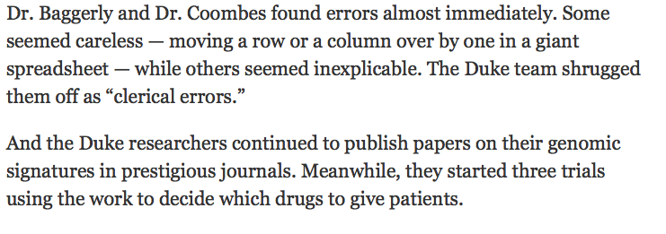
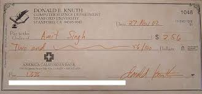
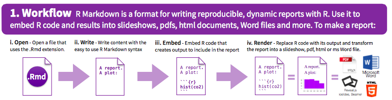

```{r echo = FALSE, message = FALSE, warning = FALSE}
knitr::knit_hooks$set(source = function(x, options){
  if (!is.null(options$verbatim) && options$verbatim){
    opts = gsub(",\\s*verbatim\\s*=\\s*TRUE\\s*", "", options$params.src)
    bef = sprintf('\n\n    ```{r %s}\n', opts, "\n")
    stringr::str_c(
      bef, 
      knitr:::indent_block(paste(x, collapse = '\n'), "    "), 
      "\n    ```\n"
    )
  } else {
    stringr::str_c("\n\n```", tolower(options$engine), "\n", 
      paste(x, collapse = '\n'), "\n```\n\n"
    )
  }
})
library(faraway)
data(nepali)
```

# Reproducible research

## What is reproducible research?

**Reproducible**: Could someone else re-do your entire analysis?

- Data available
- All code for cleaning raw data
- All code and software (specific versions, packages) for analysis

The *Methods* section of the future...

## Why is it important?

Some advantages of making your research reproducible are:

- You can (easily) figure out what you did six months from now.
- You can (easily) make adjustments to code or data, even early in the process, and re-run all analysis.
- When you're ready to publish, you can (easily) do a last double-check of your full analysis, from cleaning the raw data through generating figures and tables for the paper.
- You can pass along or share a project with others.
- You can give useful code examples to people who want to extend your research.

## Why is it important?

A cautionary example (Source: The New York Times-- link below): \bigskip 

```{r echo = FALSE, out.width = "0.9\\textwidth"}

```

\medskip

Read more from: 

- [The Economist](http://www.economist.com/node/21528593)
- [The New York Times](http://www.nytimes.com/2011/07/08/health/research/08genes.html?_r=0)
- [Simply Statistics](http://simplystatistics.org/2012/02/27/the-duke-saga-starter-set/)


## Some steps to making research reproducible

- All your raw data should be saved in the project directory. You should have clear documentation on the source of all this data.
- Scripts should be included with all the code used to clean this data into the data set(s) used for final analyses and to create any figures and tables.
- You should include details on the versions of any software used in analysis (for R, this includes the version of R as well as versions of all packages used). 
- If possible, there so be no "by hand" steps used in the analysis; instead, all steps should be done using code saved in scripts. For example, you should use a script to clean data, rather than cleaning it by hand in Excel. If any "non-scriptable" steps are unavoidable, you should very clearly document those steps. 

## Tools for research reproducible

There are several software tools that can help you improve the reproducibility of your research: 

- **`knitr`**: Create files that include both your code and text. These can be compiled to create final reports and papers. They keep code within the final file for the report.
- **`knitr` complements**: Create fancier tables and figures within RMarkdown documents. Packages include `tikzDevice`, `animate`, `xtables`, and `pander`.
- **`packrat`**: Save versions of each package used for the analysis, then load those package versions when code is run again in the future.

Today we will focus on using `knitr` and RMarkdown files. 

# Markdown

## Markup languages

To write RMarkdown files, you need to understand what markup languages like Markdown are and how they work. \bigskip

In Word, you can add formatting using buttons and keyboard shortcuts (e.g., "Ctrl-B" for bold). The file saves the words you type. It also saves the formatting, but you see the final output, rather than the formatting markup, when you edit the file (WYSIWYG-- what you see is what you get). \bigskip

In markup languages, you markup the document directly to show what formatting the final version should have (e.g., you type `**bold**` in the file to end up with a document with **bold**).

## Markup languages

Examples of markup languages include:

- HTML (HyperText Markup Language)
- LaTex
- Markdown (a "lightweight" markup language)

## Markup languages

For example, here's some marked-up HTML code from CSU's website: \bigskip

```{r echo = FALSE, out.width = "\\textwidth"}
knitr::include_graphics("../figures/example_html.png")
```

## Markup languages

And here's how it looks when it's rendered by a web browser: \bigskip

```{r echo = FALSE, out.width = "\\textwidth"}
knitr::include_graphics("../figures/example_output.png")
```

## Markdown conventions

To write a file in Markdown, you'll need to learn the conventions for creating formatting. This table shows what you would need to write in a flat file for some common formatting choices: \medskip

```{r echo = FALSE}
markdown_format <- data.frame(Code = c("`**text**`",
                                       "`*text*`",
                                       "`[text](www.google.com)`", 
                                       "`# text`", 
                                       "`## text`"),
                              Rendering = c("**text**",
                                            "*text*",
                                            "[text](www.google.com)",
                                            "",
                                            ""),
                              Explanation = c("boldface",
                                              "italicized",
                                              "hyperlink",
                                              "first-level header",
                                              "second-level header"))
knitr::kable(markdown_format)
```


## Markdown conventions

Some other simple things you can do:

- Lists (ordered or bulleted)
- Equations
- Tables
- Figures from file
- Block quotes
- Superscripts

\bigskip

For more Markdown conventions, see [RStudio's R Markdown Reference Guide](https://www.rstudio.com/wp-content/uploads/2015/03/rmarkdown-reference.pdf) (link also available through "Help" in RStudio). 


# Literate programming in R

## Literate programming

**Literate programming**, an idea developed by Donald Knuth, mixes code that can be executed with regular text. \medskip 

```{r echo = FALSE, out.width = "0.9\\textwidth"}

```

\medskip

The files you create can then be rendered, to run any embedded code. The final output will have results from your code and the regular text. 

## Literate programming with `knitr`

The `knitr` package can be used for literate programming in R. \bigskip

```{r echo = FALSE, out.width = "\\textwidth"}

```

(Source: RMarkdown Cheatsheet, RStudio) \bigskip

In essence, `knitr` allows you to write an R Markdown file that can be rendered into a pdf, Word, or HTML document.

## Basics

- To open a new RMarkdown file, go to "File" -> "New File" -> "RMarkdown..." -> for now, chose a "Document" in "HTML" format.
- This will open a new R Markdown file in RStudio. The file extension for RMarkdown files is ".Rmd". 
- The new file comes with some example code and text. You can run the file as-is to try out the example. You will ultimately delete this example code and text and replace it with your own.
- Once you "knit" the R Markdown file, R will render an HTML file with the output. This is automatically saved in the same directory where you saved your .Rmd file.
- Write everything besides R code using Markdown syntax.

## Chunk syntax

To include R code in an RMarkdown document, separate off the code chunk using the following syntax:

    `r ''````{r}
    my_vec <- 1:10
    ```

## Naming chunks

You can specify a name for each chunk, if you'd like, by including it after "r" when you begin your chunk. \medskip

For example, to give the name `load_nepali` to a code chunk that loads the `nepali` dataset, specify that name in the start of the code chunk: \bigskip

    `r ''````{r load_nepali}
    library(faraway)
    data(nepali)
    ```

\bigskip 

Some tips: 

- Chunk names must be unique across a document.
- Any chunks you don't name are given numbers by `knitr`.

## Naming chunks

You do not have to name each chunk. However, there are some advantages: 

- It will be easier to find any errors.  
- You can use the chunk labels in referencing for figure labels. 
- You can reference chunks later by name.

## Chunk options

You can add options when you start a chunk. Many of these options can be set as TRUE / FALSE and include:

```{r echo = FALSE}
chunk_opts <- data.frame(Option = c("`echo`",
                                    "`eval`",
                                    "`messages`",
                                    "`warnings`",
                                    "`include`"),
                         Action = c("Print out the R code?",
                                    "Run the R code?",
                                    "Print out messages?",
                                    "Print out warnings?",
                                    "If FALSE, run code, but don't print code or results"))
knitr::kable(chunk_opts)
```

## Chunk options

Other chunk options take values other than TRUE / FALSE. Some you might want to include are:

```{r echo = FALSE}
chunk_opts2 <- data.frame(Option = c("`results`",
                                     "`fig.width`",
                                     "`fig.height`"),
                          Action = c("How to print results (e.g., `hide` runs the code, but doesn't print the results)",
                                     "Width to print your figure, in inches (e.g., `fig.width = 4`)",
                                     "Height to print your figure"))
pander::pander(chunk_opts2, split.cells = c(10, 50),
               justify = c("center", "left"))
```

## Chunk options

Add these options in the opening brackets and separate multiple ones with commas:

    `r ''````{r  messages = FALSE, echo = FALSE}
    nepali[1, 1:3]
    ```

\bigskip 

We will go over other options later, once you've gotten the chance to try writting R Markdown files.

## Global options

You can set "global" options at the beginning of the document. This will create new defaults for all of the chunks in the document. \bigskip

For example, if you want `echo`, `warning`, and `message` to be `FALSE` by default in all code chunks, you can run: \bigskip

    `r ''````{r  global_options}
    knitr::opts_chunk$set(echo = FALSE, message = FALSE,
      warning = FALSE)
    ```

## Global options

Options that you set specifically for a chunk will take precedence over global options. \bigskip

For example, running a document with:

    `r ''````{r  global_options}
    knitr::opts_chunk$set(echo = FALSE, message = FALSE,
      warning = FALSE)
    ```


    `r ''````{r  check_nepali, echo = TRUE}
    head(nepali, 1)
    ```
    
would print the code for the `check_nepali` chunk.

## Inline code

You can also include R output directly in your text ("inline") using backticks: \bigskip

There are `` `r '\x60r nrow(nepali)\x60'` `` observations in the `nepali` data set. The average age is `` `r '\x60r mean(nepali$age, na.rm = TRUE)\x60'` `` months.

\bigskip

Once the file is rendered, this gives: \bigskip

There are `r nrow(nepali)` observations in the `nepali` data set. The average age is `r mean(nepali$age, na.rm = TRUE)` months.

# Working with Rmd files

## R Markdown tips

Here are two tips that will help you diagnose some problems rendering R Markdown files:

- Be sure to save your R Markdown file before you run it.
- All the code in the file will run "from scratch"-- as if you just opened a new R session.
- The code will run using, as a working directory, the directory where you saved the R Markdown file.

## Running code

You'll want to try out pieces of your code as you write an R Markdown document. There are a few ways you can do that:

- You can run code in chunks just like you can run code from a script (Ctrl-Return or the "Run" button). 
- You can run all the code in a chunk (or all the code in all chunks) using the different options under the "Run" button in RStudio. 
- All the "Run" options have keyboard shortcuts, so you can use those.

## Compiling to other formats

You can compile R Markdown documents to other formats:

- Word
- Pdf (requires that you've installed "Tex" on your computer.)
- Slides (ioslides)

\bigskip

Click the button to the right of "Knit" to see different options for rendering on your computer. 

## RPubs

You can freely post your RMarkdown documents at [RPubs](http://rpubs.com). \bigskip

If you want to post to RPubs, you need to create an account. Once you do, you can click the "Publish" button on the window that pops up with your compiled file. \bigskip

RPubs can also be a great place to look for interesting example code, although it sometimes can be pretty overwhelmed with MOOC homework. 

## Find out more

Here are two good how-to books on reproducible research in R (our library has both):

- *Reproducible Research with R and RStudio*, Christopher Gandrud
- *Dynamic Documents with R and knitr*, Yihui Xie

# R Style

## Why is style important?

**R style guidelines** provide rules for how to format code in an R script. \medskip

Some people develop their own style as they learn to code. However, it is easy to get in the habit of following style guidelines, and they offer some important advantages: \medskip

- Clean code is easier to read and interpret later.
- It's easier to catch and fix mistakes when code is clear.
- Others can more easily follow and adapt your code if it's clean.
- Some style guidelines will help prevent possible problems (e.g., avoiding `.` in function names).

## Style guidelines

For this course, we will use R style guidelines from two sources: 

- [Google's R style guidelines](https://google.github.io/styleguide/Rguide.xml)
- [Hadley Wickham's R style guidelines](http://adv-r.had.co.nz/Style.html)

These two sets of style guidelines are very similar. 

## Style guideline review

Hear are a few guidelines we've already covered in class:

- Use `<-`, not `=`, for assignment.
- Guidelines for naming objects:
    + All lowercase letters or numbers
    + Use underscore (`_`) to separate words, not camelCase or a dot (`.`) (this differs for Google and Wickhmam style guides)
    + Have some consistent names to use for "throw-away" objects (e.g., `df`, `ex`, `a`, `b`)
- Make names meaningful
    + Descriptive names for R scripts ("random_group_assignment.R")
    + Nouns for objects (`todays_groups` for an object with group assignments)
    + Verbs for functions (`make_groups` for the function to assign groups)

## Line length

Google: **Keep lines to 80 characters or less** \medskip

To set your script pane to be limited to 80 characters, go to "RStudio" -> "Preferences" -> "Code" -> "Display", and set "Margin Column" to 80.

```{r eval = FALSE}
# Do
my_df <- data.frame(n = 1:3,
                    letter = c("a", "b", "c"),
                    cap_letter = c("A", "B", "C"))

# Don't
my_df <- data.frame(n = 1:3, letter = c("a", "b", "c"), cap_letter = c("A", "B", "C"))
```

This guideline helps ensure that your code is formatted in a way that you can see all of the code without scrolling horizontally (left and right).

## Spacing

- Binary operators (e.g., `<-`, `+`, `-`) should have a space on either side
- A comma should have a space after it, but not before.
- Colons should not have a space on either side. 
- Put spaces before and after `=` when assigning parameter arguments

```{r eval = FALSE}
# Do
shots_per_min <- worldcup$Shots / worldcup$Time
#Don't 
shots_per_min<-worldcup$Shots/worldcup$Time

#Do
ave_time <- mean(worldcup[1:10 , "Time"])
#Don't
ave_time<-mean(worldcup[1 : 10 ,"Time"])
```

## Semicolons

Although you can use a semicolon to put two lines of code on the same line, you should avoid it. 

```{r eval = FALSE}
# Do
a <- 1:10
b <- 3

# Don't
a <- 1:10; b <- 3
```

## Commenting

- For a comment on its own line, use `#`. Follow with a space, then the comment. 
- You can put a short comment at the end of a line of R code. In this case, put two spaces after the end of the code, one `#`, and one more space before the comment.
- If it helps make it easier to read your code, separate sections using a comment character followed by many hyphens (e.g., `#------------`). Anything after the comment character is "muted". 

```{r eval = FALSE}
# Read in health data ---------------------------

# Clean exposure data ---------------------------
```

## Indentation

Google:

- Within function calls, line up new lines with first letter after opening parenthesis for parameters to function calls:

Example:

```{r eval = FALSE}
# Relabel sex variable
nepali$sex <- factor(nepali$sex, 
                     levels = c(1, 2),
                     labels = c("Male", "Female"))
```

## Code grouping

- Group related pieces of code together. 
- Separate blocks of code by empty spaces.

```{r eval = TRUE}
# Load data
library(faraway)
data(nepali)

# Relabel sex variable
nepali$sex <- factor(nepali$sex, 
                     levels = c(1, 2),
                     labels = c("Male", "Female"))
```

Note that this grouping often happens naturally when using tidyverse functions, since they encourage piping (`%>%` and `+`).

## Broader guidelines

- Omit needless code.
- Don't repeat yourself.

We'll learn more about satisfying these guidelines when we talk about writing your own functions in the next part of the class.

# More with knitr

## Equations in `knitr`

You can write equations in RMarkdown documents by setting them apart with dollar signs (`$`). For an equation on a line by itself (**display equation**), you two `$`s before and after the equation, on separate lines, then use LaTex syntax for writing the equations. \bigskip

To help with this, you may want to use this [LaTex math cheat sheet.](http://reu.dimacs.rutgers.edu/Symbols.pdf). You may also find an online LaTex equation editor like [Codecogs.com](https://www.codecogs.com/latex/eqneditor.php) helpful.\bigskip

Note: Equations denoted this way will always compile for pdf documents, but won't always come through on Markdown files (for example, GitHub won't compile these math).  

## Equations in `knitr`

For example, writing this in your R Markdown file: 

    $$
    E(Y_{t}) \sim \beta_{0} + \beta_{1}X_{1}
    $$

will result in this rendered equation:

$$
E(Y_{t}) \sim \beta_{0} + \beta_{1}X_{1}
$$

## Equations in `knitr`

To put math within a sentence (**inline equation**), just use one `$` on either side of the math. For example, writing this in a R Markdown file:

    "We are trying to model $E(Y_{t})$."

The rendered document will show up as: \medskip

"We are trying to model $E(Y_{t})$."

## Figures

You can include not only figures that you create with R, but also figures that you have saved on your computer. \bigskip

The best way to do that is with the `include_graphics` function in `knitr`:

```{r out.width = "0.3\\textwidth", fig.align = "center"}
library(knitr)
include_graphics("../figures/CSU_ram.png")
```

## Figures

```{r eval = FALSE}
library(knitr)
include_graphics("../figures/CSU_ram.png")
```

This example would include a figure with the filename "MyFigure.png" that is saved in the "figures" sub-directory of the parent directory of the directory where your .Rmd is saved. \bigskip

Don't forget that you will need to give an absolute pathway or the relative pathway **from the directory where the .Rmd file is saved**.

## Saving graphics files

You can save figures that you create in R. Typically, you won't need to save figures for an R Markdown file, since you can include figure code directly. \bigskip

However, you will sometimes want to save a figure from a script. You have two options:

- Use the "Export" choice in RStudio
- Write code to export the figure in your R script

To make your research more reproducible, use the second choice.

## Saving graphics files

To use code export a figure you created in R, take three steps: 

1. Open a graphics device (e.g., `pdf("MyFile.pdf")`).
2. Write the code to print your plot. 
3. Close the graphics device using `dev.off()`.

## Saving graphics files

For example, the following code would save a scatterplot of time versus passes as a pdf named "MyFigure" in the "figures" subdirectory of the current working directory:

```{r eval = FALSE}
pdf("figures/MyFigure.pdf", width = 8, height = 6)
ggplot(worldcup, aes(x = Time, y = Passes)) + 
        geom_point(aes(color = Position)) + 
        theme_bw()
dev.off()
```

If you create multiple plots before you close the device, they'll all save to different pages of the same pdf file. 

## Saving graphics files

You can open a number of different graphics devices. Here are some of the functions you can use to open graphics devices: 

- `pdf`
- `png`
- `bmp`
- `jpeg`
- `tiff`
- `svg`

## Saving graphics files

You will use a device-specific function to open a graphics device (e.g., `pdf`). However, you will always close these devices with `dev.off`. \bigskip

Most of the functions to open graphics devices include parameters like `height` and `width`. These can be used to specify the size of the output figure. The units for these depend on the device (e.g., inches for `pdf`, pixels by default for `png`). Use the helpfile for the function to determine these details. 

## `kable` 

If you want to create a nice, formatted table from an R dataframe, you can do that using `kable` from the `knitr` package. \bigskip

```{r}
my.df <- data.frame(letters = c("a", "b", "c"),
                numbers = 1:3)
kable(my.df)
```

## `kable` 

There are a few options for the `kable` function:

```{r echo = FALSE, results = 'asis'}
kable_opts <- data.frame(arg = c("`colnames`",
                                 "`align`",
                                 "`caption`",
                                 "`digits`"),
                         expl = c("Column names (default: column name in the dataframe)",
                                  "A vector giving the alignment for each column ('l', 'c', 'r')",
                                  "Table caption",
                                  "Number of digits to round to. If you want to round columns different amounts, use a vector with one element for each column."))
pander::pandoc.table(kable_opts, split.cells = c(10, 50),
               justify = "rl", style = "multiline")
```

## `kable` 

```{r}
my.df <- data.frame(letters = c("a", "b", "c"),
                numbers = rnorm(3))
kable(my.df, digits = 2, align = c("r", "c"),
      caption = "My new table", 
      col.names = c("First 3 letters", 
                    "First 3 numbers"))
```

## `xtable`, `pander`

From Yihui:

>"**Want more features?** No, that is all I have. You should turn to other packages for help. I'm not
going to reinvent their wheels."

If you want to do fancier tables, you may want to explore the `xtable` and `pander` packages. \bigskip 

These might both be more effective when compiling to pdf, rather than html.
