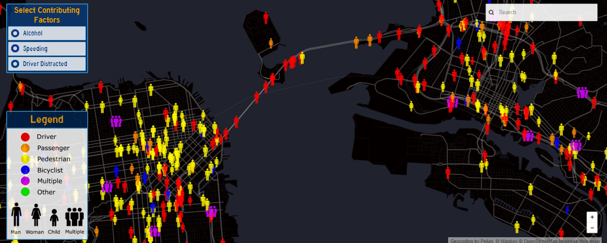

```{r echo = FALSE, message = FALSE, warning = FALSE}
library(tidyverse)
library(knitr)
library(faraway)
data(worldcup)
data(nepali)
```

# Final group project

## Final group project

- Group size: Three or four students
- If you'd like, you may form your own groups. For any students who do not form a group, I will randomly assign groups (or add on to groups that have started).

## Final group project

Important dates: 

- October 17: Due date for creating groups. Email me your group members.
- October 24: Due date (by start of class) for a two-paragraph summary of the question you'd like to answer, including some ideas on where you might find the data. 
- December 5: First submission of written report will be due.
- Week of December 12: Final presentation and final draft of written report due.

## Final group project

- You will have in-class group work time during the "Advanced" weeks to work on this. This project will also require work with your group outside of class.
- You will be able to get feedback and help from me during the in-class group work time. 
- Your project should not use any datasets from your own research or from other classes.
- Part of the grade will be on the writing and presentation of the final project.

## Final group project

To get an idea of what your final product should look like, check out these links:

- [Does Christmas come earlier each year?](http://www.statslife.org.uk/culture/1892-does-christmas-really-come-earlier-every-year)
- [Hilary: the most poisoned baby name in US history](http://hilaryparker.com/2013/01/30/hilary-the-most-poisoned-baby-name-in-us-history/)
- [Every Guest Jon Stewart Ever Had On "The Daily Show"](http://fivethirtyeight.com/datalab/every-guest-jon-stewart-ever-had-on-the-daily-show/)
- [Should Travelers Avoid Flying Airlines That Have Had Crashes in the Past?](http://fivethirtyeight.com/features/should-travelers-avoid-flying-airlines-that-have-had-crashes-in-the-past/)
- [Billion-Dollar Billy Beane](http://fivethirtyeight.com/features/billion-dollar-billy-beane/)

Part of your final project will be to design a Shiny app. \bigskip

To see some examples of Shiny apps, see the [Shiny gallery](http://shiny.rstudio.com/gallery/).

# Joining datasets

## Joining datasets

So far, you have only worked with a single data source at a time. When you work on your own projects, however, you typically will need to merge together two or more datasets to create the a data frame to answer your research question. \bigskip

For example, for air pollution epidemiology, you will often have to join several datasets: 

- Health outcome data (e.g., number of deaths per day)
- Air pollution concentrations
- Weather measurements (since weather can be a confounder)
- Demographic data

## `*_join` functions

The `dplyr` package has a family of different functions to join two dataframes together, the `*_join` family of functions. All combine two dataframes, which I'll call `x` and `y` here. \medskip

The functions include:

- `inner_join(x, y)`: Keep only rows where there are observations in both `x` and `y`.
- `left_join(x, y)`: Keep all rows from `x`, whether they have a match in `y` or not. 
- `right_join(x, y)`: Keep all rows from `y`, whether they have a match in `x` or not. 
- `full_join(x, y)`: Keep all rows from both `x` and `y`, whether they have a match in the other dataset or not.

## `*_join` functions

In the examples, I'll use two datasets, `x` and `y`. Both datasets include the column `course`. The other column in `x` is `grade`, while the other column in `y` is `day`. Observations exist for courses `x` and `y` in both datasets, but for `w` and `z` in only one dataset.

```{r}
x <- data.frame(course = c("x", "y", "z"),
                grade = c(90, 82, 78))
y <- data.frame(course = c("w", "x", "y"),
                day = c("Tues", "Mon / Fri", "Tue"))
```

## `*_join` functions

Here is what these two example datasets look like:

```{r}
x
y
```

## `*_join` functions

With `inner_join`, you'll only get the observations that show up in both datasets. That means you'll lose data on `z` (only in the first dataset) and `w` (only in the second dataset). 

```{r warning = FALSE}
inner_join(x, y)
```

## `*_join` functions

With `left_join`, you'll keep everything in `x` (the "left" dataset), but not keep things in `y` that don't match something in `x`. That means that, here, you'll lose `w`:

```{r, warning = FALSE}
left_join(x, y)
```

## `*_join` functions

`right_join` is the opposite-- you keep all observations in the "right" dataframe, but only matching ones in the "left" dataframe:

```{r, warning = FALSE}
right_join(x, y)
```

## `*_join` functions

`full_join` keeps everything from both datasets:

```{r warning = FALSE}
full_join(x, y)
```

## `*_join` functions

For some more complex examples of using join, I'll use these example datasets:

```{r echo = FALSE}
x <- data_frame(course = c("x", "x", "y", "z"),
                grade = c(92, 90, 82, 78),
                student = c("a", "b", "a", "b"))
y <- data_frame(class = c("w", "x", "x", "y"),
                day = c("Tues", "Mon / Fri", "Mon / Fri", "Tue"), 
                student = c("a", "a", "b", "a"))
x
y
```

## `*_join` functions

If you have two datasets you want to join, but the column names for the joining column are different, you can use the `by` argument: 

```{r}
full_join(x, y, by = list(x = "course", y = "class"))
```

## `*_join` functions

A few things to note about this example: 

- The joining column name for the "left" dataframe (`x` in this case) is used as the column name for the joined data
- `student` was a column name in both `x` and `y`. If we're not using it to join the data, the column names are changed in the joined data to `student.x` and `student.y`.
- Values are recycled for rows where there were multiple matches across the dataframe (e.g., rows for course "x")

## `*_join` functions

Sometimes, you will want to join by more than one column. In this example data, it would make sense to join the data by matching both course and student. You can do this by using a vector of all columns to join on: 

```{r}
full_join(x, y, by = list(x = c("course", "student"),
                          y = c("class", "student")))
```


# Tidy data

## Tidy data

All of the material in this section comes directly from Hadley Wickham's [paper on tidy data](http://vita.had.co.nz/papers/tidy-data.pdf). You will need to read this paper to prepare for the quiz on this section.

## Characteristics of tidy data

Characteristics of tidy data are:

1. Each variable forms a column.
2. Each observation forms a row.
3. Each type of observational unit forms a table.

Getting your data into a "tidy" format makes it easier to model and plot. By taking the time to tidy your data at the start of an analysis, you will save yourself time, and make it easier to plan out, later steps. 

## Five common problems

Here are five common problems that Hadley Wickham has identified that keep data from being tidy:

1. Column headers are values, not variable names.
2. Multiple variables are stored in one column.
3. Variables are stored in both rows and columns.
4. Multiple types of observational units are stored in the same table.
5. A single observational unit is stored in multiple tables.

In the following slides, I'll give examples of each of these problems.

## Five common problems

(1.) Column headers are values, not variable names.

```{r echo = FALSE, out.width = "\\textwidth"}
include_graphics("../figures/TidyDataProblem1.png")
```

## Five common problems

Solution: 

```{r echo = FALSE, out.width = "0.6\\textwidth", fig.align = "center"}
include_graphics("../figures/TidyDataSolution1.png")
```

## Five common problems

(2.) Multiple variables are stored in one column.

```{r echo = FALSE, out.width = "0.4\\textwidth", fig.align = "center"}
include_graphics("../figures/TidyDataProblem2.png")
```

## Five common problems

Solution: 

```{r echo = FALSE, out.width = "0.4\\textwidth", fig.align = "center"}
include_graphics("../figures/TidyDataSolution2.png")
```

## Five common problems

(3.) Variables are stored in both rows and columns.

```{r echo = FALSE, out.width = "\\textwidth"}
include_graphics("../figures/TidyDataProblem3.png")
```

## Five common problems

Solution: 

```{r echo = FALSE, out.width = "\\textwidth"}
include_graphics("../figures/TidyDataSolution3.png")
```

## Five common problems

(4.) Multiple types of observational units are stored in the same table.

```{r echo = FALSE, out.width = "\\textwidth"}
include_graphics("../figures/TidyDataProblem4.png")
```

## Five common problems

Solution: 

```{r echo = FALSE, out.width = "\\textwidth"}
include_graphics("../figures/TidyDataSolution4.png")
```

## Five common problems

(5.) A single observational unit is stored in multiple tables. \bigskip

Example: exposure and outcome data stored in different files: 

- File 1: Daily mortality counts
- File 2: Daily air pollution measurements

# Gathering

## `gather` / `spread`

There are two functions from the `tidyr` package (another member of the tidyverse) that you can use to change between wide and long data: `gather` and `spread`. \bigskip

Here is a description of these two functions:

- `gather`: Take several columns and gather them into two columns, one with the former column names, and one with the former cell values
- `spread`: Take two columns and spread them into multiple columns. Column names for the new columns will come from one of the two original columns, while cell values will come from the other of the original columns.

## `gather` / `spread`

The following examples are from `tidyr` help files and show the effects of gathering and spreading a dataset. \bigskip

Here is some wide data:

```{r, include = FALSE}
wide_stocks <- data.frame(
  time = as.Date('2009-01-01') + 0:9,
  X = rnorm(10, 0, 1),
  Y = rnorm(10, 0, 2),
  Z = rnorm(10, 0, 4)
)
```

```{r}
wide_stocks[1:3, ]
```

## `gather` / `spread`

In the `wide_stocks` dataset, there are separate columns for three different stocks (`X`, `Y`, and `Z`). Each cell gives the value for a certain stock on a certain day. \bigskip

This data isn't "tidy", because the identify of the stock (`X`, `Y`, or `Z`) is a variable, and you'll probably want to include it as a variable in modeling. 

```{r}
wide_stocks[1:3, ]
```

## `gather` / `spread`

If you want to convert the dataframe to have all stock values in a single column, you can use `gather` to convert wide data to long data: 

```{r}
long_stocks <- gather(wide_stocks, key = stock,
                      value = price, -time)
long_stocks[1:5, ]
```

## `gather` / `spread`

In this "long" dataframe, there is now one column that gives the identify of the stock (`stock`) and another column that gives the price of that stock that day (`price`):

```{r}
long_stocks[1:5, ]
```

## `gather` / `spread`

The format for a `gather` call is: 

```{r eval = FALSE}
## Generic code
new_df <- gather(old_df,
                 key = [name of column with old column names],
                 value = [name of column with cell values],
                 - [name of column(s) you want to 
                    exclude from gather])
```

Three important notes: 

- Everything is gathered into one of two columns-- one column with the old column names, and one column with the old cell values
- With the `key` and `value` arguments, you are just providing column names for the two columns that everything's gathered into.
- If there is a column you don't want to gather (`date` in the example), use `-` to exclude it in the `gather` call.

## `gather` / `spread`

Notice how easy it is, now that the data is gathered, to use `stock` for aesthetics of faceting in a `ggplot2` call:

```{r fig.width = 7, fig.height = 2.5}
ggplot(long_stocks, aes(x = time, y = price)) + 
  geom_line() + 
  facet_grid(. ~ stock)
```

## `gather` / `spread`

If you have data in a "long" format and would like to spread it out, you can use `spread` to do that:

```{r}
stocks <- spread(long_stocks, key = stock, value = price)
stocks[1:5, ]
```

Notice that this reverses the action of `gather`. 

## `gather` / `spread`

"Spread" data is typically not tidy, so you often won't want to use `spread` when you are preparing data for analysis. However, `spread` can be very helpful in creating clean tables for final reports and presentations. \bigskip 

## `gather` / `spread`

For example, if you wanted to create a table with means and standard deviations for each of the three stocks, you could use `spread` to rearrange the final summary to create an attractive table. 

```{r}
stock_summary <- long_stocks %>% 
  group_by(stock) %>%
  summarize(N = n(), mean = mean(price), sd = sd(price))
stock_summary
```

## `gather` / `spread`

```{r}
stock_summary %>%
  mutate("Mean (Std.dev.)" = paste0(round(mean, 2), " (",
                                    round(sd, 2), ")")) %>%
  select(- mean, - sd) %>%
  gather(key = "Statistic", value = "Value", -stock) %>%
  spread(key = stock, value = Value) %>%
  knitr::kable()
```

# More with `dplyr`

## `dplyr`

So far, you've used several `dplyr` functions: 

- `rename`
- `filter`
- `select`
- `mutate`
- `group_by`
- `summarize`

Some other useful `dplyr` functions to add to your toolbox are: 

- `slice`
- `arrange` (including with `desc`)
- `separate` and `unite`
- `mutate` (with `group_by`, special functions)

## `slice`

If you want to pull out only a few rows of the data, you can use `slice`. 

```{r}
nepali %>%
  slice(1:3)
```

Note: This function is very similar to `head`-- it will filter the dataset down to only to the first few rows. You could have achieved the same thing with `head(nepali, 3)` or `nepali[1:3, ]`.

## `slice`

You can also group by a factor first using `group_by`. Then, when you use `slice`, you will get the first few rows for each level of the group.  

```{r}
nepali %>%
  group_by(sex) %>%
  slice(1:2)
```

## `arrange`

You can use `arrange` to re-order the data by one of the variables:

```{r}
nepali %>% arrange(ht) %>% slice(1:6)
```

## `arrange`

The default is to arrange from lowest to highest. To order from highest to lowest instead, use `arrange` with the function `desc` (for "descending"):

```{r}
nepali %>% 
  arrange(desc(ht)) %>% 
  slice(1:4)
```

## `arrange`

You can use `arrange` with multiple columns. The data will be sorted first by the first variable listed (`id` here), then by the next listed variable (`ht`), etc. 

```{r}
nepali %>% 
  arrange(id, desc(ht)) %>% 
  slice(1:7)
```

## `arrange`

You can also group by a factor before arranging. In this case, all data for the first level of the factor will show up first, in the order given in `arrange`, then all data from the second level will show up in the specified order, etc.

```{r}
nepali %>% 
  group_by(sex) %>%
  arrange(desc(ht)) %>% 
  slice(1:2)
```

## `separate`

Sometimes, you want to take one column and split it into two columns. For example, you may have information for two variables in one column: 

```{r echo = FALSE}
ebola <- data_frame(ebola_key = c("Liberia_Cases", "Liberia_Deaths", 
                              "Spain_Cases", "Spain_Deaths"))
```

```{r}
ebola
```


## `separate`

If you have a consistent "split" character, you can use the `separate` function to split one column into two: 

```{r}
ebola %>%
  separate(col = ebola_key, into = c("country", "outcome"),
           sep = "_")
```

## `separate`

Here is the generic code for `separate`: 

```{r eval = FALSE}
## Generic code
separate([dataframe], 
         col = [name of the single column you want to split],
         into = [vector of the names of the columns 
                 you want to create],
         sep = [the character that designates where 
                you want to split])
```

## `separate`

The default is to drop the original column and only keep the columns into which it was split. However, you can use the argument `remove = FALSE` to keep the first column, as well: 

```{r}
ebola %>%
  separate(col = ebola_key, into = c("country", "outcome"),
           sep = "_", remove = FALSE)
```

## `separate`

You can use the `fill` argument (`fill = "right"` or `fill = "left"`) to control what happens when there are some observations that do not have the split character. \bigskip

For example, say your original column looked like this:

```{r echo = FALSE}
ebola <- data_frame(ebola_key = c("Liberia_Cases", "Liberia", 
                              "Spain_Cases", "Spain_Deaths"))
ebola
```

## `separate`

You can use `fill = "right"` to set how to split observations like the second one, where there is no separator character ("_"):

```{r}
ebola %>%
  separate(col = ebola_key, into = c("country", "outcome"),
           sep = "_", fill = "right")
```

## `unite`

The `unite` function does the reverse of the `separate` function: it lets you join several columns into a single column. For example, say you have data where year, month, and day are split into different columns: 

```{r echo = FALSE}
date_example <- data_frame(year = 2016, month = 10, day = 1:4)
date_example
```

## `unite`

You can use `unite` to join these into a single column: 

```{r}
date_example %>%
  unite(col = date, year, month, day, sep = "-")
```

## `unite`

If the columns you want to unite are in a row (and in the right order), you can use the `:` syntax with `unite`: 

```{r}
date_example %>%
  unite(col = date, year:day, sep = "-")
```

## Grouping with `mutate` versus `summarize`

So far, we have never used `mutate` with grouping. \bigskip

You can use `mutate` after grouping-- unlike `summarize`, the data will not be collapsed to fewer columns, but the summaries created by `mutate` will be added within each group. \bigskip

For example, if you wanted to add the mean height and weight by sex to the `nepali` dataset, you could do that with `group_by` and `mutate` (see next slide).

## Grouping with `mutate` versus `summarize`

```{r}
nepali %>%
  group_by(sex) %>%
  mutate(mean_ht = mean(ht, na.rm = TRUE),
         mean_wt = mean(wt, na.rm = TRUE)) %>%
  slice(1:3) %>% select(id, sex, wt, ht, mean_ht, mean_wt)
```

## More on `mutate` 

There are also some special functions that work well with `mutate`: 

- `lead`: Measured value for following observation
- `lag`: Measured value for previous observation
- `cumsum`: Sum of all values up to this point
- `cummax`: Highest value up to this point
- `cumany`: For TRUE / FALSE, have any been TRUE up to this point

## More on `mutate` 

Here is an example of using `lead` and `lag` with mutate:

```{r message = FALSE}
library(lubridate)
date_example %>% 
  unite(col = date, year:day, sep = "-") %>%
  mutate(date = ymd(date),
         yesterday = lag(date),
         tomorrow = lead(date))
```


# Tidying with `dplyr` 

## `VADeaths` data

For this example, I'll use the `VADeaths` dataset that comes with R. \bigskip

This dataset gives the death rates per 1,000 people in Virginia in 1940. It gives death rates by age, gender, and rural / urban:

```{r}
data("VADeaths")
VADeaths
```

## `VADeaths` data

There are a few things that make this data untidy: 

- One variable (age category) is saved as row names, rather than a column.
- Other variables (gender, rural / urban) are in column names.
- Once you gather the data, you will have two variables (gender, rural / urban) in the same column.

In the following slides, we'll walk through how to tidy this data. 

## Tidying the `VADeaths` data

(1) One variable (age category) is saved as row names, rather than a column. \bigskip

To fix this, we need to convert the row names into a new column. We can do this using `mutate`:

```{r}
VADeaths %>%
  as.data.frame() %>% ## Convert from matrix to dataframe
  mutate(age = rownames(VADeaths))
```

## Tidying the `VADeaths` data

(2) Two variables (gender, rural / urban) are in column names. \bigskip

Gather the data to convert column names to a new column:

```{r}
VADeaths %>%
  as.data.frame() %>% 
  mutate(age = rownames(VADeaths)) %>%
  gather(key = gender_loc, value = mort_rate, - age) %>%
  slice(1:4)
```

## Tidying the `VADeaths` data

(3) Two variables (gender, rural / urban) in the same column. \bigskip

Separate the column into two separate columns for "gender" and "loc" (rural / urban):

```{r}
VADeaths %>%
  as.data.frame() %>% 
  mutate(age = rownames(VADeaths)) %>%
  gather(key = gender_loc, value = mort_rate, - age) %>%
  separate(col = gender_loc, into = c("gender", "loc"),
           sep = " ") %>%
  slice(1:4)
```

## Tidying the `VADeaths` data

Now that the data is tidy, it's much easier to plot: 

```{r echo = FALSE}
VADeaths <- VADeaths %>%
  as.data.frame() %>% 
  mutate(age = rownames(VADeaths)) %>%
  gather(key = gender_loc, value = mort_rate, - age) %>%
  separate(col = gender_loc, into = c("loc", "gender"),
           sep = " ")
```

```{r fig.width = 8, fig.height = 3}
ggplot(VADeaths, aes(x = age, y = mort_rate,
                     color = gender)) + 
  geom_point() + 
  facet_wrap( ~ loc, ncol = 2) + 
  xlab("Age category") + ylab("Death rate (per 1,000)") + 
  theme_minimal()
```

# FARS data

## FARS data

The US Department of Transportation runs the Fatality Analysis Reporting System (FARS), which gathers data on all fatal motor vehicle accidents. Here is a description from their documentation:

- Motor vehicle on a public road
- Resulted in a death within 30 days of the crash
- Includes crashes in the 50 states, DC, and Puerto Rico

## FARS data

```{r echo = FALSE, out.width = "\\textwidth"}

```

Source: Max Galka 

http://metrocosm.com/10-years-of-traffic-accidents-mapped.html

## FARS data

```{r echo = FALSE, out.width = "\\textwidth"}

```

Source: Max Galka 

http://metrocosm.com/10-years-of-traffic-accidents-mapped.html
