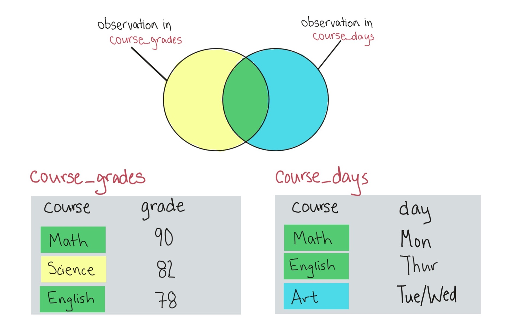
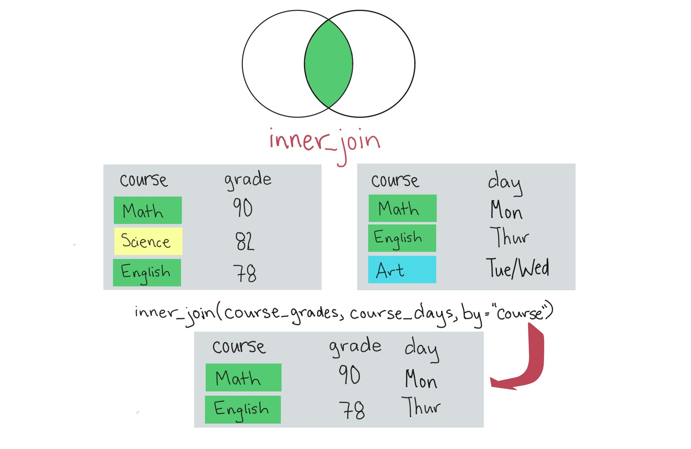
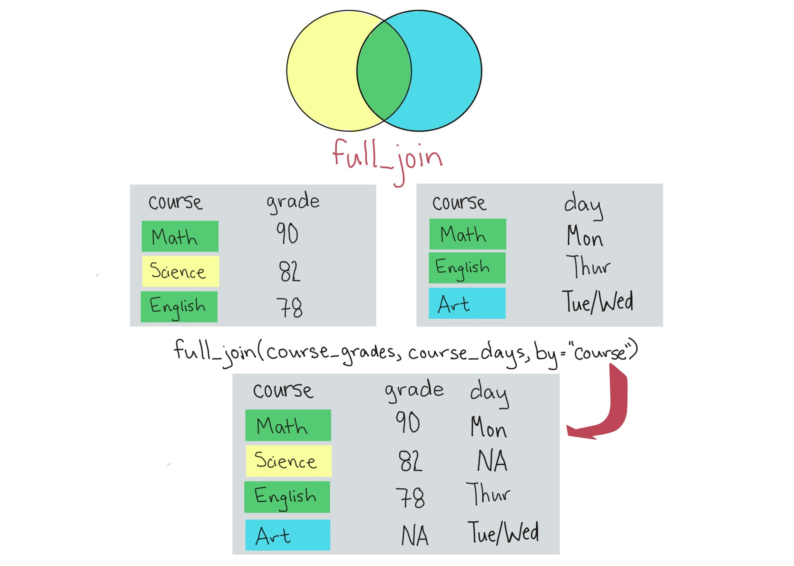
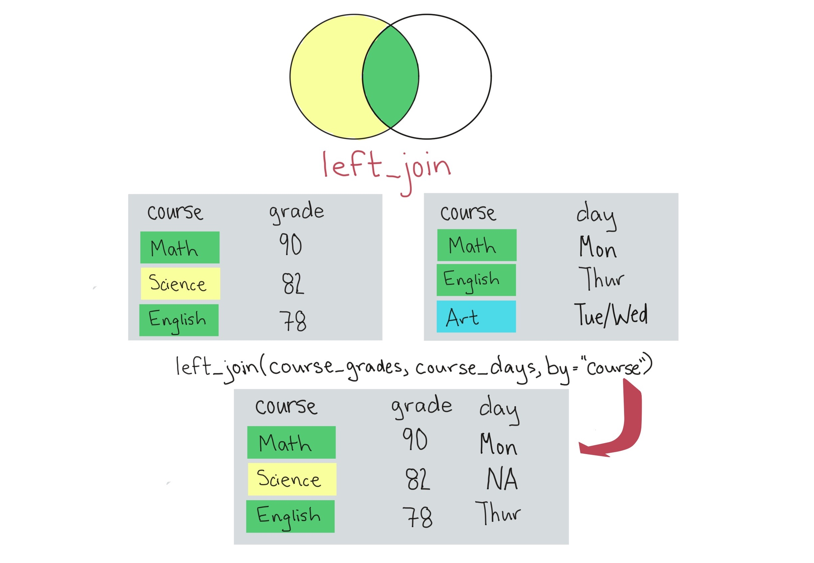
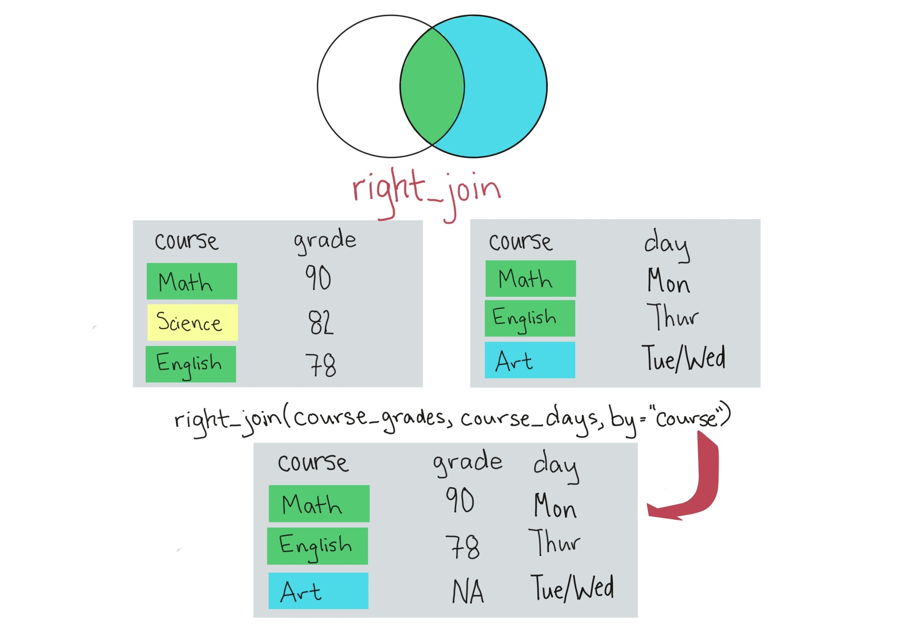

```{r echo = FALSE, message = FALSE, warning = FALSE}
library(tidyverse)
library(knitr)
library(faraway)
data(worldcup)
```

# Joining datasets

## Joining datasets

So far, you have only worked with a single data source at a time. When you work
on your own projects, however, you typically will need to merge together two or
more datasets to create the a data frame to answer your research question.
\bigskip

For example, for air pollution epidemiology, you will often have to join several
datasets:

- Health outcome data (e.g., number of deaths per day)
- Air pollution concentrations
- Weather measurements (since weather can be a confounder)
- Demographic data

## `*_join` functions

The `dplyr` package has a family of different functions to join two dataframes
together, the `*_join` family of functions. These include: 

- `inner_join`
- `full_join`
- `left_join`
- `right_join`

All combine two dataframes, which I'll call `course_grades` and `course_days`
here.

<!-- The functions include: -->

<!-- - `inner_join(course_grades, course_days)`: Keep only rows where there are -->
<!-- observations in both `course_grades` and `course_days`. -->
<!-- - `left_join(course_grades, course_days)`: Keep all rows from `course_grades`, -->
<!-- whether they have a match in `course_days` or not. -->
<!-- - `right_join(course_grades, course_days)`: Keep all rows from `course_days`, -->
<!-- whether they have a match in `course_grades` or not. -->
<!-- - `full_join(course_grades, course_days)`: Keep all rows from both -->
<!-- `course_grades` and `course_days`, whether they have a match in the other -->
<!-- dataset or not. -->

## `*_join` functions

```{r, out.width = "\\textwidth", echo = FALSE}

```

## `inner_join`

```{r, out.width = "\\textwidth", echo = FALSE}

```

## `full_join`

```{r, out.width = "\\textwidth", echo = FALSE}

```

## `left_join`

```{r, out.width = "\\textwidth", echo = FALSE}

```

## `right_join`

```{r, out.width = "\\textwidth", echo = FALSE}

```

## `*_join` functions

For some more complex examples of using join, I'll use these example datasets (`x` and `y`):

```{r echo = FALSE}
x <- tibble(course = c("x", "x", "y", "z"),
                grade = c(92, 90, 82, 78),
                student = c("a", "b", "a", "b"))
y <- tibble(class = c("w", "x", "x", "y"),
                day = c("Tues", "Mon / Fri", "Mon / Fri", "Tue"), 
                student = c("a", "a", "b", "a"))
x
y
```

## `*_join` functions

If you have two datasets you want to join, but the column names for the joining column are different, you can use the `by` argument: 

```{r}
full_join(x, y, by = list(x = "course", y = "class"))
```

## `*_join` functions

A few things to note about this example: 

- The joining column name for the "left" dataframe (`x` in this case) is used as the column name for the joined data
- `student` was a column name in both `x` and `y`. If we're not using it to join the data, the column names are changed in the joined data to `student.x` and `student.y`.
- Values are recycled for rows where there were multiple matches across the dataframe (e.g., rows for course "x")

## `*_join` functions

Sometimes, you will want to join by more than one column. In this example data, it would make sense to join the data by matching both course and student. You can do this by using a vector of all columns to join on: 

```{r}
full_join(x, y, by = list(x = c("course", "student"),
                          y = c("class", "student")))
```

