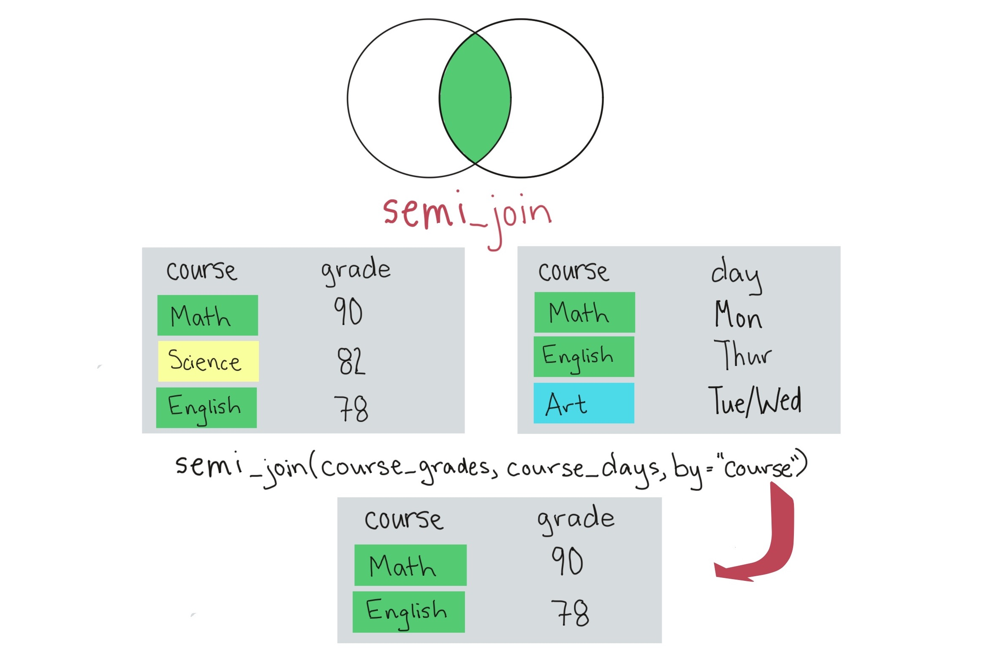
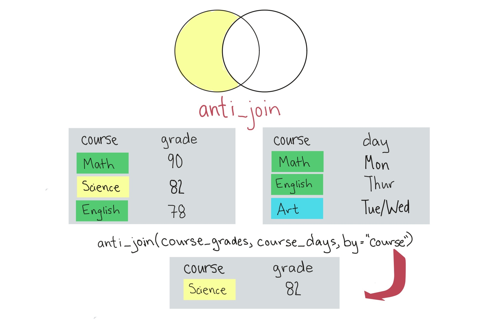

```{r echo = FALSE, message = FALSE, warning = FALSE}
library(tidyverse)
library(knitr)
library(faraway)
data(worldcup)
```

# More with `dplyr`

## `unite`

The `unite` function does the reverse of the `separate` function: it lets you join several columns into a single column. For example, say you have data where year, month, and day are split into different columns: 

```{r echo = FALSE}
date_example <- tibble(year = 2016, month = 10, day = 1:4)
date_example
```

## `unite`

You can use `unite` to join these into a single column: 

```{r}
date_example %>%
  unite(col = date, year, month, day, sep = "-")
```

## `unite`

If the columns you want to unite are in a row (and in the right order), you can use the `:` syntax with `unite`: 

```{r}
date_example %>%
  unite(col = date, year:day, sep = "-")
```

## Grouping with `mutate` versus `summarize`

So far, we have never used `mutate` with grouping. \bigskip

You can use `mutate` after grouping-- unlike `summarize`, the data will not be collapsed to fewer columns, but the summaries created by `mutate` will be added within each group. \bigskip

For example, if you wanted to add the mean time by team to the `worldcup` dataset, you could do that with `group_by` and `mutate` (see next slide).

## Grouping with `mutate` versus `summarize`

```{r}
worldcup %>%
  group_by(Position) %>%
  mutate(mean_time = mean(Time)) %>%
  slice(1:2) %>% select(Team:Time, mean_time)
```

<!-- ## More on `mutate`  -->

<!-- There are also some special functions that work well with `mutate`:  -->

<!-- - `lead`: Measured value for following observation -->
<!-- - `lag`: Measured value for previous observation -->
<!-- - `cumsum`: Sum of all values up to this point -->
<!-- - `cummax`: Highest value up to this point -->
<!-- - `cumany`: For TRUE / FALSE, have any been TRUE up to this point -->

<!-- ## More on `mutate`  -->

<!-- Here is an example of using `lead` and `lag` with mutate: -->

<!-- ```{r message = FALSE} -->
<!-- library(lubridate) -->
<!-- date_example %>%  -->
<!--   unite(col = date, year:day, sep = "-") %>% -->
<!--   mutate(date = ymd(date), -->
<!--          yesterday = lag(date), -->
<!--          tomorrow = lead(date)) -->
<!-- ``` -->

## `slice`

You can also group by a factor first using `group_by`. Then, when you use `slice`, you will get the first few rows for each level of the group.  

```{r}
worldcup %>% 
  group_by(Position) %>% 
  slice(1:2)
```

## `arrange` with `group_by`

You can also group by a factor before arranging. In this case, all data for the first level of the factor will show up first, in the order given in `arrange`, then all data from the second level will show up in the specified order, etc.

```{r}
worldcup %>% 
  group_by(Team) %>% 
  arrange(desc(Saves)) %>% 
  slice(1) %>% 
  head(n = 4)
```

## `semi_join` and `anti_join`

There are two more `*_join` functions we'll look at.

These functions allow you to filter one dataframe on only values that **do** have a match in a second dataframe (`semi_join`) or **do not** have a match in a second dataframe (`anti_join`).

These functions do **not** bring in columns from the second dataset. Instead, 
they check the second dataset to decide whether or not to keep certain rows 
in the first dataset.

## `semi_join`

```{r out.width = "0.98\\textwidth", echo = FALSE}

```

The `semi_join` function filters to observations that **do**
have a match in a second dataframe.

## `anti_join`

```{r out.width = "0.98\\textwidth", echo = FALSE}

```

The `anti_join` function filters to observations that **do not**
have a match in a second dataframe.

