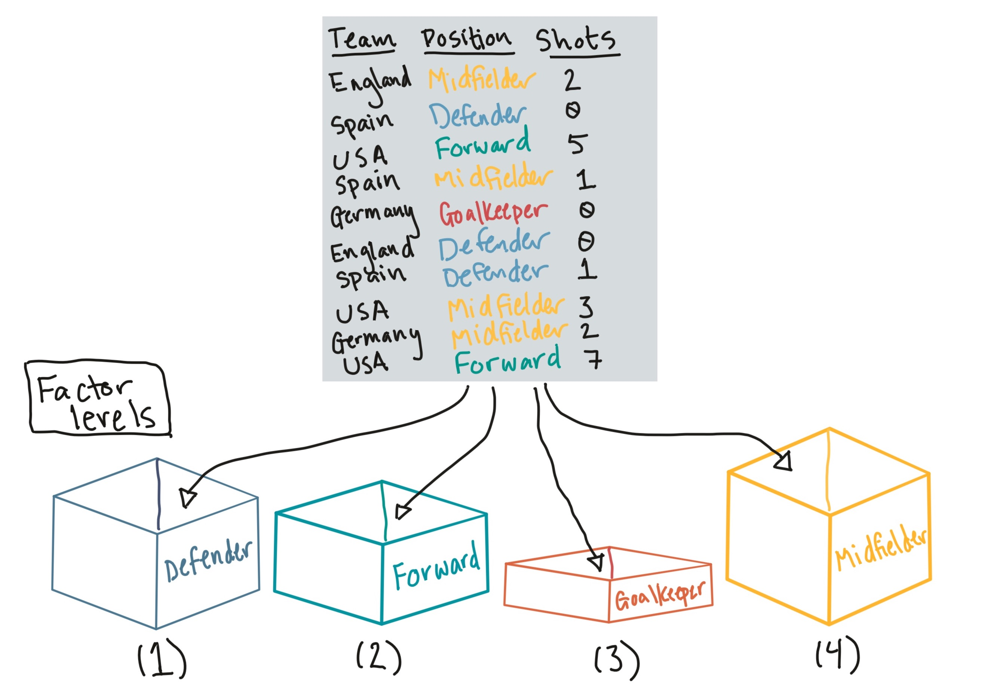
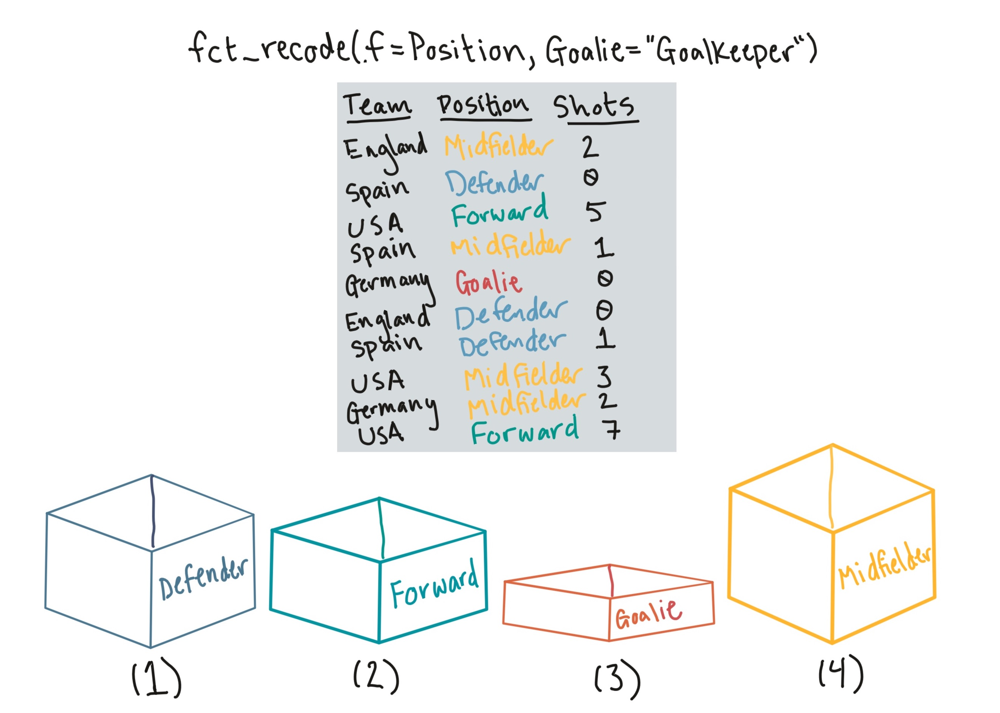
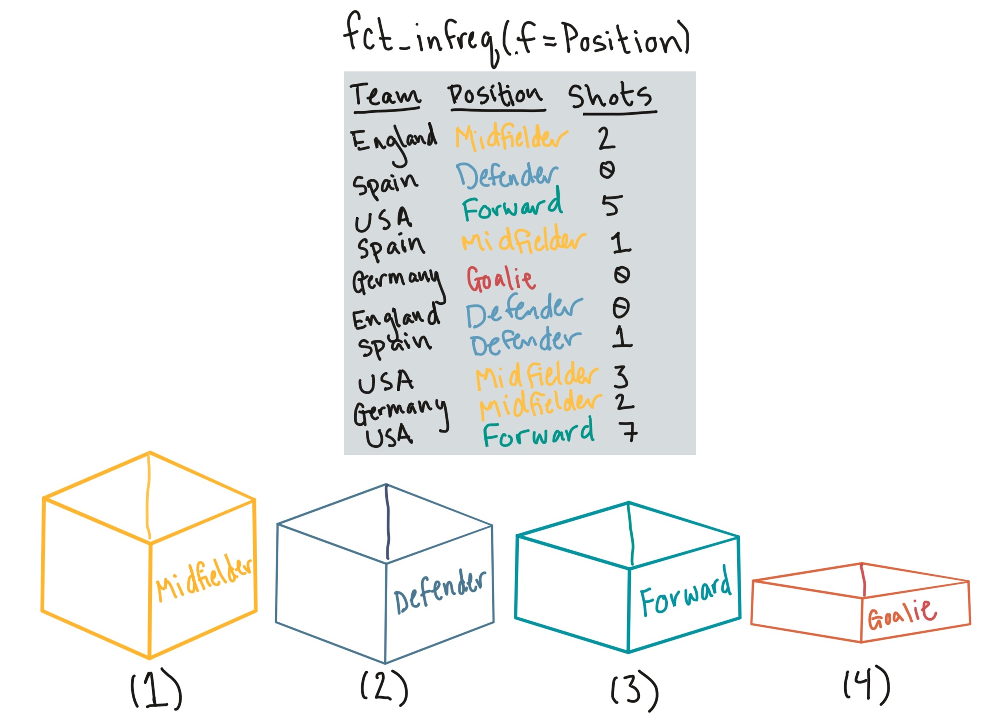
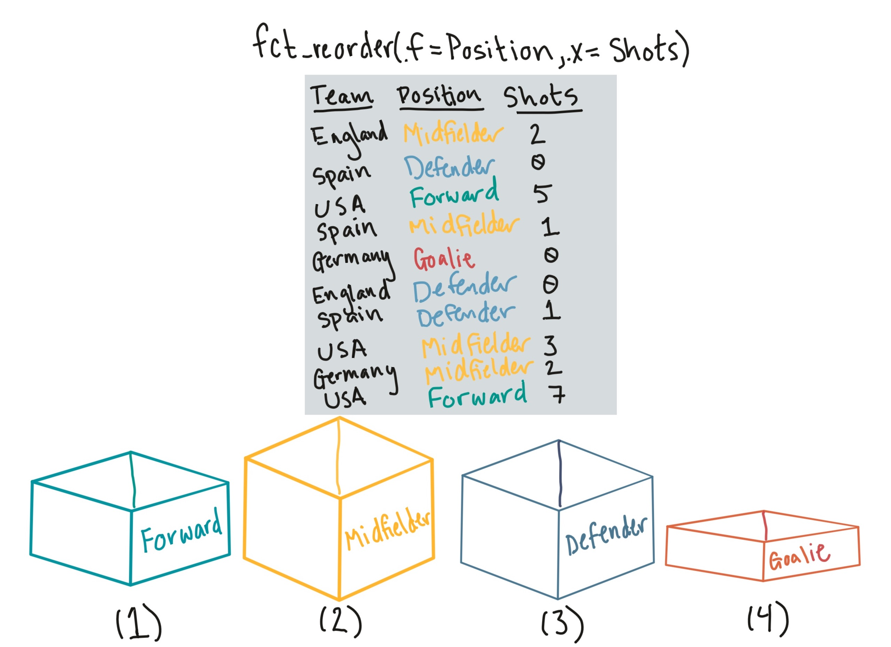
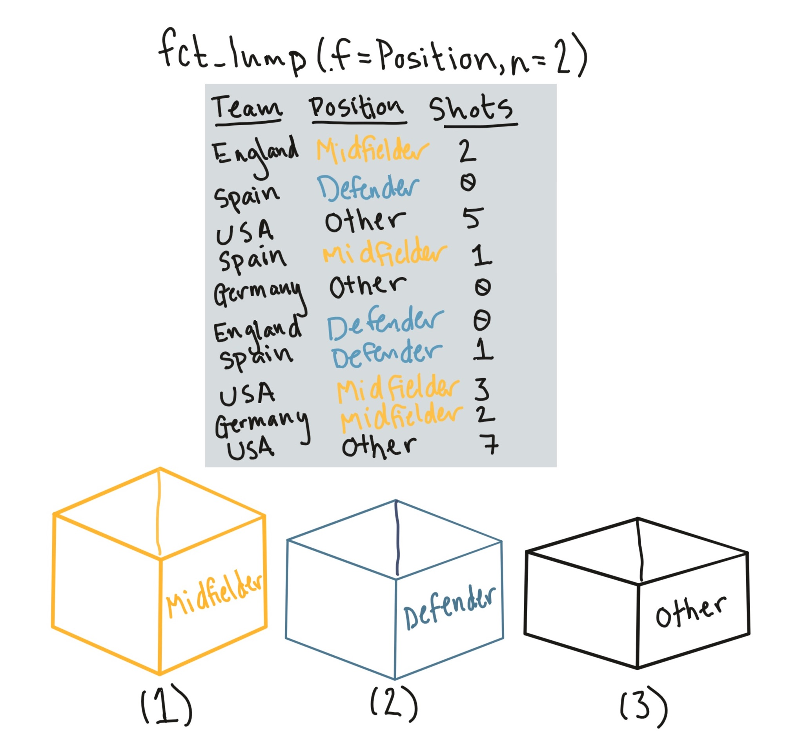

```{r echo = FALSE, message = FALSE, warning = FALSE}
library(tidyverse)
library(knitr)
library(faraway)
data(worldcup)
```

# Working with factors

## Working with factors

Hadley Wickham has developed a package called `forcats` that helps you work with
factors.

```{r}
library("forcats")
```

## Factors

```{r echo = FALSE, out.width = "\\textwidth"}

```

## `fct_recode`

```{r echo = FALSE, out.width = "\\textwidth"}

```

## `fct_recode`

The `fct_recode` function can be used to change the labels of a function (along
the lines of using `factor` with `levels` and `labels` to reset factor labels).
\bigskip

One big advantage is that `fct_recode` lets you change labels for some, but not all, levels. For example, here are the team names:
\footnotesize
```{r}
worldcup %>% 
  filter(Team == "USA") %>%
  slice(1:3) %>% select(Team, Position, Time)
```

## `fct_recode`

If you just want to change "USA" to "United States", you can run: 

```{r}
worldcup <- worldcup %>%
  mutate(Team = fct_recode(Team, `United States` = "USA"))
worldcup %>%
  filter(Team == "United States") %>%
  slice(1:3) %>% select(Team, Position, Time)
```

## `fct_infreq`

```{r echo = FALSE, out.width = "\\textwidth"}

```

## `fct_infreq`

You can use the `fct_infreq` function to reorder the levels of a factor from most common to least common:

```{r}
levels(worldcup$Position)
worldcup <- worldcup %>%
  mutate(Position = fct_infreq(Position))
levels(worldcup$Position)
```

## `fct_reorder`

```{r echo = FALSE, out.width = "\\textwidth"}

```

## `fct_reorder`

If you want to reorder one factor by another variable (ascending order), you can use `fct_reorder` (e.g., homework 3). For example, to re-level `Position` by the median shots on goals for each position, you can run:

```{r}
levels(worldcup$Position)
worldcup <- worldcup %>%
  mutate(Position = fct_reorder(Position, Shots))
levels(worldcup$Position)
```

## `fct_lump`

```{r echo = FALSE, out.width = "0.8\\textwidth", fig.align = "center"}

```

## `fct_lump`

You can use the `fct_lump` function to lump uncommon factors into an "Other" category. For example, to lump the two least common positions together, you can run (`n` specifies how many categories to keep outside of "Other"): 

```{r}
worldcup %>%
  mutate(Position = fct_lump(Position, n = 2)) %>%
  count(Position)
```

