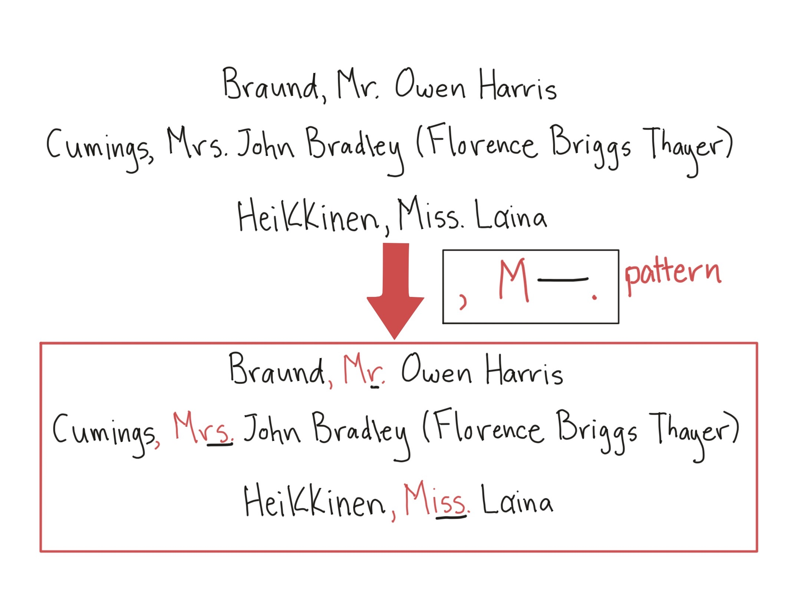
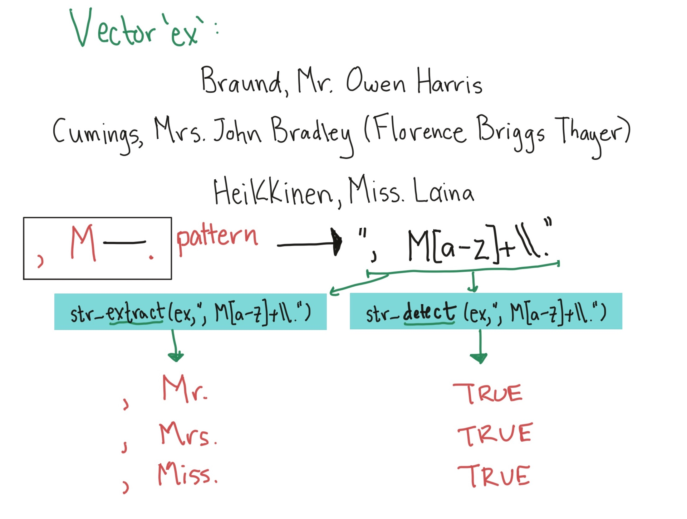
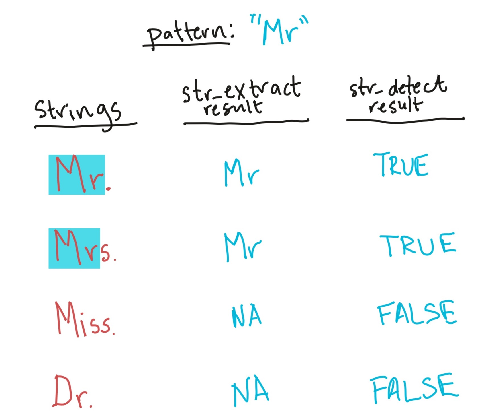
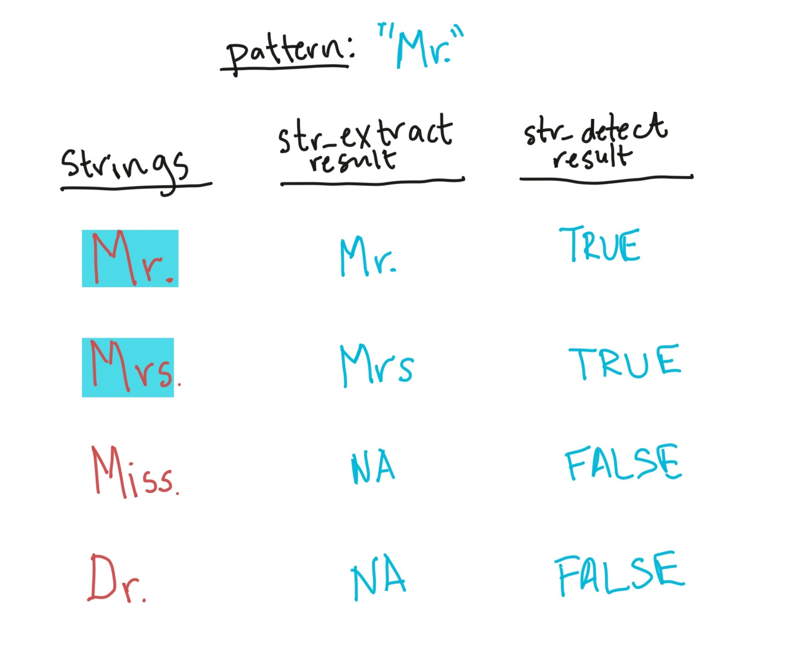
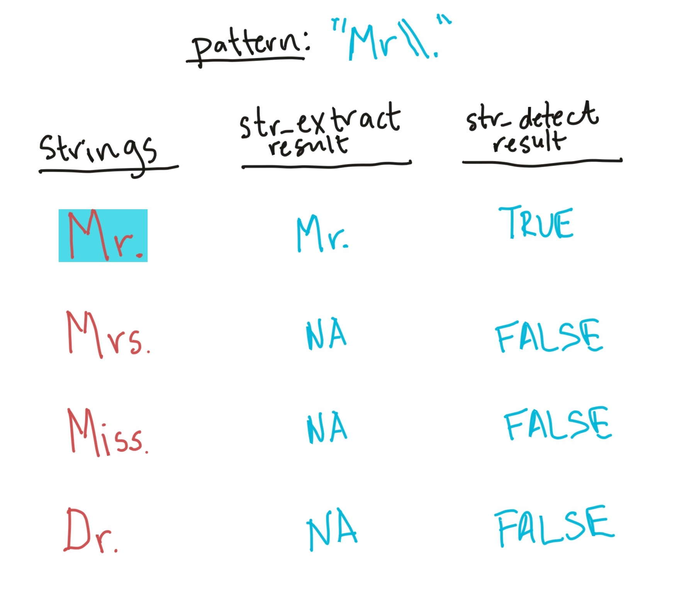
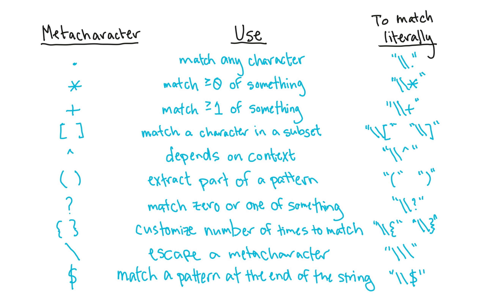
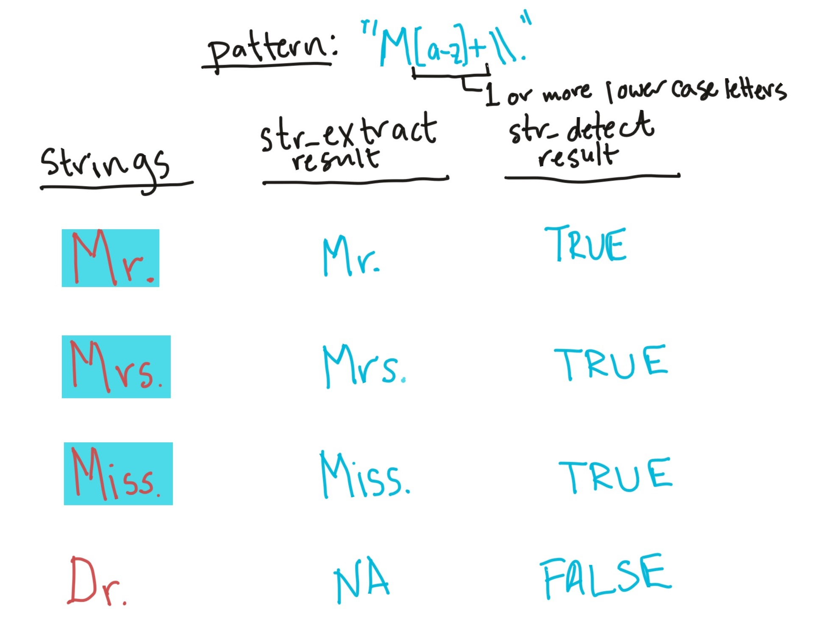
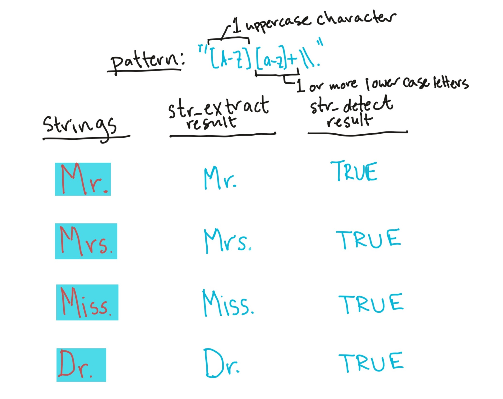
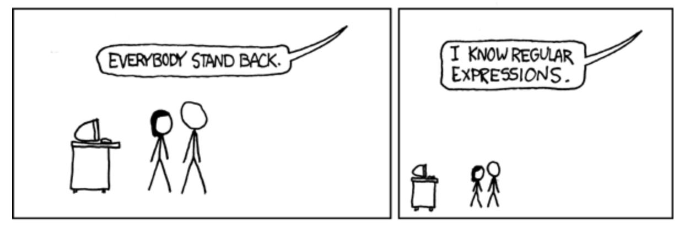
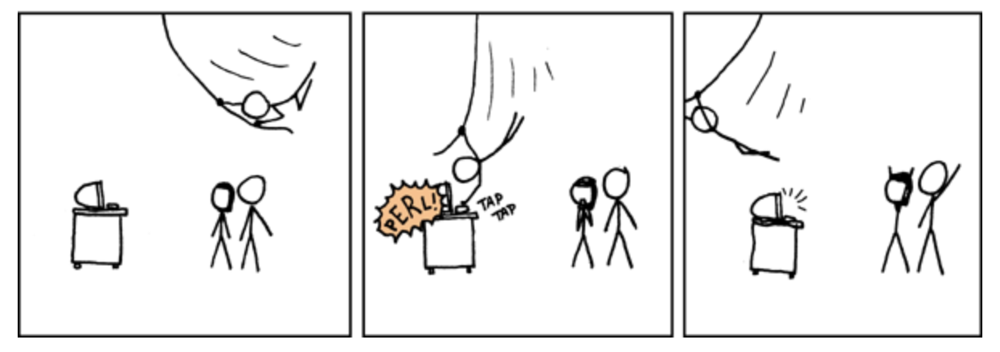

```{r echo = FALSE, message = FALSE, warning = FALSE}
library(tidyverse)
library(knitr)
library(faraway)
data(worldcup)

library("titanic")
data("titanic_train")
```

# Regular expressions

## Regular expressions

We've already done some things to manipulate strings. For example, if we wanted to separate "Name" into last name and first name (including title), we could actually do that with the `separate` function: 

```{r}
titanic_train %>% 
  select(Name) %>% 
  slice(1:3) %>% 
  separate(Name, c("last_name", "first_name"), sep = ", ")
```

## Regular expressions

Notice that `separate` is looking for a regular pattern (", ") and then doing something based on the location of that pattern in each string (splitting the string). \bigskip

There are a variety of functions in R that can perform manipulations based on finding regular patterns in character strings. 

## Regular expressions

```{r echo = FALSE, out.width = "\\textwidth", fig.align = "center"}

```

## Regular expressions

```{r echo = FALSE, out.width = "\\textwidth", fig.align = "center"}

```

## Regular expressions

```{r echo = FALSE, out.width = "0.9\\textwidth", fig.align = "center"}

```


## Regular expression patterns

The easiest regular expression patterns are literal text. For example, the regular expression
pattern if you're trying to match "Mr" is just "Mr": 

```{r}
ex_names <- c("Braund, Mr. Owen Harris",
              "Cumings, Mrs. John Bradley",
              "Heikkinen, Miss. Laina")
str_extract(ex_names, pattern = "Mr")
```

## Regular expression patterns

Regular expression patterns are case sensitive, so you won't match "Mr" with the
pattern "mr":

```{r}
ex_names <- c("Braund, Mr. Owen Harris",
              "Cumings, Mrs. John Bradley",
              "Heikkinen, Miss. Laina")
str_extract(ex_names, pattern = "mr")
```

## Regular expression patterns

There are a few characters called **metacharacters** that mean something special in 
regular expression patterns. 

To use any of these literally in a regular expression, you 
need to "protect" them with two backslashes. 

## Regular expressions

```{r echo = FALSE, out.width = "0.9\\textwidth", fig.align = "center"}

```

## Regular expressions

```{r echo = FALSE, out.width = "0.9\\textwidth", fig.align = "center"}

```

## Regular expression patterns

For example, "." is a metacharacter, so to match "Mr.", you need to use the pattern `"Mr\\."`:

```{r}
ex_names <- c("Braund, Mr. Owen Harris",
              "Cumings, Mrs. John Bradley",
              "Heikkinen, Miss. Laina")
str_extract(ex_names, pattern = "Mr\\.")
```

## Regular expression metacharacters

```{r echo = FALSE, out.width = "0.9\\textwidth"}

```

## Regular expression patterns

```{r echo = FALSE, out.width = "0.9\\textwidth", fig.align = "center"}
knitr::include_graphics("../figures/regex_pattern_4.jpg")
```

## Regular expression patterns

```{r echo = FALSE, out.width = "0.9\\textwidth", fig.align = "center"}

```

## Regular expressions

The last pattern used `[a-z]+` to match one or more lowercase letters. The `[a-z]`is a **character class**. \bigskip 

You can also match digits (`[0-9]`), uppercase letters (`[A-Z]`), just some letters (`[aeiou]`), etc. \bigskip

You can negate a character class by starting it with `^`. For example, `[^0-9]` will match anything that **isn't** a digit. 

## Regular expression patterns

```{r echo = FALSE, out.width = "0.9\\textwidth", fig.align = "center"}

```

## Regular expressions

The `str_detect` function will look through each element of a character vector for a designated pattern. If the pattern is there, it will return `TRUE`, and otherwise `FALSE`. The convention is: 

```
## Generic code
str_detect(string = [vector you want to check], 
           pattern = [pattern you want to check for])
```

For example, to create a logical vector specifying which of the Titanic passenger names include "Mrs.", you can call:

```{r}
mrs <- str_detect(titanic_train$Name, "Mrs\\.")
head(mrs)
```


## Regular expressions

The result is a logical vector, so `str_detect` can be used in `filter` to subset data to only rows where the passenger's name includes "Mrs.":

```{r}
titanic_train %>%
  filter(str_detect(Name, "Mrs\\.")) %>%
  select(Name) %>%
  slice(1:3)
```

## Regular expressions

The `str_extract` function can be used to extract a string (if it exists) from each value in a character vector. It follows similar conventions to `str_detect`:

```
## Generic code
str_extract(string = [vector you want to check], 
           pattern = [pattern you want to check for])
```

## Regular expressions

For example, you might want to extract "Mrs." if it exists in a passenger's name:

```{r}
titanic_train %>%
  mutate(mrs = str_extract(Name, "Mrs\\.")) %>%
  select(Name, mrs) %>%
  slice(1:3)
```

Notice that now we're creating a new column (`mrs`) that either has "Mrs." (if there's a match) or is missing (`NA`) if there's not a match. 

## Regular expressions

For this first example, we were looking for an exact string ("Mrs"). However, you can use patterns that match a particular pattern, but not an exact string. For example, we could expand the regular expression to find "Mr." or "Mrs.":  

```{r}
titanic_train %>%
  mutate(title = str_extract(Name, "Mr[s]*\\.")) %>%
  select(Name, title) %>%
  slice(1:3)
```

This pattern uses `[s]*` to match zero or more "s"s at this spot in the pattern. 

## Regular expressions

In the previous code, we found "Mr." and "Mrs.", but missed "Miss.". We could tweak the pattern again to try to capture that, as well. For all three, we have the pattern that it starts with "M", has some lowercase letters, and then ends with ".".  

```{r}
titanic_train %>%
  mutate(title = str_extract(Name, "M[a-z]+\\.")) %>%
  select(Name, title) %>%
  slice(1:3)
```


## Regular expressions 

Sometimes, you want to match a pattern, but then only subset a part of it. For example, each passenger seems to have a title ("Mr.", "Mrs.", etc.) that comes after ", " and before ". ". We can use this pattern to find the title, but then we get some extra stuff with the match: 

```{r}
titanic_train %>%
  mutate(title = str_extract(Name, ", [A-Z][a-z]*\\.")) %>%
  select(title) %>%
  slice(1:3)
```


## Regular expressions 

We are getting things like ", Mr. ", when we really want "Mr". We can use the `str_match` function to do this. We group what we want to extract from the pattern in parentheses, and then the function returns a matrix. The first column is the full pattern match, and each following column gives just what matches within the groups. 

```{r}
head(str_match(titanic_train$Name,
          pattern = ", ([A-Z][a-z]*)\\."))
```

## Regular expressions 

To get just the title, then, we can run:

```{r}
titanic_train %>%
  mutate(title = 
           str_match(Name, ", ([A-Z][a-z]*)\\.")[ , 2]) %>%
  select(Name, title) %>%
  slice(1:3)
```

The `[ , 2]` pulls out just the second column from the matrix returned by `str_match`. 

## Regular expressions 

Here are some of the most common titles: 

```{r}
titanic_train %>%
  mutate(title = 
           str_match(Name, ", ([A-Z][a-z]*)\\.")[ , 2]) %>%
  group_by(title) %>% summarize(n = n()) %>%
  arrange(desc(n)) %>% slice(1:5)
```

## Regular expressions

The following slides have a few other examples of regular expressions in action with this dataset. \bigskip

Get just names that start with ("^") the letter "A":

```{r}
titanic_train %>%
  filter(str_detect(Name, "^A")) %>%
  select(Name) %>%
  slice(1:3)
```

## Regular expressions

Get names with "II" or "III" (`{2,}` says to match at least two times):

```{r}
titanic_train %>%
  filter(str_detect(Name, "I{2,}")) %>%
  select(Name) %>%
  slice(1:3)
```

## Regular expressions

Get names with "Andersen" or "Anderson" (alternatives in square brackets):

```{r}
titanic_train %>%
  filter(str_detect(Name, "Anders[eo]n")) %>%
  select(Name)
```


## Regular expressions

Get names that start with ("^" outside of brackets) the letters "A" and "B":

```{r}
titanic_train %>%
  filter(str_detect(Name, "^[AB]")) %>%
  select(Name) %>%
  slice(1:3)
```

## Regular expressions

Get names that end with ("$") the letter "b" (either lowercase or uppercase):

```{r}
titanic_train %>%
  filter(str_detect(Name, "[bB]$")) %>%
  select(Name) 
```


## Regular expressions

There is a family of older, base R functions called `grep` that does something very similar.

You may see these functions in example code.

## Regular expressions

```{r echo = FALSE, out.width = "\\textwidth"}

```

\footnotesize
Souce: xkcd

## Regular expressions

```{r echo = FALSE, out.width = "\\textwidth"}

```

\footnotesize
Souce: xkcd

## Regular expressions

```{r echo = FALSE, out.width = "\\textwidth"}

```

\footnotesize
Souce: xkcd

## Regular expressions

For more on these patterns, see: 

- Help file for the `stringi-search-regex` function in the `stringi` package (which should install when you install `stringr`)
- Chapter 14 of R For Data Science
- http://gskinner.com/RegExr: Interactive tool for helping you build regular expression pattern strings


## Tidy select

There are [`tidyverse`](https://dplyr.tidyverse.org/reference/select.html) functions to make selecting variables more straightforwards. You can call these functions as arguments of the `select` function to streamline variable selection. Examples include: `starts_with()`, `ends_with()`, and `contains()`.

## Tidy select (helpers)

Here we use `starts_with("t")` to select all variables that begin with `t`.

```{r}
titanic_train %>%
  select(starts_with("t")) %>%
  slice(1:3)
```

## Tidy select


The are also tidyverse functions that allow us to easily operate on a selection of variables. These functions are called [`scoped varients`](https://dplyr.tidyverse.org/reference/scoped.html). You can identity these functions by these `_all`, `_at`, and `_if` suffixes.


## Tidy select (*_if)

Here we use `select_if` to select all the numeric variables in a dataframe and covert their names to lower case (a handy function to tidy the variable names).

```{r}
titanic_train %>%
  select_if(is.numeric, tolower) %>%
  slice(1:3)
```

## Tidy select (*_if)

The `select_if` function takes the following form.

```{r eval = FALSE}
## Generic code
new_df <- select_if(old_df,
                    .predicate [selects the variable to keep], 
                    .funs = [the function to apply to 
                             the selected column names])
```

## Tidy select (*_at)

Here we use `select_at` to select all the variables that contain `ss` in their name and then covert their names to lower case (a handy function to tidy the variable names).

```{r}
titanic_train %>%
  select_at(vars(contains("ss")), tolower) %>%
  slice(1:3)
```

