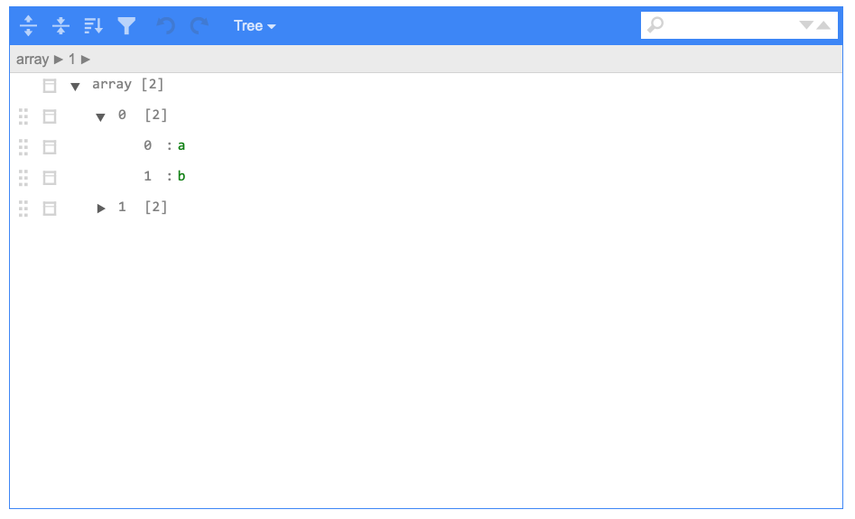
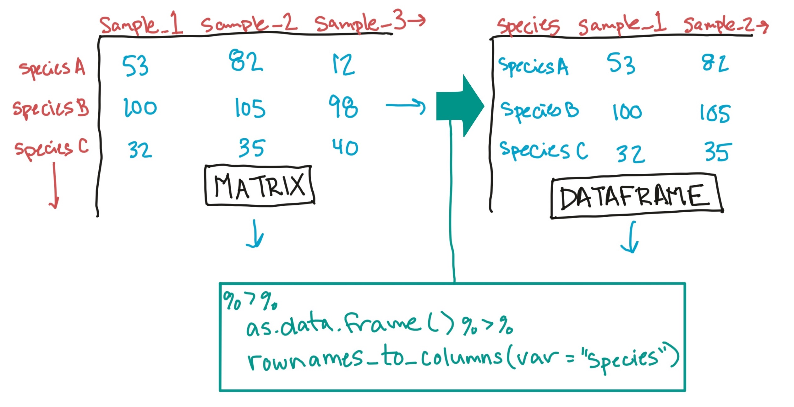
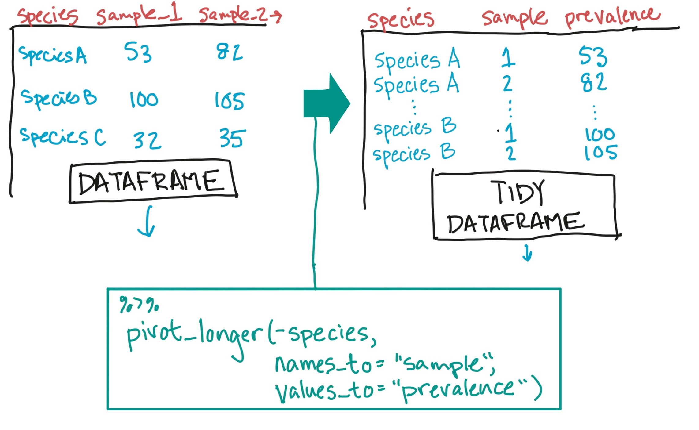
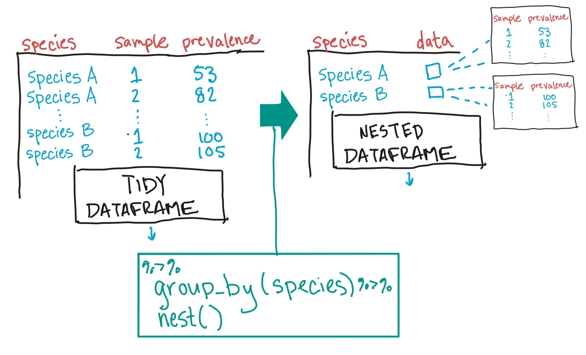
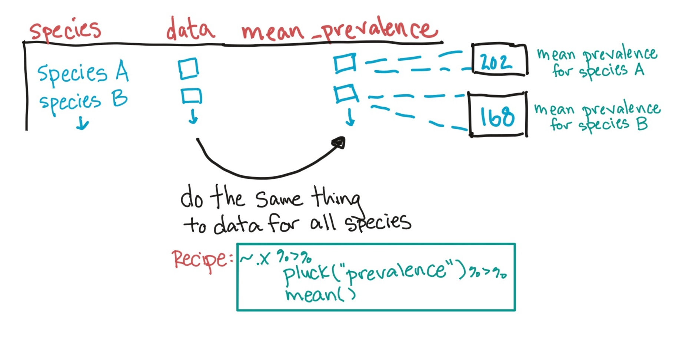
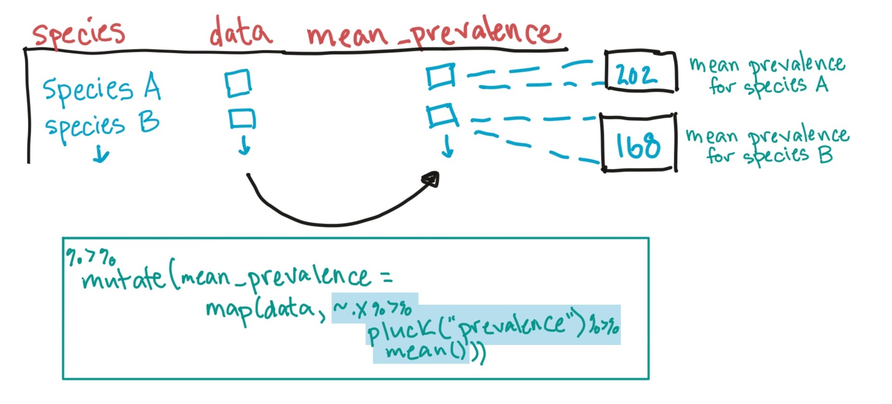
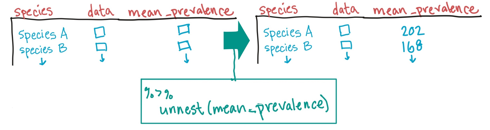
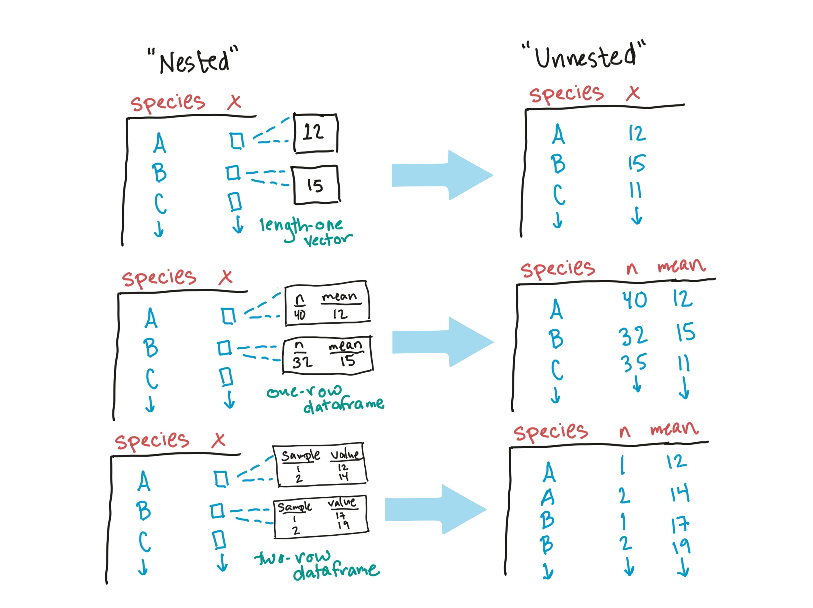

```{r echo = FALSE, message = FALSE, warning = FALSE}
library(knitr)
library(ggplot2)
library(dplyr)
library(tidyr)
library(ggthemes)
library(faraway)
data(worldcup)
data(nepali)
```

# Other R objects: Matrices and lists

## Matrices

A matrix is like a data frame, but all the values in all columns must be of the same class (e.g., numeric, character). (Another way you can think of it is as a "wrapped" vector.)

Matrices can be faster and more memory-efficient than data frames. Also, a lot of statistical
methods within R code is implemented using linear algebra and other mathematical 
techniques based on matrices.

## Matrices

We can use the `matrix()` function to construct a matrix:

```{r}
foo <- matrix(1:10, ncol = 5)
foo
```

## Matrices

The `as.matrix()` function is used to convert an object to a matrix:

```{r}
foo <- data.frame(col_1 = 1:2, col_2 = 3:4,
                  col_3 = 5:6, col_4 = 7:8,
                  col_5 = 9:10)
foo <- as.matrix(foo)
foo
```

## Matrices

You can index matrices with square brackets, just like data frames: 

```{r}
foo[1, 1:2]
```

You cannot, however, use `dplyr` functions with matrices: 

```{r, eval = FALSE}
foo %>% filter(col_1 == 1)
```
```
Error in UseMethod("filter_") : 
  no applicable method for 'filter_' applied to an object of 
  class "c('matrix', 'integer', 'numeric')"
```

# Lists

## Lists

Lists are the "kitchen sink" of R objects. They can be used to keep together a variety of different R objects of different classes, dimensions, and structures in a single R object. 

Because there are often cases where an R operation results in output that doesn't have a simple structure, lists can be a very useful way to output complex output from an R function. 

Most lists are not "tidy" data. However, we'll cover some ways that you can easily "tidy" some common list objects you might use a lot in your R code, including the output of fitting linear and generalized linear models.

## Lists

```{r}
example_list <- list(a = sample(1:10, 5), 
                     b = tibble(letters = letters[1:3], 
                                numbers = 1:3))
example_list
```

## Indexing lists

To pull an element out of a list, you can either use `$` or `[[]]` indexing:

```{r}
example_list$a
```

```{r}
example_list[[2]]
```

## Indexing lists


To access a specific value within a list element we can index the element using double, double brackets:

```{r}
example_list[["b"]][["numbers"]]
```

Again, we can index using names or numeric indices:

```{r}
example_list[["b"]][[1]]
```

## Exploring lists

If an R object is a list, running `class` on the object will return "list": 

```{r}
class(example_list)
```

Often, lists will have names for each element (similar to column names for a dataframe). You can get the names of all elements of a list using the `names` function: 

```{r}
names(example_list)
```

## Exploring lists

The `str` function is also useful for exploring the structure of a list object: 

\footnotesize

```{r}
str(example_list)
```

## Exploring lists

A list can even contain other lists. We can use the `str` function to see the structure of a list:

```{r cakk}
a_list <- list(list("a", "b"), list(1, 2))

str(a_list)
```

## Exploring lists

Using `str` to print out the list's structure doesn't produce the easiest to digest output. We can use the `jsonedit` function from the `listviewer` package to create a widget in the Viewer pane to more esily explore our list.

```{r, eval=FALSE}
library(listviewer)
jsonedit(a_list)
```

```{r echo = FALSE, out.width = "0.7\\textwidth", fig.align = "center"}

```

<!-- ## Exploring lists -->

<!-- Sometimes you'll see unnecessary lists-of-lists, perhaps when importing data into R created. Or a list with multiple elements that you would like to combine.  -->

<!-- \footnotesize -->

<!-- ```{r cakl, warning = FALSE} -->
<!-- library(purrr) -->
<!-- a_list -->
<!-- ``` -->

<!-- ## Exploring lists -->

<!-- You can remove a level of hierarchy from a list using the `flatten` function from the `purrr` package: -->

<!-- \footnotesize -->

<!-- ```{r} -->
<!-- flatten(a_list) -->
<!-- ``` -->


## Lists versus dataframes

As a note, a dataframe is actually just a very special type of list. It is a list where every element (column in the dataframe) is a vector of the same length, and the object has a special attribute specifying that it is a dataframe. 

```{r}
example_df <- tibble(letters = letters[1:3], 
                     number = 1:3)
class(example_df)
is.list(example_df)
```

## In-course Exercise

We'll take a break now to do section 1 of the In-course Exercise for Chapter 7.

# Simple statistical tests in R

## Statistical tests

R has many different functions for different statistical tests. 

So far, I have not found a statistical test I wanted to perform that did not
have a function to do it in R.

## Statistical tests

We'll start with a pretty simple test called the "Shapiro-Wilk test of normality."

The **null hypothesis** for this test is that the data follow a normal distribution. 
If the p-value from running the test is lower than a specified threshold (often 0.05),
then you reject the null hypothesis.

## Statistical tests

Often, a parametric test will require the assumption that one or more 
variables follow a normal distribution. This test can help check that assumption.

If you find that the distribution does not seem to be normal, you can make
adjustments, like transforming the variable or using a non-parametric test
(see [here](https://www.sheffield.ac.uk/polopoly_fs/1.579191!/file/stcp-karadimitriou-normalR.pdf) 
for a nice overview). 

## Statistical tests

We'll use this test as an example, but it has two characteristics that are 
common to most simple statistical tests functions in R: 

1. It inputs a vector (or vectors, for some tests), rather than a tidy dataframe.
2. It outputs a list object, rather than a dataframe.

We'll talk about both of these characteristics and how we can still 
work statistical tests into a "tidy" workflow, where we're keeping the 
data in a tidy dataframe format most of the time.

## Statistical tests

To show how this test works, let's simulate some data that we know are normal. 

There are several functions in R that let you simulate a vector of data
from a specified distribution. For a normal distribution, the function is 
`rnorm`. 

For this function, you'll specify how many values you want in the vector (`n`) and
the values of the mean (`mean`) and standard deviation (`sd`) of the normal 
distribution.

## Statistical tests

For example, you can run this to create a vector with a random sample of 
1,000 values from a normal distribution with mean 200 and standard deviation 50:

```{r}
normal_ex_vector <- rnorm(n = 1000, mean = 200, sd = 50)
head(normal_ex_vector)
```

## Statistical tests

Let's check the histogram of this data. Since this data in in a vector, not a 
dataframe, we should use `qplot` from `ggplot2` instead of `ggplot`:

```{r out.width = "0.8\\textwidth", fig.width = 5, fig.height = 3, fig.align = "center", message = FALSE}
qplot(normal_ex_vector, geom = "histogram")
```

## Statistical tests

It looks pretty normal, but let's run the test. The function to run the test 
is `shapiro.test`. Its only argument is `x`, the vector that you want to check. 

```{r}
shapiro.test(x = normal_ex_vector)
```

## Statistical tests

The default for this function is to print out the results in a way that's easy to 
read on the screen. However, you can also save the results from the test in a new object:

```{r}
ex_sw_result <- shapiro.test(x = normal_ex_vector)
```

## Statistical tests

This object has a special class called "htest":

```{r}
class(ex_sw_result)
```

Really, though, this is just a special kind of list:

```{r}
is.list(ex_sw_result)
```

## Statistical tests

If you run `str` on the object, you can see it has all the information that
is usually printed by the function tucked away in different slots of the list:

```{r}
str(ex_sw_result)
```

## Statistical tests

There is a package called `broom` that can pull this information out
and format it as a tidy dataframe. For example:

```{r}
library(broom)
tidy(ex_sw_result)
```

This seems unexciting for this example, but trust me, it turns out that being
able to do this is **very** exciting. 

## Statistical tests

Now, let's look at how this process would work if you were starting with a vector
that was a column in a tidy dataframe. Since you're using tidyverse tools, you'll 
probably find you want to do this often. 

We'll create a very simple dataframe with only this column:

```{r}
ex_df <- tibble(norm_vector = normal_ex_vector)
ex_df %>% 
  slice(1:3)
```

## Statistical tests

Now you can use `ggplot` to make the histogram:

```{r out.width = "0.8\\textwidth", fig.width = 5, fig.height = 3, fig.align = "center", message = FALSE}
ggplot(ex_df, aes(x = norm_vector)) + 
  geom_histogram()
```

## Statistical tests

To fit the test, you'll need to be able to pull this vector out of the dataframe. To 
do that, you can use the `pluck` function from the `purrr` package in a pipeline. That
function "plucks" out a single column as a vector. For example:

```{r}
library(purrr)
ex_df %>% 
  pluck("norm_vector") %>% 
  head()
```

## Statistical tests

With that function, you can pipe right into the Shapiro-Wilk test function: 

```{r}
ex_df %>% 
  pluck("norm_vector") %>% 
  shapiro.test()
```

## Statistical tests

Now just add on the `tidy` function to get the test output in a tidy dataframe, and you're
back to your typical format!

```{r}
ex_df %>% 
  pluck("norm_vector") %>% 
  shapiro.test() %>% 
  tidy()
```

## Statistical tests

Now let's look at some real data. The variable dataframe of the `atlas1006`
dataset in the `microbiome` library has a column on `diversity`.

We might want
to test if diversity is different by gender, nationality, or other factors. To 
pick which statistical tests to use to check those questions, though, it will 
help to know if this variable is normally distributed. 

## Statistical tests

The `atlas1006` data is stored in a `phyloseq` object (think of it as a fancy type 
of list). To extract a dataframe with characteristics of the samples, you'll need to 
use `get_variable` (which we can pipe into if we want):

```{r message = FALSE, warning = FALSE}
library(microbiome)
data(atlas1006)
atlas1006 %>%  
  get_variable() %>% 
  slice(1:3)
```

## Statistical tests

There are a few people that they measure several times, so there are more rows than the number 
of people they measure:

```{r}
atlas1006 %>%  
  get_variable() %>% 
  nrow()
```

## Statistical tests

We probably just want to work with the first measurement from each person, so let's use `filter`
to filter to samples with a "time" value of 0 (first measurement): 

```{r}
atlas1006 %>%  
  get_variable() %>% 
  filter(time == 0) %>% 
  nrow() 
```

This looks right.

## Statistical tests

We can use a histogram to visually check the normality: 

```{r out.width = "0.5\\textwidth", fig.width = 5, fig.height = 3, fig.align = "center", message = FALSE}
atlas1006 %>%  
  get_variable() %>% 
  filter(time == 0) %>% 
  ggplot(aes(x = diversity)) + 
  geom_histogram()
```


## Statistical tests

To extract the column on `diversity` as a vector, we can use `pluck`: 

```{r}
atlas1006 %>%  
  get_variable() %>% 
  filter(time == 0) %>% 
  pluck("diversity") %>% 
  head()
```

## Statistical tests

Now add on the Shapiro test function: 

```{r}
atlas1006 %>%  
  get_variable() %>% 
  filter(time == 0) %>% 
  pluck("diversity") %>% 
  shapiro.test()
```

## Statistical tests

And finally add on the `tidy` function: 

```{r}
atlas1006 %>%  
  get_variable() %>% 
  filter(time == 0) %>% 
  pluck("diversity") %>% 
  shapiro.test() %>% 
  tidy()
```


<!-- ## Example data -->

<!-- We'll use a dataset for the first example that you can download [here](https://raw.githubusercontent.com/geanders/RProgrammingForResearch/master/data/accident.csv). -->

<!-- This data gives ever fatal motor vehicle accident that occurred in the US in 2016.  -->
<!-- The data originally came from the Federal Accident Reporting System (FARS). -->

<!-- ## Example: Probability of fatal crashes in Las Vegas -->

<!-- Let's pull the fatal accident data just for the county that includes Las Vegas, NV.  -->

<!-- Each US county has a unique identifier (FIPS code), composed of a two-digit state FIPS and a three-digit county FIPS code. The state FIPS for Nevada is 32; the county FIPS for Clark County is 003. -->

<!-- ## Example: Probability of fatal crashes in Las Vegas -->

<!-- Therefore, we can filter down to Clark County data in the FARS data we collected with the following code: -->

<!-- ```{r message = FALSE, error = FALSE} -->
<!-- library(readr) -->
<!-- library(dplyr) -->
<!-- # Adjust the following for the filepath of the data on  -->
<!-- # your own -->
<!-- clark_co_accidents <- read_csv("../data/accident.csv") %>%  -->
<!--   filter(STATE == 32 & COUNTY == 3) -->
<!-- ``` -->

<!-- We can also check the number of accidents:  -->

<!-- ```{r} -->
<!-- clark_co_accidents %>%  -->
<!--   count() -->
<!-- ``` -->

<!-- ## Example: Probability of fatal crashes in Las Vegas -->

<!-- We want to test if the probability, on a Friday or Saturday, of a fatal accident occurring is higher than on other days of the week. Let's clean the data up a bit as a start:  -->

<!-- ```{r message = FALSE, warning = FALSE} -->
<!-- library(tidyr) -->
<!-- library(lubridate) -->
<!-- clark_co_accidents <- clark_co_accidents %>%  -->
<!--   select(DAY, MONTH, YEAR) %>%  -->
<!--   unite(date, DAY, MONTH, YEAR, sep = "-") %>%  -->
<!--   mutate(date = dmy(date)) -->
<!-- ``` -->

<!-- ## Example: Probability of fatal crashes in Las Vegas -->

<!-- Here's what the data looks like now:  -->

<!-- ```{r} -->
<!-- clark_co_accidents %>%  -->
<!--   slice(1:5) -->
<!-- ``` -->

<!-- ## Example: Probability of fatal crashes in Las Vegas -->

<!-- Next, let's get the count of accidents by date:  -->

<!-- ```{r} -->
<!-- clark_co_accidents <- clark_co_accidents %>%  -->
<!--   group_by(date) %>%  -->
<!--   count() %>%  -->
<!--   ungroup() -->
<!-- clark_co_accidents %>%  -->
<!--   slice(1:3) -->
<!-- ``` -->


<!-- ## Example: Probability of fatal crashes in Las Vegas -->

<!-- We're missing the dates without a fatal crash, so let's add those. First, create a dataframe -->
<!-- with all dates in 2016: -->

<!-- ```{r} -->
<!-- all_dates <- tibble(date = seq(ymd("2016-01-01"),  -->
<!--                                ymd("2016-12-31"), by = 1)) -->
<!-- all_dates %>%  -->
<!--   slice(1:5) -->
<!-- ``` -->

<!-- ## Example: Probability of fatal crashes in Las Vegas -->

<!-- Then merge this with the dataset on Las Vegas fatal crashes and make any day missing from the fatal crashes dataset have a "0" for number of fatal accidents (`n`): -->

<!-- ```{r} -->
<!-- clark_co_accidents <- clark_co_accidents %>%  -->
<!--   right_join(all_dates, by = "date") %>%  -->
<!--   # If `n` is missing, set to 0. Otherwise keep value. -->
<!--   mutate(n = ifelse(is.na(n), 0, n)) -->
<!-- clark_co_accidents %>%  -->
<!--   slice(1:3) -->
<!-- ``` -->

<!-- ## Example: Probability of fatal crashes in Las Vegas -->

<!-- Next, let's add some information about day of week and weekend:  -->

<!-- ```{r} -->
<!-- clark_co_accidents <- clark_co_accidents %>%  -->
<!--   mutate(weekday = wday(date, label = TRUE),  -->
<!--          weekend = weekday %in% c("Fri", "Sat")) -->
<!-- clark_co_accidents %>%  -->
<!--   slice(1:3) -->
<!-- ``` -->


<!-- ## Example: Probability of fatal crashes in Las Vegas -->

<!-- Now let's calculate the probability that a day has at least one fatal crash, separately for weekends and weekdays:  -->

<!-- ```{r} -->
<!-- clark_co_accidents <- clark_co_accidents %>%  -->
<!--   mutate(any_crash = n > 0) -->
<!-- crash_prob <- clark_co_accidents %>%  -->
<!--   group_by(weekend) %>%  -->
<!--   summarize(n_days = n(), -->
<!--             crash_days = sum(any_crash)) %>%  -->
<!--   mutate(prob_crash_day = crash_days / n_days) -->
<!-- crash_prob -->
<!-- ``` -->

<!-- ## Example: Probability of fatal crashes in Las Vegas -->

<!-- In R, you can use `prop.test` to test if two proportions are equal. Inputs include the total number of trials in each group (`n =`) and the number of "successes"" (`x = `): -->

<!-- \footnotesize -->

<!-- ```{r} -->
<!-- prop.test(x = crash_prob$crash_days,  -->
<!--           n = crash_prob$n_days) -->
<!-- ``` -->


## Find out more about statistical tests in R

I won't be teaching in this course how to find the correct statistical test. That's 
something you'll hopefully learn in a statistics course. 

There are also a variety of books that can help you with this, including some that you 
can access free online through CSU's library. One servicable introduction is "Statistical 
Analysis with R for Dummies".

<!-- ## Output of statistical tests: List objects -->

<!-- You can create an object from the output of any statistical test in R. Typically, this will be (at least at some level) in an object class called a "list": -->

<!-- ```{r} -->
<!-- vegas_test <- prop.test(x = crash_prob$crash_days,  -->
<!--                         n = crash_prob$n_days) -->
<!-- is.list(vegas_test) -->
<!-- ``` -->

<!-- ## Output of statistical tests: List objects -->

<!-- So far, we've mostly worked with two object types in R, **dataframes** and **vectors**. -->

<!-- In the next subsection we'll look more at two object classes we haven't looked at much, -->
<!-- **matrices** and **lists**. Both have important roles once you start applying more -->
<!-- advanced methods to analyze your data.  -->

<!-- ## List object from a statistical test -->

<!-- Let's look at the list object from the statistical test we ran for Las Vegas:  -->

<!-- \footnotesize -->

<!-- ```{r} -->
<!-- str(vegas_test) -->
<!-- ``` -->

<!-- ## List object from statistical test -->

<!-- We can pull out an element using the `$` notation:  -->

<!-- ```{r} -->
<!-- vegas_test$p.value -->
<!-- ``` -->

<!-- Or using the `[[` notation: -->

<!-- ```{r} -->
<!-- vegas_test[[4]] -->
<!-- ``` -->

<!-- ## Broom package -->

<!-- You may have noticed, though, that this output is not a tidy dataframe.  -->

<!-- Ack! That means we can't use all the tidyverse tricks we've learned so far in the course! -->

<!-- Fortunately, David Robinson noticed this problem and came up with a package called `broom` that can "tidy up" a lot of these kinds of objects. -->

<!-- ## Broom package -->

<!-- The `broom` package has three main functions:  -->

<!-- - `glance`: Return a one-row, tidy dataframe from a model or other R object -->
<!-- - `tidy`: Return a tidy dataframe from a model or other R object -->
<!-- - `augment`: "Augment" the dataframe you input to the statistical function -->

<!-- ## Broom package -->

<!-- Here is the output for `tidy` for the `vegas_test` object (`augment` -->
<!-- won't work for this type of object, and `glance` gives the same thing as `tidy`):  -->

<!-- \footnotesize -->

<!-- ```{r} -->
<!-- library(broom) -->
<!-- tidy(vegas_test) -->
<!-- ``` -->


## In-course exercise

We'll take a break now to do sections 2 and 3 of the In-course Exercise for Chapter 7.


# Regression models 

## World Cup example

In the World Cup data, we may wonder if the number of tackles is associated with the time 
the player played. Let's start by grabbing just the variables we care about (we'll be using `Position` later, so we'll include that):

```{r}
library(faraway)
data(worldcup)
worldcup <- worldcup %>% 
  select(Time, Tackles, Position)
worldcup %>% slice(1:3)
```


## World Cup example

We can start by plotting the relationship between the time a player played and the
number of tackles they had:

```{r fig.height = 3, fig.width = 5, fig.align = "center", out.width = "0.7\\textwidth"}
library(ggplot2)
ggplot(worldcup, aes(Time, Tackles)) + 
  geom_point() 
```

## World Cup example

There does indeed seem to be an association. Next, we might want to test this using some 
kind of statistical model or test. 

Let's start by fitting a linear regression model, to see if there's evidence that tackles
tend to change (increase or decrease) as the player's time played increases.

(In a bit, we'll figure out that a linear model might not be the best way to model
this, since the number of tackles is a count, rather than a variable with a normal
distribution, but bear with me...)


## Formula structure

*Regression models* can be used to estimate how the expected value of a *dependent variable* changes as *independent variables* change. \medskip

In R, regression formulas take this structure:

```{r eval = FALSE}
## Generic code
[response variable] ~ [indep. var. 1] +  [indep. var. 2] + ...
```

Notice that `~` used to separate the independent and dependent variables and the `+` used to join independent variables. This format mimics the statistical notation:

$$
Y_i \sim X_1 + X_2 + \dots + \epsilon_{i}
$$

You will use this type of structure in R for a lot of different function calls, including those for linear models (`lm`) and generalized linear models (`glm`).


## Linear models

To fit a linear model, you can use the function `lm()`. Use the `data` option to specify the dataframe from which to get the vectors. You can save the model as an object. 

```{r}
tackle_model <- lm(Tackles ~ Time, data = worldcup)
```

This call fits the model:

$$ Y_{i} = \beta_{0} + \beta_{1}X_{1,i} + \epsilon_{i} $$

where: 

- $Y_{i}$ : Number of tackles for player $i$ (dependent variable)
- $X_{1,i}$ : Minutes played by player $i$ (independent variable)

## Linear models

A few things to point out: 

- By default, an intercept is fit to the model.
- If you specify a dataframe using `data` in the `lm` call, you can write the model formula using just the column names for the independent variable(s) and dependent variable you want, without quotation marks around those names.
- You can save the output of fitting the model to an R object (if you don't, a summary of the fit model will be print out at the console).

## Model objects

The output from fitting a model using `lm` is a list object: 

```{r}
class(tackle_model)
```

This list object has a lot of different information from the model, including overall model summaries, estimated coefficients, fitted values, residuals, etc.

\footnotesize

```{r}
names(tackle_model)
```

## Model objects and `broom`

This list object is not in a "tidy" format. However, you can use functions from `broom` to pull "tidy" dataframes from this model object. 

For example, you can use the `glance` function to pull out a one-row tidy dataframe with model summaries. 

\footnotesize

```{r}
glance(tackle_model)
```

## Model objects and `broom`

If you want to get the estimated model coefficients (and some related summaries) instead, you can use the `tidy` function to do that: 

```{r}
tidy(tackle_model)
```

This output includes, for each model term, the **estimated coefficient** (`estimate`), its **standard error** (`std.error`), the **test statistic** (for `lm` output, the statistic for a test with the null hypothesis that the model coefficient is zero), and the associated **p-value** for that test (`p.value`).

## Model objects and `broom`

Some of the model output have a value for each original observation (e.g., fitted values, residuals). You can use the `augment` function to add those elements to the original data used to fit the model: 

\footnotesize

```{r message = FALSE, warning = FALSE}
augment(tackle_model) %>% 
  slice(1:2)  
```

## Model objects and `broom`

One important use of this `augment` output is to create a plot with both the original data and a line showing the fit model (via the predictions):

```{r warning = FALSE, message = FALSE, fig.width = 4, fig.height = 2.5, out.width = "0.7\\textwidth", fig.align = "center"}
augment(tackle_model) %>%
  ggplot(aes(x = Time, y = Tackles)) + 
  geom_point(size = 0.8, alpha = 0.8) + 
  geom_line(aes(y = .fitted), color = "red", size = 1.2)
```

## Model objects and `autoplot`

There is a function called `autoplot` in the `ggplot2` package that will check the class of an object and then create a certain default plot for that class. Although the generic `autoplot` function is in the `ggplot2` package, for `lm` and `glm` objects, you must have the `ggfortify` package installed and loaded to be able to access the methods of `autoplot` specifically for these object types. 

If you have the package that includes an `autoplot` method for a specific object type, you can just run `autoplot` on the objects name and get a plot that is considered a useful default for that object type. For `lm` objects, `autoplot` gives small graphics with model diagnostic plots.

## Model objects and `autoplot`

```{r out.width = "0.8\\textwidth", fig.align = "center"}
library(ggfortify)
autoplot(tackle_model)
```

## Model objects and `autoplot`

The output from `autoplot` is a `ggplot` object, so you can add elements to it as you would with other `ggplot` objects:

```{r out.width = "0.7\\textwidth", fig.align = "center"}
autoplot(tackle_model) + 
  theme_classic()
```

## Regression models

In this case, these diagnostics clearly show that there are some problems with using 
a linear regression model to fit this data. 

Many of these issues arise because the outcome (dependent) variable doesn't follow a
normal distribution. 

```{r message = FALSE, out.width = "0.8\\textwidth", fig.align = "center", fig.width = 6, fig.height = 3}
ggplot(worldcup, aes(x = Tackles)) + 
  geom_histogram()
```

## Regression models

A better model, therefore, might be one where we assume that `Tackles` follows 
a Poisson distribution, rather than a normal distribution. (For variables that
represent counts, this will often be the case.)

In the a little bit, we'll look at **generalized linear models**, which let us
extend the idea of a linear model to situations where the dependent variable 
follows a distribution other than the normal distribution.

## In-course exercise

We'll take a break now to do section 4 of the In-Course Exercise for Chapter 7.

## Fitting a model with a factor

You can also use binary variables or factors (i.e., categorical variables) as independent variables in regression models:

```{r}
tackles_model_2 <- lm(Tackles ~ Position, data = worldcup)
```

This call fits the model:

$$ Y_{i} = \beta_{0} + \beta_{1}X_{1,i} + \epsilon_{i} $$

where $X_{1,i}$ : Position of player $i$

## Fitting a model with a factor

If there are more than one levels to the factor, then the model will fit a separate 
value for each level of the factor above the first level (which will serve as a baseline):

\footnotesize

```{r}
levels(worldcup$Position)
tidy(tackles_model_2)
```

## Fitting a model with a factor

The intercept is the expected (average) value of the outcome (`Tackles`) for the first 
level of the factor. Each other estimate gives the expected difference between the value
of the outcome for this first level of `Position` and one of the other levels of the factor.

\footnotesize

```{r}
levels(worldcup$Position)
tidy(tackles_model_2)
```

## Linear models versus GLMs

You can fit a variety of models, including linear models, logistic models, and Poisson models, using generalized linear models (GLMs). \medskip

For linear models, the only difference between `lm` and `glm` is how they're fitting the model (least squares versus maximum likelihood). You should get the same results regardless of which you pick. 

## Linear models versus GLMs

For example:

```{r}
glm(Tackles ~ Time, data = worldcup) %>% 
  tidy()
lm(Tackles ~ Time, data = worldcup) %>% 
  tidy()
```

## GLMs

You can fit other model types with `glm()` using the `family` option:

```{r echo = FALSE}
glm_types <- data.frame(type = c("Linear", "Logistic", "Poisson"),
                        opt = c("`family = gaussian(link = 'identity')`",
                                "`family = binomial(link = 'logit')`", 
                                "`family = poisson(link = 'log')`"))
knitr::kable(glm_types, col.names = c("Model type", "`family` option"))
```

## GLM example

For example, say we wanted to fit a GLM, but specifying a Poisson distribution for the outcome (and a log link) since we think that `Tackles` might be distributed with a Poisson distribution:

\small

```{r}
tackle_model_3 <- glm(Tackles ~ Time, data = worldcup,
                      family = poisson(link = "log"))
tackle_model_3 %>% 
  tidy()
```

## GLM example

Here are the predicted values from this model (red line): 

```{r warning = FALSE, message = FALSE, out.width = "0.6\\textwidth", fig.align = "center", fig.width = 4, fig.height = 2.5}
tackle_model_3 %>% 
  augment() %>% 
  mutate(.fitted = exp(.fitted)) %>% 
  ggplot(aes(x = Time, y = Tackles)) + 
  geom_point() + 
  geom_line(aes(y = .fitted), color = "red", size = 1.2)
```


## Formula structure

There are some conventions that can be used in R formulas. Common ones include: 

```{r echo = FALSE}
for_convs <- data.frame(Convention = c("`I()`", "`:`", "`*`", "`.`",
                                       "`-`", "`1`"),
                        Meaning = c("calculate the value inside before fitting (e.g., `I(x1 + x2)`)",
                                    "fit the interaction between two variables (e.g., `x1:x2`)",
                                    "fit the main effects and interaction for both variables (e.g., `x1*x2` equals `x1 + x2 + x1:x2`)",
                                    "fit all variables other than the response (e.g., `y ~ .`)",
                                    "do not include a variable (e.g., `y ~ . - x1`)",
                                    "intercept (e.g., `y ~ 1`)"))
pander::pander(for_convs, split.cells = c(1,1,58),
               justify = c("center", "left"))
```

## To find out more

Great resources to find out more about using R for basic statistics:

- Statistical Analysis with R for Dummies, Joseph Schmuller (free online through our library; Chapter 14 covers regression modeling)
- The R Book, Michael J. Crawley (free online through our library; Chapter 14 covers regression modeling, Chapters 10 and 13 cover linear and generalized linear regression modeling)
- R for Data Science (Section 4)

If you want all the details about fitting linear models and GLMs in R, Faraway's books are fantastic (more at level of Master's in Applied Statistics):

- Linear Models with R, Julian Faraway (also freely available online through our library)
- Extending the Linear Model with R, Julian Faraway (available in hardcopy through our library)

## In-course exercise

We'll take a break now to do section 5 of the In-Course Exercise for Chapter 7.

# Nesting and mapping

## phyloseq sample data

```{r echo = FALSE, out.width = "0.8\\textwidth", fig.align = "center"}
knitr::include_graphics("../figures/phyloseq_sample_data.jpg")
```

The "phyloseq" object class has a "sample" slot, with a matrix with prevalence
for each bacteria in each sample.

## phyloseq sample data

You can use the `get_sample` accessor function to extract this data: 

```{r}
library("microbiome")
data("atlas1006")
atlas_sample_data <- atlas1006 %>% 
  get_sample()
```

## phyloseq sample data

You can check that this is a matrix, with column names giving sample number and
rownames giving bacteria species: 

```{r}
atlas_sample_data %>% is.matrix()
atlas_sample_data %>% colnames() %>% head(n = 3)
atlas_sample_data %>% row.names() %>% head()
```

## phyloseq sample data

You can use square bracket indexing to check the top left corner of the 
sample data: 

```{r}
atlas_sample_data[1:6, 1:3]
```

## Tidying phyloseq sample data

To tidy this data, we need to: 

1. Change to a data frame
2. Move row names into a column
3. Pivot longer so that column names are in their own column as values

## Tidying phyloseq sample data

Change to a data frame and move row names into a column: 

```{r echo = FALSE, out.width = "\\textwidth", fig.align = "center"}

```

## Tidying phyloseq sample data

Pivot longer so that column names are in their own column as values:

```{r echo = FALSE, out.width = "\\textwidth", fig.align = "center"}

```

## Tidying phyloseq sample data

Here is everything in code:

```{r}
library(tibble)
library(tidyr)

tidy_samples <- atlas1006 %>% 
  get_sample() %>% 
  as.data.frame() %>% 
  rownames_to_column(var = "species") %>% 
  pivot_longer(-species, 
               names_to = "sample", 
               values_to = "prevalence")
```

## Tidying phyloseq sample data

Here's what the beginning of the tidy data looks like: 

```{r}
tidy_samples %>% 
  slice(1:5)
```

## Nesting and mapping

The first step, with nesting and mapping, is to decide what you'd do
to a subsample---the dataframe that you'd get if you filtered
to the rows just for one grouping factor (for example, bacteria
species).

## Nesting and mapping

As a simple example, say you want to get the mean of each bacteria's
prevalence across all samples. 

Start by thinking about how you would calculate the mean prevalence for
**one** species of bacteria if you had a subset of the dataframe rows
for just that species. 

```{r echo = FALSE, out.width = "\\textwidth", fig.align = "center"}
knitr::include_graphics("../figures/one_species.jpg")
```

## Nesting and mapping

For example, say that you created a subset of the data that only 
had the rows for the species "Allistipes et rel.":

```{r}
allistipes <- tidy_samples %>% 
  filter(species == "Allistipes et rel.")

allistipes %>% 
  slice(1:5)
```

## Nesting and mapping

You could determine the mean of prevalence by "plucking" the column 
measuring prevalence and then taking the mean of that vector: 

```{r}
allistipes %>% 
  pluck("prevalence") %>% 
  mean()
```

## Nesting and mapping

Once you've figured out this "recipe", you can **nest** the full dataframe
by the grouping factor (e.g., bacteria species) and then **map** this recipe
across the subsetted dataframe for each value of the grouping factor.

## Nested dataframe

A nested dataframe is a fancy type of tibble. 

For classic dataframes, each column must be a **vector**. For a nested 
dataframe, some of the columns can be **list-columns**, where each element
is a more complex object than just a vector. 

The elements in one of these list-columns can be a dataframe or a statistical 
model output object (or any other kind of list).

## Nested dataframe

Here's an example where the list-column ("data") contains a dataframe for each
bacterial species, with the prevalence measured for each sample for that bacteria.

```{r echo = FALSE, out.width = "0.8\\textwidth", fig.align = "center"}
knitr::include_graphics("../figures/nested_dataframe.jpg")
```

## Nested dataframe

Because a list-column packs in a lot more than a typical column, it will 
print out a little differently in R. For example, here the "data" column
stores a dataframe for each bacteria sample:

```{r echo = FALSE}
tidy_samples %>% 
  group_by(species) %>% 
  nest() %>% 
  head(3)
```

You can see that this element is a dataframe and its dimensions, but not 
values in it.

## Nested dataframe

To created this type of nested dataframe, you can `group_by` a grouping value
(e.g., bacteria species) and then `nest`: 

```{r echo = FALSE, out.width = "\\textwidth", fig.align = "center"}

```

## Nested dataframe

Here's the code to do that: 

```{r}
nested_samples <- tidy_samples %>% 
  group_by(species) %>% 
  nest()

nested_samples %>% head(3)
```

## Mapping with a nested dataframe

Now, you want to run the "recipe" you figured out on each 
bacteria species' dataframe. 

```{r echo = FALSE, out.width = "\\textwidth", fig.align = "center"}

```

The goal is to create a new list-column with the results for each species.

## Mapping with a nested dataframe

You can use the `map` function from the `purrr` package within
a `mutate` function to run the "recipe" you figured out on each 
bacteria species' dataframe. 

```{r echo = FALSE, out.width = "\\textwidth", fig.align = "center"}

```

## Mapping with a nested dataframe

Here is what this looks like in code: 

```{r}
nested_samples2 <- nested_samples %>% 
  mutate(mean_prevalence = map(data, ~ .x %>% 
                                 pluck("prevalence") %>% 
                                 mean())) 

nested_samples2 %>% 
  head(3)
```

## Unnesting a nested dataframe

You'll usually want to unnest the new column so you can use if for 
creating plots, tables, and other output. You can use `unnest` to 
convert this column back to a regular column or columns (e.g., 
a vector or vectors) in a dataframe. 

## Unnesting a nested dataframe

You'll need to specify which list-column to "unnest" when you use `unnest`:

```{r echo = FALSE, out.width = "\\textwidth", fig.align = "center"}

```

## Unnesting a nested dataframe

Here's an example in code:

```{r}
unnested_samples <- nested_samples2 %>% 
  unnest(mean_prevalence) 

unnested_samples %>% 
  head(3)
```

## Nesting and mapping

Here's what the whole process looks like, if you're doing it in a single 
piece of code: 

\footnotesize

```{r eval = FALSE}
atlas1006 %>% 
  get_sample() %>% 
  as.data.frame() %>% 
  tibble::rownames_to_column(var = "species") %>% 
  tidyr::pivot_longer(- species, 
                      names_to = "sample", 
                      values_to = "prevalence") %>% 
  group_by(species) %>% 
  nest() %>% 
  mutate(mean_prevalence = map(data, ~ .x %>% 
                                 pluck("prevalence") %>% 
                                 mean())) %>% 
  unnest(mean_prevalence)
```

## Nesting and mapping

So far, this might not seem too exciting, since everything we just did 
could have been done more easily with `group_by` and `summarize`. 

However, this approach allows you to do more complex things. You can 
expand because you can unnest much more complicated list-columns than 
ones with length-one vectors for each grouping value.

## Nesting and mapping

```{r echo = FALSE, out.width = "\\textwidth", fig.align = "center"}

```

## Nesting and mapping

For example, you can use this approach to run Shapiro-Wilk tests for all bacteria's
prevalence samples:


```{r}
sample_norm_test <- atlas1006 %>% 
  get_sample() %>% 
  as.data.frame() %>% 
  tibble::rownames_to_column(var = "species") %>% 
  tidyr::pivot_longer(- species, 
                      names_to = "sample", 
                      values_to = "prevalence") %>% 
  group_by(species) %>% 
  nest() %>% 
  mutate(norm_test = map(data, ~ .x %>% 
                           pluck("prevalence") %>% 
                           shapiro.test() %>% 
                           tidy())) %>% 
  unnest(norm_test)
```

## Nesting and mapping

```{r}
sample_norm_test %>% 
  head(4)
```

## Nesting and mapping

```{r out.height = "0.7\\textheight", fig.align="center", warning = FALSE, message = FALSE, fig.width = 5, fig.height = 3}
sample_norm_test %>% 
  ggplot(aes(x = log10(p.value))) + 
  geom_histogram()
```

## In-course exercise

We'll take a break now to do section 6 of the in-course exercise for Chapter 7.

# Functions

## Functions

As you move to larger projects, you will find yourself using the same code a lot. \bigskip

Examples include: 

- Reading in data from a specific type of equipment (air pollution monitor, accelerometer)
- Running a specific type of analysis (e.g., fitting the same model format to
many datasets)
- Creating a specific type of plot or map

\bigskip 

If you find yourself cutting and pasting a lot, convert the code to a function.

## Functions

Advantages of writing functions include: 

- Coding is more efficient
- Easier to change your code (if you've cut and paste code and you want to
change something, you have to change it everywhere)
- Easier to share code with others

## Functions

You can name a function anything you want, as long as you follow the naming
rules for all R objects (although try to avoid names of preexisting-existing
functions). You then specify any inputs (arguments; separate multiple arguments
with commas) and put the code to run in braces. You **define** a function as an
R object just like you do with other R objects (`<-`).

Here is the basic structure of "where things go" in an R function definition. 

```{r, eval = FALSE}
## Note: this code will not run
[function name] <- function([any arguments]){
        [code to run]
}
```

## Functions

Here is an example of a very basic function. This function takes a number as
the input (`number`) and adds 1 to that number. An R function will only return one R object. By
default, that object will be the last line of code in the function body.

```{r}
add_one <- function(number){
        number + 1 # Value returned by the function
}

add_one(number = 1:3)
add_one(number = -1)
```

## Functions

```{r eval = FALSE}
add_one <- function(number){
        number + 1 # Value returned by the function
}
```

- I picked the name of the function (`add_one`) (just like you pick what name
you want to use with any R object)
- The only input is a numeric vector. I pick the name I want to use for the
vector that is input to the function. I picked `number`.
- Within the code inside the function, the `number` refers to the numeric vector
object that the user passed into the function.

## Functions

As another example, you could write a small function to fit a specific model to
a dataframe you input and return the model object:

```{r}
fit_time_pos_mod <- function(df){
  lm(Tackles ~ Time + Position, 
     data = df) # Returns result from this call
}
```

- I picked the name of the function (`fit_time_pos_mod`) (just like you pick
what name you want to use with any R object)
- The only input is a dataframe. I pick the name I want to use for the dataframe
that is input to the function. I picked `df` (I often use this as a default
parameter name for a dataframe).
- Within the code inside the function, the `df` refers to the dataframe object
that the user passed into the function.

## Functions

Now you can apply that function within a tidy pipeline, for example to fit the
model to a specific subset of the data (the top four teams):

```{r}
data(worldcup)
worldcup %>%
  filter(Team %in% c("Spain", "Netherlands", 
                     "Uruguay", "Germany")) %>% 
  fit_time_pos_mod() %>% 
  tidy()
```

## Functions 

- Functions can input any type of R object (for example, vectors, data frames,
even other functions and ggplot objects)
- Similarly, functions can output any type of R object
- However, functions can only output one R object. If you have complex things
you want to output, a list might be a good choice for the output object type.
- Functions can have "side effects". Examples include printing something or
drawing a plot. Any action that a function takes *besides returning an R object*
is a "side effect".

## Functions---parameter defaults 

When defining a function, you can set default values for some of the parameters.
For example, in the `add_one` function, you can set the default value of the
`number` input to `0`.

```{r}
add_one <- function(number = 0){
        number + 1 # Value returned by the function
}
```

\small

Now, if someone runs the function without providing a value for `number`, the
function will use `0`. If they do provide a value for `number`, the function
will use that instead.

```{r}
add_one()    # Uses 0 for `number`
add_one(number = 3:5)   # Uses 5 for `number`
```

## Functions---parameters

You could write a function with no parameters:

```{r}
hello_world <- function(){
  print("Hello world!")
}

hello_world()
```

However, this will be pretty uncommon as you're first learning to write
functions.

## Functions---parameters

You can include multiple parameters, some with defaults and some without. For
example, you could write a function that inputs two numbers and adds them. If
you don't include a second value, `1` will be added as the second number:

```{r}
add_two_numbers <- function(first_number, second_number = 1){
  first_number + second_number
}
```

```{r}
add_two_numbers(first_number = 5:7, second_number = 5)
add_two_numbers(first_number = 5:7)
```

## Functions---the `return` function 

You can explicitly specify the value to return from the function (use `return`
function).

```{r eval = FALSE}
add_one <- function(number = 0){
        new_number <- number + 1 
        return(new_number)
}
```

If using `return` helps you think about what's happening with the code in your
function, you can use it. However, outside of a few exceptions, you usually
won't need to do it.

## `if` / `else`

In R, the `if` statement evaluates everything in the parentheses and, if that
evaluates to `TRUE`, runs everything in the braces. This means that you can
trigger code in an `if` statement with a single-value logical vector:

```{r}
tell_date <- function(){
  cat("Today's date is: ")
  cat(format(Sys.time(), "%b %d, %Y"))
  
  todays_wday <- lubridate::wday(Sys.time(),
                                 label = TRUE)
  if(todays_wday %in% c("Sat", "Sun")){
    cat("\n")
    cat("It's the weekend!")
  }
}
```

## `if` / `else`

```{r}
tell_date()
```

## `if` / `else`

You can add `else if` and `else` statements to tell R what to do if the
condition in the `if` statement isn't met.

For example, in the `tell_date` function, we might want to add some code so it
will print `"It's almost the weekend!"` on Fridays and how many days until
Saturday on other weekdays.

## `if` / `else`

```{r}
tell_date <- function(){
  # Print out today's date
  cat("Today's date is: ")
  cat(format(Sys.time(), "%b %d, %Y."), "\n")
  
  # Add something based on the weekday of today's date
  todays_wday <- lubridate::wday(Sys.time())
  
  if(todays_wday %in% c(1, 7)){      # What to do on Sat / Sun
    cat("It's the weekend!")
  } else if (todays_wday == c(6)) {  # What to do on Friday
    cat("It's almost the weekend!")
  } else {                           # What to do other days
    cat("It's ", 7 - todays_wday, "days until the weekend.")
  }
}
```

## `if` / `else`

```{r}
tell_date()
```

## In-course exercise

We'll take a break now to do section 7 of the in-course exercise for Chapter 7.

## Applying a function repeatedly

You will often want to apply a function multiple times with different input. A
powerful way to do this in R is using `lists`. 

We can use functions from the
`purrr` library to `map` functions to each element of a list.

The `map` family of functions includes: `map`, `map_2`, and `pmap`.

## Applying a function repeatedly

The `map` function works well if you have a list and you 
want to apply a function to each element in the list.

For example, say you have the following list:

```{r}
a_list <- list(first_element = 1:3, 
               second_element = c(11, 15, 20))

```

## Applying a function repeatedly

You want to get the range of numbers in each element of the list.
From looking at the list, you should have an idea of the values we'll 
get if we do this:

```{r}
a_list
```

## Applying a function repeatedly

You can use the `map` function from the `purrr` package to apply this 
function to each element of the list:

```{r}
library(purrr)
map(.x = a_list, .f = range)
```

## Applying a function repeatedly

This works well with data that you have in a "list-column" of a
nested dataframe. 

Say that you originally had the data in a dataframe, with one
column saying whether it's the first or second element and 
another giving the measure value:

```{r}
a_df <- tibble(element = c("first", "first", "first",
                           "second", "second", "second"),
               measure = c(1, 2, 3, 11, 15, 20))
```

## Applying a function repeatedly

Here's what the data looks like:

```{r}
a_df
```

## Applying a function repeatedly

You can `group_by` and `nest` the data to get a column that gives
a list of values in each element, like the list we were working with 
before:

```{r}
a_df %>% 
  group_by(element) %>% 
  nest()
```

## Applying a function repeatedly

We can use `map` inside `mutate` to map the `range` function across 
each value:

```{r}
a_df %>% 
  group_by(element) %>% 
  nest() %>% 
  mutate(range = map(.x = data, .f = range))
```

## Applying a function repeatedly

Then `unnest` to get the values in a "normal" column:

```{r}
a_df %>% 
  group_by(element) %>% 
  nest() %>% 
  mutate(range = map(.x = data, .f = range)) %>% 
  unnest(range)
```

## Applying a function repeatedly

Other members of the `map` family of functions will let you map 
across the elements of two (`map2`) or more (`pmap`) R objects.

As a simple example, say you have two vectors of words, `first_word`
and `second_word`:

```{r}
first_word <- c("open", "ride", "moot")
second_word <- c("source", "share", "point")
```

You want to paste these together, using `first_word` as
the first element and `second_word` as the second element.

## Applying a function repeatedly

You can use the `map2` function to put `first_word` in as the
first argument (`.x`) for the function (`.f`) and `second_word` in as
the second argument (`.y`):

```{r}
map2(.x = first_word, 
     .y = second_word, 
     .f = paste)
```

## Applying a function repeatedly

You can also use this function within a dataframe:

```{r}
df <- tibble(first_word = c("open", "ride", "moot"),
             second_word = c("source", "share", "point"))
df
```

## Applying a function repeatedly

The resulst is a list-column:

```{r}
df %>% 
  mutate(phrase = map2(.x = first_word,
                       .y = second_word,
                       .f = paste))
```

## Applying a function repeatedly

You can unnest this list-column to get it back to a "normal" column:

```{r}
df %>% 
  mutate(phrase = map2(.x = first_word,
                       .y = second_word,
                       .f = paste)) %>% 
  unnest(phrase)
```

