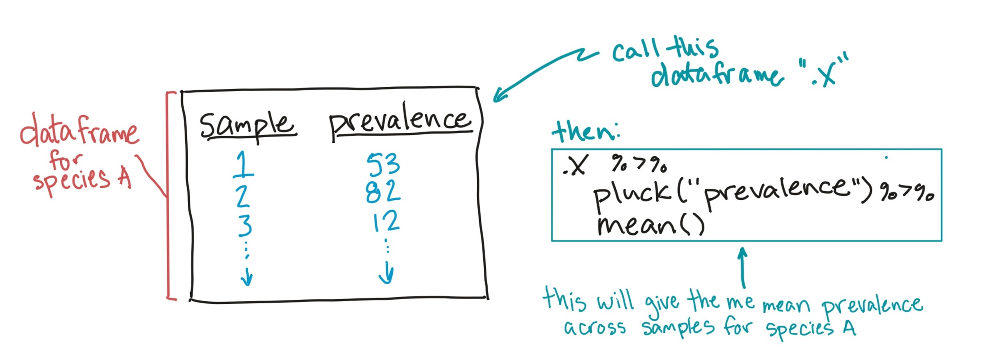
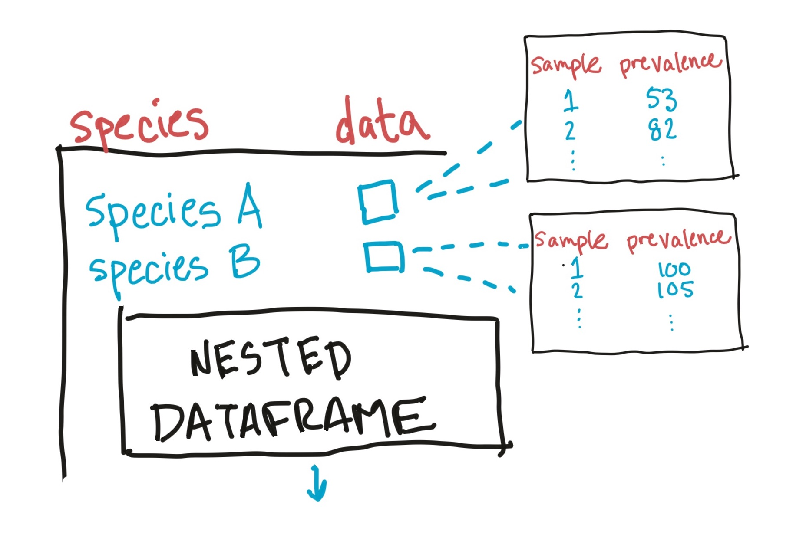

```{r echo = FALSE, message = FALSE, warning = FALSE}
library(knitr)
library(ggplot2)
library(dplyr)
library(tidyr)
library(ggthemes)
library(faraway)
data(worldcup)
data(nepali)

library(tibble)
library(broom)
library("microbiome")
data("atlas1006")
tidy_samples <- atlas1006 %>% 
  get_sample() %>% 
  as.data.frame() %>% 
  rownames_to_column(var = "species") %>% 
  pivot_longer(-species, 
               names_to = "sample", 
               values_to = "prevalence")
```

# Nesting and mapping

## Nesting and mapping

The first step, with nesting and mapping, is to decide what you'd do
to a subsample---the dataframe that you'd get if you filtered
to the rows just for one grouping factor (for example, bacteria
species).

## Nesting and mapping

As a simple example, say you want to get the mean of each bacteria's
prevalence across all samples. 

Start by thinking about how you would calculate the mean prevalence for
**one** species of bacteria if you had a subset of the dataframe rows
for just that species. 

```{r echo = FALSE, out.width = "\\textwidth", fig.align = "center"}

```

## Nesting and mapping

For example, say that you created a subset of the data that only 
had the rows for the species "Allistipes et rel.":

```{r}
allistipes <- tidy_samples %>% 
  filter(species == "Allistipes et rel.")

allistipes %>% 
  slice(1:5)
```

## Nesting and mapping

You could determine the mean of prevalence by "pulling" the column 
measuring prevalence and then taking the mean of that vector: 

```{r}
allistipes %>% 
  pull("prevalence") %>% 
  mean()
```

## Nesting and mapping

Once you've figured out this "recipe", you can **nest** the full dataframe
by the grouping factor (e.g., bacteria species) and then **map** this recipe
across the subsetted dataframe for each value of the grouping factor.

## Nested dataframe

A nested dataframe is a fancy type of tibble. 

For classic dataframes, each column must be a **vector**. For a nested 
dataframe, some of the columns can be **list-columns**, where each element
is a more complex object than just a vector. 

The elements in one of these list-columns can be a dataframe or a statistical 
model output object (or any other kind of list).

## Nested dataframe

Here's an example where the list-column ("data") contains a dataframe for each
bacterial species, with the prevalence measured for each sample for that bacteria.

```{r echo = FALSE, out.width = "0.8\\textwidth", fig.align = "center"}

```

## Nested dataframe

Because a list-column packs in a lot more than a typical column, it will 
print out a little differently in R. For example, here the "data" column
stores a dataframe for each bacteria sample:

```{r echo = FALSE}
tidy_samples %>% 
  group_by(species) %>% 
  nest() %>% 
  head(3)
```

You can see that this element is a dataframe and its dimensions, but not 
values in it.

