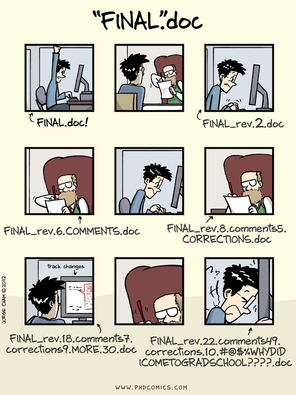
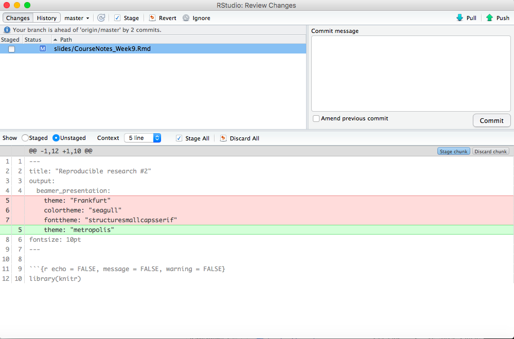
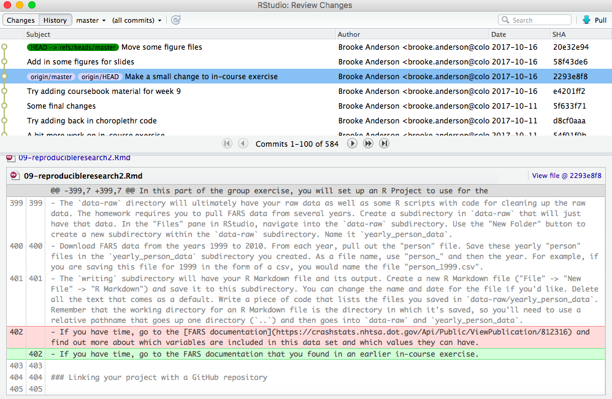

```{r echo = FALSE, message = FALSE, warning = FALSE}
library(knitr)
```

# git

## git

Git is a version control system. \bigskip

It saves information about all changes you make on all files in a repository. This allows you to revert back to previous versions and search through the history for all files in the repository. 

## git

```{r echo = FALSE, out.width = "\\textwidth", fig.align = "center"}
knitr::include_graphics("../figures/GitCartoon1.png")
```

## git

```{r echo = FALSE, out.width = "0.5\\textwidth", fig.align = "center"}

```
Source: PhDComics

## git

Git is open source. You can download it for different operating systems here: 

https://git-scm.com/downloads

You will need git on your computer to use git with RStudio and create local git repositories you can sync with GitHub repositories.

## git

Sometimes, RStudio will automatically find git (once you've installed git) when you start RStudio. \bigskip

However, in some cases, you may need to take some more steps to activate git in RStudio. To do this, go to "RStudio" -> "Preferences" -> "Git/SVN". Choose "Enable version control". If RStudio doesn't find your version of git in the "Git executable" box, browse for it. 

## git

Before you use git, you should configure it. For example, you should make sure it has your name and email address. 

You can configure git with commands at the shell. For example, I would run the following code at a shell to configure git to have my proper user name and email:  

```
git config --global user.name "Brooke Anderson"
git config --global user.email "brooke.anderson@colostate.edu"
```

## Initializing a git repository

You can initialize a git repository for a directory that is an R Project directory through R Studio. 

1. Open the Project. 
2. Go to "Tools" -> "Version Control" -> "Project Setup".
3. In the box for "Version control system", choose "Git".

**Note:** If you have just installed git, and have not restarted RStudio, you'll need to do that before RStudio will recognize git. If you do not see "Git" in the box for "Version control system", it means either that you do not have git installed on your computer or that RStudio was unable to find it.

## Initializing a git repository

Once you initialize the project as a git repository, you should have a "Git" window in one of your RStudio panes (top right pane by default). \bigskip

As you make and save changes to files, they will show up in this window for you to commit. For example, this is what the Git window for our coursebook looks like when I have changes to the slides for week 9 that I need to commit: 

```{r echo = FALSE, out.width="0.8\\textwidth", fig.align="center"}
knitr::include_graphics("../figures/ExampleGitWindow.png")
```

## Committing

When you want git to record changes, you *commit* the files with the changes. Each time you commit, you have to include a short commit message with some information about the changes. \bigskip

You can make commits from a shell. However, in this course we'll just make commits from the RStudio environment. 
Each time you commit, you are saving a record of the change **locally** (i.e., on your computer). To send this
change to other remote repositories, you'll need to link with **remote** repositories and then **push** and 
**pull** your commits.

## Committing

To make a commit from RStudio, click on the "Commit" button in the Git window. That will open a separate commit window that looks like this: 

```{r echo = FALSE, out.width="0.8\\textwidth", fig.align="center"}

```

## Committing

In this window, to commit changes: 

1. Click on the files you want to commit to select them. 
2. If you'd like, you can use the bottom part of the window to look through the changes you are committing in each file. 
3. Write a message in the "Commit message" box. Keep the message to one line in this box if you can. If you need to explain more, write a short one-line message, skip a line, and then write a longer explanation. (Think of 
this like an email, where the first line is the subject line and then the rest is the body of the email.)
Write the message in the imperative voice ("Add Rmarkdown file", "Change code for cleaning data").
4. Click on the "Commit" button on the right. 

Once you commit changes to files, they will disappear from the Git window until you make and save more changes in them.

## Committing

```{r echo = FALSE, out.width = "\\textwidth", fig.align = "center"}
knitr::include_graphics("../figures/git_commit.png")
```
Source: xkcd


## Browsing history 

On the top left of the Commit window, you can toggle to "History". This window allows you to explore the history of commits for the repository.

```{r echo = FALSE, out.width="0.8\\textwidth", fig.align="center"}

```
