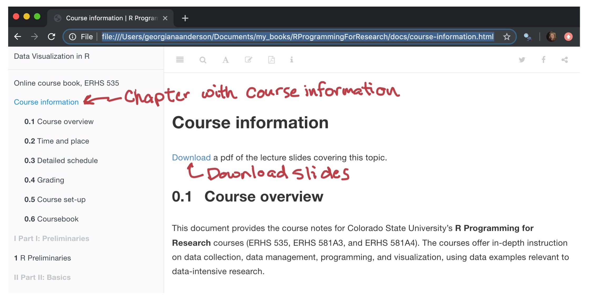
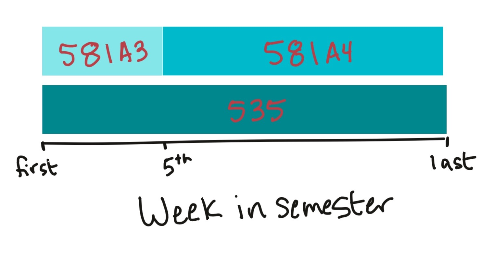
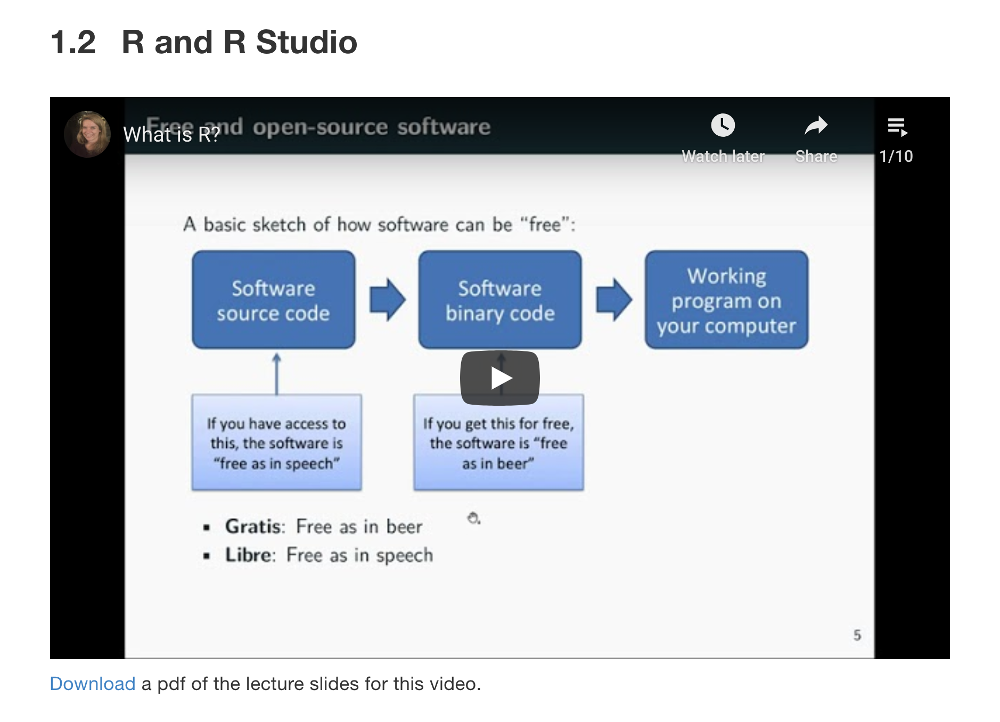
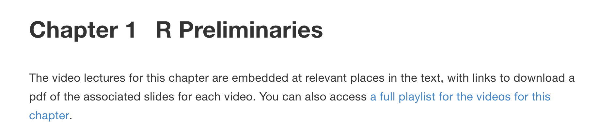
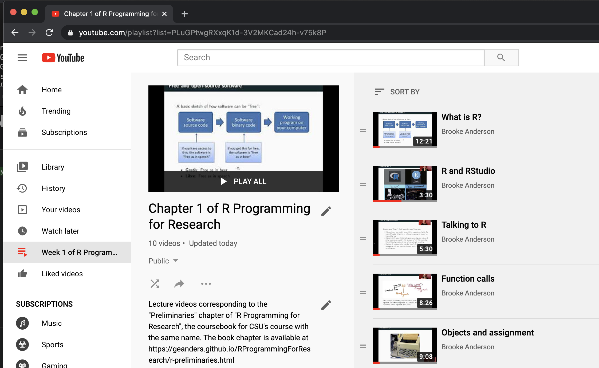
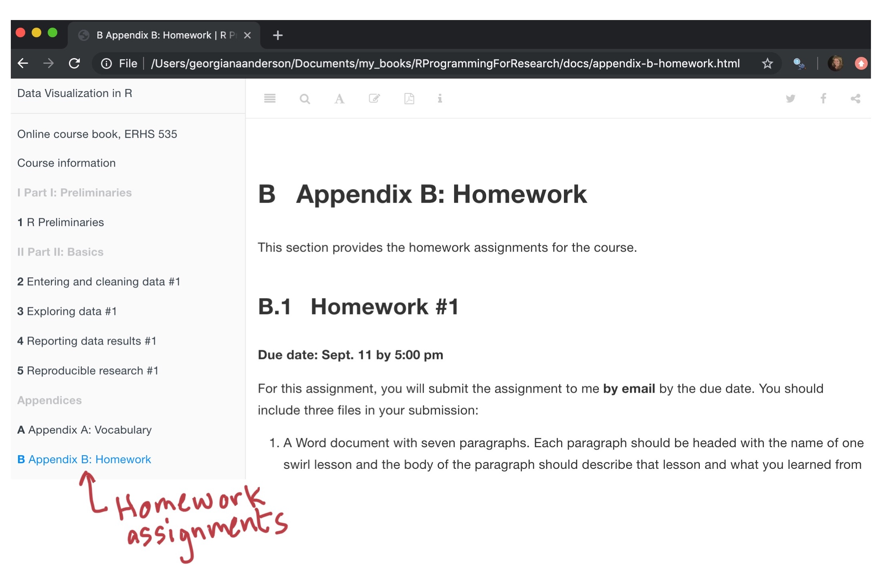
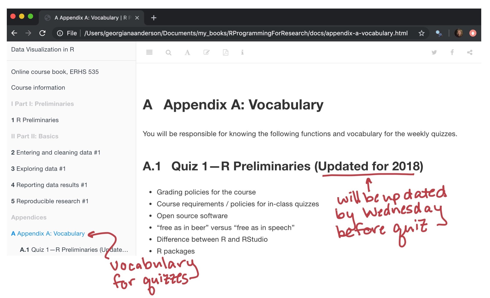

## Course structure

1. **Online video lectures.** Available through YouTube for you to 
watch asynchronously (about 2 hours per week)
2. **Live Sessions.** Synchronous meetings to work together on 
practical coding exercises (about 2 hours per week)
3. (Optional) **Live Office Hours.** Synchronous meeting to ask
questions about course material, homework, etc. (1 hour per week)

## Where to find what you need

\large

Online coursebook:

\begin{center}
\href{https://geanders.github.io/RProgrammingForResearch/}{https://geanders.github.io/RProgrammingForResearch/}
\end{center}

\bigskip

\normalsize

- Embedded video lectures
- Links to YouTube playlists of lectures
- PDF downloads of lecture slides
- In-class exercise prompts
- Homework assignments
- Quiz vocabulary
- Course information, including detailed schedule

## Where to find what you need

- In person 
  + Regularly scheduled meetings 
  + Announcements at start of session
  + Breakout groups to do coding exercises in small groups
  + If online, Share code scripts in Chat
  + In-course quizzes through link (Google Forms)
  + Optional weekly office hours
  + Group work for final project
  
- Email
  + Reminder of assignment of video lectures to watch before live meetings
  + Repeat of major announcements
  + Homework submission, grades, and feedback
  + Quiz grades and feedback

## Online coursebook

```{r fig.align = "center", out.width = "300pt", echo = FALSE}

```

## ERHS 535 vs. ERHS 581A3 / A4

```{r fig.align = "center", out.width = "300pt", echo = FALSE}

```

## Time and place

- Time: Mondays 10:00 am--11:50 am and Wednesdays, **either** 10:00 am--10:55 am **or** 11:00 am--11:55 am
- Exceptions: 
    + There will be no meeting on Labor Day.
    + There are no course meetings the week of Thanksgiving.
- Place: In person for exercises, online through YouTube for lectures, and [online coursebook](https://geanders.github.io/RProgrammingForResearch/)

(Some details may change depending on if we can get a bigger classroom on Mondays!)

## Office hours

- To be determined 

## Computer

- You will need access to a computer and a reliable internet connection for this course.
- If you do not have access to one of these, email me and
we can try to figure something out.
- We will be working
with some large datasets. Please talk to me if
you have limited space on your computer.


## Laptops

- Please plan to bring a personal laptop to all classes.
- If you do not have access to a laptop you can bring to class, talk to me and
we can try to figure something out.
- If you are taking 535 or planning to continue to 581A4, we will be working
with some large datasets. Please talk to me before the fifth week of class if
you have limited space on your laptop.

## Content

We will cover four large themes in this course:

- Entering and cleaning data
- Exploring data
- Reporting data results
- Reproducible research

## Content

The first week covers preliminaries, and after that there will be "cycles" of covering these topics:

- **Preliminaries** Week 1
- **Basic** Weeks 2--5 (ERHS 581A3 ends here)
- **Intermediate** Weeks 6--9
- **Advanced** Weeks 10--15
- **Final** Week 16

A detailed course schedule is available in the online course book.

## Grading---ERHS 535

If you are taking ERHS 535, your grade will be determined based on the following components:

```{r echo = FALSE}
a <- data.frame(a = c("Final group project",
                      "Weekly in-class quizzes, weeks 2--10",
                      "Homeworks 1--6",
                      "Attendance and class participation",
                      "Weekly in-course group exercises"),
                b = c(30, 25, 25, 10, 10))
knitr::kable(a, col.names = c("Assessment component", 
                              "Percent of grade"))
```

## Grading---ERHS 581A3

If you are taking ERHS 581A3, your grade will be determined based on the following components:

```{r echo = FALSE}
a <- data.frame(a = c("Weekly in-class quizzes, weeks 2--5",
                      "Homeworks 1 and 2",
                      "Attendance and class participation",
                      "Weekly in-course group exercises"),
                b = c(40, 30, 10, 20))
knitr::kable(a, col.names = c("Assessment component", 
                              "Percent of grade"))
```

## Attendance and class participation

You will meet twice each week in a live session. 

On Wednesdays, there will be two "cohorts" for these meetings. Half of the students will meet
live each week from **10:00 AM--10:55 AM on Mondays and Wednesdays**. The 
other half of the class will meet live each week 
**11:00 AM--11:55 AM on Mondays and Wednesdays**. 

I will be sending out a poll to help determine which Wednesday cohort works best for each student (starting next week).

## Attendance and class participation---ERHS 535

Because so much of the learning for this class is through interactive work in
class, it is critical that you come to class.

On days that you have a quiz, the quiz will also be used to assess attendance. 
On other days, you will fill out an "Exit Ticket" when you leave the class. 

Lectures will be shared through YouTube. They are embedded in the online 
course book within each chapter. At the start of each chapter, you can also 
find a link to a YouTube playlist with all videos for the chapter.

## Attendance and class participation

```{r fig.align = "center", out.width = "300pt", echo = FALSE}

```

## Attendance and class participation

```{r fig.align = "center", out.width = "300pt", echo = FALSE}

```

## Attendance and class participation

```{r fig.align = "center", out.width = "300pt", echo = FALSE}

```

## Attendance and class participation

You will be responsible for watching 
certain videos *before* you attend each live session. You will receive
an email reminder with the list of videos you need to watch before each meeting.
There will be about two hours worth of video lectures each week, broken into 
videos about 10--15 minutes each.

This week, you will be responsible for watching the first nine videos
in Chapter 1 ("R Preliminaries"). 

## Attendance and class participation---ERHS 581A3

If you are in **ERHS 535**, out of a possible 10 points for class attendance,
you will get:

- **10 points** if you miss two or fewer classes
- **8 points** if you miss three classes
- **6 points** if you miss four classes
- **4 points** if you miss five classes
- **2 points** if you miss six classes
- **0 points** if you miss seven or more classes

## Attendance and class participation---ERHS 581A3

If you are in **ERHS 581A3**, out of a possible 10 points for class attendance,
you will get:

- **10 points** if you miss one or fewer classes
- **8 points** if you miss two classes
- **6 points** if you miss three classes
- **4 points** if you miss four classes
- **2 points** if you miss five classes
- **0 points** if you miss six or more classes

## Attendance and class participation

Excused absences: 

- Attendance this week will not be counted
- CSU-related: This is typically missing to attend a conference or for a field
study for your research. To be excused, this requires a letter/email from your
adviser.
- Serious medical issue.
- For an absence to be excused, you must email me a copy of the letter (if required) by 5:00
pm the Friday afternoon following the class you missed.

## Weekly in-course group exercises

- As long as you are in class and participate in these exercises, you will get
full credit for this component.
- **If you miss a class,** to get credit towards this component of your grade, you
will need to turn in a few paragraphs describing what was covered in the
exercise and what you learned.
- To get credit for this, you must submit it to me by email by 5:00 pm the Friday
afternoon of the week of the class you missed.
- All in-class exercises are included in the online course book at the end of
the chapter on the associated material.

## Homework

- In approximately the first five weeks, there will be two homework assignments (see detailed
schedule in the online course book).
- The first should be done individually. 
- Homeworks will be graded for correctness, but some partial credit will be
given for questions you try but fail to answer correctly. Some of the exercises will 
not have "correct" answers, but instead will be graded on completeness.

## Homework 

```{r fig.align = "center", out.width = "300pt", echo = FALSE}

```

## Homework

- Homework is due to me by email by midnight on the due date. 
- Your grade will be reduced by 10 points for each day it is late, and will
receive no credit if it is late by over a week.

<!-- ## Homework -->

<!-- - There will be six homework assignments, starting a few weeks into the course and then due approximately every two weeks (see detailed schedule in the online course book). -->
<!-- - The first homeworks should be done individually. For later homeworks, you will often have the choice to work together in groups. -->
<!-- - Homeworks will be graded for correctness, but some partial credit will be given for questions you try but fail to answer correctly.  -->
<!-- - For later homeworks with detailed coding, we will randomly select a subset of the questions to grade in detail, providing extensive feedback on the code. The other questions will be graded for completeness and correctness. We will provide solution code for all questions. -->
<!-- - Homework is due by the start of class on the due date. Your grade will be reduced by 10 points for each day it is late, and will receive no credit if it is late by over a week.  -->


<!-- ## Final group project -->

<!-- The final group project will be graded with A through F, with the following point values (out of 30 possible): -->

<!-- - **30 points** for an A -->
<!-- - **25 points** for a B -->
<!-- - **20 points** for a C -->
<!-- - **15 points** for a D -->
<!-- - **10 points** for an F -->

<!-- If you turn nothing in, you will get **0 points**. -->

<!-- ## Final group project -->

<!-- - You will do the final group project in groups of 2--3.  -->
<!-- - All groups will be working on a larger R programming project. Each group will be responsible for specific elements of the overall project.  -->
<!-- - Final products will include R code for the group's portion of the project, a final oral presentation from each group presenting their final product, and a short written report from each group giving examples of applying the tools they developed. -->
<!-- - You will have in-class group work time during weeks 10--15 to work on this. This project will also require some work with your group outside of class.  -->
<!-- - You will be able to get feedback from me through GitHub in these weeks. I will also provide feedback and help during the in-class group work time.  -->
<!-- - We will discuss expectations and grading for this, create groups, etc. around the middle of the semester. -->

<!-- ## Final group project -->

<!-- - You will do the final group project in groups of 2--3.  -->
<!-- - The final product will be a statistical blog post-style article of 1,500 words or less and an accompanying Shiny web application. Come up with an interesting question you'd love to get the answer to that you think you can find data to help you answer.  -->
<!-- - You will need to use the data you find, and R, to write your article.  -->
<!-- - The final product will be a Word document created from an RMarkdown file and an accompanying Shiny web application.  -->

<!-- ## Final group project -->

<!-- - You will have in-class group work time during weeks 10--15 to work on this. This project will also require some work with your group outside of class.  -->
<!-- - You will be able to get feedback from me through weekly informal written reports in these weeks. I will also provide feedback and help during the in-class group work time.  -->

<!-- ## Final group project -->

<!-- To get an idea of what your final product should look like, check out these links: -->

<!-- - [Does Christmas come earlier each year?](http://www.statslife.org.uk/culture/1892-does-christmas-really-come-earlier-every-year) -->
<!-- - [Hilary: the most poisoned baby name in US history](http://hilaryparker.com/2013/01/30/hilary-the-most-poisoned-baby-name-in-us-history/) -->
<!-- - [Every Guest Jon Stewart Ever Had On "The Daily Show"](http://fivethirtyeight.com/datalab/every-guest-jon-stewart-ever-had-on-the-daily-show/) -->
<!-- - [Should Travelers Avoid Flying Airlines That Have Had Crashes in the Past?](http://fivethirtyeight.com/features/should-travelers-avoid-flying-airlines-that-have-had-crashes-in-the-past/) -->
<!-- - [Billion-Dollar Billy Beane](http://fivethirtyeight.com/features/billion-dollar-billy-beane/) -->

<!-- ## Final group project -->

<!-- - We will discuss expectations and grading for this, create groups, etc. around the middle of the semester.  -->
<!-- - The focus for this will be on finding, cleaning, and using good data to answer an interesting question, and on presenting, summarizing, and explaining the data well. -->

## In-class quizzes

- You will have quizzes weekly, starting next Wednesday
- Quizzes will be on Wednesdays at the start of class (first 10--15 minutes)
- For students in ERHS 535, quizzes will continue until week 10 of the 
course
- Quizzes will be conducted through Google Forms. They will be immediately 
graded, and you will get back your grade and feedback as soon as you submit
the quiz. 

## In-class quizzes

- Quiz questions will be multiple choice, matching, short-answer, or similar
styles of questions. The questions are designed so that each can be answered
fairly quickly.
- If you miss a class with a quiz, you may make it up during office hours on the
week of the missed quiz. Except in exceptional circumstances, this will be the
only time when make-up quizzes will be offered.

## In-class quizzes

- There will be *at least* 10 questions per quiz. Usually, there will be 12--15. 
- If you get, on average, 10 correct questions per quiz, you will get the
maximum possible points for the quiz component of your grade.

## In-class quizzes

For ERHS 535 (nine quizzes total):

$$
\mbox{Quiz grade} = 25 * \frac{\mbox{Number of correct quiz answers}}{90}
$$

For ERHS 581A3 (four quizzes total):

$$
\mbox{Quiz grade} = 40 * \frac{\mbox{Number of correct quiz answers}}{40}
$$

**Note:** You can not get more than the maximum of for this component quiz component
(25 points for ERHS 535 students, 40 points for ERHS 581A3 students).


## In-class quizzes

- The "Vocabulary" appendix of our online book has the list of material for
which you will be responsible for this quiz.
- Most of the functions and concepts will have been covered in class, but some
may not.
- You are responsible for going through the list and, if there are things you
don't know or remember from class, learning them. To do this, you can use help
functions in R, Google, StackOverflow, books on R, ask a friend, and any other
resource you can find.

## In-class quizzes

```{r fig.align = "center", out.width = "300pt", echo = FALSE}

```

## In-class quizzes

An example of the vocabulary list:

- `mean()`
- `read_csv`, argument `skip = `
- R object
- open source software
- Hadley Wickham

## In-class quizzes

- Using R frequently in your research or other coursework will also help you
prepare.
- Working on your homework assignments will also help you prepare.

## What you have due soon

- Wednesday, Aug. 31, during class: First in-class quiz. The "Vocabulary"
appendix of our online book has the list of material for which you will be
responsible for this quiz (Quiz 1 list).
- Monday, Sept. 12: First homework is due by midnight by email.

